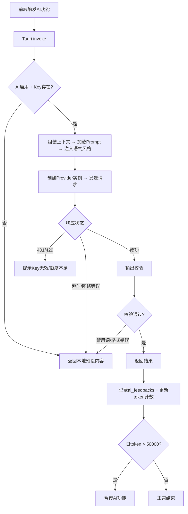
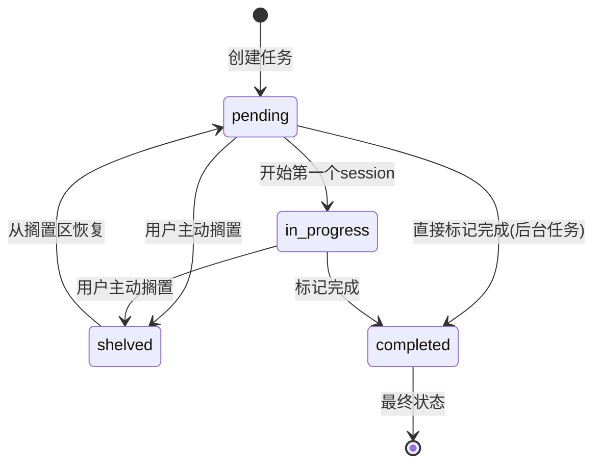
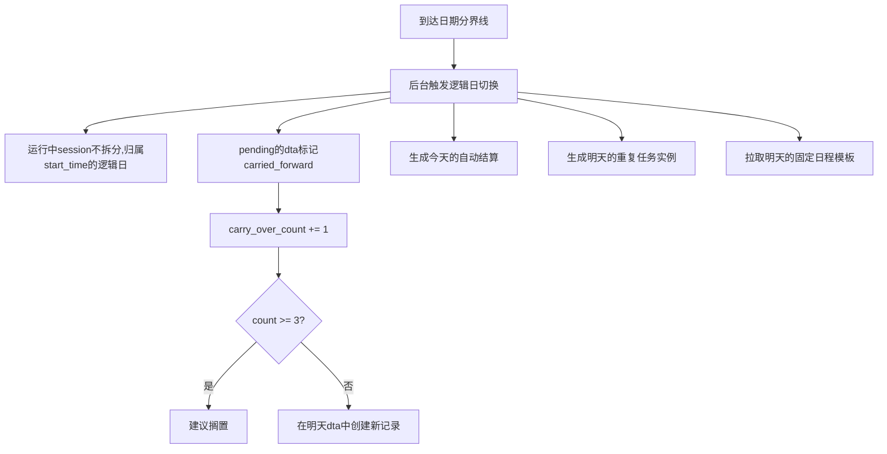

# FocusLab - 开发计划与风险管理

> 版本: v1.1  
> 最后更新: 2025-07-XX  
> 文档类型: 项目管理

---

## 1. 开发路线图

### 1.1 Phase 1 — 核心 MVP（第 1-5 周）

**目标**: 一个可用的"番茄钟 + 任务列表 + 日结算"工具

#### Week 1: 项目搭建 + 基础框架
- [ ] Tauri 2 + Vue 3 + TypeScript 项目初始化
- [ ] TailwindCSS + 主题系统搭建
- [ ] SQLite 数据库初始化 + 迁移系统
- [ ] 基础 CRUD 命令（Tauri invoke）
- [ ] 主窗口布局骨架（侧边栏 + 内容区）
- [ ] Pinia Store 基础结构
- [ ] **[v1.1]** 实现 daily_task_assignments 关联表及相关 CRUD
- [ ] **[v1.1]** 实现 timer_state 持久化表
- [ ] **[v1.1]** 实现逻辑日（logical date）工具函数 + 日期分界线配置
- [ ] **[v1.1]** 实现崩溃恢复检查流程
- **里程碑**: 能编译运行,能在前后端间传递数据

#### Week 2: 任务管理 + 番茄钟
- [ ] 任务创建/编辑/删除/完成
- [ ] 任务列表展示（按四象限分组）
- [ ] 番茄钟计时器（Rust 后端计时 + 前端展示）
- [ ] 番茄钟圆环 UI + 倒计时动画
- [ ] 计时状态机（开始/暂停/继续/放弃）
- [ ] 专注时段数据记录
- [ ] 基础音效播放
- [ ] **[v1.1]** 计划锁定机制（plan_locked_at）
- [ ] **[v1.1]** 完成率计算使用 dta 表
- [ ] **[v1.1]** 番茄钟计时状态持久化（每30秒写入）
- [ ] **[v1.1]** 休息结束时三选一交互（继续/切换/延长）
- **里程碑**: 能创建任务并用番茄钟计时

#### Week 3: 日结算 + 悬浮球
- [ ] 日结算计算逻辑（完成率/分级）
- [ ] 日结算面板 UI（进度条/数据展示/评级动效）
- [ ] S/A/B/C 四级视觉反馈
- [ ] 未完成任务处理流程
- [ ] 悬浮球窗口（置顶/透明/拖拽）
- [ ] 悬浮球显示当前任务 + 倒计时
- [ ] 系统托盘基础功能
- [ ] 全局快捷键（显示/隐藏）
- [ ] **[v1.1]** 日结算自动计算逻辑（分界线触发）
- [ ] **[v1.1]** 日结算补算机制（启动时检查）
- [ ] **[v1.1]** 未完成任务自动顺延（carry_over）
- [ ] **[v1.1]** 跨天边界处理逻辑
- **里程碑**: 完整的一天工作流可以走通

#### Week 4-5: 打磨 + 补缺 + 内测
- [ ] 四象限拖拽视图
- [ ] 任务分类体系（五大类）
- [ ] 昨日复盘卡片
- [ ] 悬浮球吸附 + 快捷面板
- [ ] 深色模式
- [ ] 本地数据持久化验证
- [ ] Bug 修复 + 交互优化
- [ ] 应用图标 + 名称 + 关于页面
- [ ] **[v1.1]** FTUE 首次启动引导（5步）
- [ ] **[v1.1]** 所有页面的空状态 UI
- [ ] **[v1.1]** 核心错误状态 UI（数据库/快捷键）
- [ ] **[v1.1]** 极简模式基础实现
- [ ] **[v1.1]** 日志系统（tracing + 文件输出）
- [ ] **[v1.1]** 内存占用基准测试
- **里程碑**: MVP 可以交给 3-5 人内测

**Phase 1 交付物**:
- ✅ 创建任务 + 四象限分类 + 分类标签
- ✅ 番茄钟计时（25/45/90分钟 + 自由模式）
- ✅ 暂停/继续/放弃 + 中断原因记录
- ✅ 日结算分级（S/A/B/C）+ 视觉反馈
- ✅ 未完成任务温和处理
- ✅ 昨日复盘卡片
- ✅ 悬浮球置顶 + 吸附 + 半透明
- ✅ 系统托盘 + 全局快捷键
- ✅ 深色模式
- ✅ 本地 SQLite 数据存储

---

### 1.2 Phase 2 — AI 与长线目标（第 6-9 周）

**目标**: 引入 AI 能力和长线目标系统,形成差异化

#### Week 6: AI 基础集成
- [ ] AI 服务层搭建（Rust HTTP 客户端）
- [ ] API Key 管理（加密存储 + 设置界面）
- [ ] Prompt 模板系统
- [ ] AI 日结算话术生成（替换硬编码文案）
- [ ] AI 语气风格设置（5种预设 + 强度滑块）
- [ ] 离线降级（本地预设话术缓存）
- [ ] 流式响应 + 打字机效果
- [ ] **[v1.1]** AI 多提供商适配层（Provider trait + 4个实现）
- [ ] **[v1.1]** AI 输出校验系统（validator）+ 幻觉防护
- [ ] **[v1.1]** AI 上下文组装器（context_builder）
- [ ] **[v1.1]** AI 隐私确认弹窗 + 使用量统计面板
- [ ] **[v1.1]** AI 错误状态 UI

#### Week 7: AI 任务拆解 + 每日建议
- [ ] AI 任务拆解功能（大任务 → 子任务列表）
- [ ] 拆解结果展示面板（采纳/编辑/拒绝）
- [ ] AI 四象限自动分类建议
- [ ] AI 每日建议生成（基于昨日数据）
- [ ] AI 反馈记录 + 用户评分（👍👎）
- [ ] 引导思考流程（5步,可选）
- [ ] 思考卡片（轻量替代方案）

#### Week 8: 长线目标系统 + 进阶功能
- [ ] 长线目标创建/编辑/归档
- [ ] 里程碑创建/编辑/排序/完成
- [ ] 里程碑时间线可视化
- [ ] 任务与里程碑关联
- [ ] 里程碑进度展示（非百分比制）
- [ ] 主观进度感受滑块
- [ ] 引导流程中的长线目标审视
- [ ] 每日任务与长线目标的投入统计
- [ ] **[v1.1]** 重复任务完整实现（规则 + 实例生成 + 交互）
- [ ] **[v1.1]** 每周固定日程模板管理
- [ ] **[v1.1]** 任务微复盘机制
- [ ] **[v1.1]** 每日专注目标时长设定
- [ ] **[v1.1]** 后台任务标记（is_background）
- [ ] **[v1.1]** 任务排序策略 + 任务预估时长 AI 自动填充

#### Week 9: 隐私与打磨
- [ ] **[v1.1]** 隐私设置面板
- [ ] **[v1.1]** 数据发送内容查看功能
- [ ] **[v1.1]** 任务预估偏差分析（基于 task_reflections）

**Phase 2 交付物**:
- ✅ AI 日结算话术（个性化 + 多风格）
- ✅ AI 任务智能拆解
- ✅ AI 四象限分类建议
- ✅ AI 每日计划建议
- ✅ AI 语气风格设置（5种 + 自定义）
- ✅ 引导思考流程 + 思考卡片
- ✅ 长线目标 + 里程碑追踪
- ✅ 里程碑进度可视化
- ✅ 任务与长线目标关联
- ✅ 离线降级方案

---

### 1.3 Phase 3 — 数据可视化与体验优化（第 10-12 周）

**目标**: 完善数据分析和视觉体验

#### Week 10: 数据分析
- [ ] 专注时段热力图（ECharts）
- [ ] 完成率趋势折线图
- [ ] 时间分类饼图
- [ ] AI 数据洞察卡片
- [ ] 周报自动生成（数据 + AI 总结）
- [ ] 周报 Markdown 导出
- [ ] 日历视图（历史日期查看）
- [ ] **[v1.1]** 数据导出完整实现（JSON + CSV）
- [ ] **[v1.1]** 数据导入（从备份恢复）
- [ ] **[v1.1]** 预估准确度分析（基于复盘数据）
- [ ] **[v1.1]** 科研日志导出（从复盘笔记生成）

#### Week 11-12: 体验打磨
- [ ] S级结算粒子特效（Canvas）
- [ ] 日结算完整动效流程优化
- [ ] 番茄钟最后5分钟提醒动效
- [ ] 悬浮球呼吸灯效果
- [ ] 任务完成动效
- [ ] 番茄钟定制化设置完善
- [ ] 提醒偏好精细控制
- [ ] 自动备份
- [ ] 开机自启选项
- [ ] 全面的 Bug 修复 + 性能优化
- [ ] **[v1.1]** 无障碍设计实现（键盘导航 + 对比度 + 字号 + 减少动画）
- [ ] **[v1.1]** 版本更新检查机制
- [ ] **[v1.1]** 完整的日志管理界面
- [ ] **[v1.1]** 安全加固（CSP + IPC权限 + DevTools禁用）
- [ ] **[v1.1]** 国际化框架搭建（vue-i18n + 文案外置）
- [ ] **[v1.1]** 窗口位置记忆
- [ ] **[v1.1]** 内存优化验证
- [ ] **[v1.1]** v1.0 发布准备（代码签名 + 打包）

**Phase 3 交付物**:
- ✅ 专注热力图
- ✅ 完成率趋势图
- ✅ 分类时间分布图
- ✅ AI 数据洞察
- ✅ 周报生成 + 导出
- ✅ 日历视图
- ✅ 完整的动效体系
- ✅ 数据导出/备份
- ✅ 发布 v1.0 正式版

---

### 1.4 Phase 4 — 长期演进（第 10 周+）

可选方向（根据用户反馈决定优先级）:

| 方向 | 内容 |
|------|------|
| 🎖️ 成就系统 | 连续专注天数徽章、里程碑完成勋章、坚持记录奖励 |
| 📱 移动端适配 | Tauri Mobile (iOS/Android) 或 PWA |
| ☁️ 云同步 | 用户账号系统、数据加密云同步、多设备支持 |
| 👥 社交功能 | 匿名专注 PK、学习小组、只看数据不看人 |
| 🔌 插件/集成 | 日历同步、Zotero集成、Obsidian集成、Webhook/API |
| 🧠 AI 进阶 | 本地模型支持（Ollama）、智能排程、多轮对话式计划 |

---

## 2. 里程碑总览

```
      Week 1-5           Week 6-9           Week 10-12       Week 13+
        │                  │                  │                 │
┌─────────┴────────┐ ┌──────┴───────┐ ┌───────┴──────┐ ┌───────┴───────┐
│    Phase 1       │ │   Phase 2    │ │   Phase 3    │ │   Phase 4     │
│   核心 MVP       │ │ AI + 目标    │ │ 数据 + 打磨  │ │   长期演进    │
│   (4-5周)        │ │ + 进阶功能   │ │   (3周)      │ │               │
│ • 任务管理       │ │ (3-4周)      │ │ • 热力图     │ │ • 成就系统    │
│ • 番茄钟+恢复    │ │ • AI 多提供商│ │ • 周报+导出  │ │ • 云同步      │
│ • 日结算+自动    │ │ • AI 拆解    │ │ • 数据导入   │ │ • 移动端      │
│ • 悬浮球         │ │ • AI 防护    │ │ • 无障碍     │ │ • 社交功能    │
│ • FTUE           │ │ • 引导流程   │ │ • 安全加固   │ │ • 插件集成    │
│ • 逻辑日+跨天    │ │ • 长线目标   │ │ • i18n预留   │ │ • AI进阶      │
│ • 极简模式       │ │ • 重复任务   │ │ • 性能优化   │ │               │
│ • 空状态/错误UI  │ │ • 固定日程   │ │              │ │               │
│ • 日志系统       │ │ • 微复盘     │ │              │ │               │
│ • 深色模式       │ │ • 隐私设计   │ │              │ │               │
└──────────────────┘ └──────────────┘ └──────────────┘ └───────────────┘
       ↑                    ↑                 ↑
    内测发布 v0.1       扩大内测 v0.5     v1.0 正式发布
     (3-5人)            (20-50人)          (公开发布)

总开发周期（至 v1.0）：约 10-12 周
```

---

## 3. 风险与应对策略

### 3.1 技术风险

**风险1: Tauri 多窗口稳定性**
- 描述: 悬浮球窗口 + 主窗口 + 快捷面板的多窗口协调可能不稳定
- 可能性: 中 | 影响: 高
- 应对: Week 1 即搭建多窗口原型验证; 降级方案: 悬浮球改为主窗口内固定区域

**风险2: 悬浮球跨平台一致性**
- 描述: 置顶/透明/拖拽在 macOS/Windows/Linux 上行为可能不一致
- 可能性: 高 | 影响: 中
- 应对: MVP 优先支持 macOS,Windows 次优先,Linux 最后适配

**风险3: AI API 可用性与延迟**
- 描述: 国内网络环境下 OpenAI/Anthropic API 可能不稳定
- 可能性: 高（中国用户）| 影响: 中
- 应对: 所有核心功能离线可用; 支持配置代理/自定义 API 地址; 后期支持国产大模型

**风险4: SQLite 并发性能**
- 描述: 多窗口同时读写 SQLite 可能导致锁冲突
- 可能性: 低 | 影响: 低
- 应对: 使用 WAL 模式; 所有数据库操作通过 Rust 后端统一管理

**风险5: 计时器精度**
- 描述: WebView 标签页不活跃时 setInterval 精度下降
- 可能性: 确定会发生 | 影响: 高
- 应对: Rust 后端作为计时主源; 前端 Web Worker 校验; 计时结束事件由 Rust 触发

### 3.2 产品风险

**风险6: 用户留存率低**
- 描述: 效率工具的普遍问题——用户新鲜感过后停止使用
- 可能性: 高 | 影响: 致命
- 应对: 渐进式留存策略（1-3天极简、3-7天数据洞察、7-14天沉没成本、30天+数据壁垒）

**风险7: AI 建议质量不稳定**
- 描述: AI 生成的话术可能不恰当或千篇一律
- 可能性: 中 | 影响: 中
- 应对: 精心设计 Prompt 模板; 用户评分机制（👍👎）; 本地预设高质量话术兜底

**风险8: 功能过于复杂**
- 描述: 引导流程/四象限/里程碑等功能可能让用户觉得复杂
- 可能性: 中 | 影响: 高
- 应对: 渐进式展示; 高级功能隐藏在二级入口; 所有引导/分析功能可以完全关闭

**风险9: 未完成任务的心理负担**
- 描述: 即使设计了"温和处理",频繁的未完成仍可能让用户逃避
- 可能性: 中 | 影响: 高
- 应对: 搁置机制; C级日结算文案反复打磨; 连续3天C级主动建议减少计划量

### 3.3 商业风险

**风险10: 盈利模式不清晰**
- 描述: MVP 阶段没有收入,AI API 需要成本
- 可能性: 确定 | 影响: 低
- 应对: MVP 阶段用户自备 API Key,零服务端成本; 后期考虑订阅/买断/教育优惠/开源+付费AI

**风险11: 竞品模仿**
- 描述: 如果产品有效,可能被大厂/竞品快速模仿
- 可能性: 中 | 影响: 中
- 应对: 护城河在于"对研究生群体的深度理解"; 快速迭代; 社区运营; 数据积累形成迁移成本

---

## 4. 成功指标

### 4.1 北极星指标

**周活跃天数（WAD）**: 用户每周使用 FocusLab 的天数
- 目标: 平均 WAD ≥ 4 天/周（内测用户中）
- 含义: 用户至少工作日中有 4 天在使用,说明已形成习惯

### 4.2 核心指标体系

**1. 留存指标**

| 指标 | 目标 |
|------|------|
| Day 1 留存率 | ≥ 80% |
| Day 3 留存率 | ≥ 60% |
| Day 7 留存率 | ≥ 40% |
| Day 14 留存率 | ≥ 30% |
| Day 30 留存率 | ≥ 20% |

定义: "留存" = 当天打开应用并完成至少 1 个任务或 1 个番茄钟

**2. 使用深度指标**

| 指标 | 目标 |
|------|------|
| 日均专注时长 | ≥ 3 小时 |
| 日均完成任务数 | ≥ 3 个 |
| 日均番茄钟数 | ≥ 6 个 |
| 日结算完成率 | ≥ 70% |
| 引导流程完成率 | ≥ 50% |

**3. 功能渗透率**（过去 7 天内使用过该功能的活跃用户比例）

| 功能 | 目标 |
|------|------|
| 番茄钟使用率 | ≥ 90% |
| 日结算使用率 | ≥ 70% |
| 四象限分类使用率 | ≥ 50% |
| AI 拆解使用率 | ≥ 30% |
| 长线目标使用率 | ≥ 40% |
| 周报查看率 | ≥ 25% |

**4. AI 质量指标**

| 指标 | 目标 |
|------|------|
| AI 建议采纳率 | ≥ 60% |
| AI 拆解采纳率 | ≥ 70% |
| AI 反馈正面率 | ≥ 80% |
| AI 调用失败率 | < 5% |

**5. 健康指标**（防止产品制造焦虑）

| 指标 | 警戒线 |
|------|--------|
| C级日结算占比 | ≤ 30% |
| 任务搁置率 | ≤ 25% |
| 连续C级用户比例 | ≤ 10% |

---

## 5. 埋点方案

### 5.1 埋点原则

- 所有数据仅存储在本地,不上传到任何服务器
- 后期如果需要聚合分析,征得用户同意后匿名上传
- 埋点数据与业务数据复用（从 SQLite 表直接统计）
- 不额外引入第三方统计 SDK

### 5.2 需要记录的事件

| 事件名 | 说明 |
|--------|------|
| app_launched | 应用启动 |
| app_closed | 应用关闭 |
| guide_flow_started | 引导流程开始 |
| guide_flow_step_N | 引导流程到达第 N 步 |
| guide_flow_skipped | 引导流程被跳过 |
| guide_flow_completed | 引导流程完成 |
| thinking_card_shown | 思考卡片展示 |
| thinking_card_adopted | 思考卡片被采纳 |
| ai_breakdown_requested | 请求 AI 拆解 |
| ai_breakdown_adopted | AI 拆解被采纳 |
| ai_breakdown_rejected | AI 拆解被拒绝 |
| settlement_triggered | 日结算被触发 |
| uncompleted_task_action | 未完成任务处理 |
| quadrant_view_opened | 四象限视图被打开 |
| weekly_report_viewed | 周报被查看 |
| weekly_report_exported | 周报被导出 |
| display_mode_switched | 显示模式切换 |
| shortcut_used | 全局快捷键被使用 |
| settings_changed | 设置被修改 |
| data_exported | 数据被导出 |

---

## 6. 内测反馈收集

### 6.1 应用内反馈入口

- 设置页底部: "反馈建议"按钮
- 点击后打开简单表单: 类型（Bug/功能建议/体验问题/其他）+ 描述 + 截图（可选）
- 提交方式: 发送邮件到指定邮箱 / 打开 GitHub Issue

### 6.2 定期问卷（每 2 周一次）

- 使用时长和频率
- 最喜欢的功能 Top 3
- 最希望改进的地方 Top 3
- NPS（0-10 推荐意愿打分）
- 是否愿意继续使用
- 开放式建议

### 6.3 一对一访谈（Phase 1 结束时）

- 邀请 3-5 名内测用户进行 30 分钟访谈
- 重点了解: 一天的使用流程 / 哪些功能用了没用 / 是否感到压力 / 与之前工具对比

---

## 7. 设计决策记录（ADR）

### ADR-001: 选择 Tauri 而非 Electron

- **决策**: 选择 Tauri 2
- **理由**: FocusLab 需要常驻后台,内存占用敏感; Rust 后端适合计时器、数据库等系统级操作; 打包体积小; Tauri 2.x 已足够稳定
- **风险**: Tauri 生态不如 Electron 成熟

### ADR-002: 选择本地 SQLite 而非云数据库

- **决策**: 选择 SQLite
- **理由**: 隐私优先; 零服务器成本; 离线可用; 性能对单用户应用绰绰有余; 后期可增加云同步层
- **风险**: 多设备同步需要额外开发

### ADR-003: AI 功能用户自备 API Key

- **决策**: MVP 阶段选择用户自备,后期考虑提供官方 Key
- **理由**: 零运营成本; 用户控制; 隐私; 降级方案完善
- **风险**: 可能劝退非技术用户

### ADR-004: 不使用第三方 UI 组件库

- **决策**: 核心组件自建,复杂交互可借助 Headless UI
- **理由**: 产品视觉风格独特; 第三方组件库设计语言不匹配; 组件数量可控
- **风险**: 开发速度较慢

### ADR-005: 日结算 C 级不使用红色

- **决策**: 灰色进度条 + 温和文案
- **理由**: 产品原则"陪伴不监工"; 红色触发负面情绪; 灰色传达"平淡"而非"失败"
- **风险**: 可能有用户觉得反馈不够强烈,通过"极简数据型"语气风格满足

### ADR-006: 计时器主逻辑放在 Rust 后端

- **决策**: Rust 后端计时 + 前端 Worker 双保险
- **理由**: 前端 setInterval 精度极差; Rust 不受 WebView 状态影响; 计时结束由 Rust 触发保证可靠
- **风险**: 增加架构复杂度,但计时是核心功能,值得投入

### ADR-007: 日结算数据的自动计算与手动查看分离（v1.1 新增）

- **决策**: 将日结算拆分为"数据计算"（自动后台执行）和"结算查看"（手动/半自动面板UI）
- **理由**: 用户可能跳过日结算面板,但数据不应丢失。自动计算在日期分界线时刻触发,写入 settlements 表（AI寄语留空）。用户查看时才触发 AI 生成和动效展示。启动时补算昨天缺失的结算。
- **好处**: 用户永远不会丢失数据; 日结算面板变成"可选的丰富体验"; AI 调用只在用户真正查看时发生（节省成本）
- **风险**: 自动计算的结算缺少 AI 寄语和用户感想,但可以后续补充

### ADR-008: 任务预估时长的处理策略（v1.1 新增）

- **决策**: 三级策略 — 用户主动填写 > AI基于历史推断 > 不使用预估时长
- **理由**: 预估时长影响多个功能（日计划合理性判断、引导流程、日结算对比、复盘分析），但强制填写增加摩擦。自动推断逻辑: 相同名称历史 > 相同分类平均值 > 分类默认值 > 通用默认值（45分钟）。
- **数据模型**: tasks 表增加 `estimate_source` 字段（user/auto/ai/NULL）
- **校正机制**: 数据积累2周后,按分类计算 bias_ratio 自动校正预估

### ADR-009: 主观信号与任务引擎解耦（v1.2 新增）

- **决策**: 晨间意图档位 / 晚间真实情绪 / 里程碑主观进度感受,统一为"主观信号"体系,**仅存储与可视化,不反向驱动任务引擎**（不调难度、不调番茄时长、不改 S/A/B/C 评级、不改 AI 寄语语气）。
- **理由**:
  - 避免"低情绪 → 系统降低任务难度 → 完成感更差 → 情绪更低"的负反馈循环,延续 ADR-005"陪伴不监工"的精神。
  - 早晨文案"定调式"而非"评估式": 五档都是正向承诺（🌙 保养档 → 🔥 冲刺档,没有"差"档）,避免晨间打卡变成情绪审判。
  - 晚间三段式流程 `摘要 → 情绪 → 评级` 避免用户在信息真空里评价一天,也避免被评级锚定真实感受。
- **数据模型**: 新表 `subjective_signals(kind, ref_date, ref_id, scale, value, note, captured_at)`,承载三类信号。
- **可跳过**: 三类信号均可跳过,跳过不影响任何其他功能,只是字段为空。
- **留待后续评估**: 是否基于长期数据触发"连续低情绪主动减量"等联动,v1.3 再决定。
- **详见**: `docs/02-功能设计文档.md §5.6 主观信号体系`

### ADR-010: 主屏密度策略 · 4 件核心 + 折叠切片卡（v1.2 新增 · **v1.2.1 Superseded**）

> **状态**: 🚫 **Superseded · 不再执行**
>
> **放弃原因**:
> - 桌面端窗口横屏宽度 1280-1920px,原版 `main-today.html` 的「左栏任务 + 右栏信息」双列布局**能利用横向空间**,不是过载;强行压成单列(如 `main-today-lite.html` 实验)反而造成右侧大面积空白和更长的纵向滚动。
> - 将"功能多"等同于"同屏块数多"是错误的问题框架。新用户感知过载的真实源头是: **FTUE 引导不够聚焦、功能层级感缺失、右栏信息同质重复**,而非主屏块数。
> - "≤5 硬约束"为人为发明的指标,未经数据验证;强制替换现版主屏将损伤桌面应用感。
>
> **保留的精神**(以 soft guideline 形式延续,无需代码级约束):
> - 新增功能时评估是否能并入已有块,避免无序新增独立卡片
> - 实验功能默认关闭(此条由 ADR-009 覆盖,继续执行)
>
> **已产出但存档不用**: `prototype/screens/main-today-lite.html` 作为探索备忘保留,不接入导航。
>
> **替代方向**(v1.2.1 及以后):
> - ~~加强 FTUE 前 3 天对焦点卡的聚焦呈现~~ **[v1.2.2 作废,见下]**
> - 精简右栏 4 卡到 2 卡(合并同质内容) **[v1.2.2 已落地]**
> - 强化 Cmd+K 命令面板作为低频功能统一入口
>
> **v1.2.2 追加(2026-04-18): 放弃"前 3 天聚焦"这一条**
> - **放弃原因**: 按天解锁本质是"系统替用户决定什么时候可以用什么功能",与 ADR-005 "陪伴不监工" 核心精神冲突 — 监工的延伸就是"我觉得你还没准备好用这个功能"。
> - **替代思路**: 全功能默认开启 · 用户不想要的元素可在 settings 里关闭(已有/待补细粒度开关 · 见 `docs/02 §10.1 显示模式` + `settings/settings.html` 通知与外观分区)。
> - **保留的精神**: 新用户过载问题应由 **FTUE 本身的聚焦度优化** 解决(如收窄引导焦点、减少一次性信息量),而不是在主屏上做"时间锁"。
> - **实际落地**: v1.2.2 版本不再实现任何"按天显示不同内容"的机制;`main-today.html` 不加 day-n 变体;若未来仍有新用户过载信号,通过"默认勾选的简化模式"而非"按天强制"实现。
>
> ---
>
> **以下为原决策内容,仅作历史保留**:

- **决策**: `main-today.html` 主屏同时可见信息块 **≤ 5 个**。核心 4 件按固定顺序呈现: `今日任务列表 → 焦点任务卡 → 番茄计时 → 结束今天`。其余增强信号(日期/能量/专注统计/四象限切换/心情等)折叠进底部"今日切片"卡,**默认收起**,点击展开才显示详情。
- **背景问题**: v1.0-v1.1 规划累计 20+ 模块,单靠"标准/极简"二元切换无法缓解新用户的感知过载。问题根因不是"功能数多",而是**同屏信号密度过高**(ADR-010 分析)。
- **理由**:
  - **布局解耦功能**: 让"是否启用功能"和"是否同屏呈现"解耦 —— 用户即使停在标准模式,主屏密度也不失控。
  - **核心四件保底**: 每日 80% 场景只需触达这 4 件,其它都是低频。
  - **折叠收纳增强**: 四象限、AI 拆解、长线目标入口等下沉到二级页或命令面板(Cmd+K);日历/复盘/热力图经侧栏导航进入。
  - **实验功能默认关闭**: 心情打卡等新加入的主观信号默认不启用(见 ADR-009 + `docs/02 §5.6`)。
- **落地路径**:
  1. 先做 `prototype/screens/main-today-lite.html` 原型,与现版 `main-today.html` 并列对照验证
  2. 视觉确认后决定是否替换
  3. 替换后 `main-today.html` 归档为 `main-today-legacy.html`,保留 2 个版本供回溯
- **度量**:
  - FTUE 完成后首次打开主屏,用户 **3 秒内能找到"开始计时"** 按钮(可用性测试指标)
  - 主屏信息块数量 **≤ 5**(硬约束,代码层 lint)
- **相关**: ADR-009(实验功能默认关闭)、`docs/05 §6.5`(标准模式密度控制)

### ADR-011: 科研人格图鉴设计原则（v1.3 规划）

- **决策**: FocusLab 用户画像系统（科研人格图鉴）定位为**社交分享工具**,不是行为矫正工具。灵感来自 SBTI（2026.4 爆火）的传播机制。
- **核心定位**: 社交分享优先、数据洞察为底。核心公式: `真实行为数据 + 动物意象 + SBTI 式自嘲文案 = 又扎心又想转发`。
- **设计约束**:
  - 所有标签描述"风格"而非"问题"（延续 ADR-005"陪伴不监工"精神）。允许自嘲("DDL 是你唯一的生产力来源"),禁止系统审判("你有拖延症")。
  - 不联动任务引擎（延续 ADR-009）:人格标签不改变任务难度、番茄时长、S/A/B/C 评级。
  - **不做排行榜**: 不做个人排名、不做"最深夜研究员"等竞争性比较。只做全站人格分布比例("本周 23% 用户也是蝙蝠")。
  - **好友对比**: 只展示风格差异("你是蝙蝠 🦇 / TA 是晨鸣鹤 🐓"),不展示"谁更强"。
  - **反转时刻"关心不批评"**: 当数据偏离人格预期时,系统弹出反转评论保持幽默但不刻薄。鲨鱼停下来 → "你还好吗?"(关心),不是"你怎么摸鱼了"(批评)。
- **系统规模**: 30 型人格（27 常规 + 3 稀有/隐藏）· 9 门 · 16 组合称号 · 9 条进化链 · 5 个季节限定 · 45 枚成就徽章
- **冷启动方案**: 7 天人格孵化叙事,把"数据不足期"变成"期待感游戏化"。
- **实验功能**: 默认关闭,设置 → 实验功能中启用。
- **详见**: `docs/02-功能设计文档.md §8 科研人格图鉴系统` + `§9 成就徽章系统`

### ADR-012: 任务到期日 · 只做内部日历,不做外部同步（v1.2.2 新增）

- **状态**: ✅ 已确认
- **决策**: 任务到期日(`due_date`)功能只在 FocusLab **内部**实现,不做 Google Calendar / macOS Reminders / Outlook / ICS 等**外部系统的双向同步或导出**。
- **背景问题**: 用户提出"任务设了到期日能否自动放到系统日历里提醒",此需求有三种可能实现方式,复杂度差异巨大:
  1. 内部日历 + 本地通知(轻量,可在 Phase 1 MVP 完成)
  2. ICS 单向导出(中量,需处理编码/时区/订阅 URL)
  3. 深度系统日历集成(重量,涉及 OAuth、各平台 API、冲突解决、同步策略,约 3-5 周工作量)
- **理由**:
  - **FocusLab 核心价值是专注与研究节奏**,不是跨平台待办聚合(已有 Todoist / TickTick 等成熟方案)。若做外部集成,会陷入同步冲突、账户绑定、API 配额等工程长尾问题,分散核心精力。
  - **内部日历页(`calendar.html`)已存在**,可天然承载 DDL 可视化,无需额外建设。
  - **本地通知** + **到期当日自动置顶** 两条机制足以解决用户的"别忘记"诉求,不需要依赖系统日历的提醒能力。
  - **延续 ADR-002(本地 SQLite)精神**: 数据留在本地,不引入第三方同步依赖。
- **落地形态**:
  - 任务编辑 / 快速加任务 modal 提供"截止日期"字段(可选)
  - `calendar.html` 月视图在对应日期格子展示 DDL event-pill(`event-pill.due`)
  - `main-today.html` 今日到期任务**自动置顶**到当日计划并加 `chip-due.is-today` 标签
  - `main-tasks.html` 任务列表 / 四象限视图按 DDL 临近度展示 `chip-due` 状态(normal/soon/today/overdue)
  - 本地通知: 到期前一天 20:00(用户可自定义)推送"XX 任务明天到期" + 悬浮球红点
  - 逾期处理: 未完成的 DDL 任务自动继承到次日,打 `chip-due.is-overdue` 标签,不批评不提示"失败"
- **不做的事**:
  - ❌ Google Calendar / Outlook / iCloud 的 API 集成(OAuth 配置、双向同步策略、冲突解决 — 工程量 3-5 周)
  - ❌ .ics 文件导出 / 订阅 URL(看似简单,但要处理时区、订阅更新节奏、客户端兼容差异)
  - ❌ macOS Reminders / Windows TodoList 的原生 EventKit 集成(平台差异大、Tauri 需要 IPC 转发)
- **未来重新评估的触发条件**(如果以下任一满足,可重开 ADR):
  - 内测用户中 **≥30%** 主动提出需要外部日历同步
  - Phase 1-3 核心功能都稳定后,有余力扩展(Phase 4 长期演进)
  - 第三方 SDK 出现了低成本的统一抽象层(如 CalDAV 客户端)
- **相关**: ADR-002(本地 SQLite)、`docs/02 §3 任务管理`、`docs/02 §10.2 提醒系统`

### ADR-013: 主题色板全局接入 · 12 组色调 × 2 明暗(v1.2.4 新增)

- **状态**: ✅ 已确认并落地
- **决策**: 引入全局色调主题系统,共 12 组主题(默认蓝 + 11 组来自 `FocusLab-主题预览.html`)。主题色调与明暗模式**两轴正交**,所有主题化配色(品牌 / 功能 / 象限 / 表面 / 文本 / 描边 / 聚焦)同步变化。
- **背景问题**: 产品原本只有"默认蓝 · 宁静",用户希望拥有更多氛围选择(暖色系 / 冷色系 / 中性);同时仓库里已有一份 11 组主题的完整预览 HTML,需要把它正式接入产品。
- **方案选型**:
  - 方案 A:只换 primary 四件套 — 过浅,达不到"换氛围"效果
  - **方案 B:全配色主题化**(采纳)— 每个主题覆盖 30 个 CSS 变量(bg / 文本 / 边框 / 功能色 / 象限色 / 聚焦阴影),氛围完整
  - 方案 C:折中,只主题化表面层 — 会出现"氛围换了,但状态色仍是老系统"的割裂感
- **落地形态**:
  - `tokens.css` 追加 22 个主题块(11 主题 × light / dark),每块 30 个变量
  - 设置页外观分区:旧 5 色主色圆点 → 12 张主题卡(3 色条 + 名称 + 描述 + ✓ 选中态)
  - `localStorage.fl-accent` + `fl-theme` 持久化,所有 21 个原型 HTML 页面 `<head>` 注入统一初始化脚本
  - `storage` 事件跨 tab 热同步
  - 文本色通过 `color-mix(var(--color-*)  25%/15%, black/white)` 派生,`:root` 与 `[data-theme="dark"]` 各定义一次,利用 CSS 变量 late binding 自动跟随主题
- **识别色保留不变**(不随主题):
  - 🌀 自由模式紫罗兰 `#8B5CF6 / #A78BFA / #7B52D6`
  - 🍅 番茄计数点 `#FF7A5C`
  - macOS 窗口红黄绿(`#FF5F57 / #FEBC2E / #28C840`)
  - 成就徽章青铜 / 白银 / 黄金
  - persona-hatch / persona-card 的专属氛围渐变
- **不做**:
  - ❌ 自定义调色板 / 主题导入导出
  - ❌ 基于时间自动切主题 / 跟随系统强调色
- **相关**: `docs/superpowers/specs/2026-04-18-theme-palette-integration-design.md`、`docs/05 §1.1.1 色调主题`

---

## 8. 附录

### 8.1 术语表

| 术语 | 定义 |
|------|------|
| 番茄钟 (Pomodoro) | 一个固定时长的专注时段,通常 25 分钟 |
| 专注时段 (Session) | 一次连续的计时记录,可以是番茄钟或自由计时 |
| 中断 (Interruption) | 专注时段中的暂停事件 |
| 四象限 | 艾森豪威尔矩阵,按紧急/重要两个维度分类任务 |
| 长线目标 (Goal) | 需要数周到数月完成的大目标 |
| 里程碑 (Milestone) | 长线目标下的阶段性节点 |
| 日结算 (Settlement) | 每天结束时对当天完成情况的总结和评估 |
| 搁置 (Shelve) | 将任务暂时移出活跃列表,不再主动提醒 |
| 引导流程 (Guided Flow) | 帮助用户思考和规划每日任务的引导步骤 |
| 思考卡片 | 引导流程的轻量替代,展示 AI 建议供用户参考 |
| 呼吸式提醒 | 通过透明度变化等柔和方式提示用户应用的存在 |
| 悬浮球 (Float Bubble) | 常驻屏幕的迷你窗口,显示当前任务和计时 |
| 结算评级 (Grade) | S/A/B/C 四级,根据当天任务完成率评定 |

### 8.2 竞品功能对比表

| 功能 | FocusLab | 滴答清单 | Forest | Notion | 番茄Todo |
|------|----------|---------|--------|--------|---------|
| 番茄钟计时 | ✅ | ✅ | ✅ | ❌ | ✅ |
| 多时长模式 | ✅ | ❌ | ✅ | ❌ | ✅ |
| 任务管理 | ✅ | ✅ | ❌ | ✅ | ✅ |
| 四象限分类 | ✅ | ❌ | ❌ | ⚠️¹ | ❌ |
| AI 任务拆解 | ✅ | ❌ | ❌ | ⚠️² | ❌ |
| 长线目标追踪 | ✅ | ⚠️³ | ❌ | ⚠️¹ | ❌ |
| 里程碑系统 | ✅ | ❌ | ❌ | ⚠️¹ | ❌ |
| 引导式计划 | ✅ | ❌ | ❌ | ❌ | ❌ |
| 日结算分级 | ✅ | ❌ | ❌ | ❌ | ❌ |
| AI 个性化鼓励 | ✅ | ❌ | ❌ | ❌ | ❌ |
| 未完成任务温和处理 | ✅ | ❌ | ❌ | ❌ | ❌ |
| 专注热力图 | ✅ | ⚠️⁴ | ✅ | ❌ | ✅ |
| 桌面悬浮球 | ✅ | ❌ | ❌ | ❌ | ❌ |
| 研究生场景优化 | ✅ | ❌ | ❌ | ❌ | ❌ |
| 完全离线可用 | ✅ | ❌ | ✅ | ❌ | ✅ |
| 本地优先/隐私 | ✅ | ❌ | ✅ | ❌ | ❌ |

注: ¹ Notion 可自建但需用户搭建模板 ² Notion AI 可拆解但不与任务系统集成 ³ 滴答清单有项目但无里程碑 ⁴ 滴答清单有统计但无热力图

### 8.3 参考资料

**产品设计参考**:
- 《原子习惯》James Clear — 习惯养成的心理学原理
- 《深度工作》Cal Newport — 专注力管理方法论
- 《游戏化实战》Yu-kai Chou — 游戏化设计八角框架
- 《Don't Make Me Think》Steve Krug — 交互设计原则
- 《情感化设计》Donald Norman — 产品情感层设计

**技术参考**:
- Tauri 2.x 官方文档 — https://v2.tauri.app/
- Vue 3 官方文档 — https://vuejs.org/
- Pinia 文档 — https://pinia.vuejs.org/
- TailwindCSS 文档 — https://tailwindcss.com/
- ECharts 文档 — https://echarts.apache.org/

### 8.4 未来探索方向

1. **认知负荷管理** — 基于任务切换频率识别"认知过载",主动建议休息
2. **心流状态检测** — 基于连续专注时长识别心流,自动屏蔽提醒
3. **智能排程** — 基于历史效率数据自动将任务安排到最佳时段
4. **外部工具集成** — Zotero/GitHub/Google Calendar/Obsidian
5. **微日记** — 日结算感想扩展为 Markdown 微日记,可导出为科研日志
6. **导师视角** — 学生授权后导师可查看进度概览（高度敏感,需谨慎设计）

---

## 附录 A: 完整设置项清单（v1.1 新增）

共 53 个设置项,按分类列出:

| 分类 | 设置项 | 类型 | 默认值 | 说明 |
|------|--------|------|--------|------|
| 🍅 番茄钟 | pomodoro_work_min | 整数 | 25 | 专注时长（分钟） |
| | pomodoro_break_min | 整数 | 5 | 短休息时长 |
| | pomodoro_long_break_min | 整数 | 15 | 长休息时长 |
| | pomodoro_rounds | 整数 | 4 | 触发长休息的轮数 |
| | pomodoro_auto_start | 布尔 | false | 休息结束后自动开始 |
| 🤖 AI | ai_enabled | 布尔 | true | AI功能总开关 |
| | ai_provider | 枚举 | openai | openai/anthropic/ollama/compatible |
| | ai_base_url | 文本 | (按提供商) | API 地址 |
| | ai_model | 文本 | gpt-4o-mini | 模型名称 |
| | ai_tone_style | 枚举 | academic | 语气风格 |
| | ai_tone_intensity | 整数 | 5 | 语气强度 1-10 |
| | ai_custom_prompt | 文本 | (空) | 自定义 prompt |
| | ai_privacy_acknowledged | 布尔 | false | 已确认隐私提示 |
| 🪟 显示 | display_mode | 枚举 | float | float/sidebar/window |
| | float_opacity | 浮点 | 0.7 | 悬浮球透明度 |
| | theme | 枚举 | system | light/dark/system |
| | font_size_level | 枚举 | medium | small/medium/large |
| | reduce_motion | 布尔 | false | 减少动画 |
| | sidebar_collapsed | 布尔 | true | 侧边栏折叠 |
| 🔔 提醒 | reminder_pomodoro | 布尔 | true | 番茄钟完成提醒 |
| | reminder_break_end | 布尔 | true | 休息结束提醒 |
| | reminder_dnd_start | 时间 | 23:00 | 免打扰开始 |
| | reminder_dnd_end | 时间 | 08:00 | 免打扰结束 |
| | sound_enabled | 布尔 | true | 音效总开关 |
| 📋 计划 | guide_mode | 枚举 | auto | always/auto/never |
| | settle_time | 时间 | 22:00 | 日结算提醒时间 |
| | day_boundary_hour | 整数 | 4 | 日期分界线（0-6） |
| | auto_estimate_enabled | 布尔 | true | 自动预估任务时长 |
| | default_target_focus | 整数 | 240 | 默认目标专注分钟数 |
| | work_start_time | 时间 | 09:00 | 工作开始时间 |
| ⌨️ 快捷键 | shortcut_toggle_main | 快捷键 | CmdOrCtrl+Shift+K | 打开/关闭主窗口 |
| | shortcut_timer | 快捷键 | CmdOrCtrl+Shift+S | 开始/暂停计时 |
| | shortcut_quick_add | 快捷键 | CmdOrCtrl+Shift+N | 快速添加任务 |
| 🔧 通用 | minimal_mode | 布尔 | false | 极简模式 |
| | auto_start | 布尔 | false | 开机自启 |
| | close_behavior | 枚举 | minimize | minimize/quit |
| | timezone | 文本 | (系统自动) | 时区 |
| | log_level | 枚举 | info | info/debug/warn |
| | check_updates | 布尔 | true | 自动检查更新 |
| 📊 FTUE | first_launch_done | 布尔 | false | 首次引导完成 |
| | ftue_completed_at | 日期时间 | (空) | 完成时间 |
| | ftue_last_step | 整数 | 0 | 中断恢复点 |

---

## 附录 B: 界面清单索引（v1.1 新增）

共 59 个界面,按优先级分布: P0（19个）/ P1（25个）/ P2（15个）

| 编号 | 界面名称 | 类型 | 优先级 | 窗口 |
|------|---------|------|--------|------|
| UI-01 | 主窗口框架 | 页面 | P0 | main |
| UI-02 | 今日计划页 | 页面 | P0 | main |
| UI-03 | 四象限视图 | 页面 | P1 | main |
| UI-04 | 长线目标列表页 | 页面 | P1 | main |
| UI-06 | 数据分析页 | 页面 | P2 | main |
| UI-08 | 设置页 | 页面 | P0 | main |
| UI-09 | 极简模式主页面 | 页面 | P1 | main |
| UI-10 | 悬浮球窗口 | 窗口 | P0 | float |
| UI-12 | 任务创建/编辑表单 | 弹窗 | P0 | main |
| UI-13 | 番茄钟圆环计时器 | 组件 | P0 | main |
| UI-17 | 日结算面板 | 弹窗 | P0 | main |
| UI-18 | 未完成任务处理面板 | 弹窗 | P0 | main |
| UI-20 | 休息结束选择面板 | 弹窗 | P1 | main |
| UI-22 | 引导思考流程(5步) | 流程 | P1 | main |
| UI-36 | AI 提供商设置面板 | 组件 | P1 | main |
| UI-41 | 每周固定日程设置面板 | 组件 | P1 | main |
| UI-46~50 | FTUE Step 1-5 | 步骤 | P0 | main |
| UI-51 | 任务微复盘卡片 | 弹窗 | P2 | main |
| UI-52~54 | 空状态/加载/错误状态 | 状态 | P1 | main |
| UI-55 | AI 隐私确认弹窗 | 弹窗 | P1 | main |
| UI-57 | 崩溃恢复提示 | 弹窗 | P0 | main |
| UI-58 | 系统托盘菜单 | 系统 | P0 | tray |

---

## 附录 C: 关键流程图（v1.1 新增）

以下流程图使用 Mermaid 格式,可在支持 Mermaid 的 Markdown 渲染器中查看。

### C.1 用户一天的完整使用流程

```mermaid
flowchart TD
    A[打开电脑/应用自动启动] --> B{是否首次使用?}
    B -->|是| C[FTUE 引导流程]
    C --> D[进入主界面]
    B -->|否| E{昨天有未结算数据?}
    E -->|是| F[自动生成补充结算]
    E -->|否| G[正常启动]
    F --> G
    G --> H{检查崩溃恢复}
    H -->|有未完成session| I[显示恢复对话框]
    H -->|无| J[显示昨日复盘卡片]
    I --> J
    J --> K[引导思考/思考卡片/直接显示任务列表]
    K --> L[生成今日计划 → 锁定]
    L --> M[选择任务开始番茄钟]
    M --> N[专注中...]
    N --> O{番茄钟结束}
    O --> P[休息 → 继续/切换/延长]
    P --> M
    O --> Q{任务完成?}
    Q -->|是| R[触发微复盘?]
    R --> M
    M --> S[用户点击"结束今天"]
    S --> T[日结算面板 → 处理未完成 → AI寄语 → 感想 → 保存]
```

### C.2 AI 调用完整链路



### C.3 任务生命周期状态机



注: 每日任务分配(dta)的 `day_status` 独立于全局 `status`: pending → completed/carried_forward/shelved/cancelled

### C.4 跨天边界处理流程



---

## 文档变更记录

| 版本 | 日期 | 变更内容 |
|------|------|---------|
| v1.0 | 2025-07-XX | 初始版本 |
| v1.1 | 2025-07-XX | 全面审查补充: 新增ADR-007/008, 更新Phase 1-3路线图(+3周), 新增设置项清单(53项)/界面清单(59个)/关键流程图(6个) |
