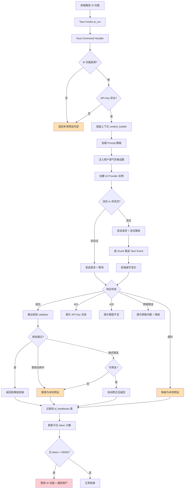
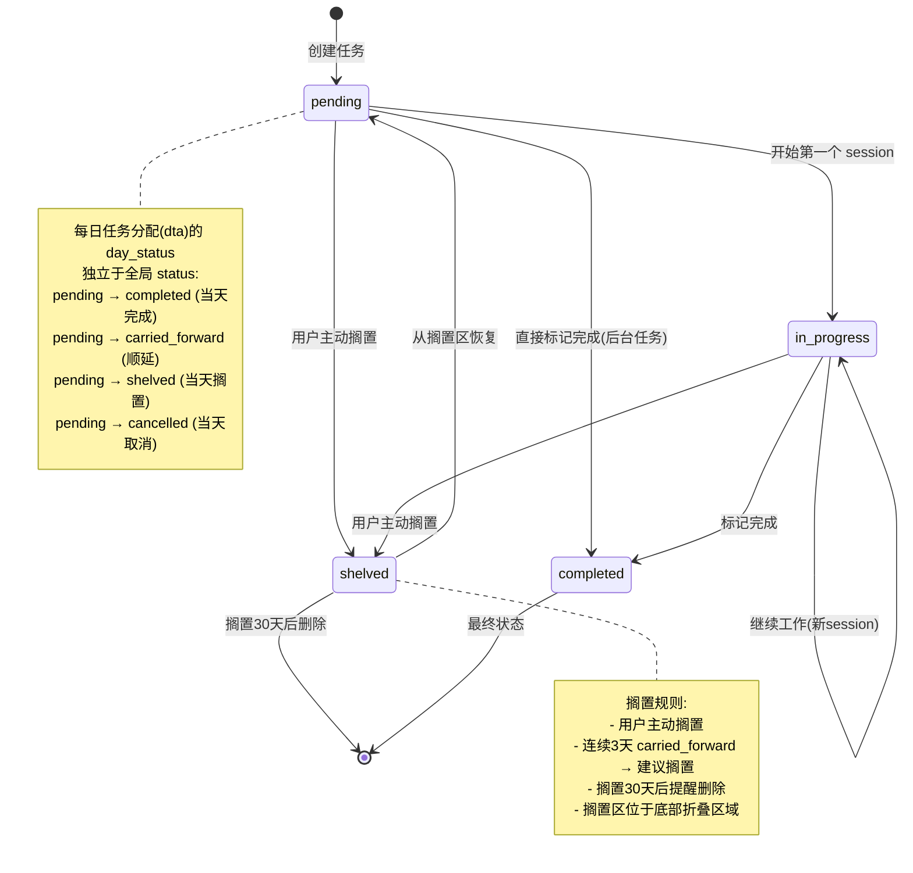
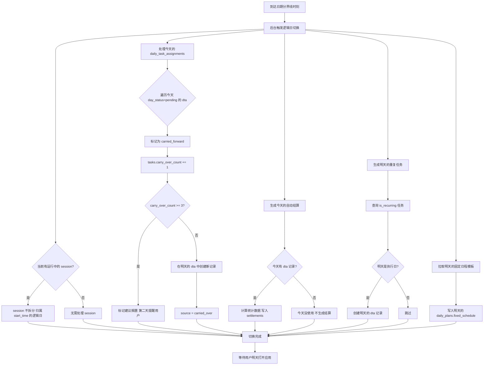

# 我想做一款产品，这是未完成的设计文档以及部分要求：

---

## 一、你新增的功能点评价

## 🧑‍💻 User

我想做一款产品，这是未完成的设计文档以及部分要求：

---

## 一、你新增的功能点评价

### ✅ 番茄钟模式
**非常必要。** 研究生的工作特点是"需要深度专注但容易被打断"，番茄钟天然契合。

**建议增强点：**
```
🍅 智能番茄钟
├── 传统模式：25分钟专注 + 5分钟休息
├── 弹性模式：用户自定义时长（有人习惯45分钟）
├── 深度模式：90分钟专注（适合写论文/跑实验）
└── 中断记录：番茄钟被打断时，记录原因（导师找/开会/摸鱼）
    └── 数据价值：分析"被动中断"vs"主动放弃"的比例
```

### ✅ 昨日复盘 + 专注最久的事
**这个设计很聪明。** 不是简单的"昨天完成了什么"，而是**让用户看到自己的时间投入分布**。

**建议呈现方式：**
```
📊 昨日复盘（2025-05-09）

⏱️ 总专注时长：6小时42分钟
🏆 专注最久：写论文方法论部分（2小时18分钟）
📈 完成情况：4/6 任务完成

时间分布：
████████████░░░░░░░░ 科研核心 60%（4h）
████░░░░░░░░░░░░░░░░ 事务性   20%（1.3h）
███░░░░░░░░░░░░░░░░░ 学习提升 15%（1h）
██░░░░░░░░░░░░░░░░░░ 其他     5%（0.3h）

💡 洞察：你昨天在核心科研上投入了60%的时间，
   这是本周最高的一天！保持这个节奏。
```

### ✅ AI自动拆解 + 四象限
**这是核心差异化功能。** 但需要设计好交互：

```
用户输入："完成论文第三章"

AI拆解建议：
┌─────────────────────────────────┐
│ 🤖 AI建议拆解为以下子任务：      │
├─────────────────────────────────┤
│ ☐ 梳理第三章大纲（30分钟）       │  [紧急重要]
│ ☐ 查找相关文献5篇（1小时）       │  [不紧急重要]
│ ☐ 撰写3.1节初稿（2小时）         │  [紧急重要]
│ ☐ 绘制方法流程图（1小时）        │  [不紧急重要]
│ ☐ 导师审阅前自查（30分钟）       │  [紧急不重要]
├─────────────────────────────────┤
│ [✓ 采纳全部]  [✏️ 手动调整]      │
└─────────────────────────────────┘
```

**关键设计：**
- AI拆解是**建议**，不是强制
- 用户可以一键采纳，也可以手动编辑
- 每个子任务自动标注四象限位置
- 显示预估时长（基于历史数据或AI推理）

### ✅ 日结算分级 + 不同视觉反馈
**这个设计太棒了！** 游戏化的正反馈机制。

```
🎯 日结算分级系统

S级 - 超额完成（120%+）
├── 视觉：金色光效 + 彩虹进度条
├── 音效：成就解锁音效
└── 文案："今天的你简直无敌！完成了所有计划还额外推进了XX任务"

A级 - 完美完成（100%）
├── 视觉：发光进度条 + 星星特效
├── 音效：清脆的完成音
└── 文案："完美的一天！所有计划都按时完成"

B级 - 基本完成（70-99%）
├── 视觉：蓝色进度条
├── 音效：柔和提示音
└── 文案："不错的一天，还有X个任务明天继续加油"

C级 - 严重滞后（<70%）
├── 视觉：灰色进度条（不要用红色，避免负面情绪）
├── 音效：无音效或极轻柔的提示
└── 文案："今天可能遇到了一些困难，明天我们重新开始"
```

**关键：C级的文案不能有指责感，要给台阶下。**

### ✅ AI语气设置
**这个功能很人性化。** 不同用户对"鼓励"的接受度不同。

```
⚙️ AI交互风格设置

🎭 预设风格：
├── 📚 学术导师型："根据你的进度，建议明天优先处理..."
├── 💪 健身教练型："干得漂亮！明天继续冲！"
├── 🧘 禅意陪伴型："今天已经很努力了，休息一下吧"
├── 🤖 极简数据型："完成率68%，建议调整计划"
└── 🎨 自定义：用户自己写prompt模板

🎚️ 鼓励强度：
[低] ────●──── [高]
 ↑              ↑
 少说话        多鼓励
```

### ✅ 置顶半透明 + 边缘吸附
**解决了桌面应用的"存在感"问题。** 这是macOS上很多效率工具的标配。

```
🪟 显示模式

模式1：迷你悬浮球（默认）
├── 位置：屏幕右上角
├── 显示：当前任务名 + 计时
├── 交互：点击展开完整面板
└── 吸附：自动贴边，不遮挡内容

模式2：侧边栏模式
├── 位置：屏幕右侧
├── 宽度：200px，半透明
├── 显示：今日任务列表 + 进度
└── 快捷键：Cmd+Shift+K 唤起/隐藏

模式3：全屏模式
├── 用于：每日计划/日结算
├── 触发：主动打开或定时弹出
└── 背景：毛玻璃效果，不完全遮挡
```

### ✅ 周报生成 + 后期社交功能
**分阶段很明智。** 社交功能是双刃剑，做好了是增长引擎，做不好会变成负担。

**建议：**
- MVP阶段完全不做社交
- 先把单机体验打磨到极致
- 后期如果要做社交，考虑**匿名PK模式**（只看数据不看人，避免社交压力）

---

## 二、你提出的五个问题的解决方案

### 问题1：引导思考 vs. 使用门槛

> "越需要引导的人，越容易跳过引导"

**你说得太对了。** 这是所有"教育型产品"的死穴。

#### 解决方案：**渐进式引导 + 智能跳过**

```
🎯 引导流程的三种模式

模式A：首次使用（完整引导）
├── 第1天：完整的5步引导流程
├── 第2-3天：简化为3步
└── 第4天起：根据用户行为自适应

模式B：老用户快速模式（默认）
├── 打开应用直接显示：
│   "今天想做什么？"
│   [快速添加任务] [查看昨日复盘] [跳过]
├── 如果用户点"跳过"，记录次数
└── 连续跳过3次后，弹出：
    "看起来你不需要引导了，已为你切换到极简模式"

模式C：极简模式
├── 打开即显示任务列表
├── 底部小字："需要帮助规划今天？点这里"
└── 用户主动点击才进入引导流程
```

**关键设计原则：**
1. **默认假设用户知道自己要做什么**（尊重用户）
2. **引导是可选的辅助功能**，不是必经关卡
3. **通过数据判断用户是否需要引导**：
 - 如果用户每天都能快速添加3+任务 → 不需要引导
 - 如果用户打开应用后停留超过30秒不操作 → 主动弹出："需要帮你想想今天做什么吗？"

#### 额外方案：**"思考卡片"而非"引导流程"**

```
不要做成"问答式引导"，而是做成"启发式卡片"：

┌─────────────────────────────────┐
│ 💭 今日思考                      │
├─────────────────────────────────┤
│ 你的长线目标"完成论文"已经      │
│ 进行了23天，当前在里程碑3。      │
│                                 │
│ 今天可以推进的方向：            │
│ • 继续昨天未完成的baseline复现  │
│ • 开始设计改进方案              │
│ • 补充相关文献阅读              │
│                                 │
│ [基于此创建任务] [我有其他计划]  │
└─────────────────────────────────┘
```

这种方式**不是在问用户问题，而是在给用户提供思考素材**，用户可以采纳也可以忽略，心理压力小得多。

---

### 问题2：AI建议的"有效性边界"问题

> "AI很难判断用户是真的效率低，还是遇到了学术卡点"

**这是AI应用的核心难题。** 解决方案是：**不要让AI假装懂科研，而是让AI做好"数据镜子"。**

#### 解决方案：**AI的三层能力边界**

```
🤖 AI能力分层

第一层：数据呈现（100%可靠）
├── "你今天在'读论文'上花了3小时，但标记为未完成"
├── "这是你本周第4次推迟这个任务"
└── "你在类似任务上的平均完成时间是2.5小时"
    → 只陈述事实，不做判断

第二层：模式识别（80%可靠）
├── "你通常在上午10-12点效率最高"
├── "你在'写代码'类任务上的完成率是85%，但'读论文'只有60%"
└── "你倾向于先做紧急任务，导致重要但不紧急的任务积压"
    → 基于历史数据的客观分析

第三层：建议生成（需谨慎）
├── ❌ 错误示范："建议你把论文拆成只读摘要"
│   └── 问题：AI不懂论文的学术深度
├── ✅ 正确示范："你可以尝试：
│   • 设定更小的阶段性目标（如'读完第3章'）
│   • 或者调整预估时间（当前预估可能偏乐观）
│   • 或者标记为'探索型任务'（进度难量化）"
    └── 给选项，不给结论
```

#### 关键设计：**让用户教AI**

```
任务完成后弹出：

┌─────────────────────────────────┐
│ 📝 任务复盘：读论文《XXX》      │
├─────────────────────────────────┤
│ 计划时长：2小时                 │
│ 实际时长：4小时                 │
│                                 │
│ 为什么花了更久？（可选）        │
│ ○ 论文比预期难懂                │
│ ○ 中途被打断                    │
│ ○ 摸鱼了                        │
│ ○ 其他：___________             │
│                                 │
│ [跳过] [提交]                   │
└─────────────────────────────────┘
```

**用户的反馈会训练AI的理解边界**，下次AI就知道"读论文"这类任务的不确定性高，不会给出过于简单的建议。

---

### 问题3：长线目标的进度幻觉

> "论文进度条在技术上极难定义"

**你说得对，这是个伪需求。** 但用户确实需要"我在推进"的感觉。

#### 解决方案：**用"里程碑完成度"替代"百分比进度"**

```
❌ 错误设计：
论文进度：████████░░░░░░░░ 45%
└── 问题：45%怎么算出来的？用户自己都不信

✅ 正确设计：
论文进度：里程碑 3/7 已完成
├── ✅ 里程碑1：确定研究方向（2周前完成）
├── ✅ 里程碑2：文献综述（1周前完成）
├── 🔄 里程碑3：方法论设计（进行中，已投入8天）
│   ├── ✅ 学习XX方法
│   ├── 🔄 复现baseline（今日任务）
│   └── ⬜ 设计改进方案
├── ⬜ 里程碑4：实验与数据收集
├── ⬜ 里程碑5：撰写初稿
├── ⬜ 里程碑6：导师审稿
└── ⬜ 里程碑7：投稿

📊 整体进度可视化：
[████████████░░░░░░░░░░░░░░░░]
 已完成2个里程碑，正在进行第3个

💡 关键指标：
• 已投入总天数：23天
• 预计剩余里程碑：4个
• 当前里程碑卡点：baseline复现遇到bug
```

**核心思路：**
- 不要算百分比，算**里程碑数量**
- 不要算"完成度"，算**投入天数**
- 不要预测"还要多久"，而是显示**当前在哪个阶段**

#### 额外设计：**进度的"主观标注"**

```
用户可以手动标注当前感受：

里程碑3：方法论设计
├── 客观进度：子任务 2/3 完成
├── 主观感受：[拖动滑块]
│   [刚开始] ────●──────── [快完成了]
└── AI不会基于主观感受做判断，只是记录用户的心理状态
```

这样即使客观进度难以量化，用户也能表达"我觉得快做完了"或"我觉得还早着呢"。

---

### 问题4：桌面应用的"存在感"难题

> "如何在不打扰的前提下让用户记住'我还有计划'？"

**这是桌面端效率工具的终极难题。** 我的解决方案：

#### 方案A：**"呼吸式提醒"而非"弹窗式打扰"**

```
🫁 呼吸式存在感设计

1. 视觉呼吸
├── 迷你悬浮球每30分钟轻微"呼吸"一次（透明度变化）
├── 不是闪烁，而是像呼吸一样柔和
└── 用户余光能注意到，但不会被打断

2. 任务切换提醒
├── 检测到用户切换应用（如从Word切到浏览器）
├── 悬浮球显示："当前任务：写论文（已专注45分钟）"
└── 3秒后自动消失

3. 番茄钟结束提醒
├── 不要用刺耳的铃声
├── 用柔和的音效 + 屏幕边缘的光晕效果
└── 提示："休息5分钟？或继续下一个番茄钟？"
```

#### 方案B：**"环境融入"而非"独立存在"**

```
🖥️ 与系统深度集成

macOS：
├── 菜单栏图标显示当前任务倒计时
├── 通知中心显示今日进度
└── Dock图标显示未完成任务数量（小红点）

Windows：
├── 任务栏显示当前专注时长
├── 系统托盘显示今日完成率
└── Windows 11的小组件集成

跨平台：
├── 桌面壁纸叠加层（半透明）
│   └── 在桌面右下角显示今日目标
├── 锁屏界面集成
│   └── 解锁电脑时显示："今天还有3个任务"
```

#### 方案C：**"主动召唤"机制**

```
⌨️ 全局快捷键

Cmd/Ctrl + Shift + K：快速唤起应用
├── 无论在哪个应用，按快捷键立即显示
├── 显示当前任务 + 快速操作面板
└── 再按一次隐藏

🎯 智能唤起时机
├── 检测到用户打开摸鱼网站（B站/知乎/微博）
│   └── 悬浮球轻微抖动："还记得今天的目标吗？"
├── 检测到用户长时间无操作（15分钟）
│   └── 弹出："休息够了吗？要继续工作吗？"
└── 用户可以在设置中关闭这些"智能提醒"
```

---

### 问题5：未完成任务的"负罪感卸载"

> "应用反复提醒一件用户已经在逃避的事，会诱发卸载"

**这是最难的心理学问题。** 你的洞察非常深刻。

#### 解决方案：**"温柔的遗忘机制"**

```
🗂️ 未完成任务的三种处理方式

方式1：自然过期（默认）
├── 昨天未完成的任务，今天会显示在"昨日遗留"区域
├── 用户可以选择：
│   ○ 今天继续做
│   ○ 推迟到明天
│   ○ 放弃这个任务
├── 如果用户连续3天不处理，任务自动归档到"搁置区"
└── 不再主动提醒，但用户可以随时查看

方式2：主动询问（温和）
├── 第二天打开应用时：
│   "昨天的'复现baseline'没完成，今天还想继续吗？"
│   [继续] [改天再说] [不想做了]
├── 如果用户选"不想做了"，弹出：
│   "没关系，有时候计划会变。要告诉我原因吗？（可选）"
│   ○ 任务太难了
│   ○ 优先级变了
│   ○ 不想说
└── 用户的反馈会帮助AI理解"为什么放弃"

方式3：智能降级
├── 如果一个任务被推迟3次以上
├── AI建议："这个任务似乎一直在推迟，要不要：
│   • 拆分成更小的任务？
│   • 降低优先级？
│   • 或者干脆删掉？"
└── 给用户一个"体面退出"的机会
```

#### 关键设计：**"搁置区"而非"失败记录"**

```
📦 搁置区设计

位置：应用底部的折叠区域
显示：灰色，不显眼
内容：
├── 被搁置的任务（不是"失败"，是"暂时不做"）
├── 搁置原因（如果用户填了）
└── 搁置时间

交互：
├── 用户可以随时把任务从搁置区拖回今日计划
├── 搁置超过30天的任务，自动永久删除
└── 删除前会问："这些任务已经搁置1个月了，要彻底删除吗？"

心理学原理：
└── 不是"你失败了"，而是"你选择了暂时不做"
    └── 给用户掌控感，而不是负罪感
```

#### 额外方案：**"反向激励"**

```
🎖️ 成就系统（但不要做成游戏化）

不要奖励"完成了多少任务"，而是奖励"坚持了多少天"：

├── 🔥 连续专注：连续7天每天至少专注2小时
├── 🎯 目标清晰：连续5天每天都设定了明确计划
├── 🧘 自我觉察：连续3天都进行了日结算复盘
└── 💪 突破自我：单日专注时长超过个人历史记录

关键：
└── 不惩罚"未完成"，只奖励"持续投入"
    └── 即使今天只完成了1个任务，只要你坚持记录，就是进步
```

---

## 三、综合建议：产品哲学的核心

你提出的这些问题，本质上都指向一个核心矛盾：

**效率工具 vs. 心理负担**

大多数效率工具失败的原因不是功能不够强，而是**让用户感到被监视、被评判、被催促**。

### 你的产品应该遵循的三个原则：

#### 1. **"陪伴"而非"监工"**
```
❌ 监工式：你今天又没完成任务！
✅ 陪伴式：今天可能遇到了一些困难，明天我们重新开始
```

#### 2. **"镜子"而非"法官"**
```
❌ 法官式：你的效率太低了，需要改进
✅ 镜子式：你今天在XX上花了3小时，这是你想要的吗？
```

#### 3. **"工具"而非"游戏"**
```
❌ 游戏式：完成任务获得经验值！升级！
✅ 工具式：你今天推进了长线目标，这是实实在在的进步
```

---

## 四、技术实现上的建议

基于你的功能描述，我建议的技术架构：

```
📦 技术栈

前端：
├── Tauri + Vue 3 + TypeScript
├── TailwindCSS（快速实现视觉效果）
├── Framer Motion（流畅的动画效果）
└── ECharts（数据可视化）

后端（本地）：
├── Rust（Tauri自带）
├── SQLite（本地数据库）
└── Tauri的系统API（通知、快捷键、托盘）

AI集成：
├── OpenAI API / Claude API
├── 本地缓存prompt模板
├── 流式响应（打字机效果）
└── 成本控制：只在必要时调用API

数据结构设计：
├── tasks表（任务）
├── sessions表（专注时段）
├── milestones表（长线目标里程碑）
├── reflections表（日结算记录）
└── settings表（用户偏好设置）
```

---

## 五、MVP的优先级建议

基于你的补充和我的分析，我建议的MVP功能优先级：

```
🎯 Phase 1 - 核心MVP（3-4周）
├── ✅ P0：番茄钟计时 + 任务列表
├── ✅ P0：日结算（分级反馈）
├── ✅ P0：置顶悬浮 + 边缘吸附
├── ✅ P1：四象限分类
├── ✅ P1：昨日复盘
└── ✅ P1：本地数据存储

🎯 Phase 2 - 差异化功能（2-3周）
├── ✅ P0：AI任务拆解
├── ✅ P0：长线目标 + 里程碑
├── ✅ P1：引导思考流程（可选模式）
├── ✅ P1：未完成任务的温和处理
└── ✅ P2：AI语气设置

🎯 Phase 3 - 体验优化（2周）
├── ✅ P0：视觉反馈（彩色进度条/发光效果）
├── ✅ P1：周报生成
├── ✅ P1：专注时段热力图
├── ✅ P2：成就系统
└── ✅ P2：数据导出

🎯 Phase 4 - 长期规划（3个月后）
├── ⬜ 云同步 + 登录系统
├── ⬜ 多设备支持
├── ⬜ 社交/PK功能
└── ⬜ 移动端适配
```

---

---
## 🤖 Assistant


---
## 🧑‍💻 User

<file_write file="design-doc.md" append="false">
# 🎯 FocusLab — 研究生专注力与任务管理桌面应用 设计文档

> 版本：v1.0
> 最后更新：2025年7月
> 状态：设计阶段

---

## 目录

1. [产品概述](#1-产品概述)
2. [目标用户分析](#2-目标用户分析)
3. [产品设计原则](#3-产品设计原则)
4. [功能架构总览](#4-功能架构总览)
5. [核心功能详细设计](#5-核心功能详细设计)
6. [AI 系统设计](#6-ai-系统设计)
7. [交互设计与界面规范](#7-交互设计与界面规范)
8. [数据模型设计](#8-数据模型设计)
9. [技术架构](#9-技术架构)
10. [开发路线图](#10-开发路线图)
11. [风险与应对策略](#11-风险与应对策略)
12. [成功指标](#12-成功指标)
13. [附录](#13-附录)

---

## 1. 产品概述

### 1.1 产品定位

FocusLab 是一款面向在校研究生的桌面端专注力与任务管理应用。它不是一个通用的待办清单工具，而是一个围绕研究生科研节奏设计的「个人工作操作系统」。

核心理念：**陪伴式效率管理** —— 不做监工，做镜子；不做法官，做伙伴。

### 1.2 要解决的核心问题

| 问题编号 | 痛点描述 | 现有工具的不足 |
|---------|---------|--------------|
| P1 | 研究生的任务颗粒度模糊，"写论文"太大，不知道今天该做什么 | 通用待办工具不提供任务拆解引导 |
| P2 | 长线任务（如发表论文）缺乏阶段感，容易焦虑或麻木 | 没有里程碑式的长线进度追踪 |
| P3 | 自我管理能力参差不齐，缺乏外部反馈 | 现有工具只记录，不反馈 |
| P4 | 不知道时间花在了哪里，缺乏自我觉察 | 计时工具与任务管理割裂 |
| P5 | 未完成任务带来心理负担，导致逃避甚至卸载工具 | 现有工具用红色标记未完成，加重焦虑 |

### 1.3 产品差异化

```
市面上的效率工具：
├── 滴答清单 / Todoist → 通用待办，无科研场景适配
├── Forest → 只有专注计时，无任务管理
├── Notion → 过于灵活，需要用户自己搭建系统
├── 番茄Todo → 番茄钟+待办，但无长线目标追踪
└── 以上所有 → 不提供引导思考、AI拆解、情绪感知

FocusLab 的差异化：
├── ✅ 专为研究生科研节奏设计
├── ✅ 引导式每日计划（帮用户想清楚今天做什么）
├── ✅ 长线目标 + 里程碑 + 每日小目标的三层映射
├── ✅ AI 驱动的任务拆解与个性化建议
├── ✅ 温和的未完成任务处理机制（不制造焦虑）
└── ✅ 游戏化日结算反馈（但不是游戏）
```

---

## 2. 目标用户分析

### 2.1 核心用户画像

**主要用户：在校研究生（硕士/博士）**

```
👤 用户画像 A：硕士研究生小李
├── 年龄：23岁，研二
├── 日常：每天在实验室工位工作 8-10 小时
├── 痛点：
│   ├── 导师给了大方向，但不知道每天具体做什么
│   ├── 论文写了两个月，感觉没什么进展
│   ├── 经常被事务性工作打断（报销、填表、开会）
│   └── 晚上回去觉得"今天好像什么都没做"
├── 期望：
│   ├── 有人帮我理清今天该做什么
│   ├── 能看到自己的长期进展
│   └── 不要给我太大压力
└── 技术水平：会用基本软件，不排斥新工具

👤 用户画像 B：博士研究生小王
├── 年龄：27岁，博三
├── 日常：同时推进论文、项目、助教工作
├── 痛点：
│   ├── 多条线并行，经常顾此失彼
│   ├── 长线任务太多，不知道优先级
│   ├── 时间碎片化严重
│   └── 焦虑感强，效率工具反而加重焦虑
├── 期望：
│   ├── 帮我管理多条并行任务线
│   ├── 告诉我时间花在了哪里
│   └── 不要让我觉得自己很失败
└── 技术水平：熟悉各种工具，对产品有较高要求
```

### 2.2 用户使用场景

```
场景1：早晨到工位
├── 打开电脑，FocusLab 自动启动
├── 显示昨日复盘卡片 + 今日引导
├── 用户花 3 分钟设定今日计划
└── 开始第一个番茄钟

场景2：工作中
├── FocusLab 以迷你悬浮球形式常驻
├── 显示当前任务名 + 番茄钟倒计时
├── 番茄钟结束时，柔和提醒休息
└── 用户切换任务时，一键切换计时

场景3：被打断
├── 导师突然叫去开会
├── 用户点击"暂停"，记录中断原因
├── 回来后点击"继续"或切换到新任务
└── 中断数据被记录，用于分析时间碎片化

场景4：一天结束
├── 用户点击"结束今天"或到达设定的结算时间
├── 弹出日结算面板，展示完成情况
├── 根据完成度给予分级反馈
└── 用户可以写一句今日感想（可选）

场景5：周末回顾
├── 用户打开周报功能
├── 查看本周时间分布、完成率趋势
├── AI 生成周度总结和建议
└── 用户调整下周的长线目标计划
```

### 2.3 用户心理模型

```
研究生使用效率工具的心理周期：

第1天：兴奋期 → "这个工具好酷，我要好好用"
第3天：适应期 → "还行，但有些功能用不上"
第7天：倦怠期 → "每天打开有点烦，但还在用"
第14天：分水岭 → 要么形成习惯，要么开始遗忘
第30天：稳定期 → 如果还在用，说明真的有价值

FocusLab 的留存策略：
├── 第1-3天：简化流程，不要让用户觉得复杂
├── 第3-7天：开始展示数据洞察，让用户看到价值
├── 第7-14天：引入长线目标追踪，建立沉没成本
├── 第14-30天：AI 建议开始基于历史数据，越来越精准
└── 第30天+：用户已经积累了大量数据，迁移成本高
```

---

## 3. 产品设计原则

### 3.1 核心原则

```
原则1：陪伴，不监工
├── 不用红色标记未完成任务
├── 不用"失败""落后"等负面词汇
├── 用"搁置""调整""重新开始"替代
└── 让用户感到被支持，而不是被评判

原则2：镜子，不法官
├── AI 呈现数据事实，不做价值判断
├── "你今天在XX上花了3小时" ✅
├── "你今天效率太低了" ❌
└── 让用户自己得出结论

原则3：工具，不游戏
├── 不做经验值、等级、排行榜
├── 成就系统奖励"坚持"而非"完成量"
├── 视觉反馈要克制，不要过度花哨
└── 核心价值是帮用户管理时间，不是娱乐

原则4：渐进，不强制
├── 所有引导流程都可以跳过
├── 功能复杂度随使用时间逐步展开
├── 新用户看到简洁界面，老用户解锁高级功能
└── 永远给用户"不用这个功能"的选项

原则5：轻量，不打扰
├── 常驻时占用最小屏幕空间
├── 提醒用柔和方式（呼吸灯效果，不是弹窗）
├── 尊重用户的专注状态
└── 用户在深度工作时，应用应该"隐形"
```

### 3.2 情感设计准则

```
语言风格：
├── 温暖但不油腻："今天辛苦了" ✅ "你是最棒的!!!" ❌
├── 诚实但不刺耳："今天完成了3个任务" ✅ "你只完成了3个" ❌
├── 建议但不命令："可以试试..." ✅ "你应该..." ❌
└── 用户可自定义AI语气风格

视觉风格：
├── 主色调：柔和的蓝绿色系（专注、平静）
├── 成功反馈：暖色光效（金色、橙色）
├── 未完成：灰色淡化（不是红色警告）
├── 整体氛围：像一个安静的图书馆，不是嘈杂的游戏厅
└── 支持深色模式（研究生经常熬夜）
```

---

## 4. 功能架构总览

### 4.1 功能模块地图

```
FocusLab 功能架构
│
├── 📋 任务管理模块
│   ├── 任务创建与编辑
│   ├── 四象限分类（紧急/重要矩阵）
│   ├── 任务标签与分区
│   ├── AI 智能拆解
│   └── 任务状态管理（进行中/完成/搁置）
│
├── ⏱️ 专注计时模块
│   ├── 番茄钟模式（25/45/90分钟可选）
│   ├── 自由计时模式
│   ├── 暂停/继续/切换
│   ├── 中断记录
│   └── 回溯补录
│
├── 🌅 每日计划模块
│   ├── 昨日复盘展示
│   ├── 引导思考流程（可选）
│   ├── 今日目标设定
│   ├── AI 每日建议
│   └── 固定日程导入
│
├── 🌙 日结算模块
│   ├── 完成度分级评估（S/A/B/C）
│   ├── 视觉反馈（彩色进度条/发光效果）
│   ├── AI 鼓励与建议
│   ├── 今日感想记录（可选）
│   └── 未完成任务处理
│
├── 🎯 长线目标模块
│   ├── 长线目标创建
│   ├── 里程碑设定与追踪
│   ├── 每日任务与里程碑关联
│   ├── 里程碑进度可视化
│   └── AI 进度分析与风险预警
│
├── 📊 数据分析模块
│   ├── 每日时间分布
│   ├── 专注时段热力图
│   ├── 完成率趋势图
│   ├── 任务类型分析
│   ├── 周报/月报生成
│   └── AI 数据洞察
│
├── 🤖 AI 助手模块
│   ├── 任务拆解
│   ├── 每日建议生成
│   ├── 日结算话术
│   ├── 周报总结
│   ├── 效率分析
│   └── Prompt 模板管理
│
├── 🪟 桌面集成模块
│   ├── 迷你悬浮球
│   ├── 边缘吸附
│   ├── 置顶半透明
│   ├── 系统托盘
│   ├── 全局快捷键
│   └── 通知管理
│
└── ⚙️ 设置模块
    ├── AI 语气风格设置
    ├── 番茄钟时长设置
    ├── 结算时间设置
    ├── 提醒偏好设置
    ├── 外观主题设置
    ├── 数据导出
    └── 快捷键自定义
```

### 4.2 功能优先级矩阵

```
                    高价值
                      │
         P0 核心      │     P1 重要
    ┌─────────────────┼─────────────────┐
    │ • 番茄钟计时     │ • 四象限分类     │
    │ • 任务列表       │ • 昨日复盘       │
    │ • 日结算分级     │ • 引导思考流程   │
    │ • 置顶悬浮球     │ • 长线目标里程碑 │
    │ • 本地数据存储   │ • AI 任务拆解    │
高频├─────────────────┼─────────────────┤低频
    │ P1 增强         │     P2 锦上添花   │
    │ • 中断记录       │ • 周报/月报生成  │
    │ • 任务切换       │ • 专注热力图     │
    │ • AI 鼓励话术    │ • 成就系统       │
    │ • 全局快捷键     │ • AI 语气设置    │
    │ • 深色模式       │ • 数据导出       │
    └─────────────────┼─────────────────┘
                      │
                    低价值
```

---

## 5. 核心功能详细设计

### 5.1 专注计时模块

#### 5.1.1 番茄钟模式

```
功能描述：
基于番茄工作法的计时系统，支持多种时长模式，
与任务系统深度集成。

计时模式：
├── 🍅 经典模式：25分钟专注 + 5分钟休息
├── 🍅🍅 深度模式：45分钟专注 + 10分钟休息
├── 🍅🍅🍅 沉浸模式：90分钟专注 + 15分钟休息
└── ⏱️ 自由模式：不设时限，手动开始/结束

长休息规则：
└── 每完成 4 个番茄钟，触发一次长休息（15-30分钟）

计时状态机：
┌──────┐    开始    ┌──────┐   时间到   ┌──────┐
│ 空闲  │ ────────→ │ 专注中 │ ────────→ │ 休息中 │
└──────┘           └──────┘           └──────┘
                     │  ↑                │
                暂停  │  │ 继续           │ 休息结束
                     ↓  │                ↓
                   ┌──────┐          ┌──────┐
                   │ 暂停中 │          │ 空闲  │
                   └──────┘          └──────┘
                     │
                放弃  │
                     ↓
                   ┌──────┐
                   │ 已放弃 │ → 记录放弃原因（可选）
                   └──────┘
```

#### 5.1.2 中断与切换

```
中断处理：
├── 用户点击"暂停"时，弹出中断原因选择：
│   ○ 🧑‍🏫 导师/同学找
│   ○ 📞 电话/消息
│   ○ 🚶 主动休息
│   ○ 🔄 切换任务
│   ○ 📝 其他
├── 中断数据被记录，用于分析时间碎片化程度
└── 中断原因选择是可选的，用户可以直接暂停不填

任务切换：
├── 在专注中点击"切换任务"
├── 当前任务自动暂停并记录已用时间
├── 弹出任务列表，选择新任务
├── 新任务开始计时
└── 切换记录保存，用于分析多任务切换频率

回溯补录：
├── 用户忘记按"开始"时，可以事后补录
├── 选择任务 → 输入开始时间和结束时间
├── 补录的时间段标记为"手动补录"
└── 补录数据参与统计，但在分析中标注来源
```

#### 5.1.3 计时数据记录

```
每个专注时段记录以下数据：
{
  session_id: 唯一标识,
  task_id: 关联的任务,
  start_time: 开始时间,
  end_time: 结束时间,
  planned_duration: 计划时长（番茄钟模式下）,
  actual_duration: 实际时长,
  mode: "pomodoro" | "free",
  status: "completed" | "paused" | "abandoned",
  interruptions: [
    { time: 中断时间, reason: 中断原因, duration: 中断时长 }
  ],
  is_manual_entry: 是否手动补录
}
```

### 5.2 任务管理模块

#### 5.2.1 任务创建

```
任务基本属性：
├── 任务名称（必填）
├── 任务描述（可选）
├── 所属分类（科研核心/事务性/学习提升/日常例行/个人发展）
├── 四象限位置（紧急重要/不紧急重要/紧急不重要/不紧急不重要）
├── 预估时长（可选，AI可辅助预估）
├── 关联长线目标（可选）
├── 关联里程碑（可选）
├── 截止日期（可选）
├── 重复规则（可选：每天/每周/自定义）
└── 标签（自定义标签，如"论文A""项目B"）

任务创建方式：
├── 方式1：手动创建（填写表单）
├── 方式2：快速创建（只输入名称，其他后补）
├── 方式3：AI拆解创建（输入大任务，AI拆解为子任务）
├── 方式4：从昨日遗留中继承
└── 方式5：从引导思考流程中生成
```

#### 5.2.2 四象限分类系统

```
四象限矩阵：

              紧急                    不紧急
        ┌──────────────────┬──────────────────┐
        │                  │                  │
  重要  │  🔴 第一象限      │  🟡 第二象限      │
        │  立即执行         │  计划执行         │
        │                  │                  │
        │  例：明天DDL的报告│  例：论文写作      │
        │  导师今天要的数据 │  学习新方法       │
        │                  │                  │
        ├──────────────────┼──────────────────┤
        │                  │                  │
 不重要 │  🟠 第三象限      │  🟢 第四象限      │
        │  委托或快速处理   │  减少或搁置       │
        │                  │                  │
        │  例：回复非紧急邮件│  例：整理桌面     │
        │  填写报销单       │  刷学术八卦       │
        │                  │                  │
        └──────────────────┴──────────────────┘

AI 辅助分类：
├── 用户创建任务时，AI 根据任务描述建议象限位置
├── 用户可以接受或手动调整
├── AI 学习用户的分类习惯，建议越来越准确
└── 每日计划时，AI 建议优先处理第一象限，然后第二象限
```

#### 5.2.3 任务状态流转

```
任务生命周期：

  ┌──────┐   开始    ┌──────┐   完成    ┌──────┐
  │ 待开始 │ ───────→ │ 进行中 │ ───────→ │ 已完成 │
  └──────┘          └──────┘          └──────┘
     │                 │
     │ 搁置            │ 搁置
     ↓                 ↓
  ┌──────┐          ┌──────┐
  │ 已搁置 │ ←────── │ 已搁置 │
  └──────┘          └──────┘
     │
     │ 恢复
     ↓
  ┌──────┐
  │ 待开始 │ （重新进入队列）
  └──────┘

搁置规则：
├── 用户可以主动搁置任何任务
├── 连续3天未处理的遗留任务，系统建议搁置
├── 搁置时可选填原因（任务太难/优先级变了/不想做了）
├── 搁置区的任务不参与日结算统计
├── 搁置超过30天的任务，提醒用户是否永久删除
└── 搁置区位于界面底部折叠区域，不显眼
```

#### 5.2.4 任务分类体系

```
按性质分类（一级分类）：
├── 📖 科研核心：读论文、写论文、做实验、跑代码、数据分析
├── 📋 事务性：报销、填表、回邮件、组会PPT、行政事务
├── 📚 学习提升：上课、学新工具、读教材、参加讲座
├── 🔄 日常例行：锻炼、吃饭、通勤、固定会议
└── 🌟 个人发展：社交、实习准备、副业、兴趣爱好

按紧急程度叠加（二级标签）：
├── 🔴 今日必须完成（DDL驱动）
├── 🟡 本周内完成（重要但不紧急）
└── 🟢 持续推进（长线任务的日常投入）

两个维度正交组合，形成完整的任务画像。
```

### 5.3 每日计划模块

#### 5.3.1 昨日复盘

```
触发时机：
├── 每天首次打开应用时自动展示
├── 如果用户昨天没有使用应用，显示最近一次使用的复盘
└── 用户可以跳过复盘直接进入计划

复盘内容：
┌─────────────────────────────────────────┐
│ 📊 昨日复盘（2025-07-09 周三）           │
├─────────────────────────────────────────┤
│                                         │
│ ⏱️ 总专注时长：6小时42分钟               │
│ 🏆 专注最久：写论文方法论部分（2h18m）    │
│ 📈 完成情况：4/6 任务完成                │
│                                         │
│ 时间分布：                               │
│ ████████████░░░░░░░░ 科研核心 60%        │
│ ████░░░░░░░░░░░░░░░░ 事务性   20%       │
│ ███░░░░░░░░░░░░░░░░░ 学习提升 15%       │
│ █░░░░░░░░░░░░░░░░░░░ 其他     5%        │
│                                         │
│ 未完成任务：                             │
│ ☐ 复现baseline代码                      │
│ ☐ 回复导师邮件                          │
│                                         │
│ [继续这些任务] [查看详情] [跳过]         │
└─────────────────────────────────────────┘
```

#### 5.3.2 引导思考流程

```
设计原则：
├── 不是"问答式访谈"，而是"启发式卡片"
├── 默认不强制，用户可以跳过
├── 根据用户行为自适应展示
└── 目标：3分钟内完成

触发策略：
├── 新用户（前7天）：默认展示引导流程
├── 老用户：
│   ├── 如果用户能快速添加任务 → 不展示引导
│   ├── 如果用户打开应用后30秒无操作 → 主动弹出
│   └── 用户可以在设置中选择"总是展示/从不展示/智能判断"
└── 引导流程可以在任何时候通过快捷键唤起

引导流程（5步，每步可跳过）：

Step 1 - 回顾昨日
┌─────────────────────────────────────────┐
│ 💭 昨天你完成了 4/6 个任务               │
│                                         │
│ 未完成的任务：                           │
│ ☐ 复现baseline代码                      │
│ ☐ 回复导师邮件                          │
│                                         │
│ 这些需要今天继续吗？                     │
│ [是，加入今天] [不了，搁置] [稍后决定]   │
└─────────────────────────────────────────┘

Step 2 - 审视长线目标
┌─────────────────────────────────────────┐
│ 🎯 你的长线目标进度                      │
│                                         │
│ 📄 论文A → 里程碑3/7 方法论设计（进行中）│
│ 📊 项目B → 里程碑2/5 数据收集（进行中）  │
│                                         │
│ 今天想在哪个方向推进？                   │
│ [论文A] [项目B] [都推进] [今天做别的]    │
└─────────────────────────────────────────┘

Step 3 - 检查固定日程
┌─────────────────────────────────────────┐
│
<file_write file="design-doc.md" append="true">
│ 📅 今天有固定日程吗？                    │
│                                         │
│ 已知日程：                               │
│ • 10:00-11:30 组会                      │
│ • 14:00-15:00 课程                      │
│                                         │
│ 预计可用工作时间：约 6 小时              │
│                                         │
│ [确认] [添加其他日程] [今天没有固定日程]  │
└─────────────────────────────────────────┘

Step 4 - 设定今日目标
┌─────────────────────────────────────────┐
│ ✏️ 基于以上信息，设定今天的目标           │
│                                         │
│ AI 建议（基于你的长线目标和昨日数据）：   │
│ 1. 继续复现baseline代码（关联论文A）     │
│ 2. 回复导师邮件（事务性，建议上午处理）  │
│ 3. 阅读2篇相关文献（关联论文A）          │
│                                         │
│ [采纳全部] [手动调整] [自己写]           │
│                                         │
│ 💡 建议：每天设定 3-5 个核心目标为宜     │
└─────────────────────────────────────────┘

Step 5 - 状态检查
┌─────────────────────────────────────────┐
│ 🌡️ 今天的状态如何？                      │
│                                         │
│ 😴 低能量  😐 一般  😊 不错  🔥 充沛     │
│                                         │
│ （AI会根据你的状态调整建议）             │
│ 低能量日 → 建议安排事务性/低脑力任务     │
│ 高能量日 → 建议攻克核心科研难题          │
│                                         │
│ [完成计划，开始工作！]                   │
└─────────────────────────────────────────┘
```

#### 5.3.3 思考卡片（轻量替代方案）

```
当用户选择跳过完整引导流程时，显示一张简洁的思考卡片：

┌─────────────────────────────────────────┐
│ 💭 今日思考                              │
│                                         │
│ 你的长线目标"完成论文A"已经进行了23天，  │
│ 当前在里程碑3。                          │
│                                         │
│ 今天可以推进的方向：                     │
│ • 继续昨天未完成的baseline复现           │
│ • 开始设计改进方案                       │
│ • 补充相关文献阅读                       │
│                                         │
│ [基于此创建任务] [我有其他计划] [关闭]   │
└─────────────────────────────────────────┘

设计要点：
├── 不是在问用户问题，而是在给用户提供思考素材
├── 用户可以采纳也可以忽略
├── 心理压力远小于问答式引导
└── 卡片内容基于用户的长线目标和历史数据自动生成
```

### 5.4 日结算模块

#### 5.4.1 结算触发机制

```
触发方式（多种方式并存）：

方式A：手动触发（推荐）
├── 用户点击"结束今天"按钮
└── 适用于：用户主动结束工作日

方式B：智能触发
├── 检测到用户结束最后一个任务后 10 分钟无操作
├── 弹出提示："今天的工作结束了吗？要进行日结算吗？"
└── 适用于：用户忘记手动触发

方式C：定时触发（兜底）
├── 用户在设置中自定义结算时间（默认 22:00）
├── 到达时间后弹出提醒
├── 如果用户忽略，不再重复弹出（第二天早上再展示）
└── 适用于：确保每天都有结算

优先级：方式A > 方式B > 方式C
```

#### 5.4.2 结算分级系统

```
分级规则：

S级 - 超额完成（完成率 ≥ 120%，即完成了额外任务）
├── 判定条件：所有计划任务完成 + 额外完成了非计划任务
├── 视觉效果：金色光效 + 彩虹渐变进度条 + 粒子特效
├── 音效：成就解锁音效（可关闭）
├── 进度条样式：彩虹色，带流光动画
└── AI 文案风格：热烈祝贺 + 数据亮点

A级 - 完美完成（完成率 = 100%）
├── 判定条件：所有计划任务全部完成
├── 视觉效果：发光进度条 + 星星特效
├── 音效：清脆的完成音
├── 进度条样式：金色，带发光效果
└── AI 文案风格：肯定 + 明日展望

B级 - 基本完成（完成率 70% - 99%）
├── 判定条件：大部分任务完成，少量未完成
├── 视觉效果：蓝色进度条，柔和
├── 音效：柔和提示音
├── 进度条样式：蓝色渐变
└── AI 文案风格：肯定已完成的 + 温和提及未完成

C级 - 需要调整（完成率 < 70%）
├── 判定条件：较多任务未完成
├── 视觉效果：灰蓝色进度条（不用红色）
├── 音效：无音效或极轻柔提示
├── 进度条样式：灰蓝色，不带动画
└── AI 文案风格：理解 + 建议调整 + 鼓励明天重新开始

完成率计算方式：
├── 基础完成率 = 已完成任务数 / 计划任务总数 × 100%
├── 超额部分 = 额外完成的非计划任务数 / 计划任务总数 × 100%
├── 最终完成率 = 基础完成率 + 超额部分
└── 注意：搁置的任务不计入分母
```

#### 5.4.3 结算面板设计

```
┌─────────────────────────────────────────────────┐
│                                                 │
│              🌙 今日结算                         │
│              2025-07-09 周三                     │
│                                                 │
│  ┌───────────────────────────────────────────┐  │
│  │          ★ A级 - 完美完成 ★                │  │
│  │     ████████████████████████ 100%          │  │
│  │          （发光进度条动画）                  │  │
│  └───────────────────────────────────────────┘  │
│                                                 │
│  📊 今日数据                                    │
│  ├── ⏱️ 总专注时长：7小时15分钟                 │
│  ├── 🍅 完成番茄钟：12个                        │
│  ├── ✅ 完成任务：5/5                           │
│  ├── 🏆 专注最久：写论文方法论（2h30m）         │
│  └── 📊 中断次数：3次（均为被动中断）           │
│                                                 │
│  📈 时间分布                                    │
│  科研核心  ████████████████░░░░ 65%             │
│  事务性    ████░░░░░░░░░░░░░░░ 15%             │
│  学习提升  ███░░░░░░░░░░░░░░░░ 12%             │
│  日常例行  ██░░░░░░░░░░░░░░░░░  8%             │
│                                                 │
│  ✅ 已完成任务                                  │
│  ├── ✅ 复现baseline代码        2h15m           │
│  ├── ✅ 回复导师邮件            30m             │
│  ├── ✅ 阅读文献2篇             1h45m           │
│  ├── ✅ 组会PPT准备             1h              │
│  └── ✅ 修改实验参数            1h30m           │
│                                                 │
│  🤖 AI 寄语                                    │
│  "今天所有任务都完成了，特别是在baseline复现上  │
│   取得了突破。明天可以开始设计改进方案了，       │
│   论文A的里程碑3即将完成！"                     │
│                                                 │
│  💭 今日感想（可选）                            │
│  ┌───────────────────────────────────────────┐  │
│  │ 今天效率不错，主要是上午状态好...           │  │
│  └───────────────────────────────────────────┘  │
│                                                 │
│  [保存结算] [查看本周趋势]                      │
│                                                 │
└─────────────────────────────────────────────────┘
```

#### 5.4.4 未完成任务处理

```
未完成任务的温和处理机制：

当日结算时存在未完成任务：
┌─────────────────────────────────────────┐
│ 📋 这些任务今天没有完成                  │
│                                         │
│ ☐ 设计改进方案（预估2h，今天未开始）    │
│   [明天继续] [搁置] [拆分成更小任务]    │
│                                         │
│ ☐ 整理实验数据（预估1h，进行了30m）     │
│   [明天继续] [搁置] [已经差不多了✓]     │
│                                         │
│ 💡 没关系，计划赶不上变化是常态。        │
│    重要的是你今天确实在推进。            │
└─────────────────────────────────────────┘

自动降级规则：
├── 第1天未完成：正常显示在"昨日遗留"
├── 第2天仍未完成：标记为"连续遗留"，AI建议拆分或调整
├── 第3天仍未完成：系统建议搁置
│   └── "这个任务已经连续3天未完成了，要不要：
│        • 拆分成更小的步骤？
│        • 降低优先级？
│        • 暂时搁置？"
├── 用户选择搁置后：任务进入搁置区，不再主动提醒
└── 搁置30天后：提醒用户是否永久删除

关键原则：
├── 永远不用"失败""落后""拖延"等词汇
├── 用"调整""搁置""重新安排"替代
├── 给用户"体面退出"的选项
└── 搁置不是失败，是策略性选择
```

### 5.5 长线目标模块

#### 5.5.1 长线目标结构

```
长线目标的三层结构：

第一层：长线目标（Goal）
├── 例：发表一篇SCI论文
├── 属性：名称、描述、预计完成时间、状态
└── 一个用户可以同时有多个长线目标

第二层：里程碑（Milestone）
├── 例：完成文献综述、完成方法论设计
├── 属性：名称、描述、预计完成时间、状态、排序
├── 每个长线目标包含多个里程碑
└── 里程碑之间有先后顺序

第三层：子任务（Sub-task）
├── 例：阅读论文A、复现baseline代码
├── 属性：与普通任务相同
├── 每个里程碑包含多个子任务
└── 子任务可以被拉入每日计划

映射关系：
长线目标 1:N 里程碑 1:N 子任务 → 每日任务

用户每天设定的任务可以关联到某个里程碑的子任务，
从而建立"今天做的事"与"长期目标"之间的清晰联系。
```

#### 5.5.2 里程碑进度可视化

```
进度展示方式（里程碑制，非百分比制）：

┌─────────────────────────────────────────────────┐
│ 🎯 长线目标：发表SCI论文                         │
│ 创建于 45 天前 · 已投入 32 天                    │
├─────────────────────────────────────────────────┤
│                                                 │
│ 里程碑进度：                                    │
│ [████████████████████████████░░░░░░░░░░░░░░░░]  │
│  里程碑 3/7 进行中                              │
│                                                 │
│ ✅ 里程碑1：确定研究方向          已完成（7天）  │
│ ✅ 里程碑2：完成文献综述          已完成（12天） │
│ 🔄 里程碑3：方法论设计            进行中（13天） │
│    ├── ✅ 学习XX方法              已完成         │
│    ├── 🔄 复现baseline            进行中（今日） │
│    └── ⬜ 设计改进方案            待开始         │
│ ⬜ 里程碑4：实验与数据收集        待开始         │
│ ⬜ 里程碑5：撰写初稿              待开始         │
│ ⬜ 里程碑6：导师审稿+修改         待开始         │
│ ⬜ 里程碑7：投稿+审稿回复         待开始         │
│                                                 │
│ 📊 关键指标                                     │
│ ├── 已投入总天数：32天                          │
│ ├── 已完成里程碑：2个                           │
│ ├── 当前里程碑子任务：2/3 完成                  │
│ └── 本周在此目标上投入：8.5小时                 │
│                                                 │
│ 💭 主观进度感受：                                │
│ [刚开始] ──────────●──── [快完成了]              │
│                                                 │
└─────────────────────────────────────────────────┘

设计要点：
├── 不显示百分比，只显示里程碑完成数量
├── 不预测"还要多久"，只显示"已投入多少天"
├── 用户可以手动标注主观进度感受
├── 里程碑可以随时增删改（计划会变是正常的）
└── 每个里程碑展开后显示子任务完成情况
```

#### 5.5.3 长线目标与每日任务的关联

```
关联方式：

1. 创建任务时关联
├── 用户创建任务时，可选择"关联到长线目标"
├── 选择目标 → 选择里程碑 → 任务自动成为该里程碑的子任务
└── 也可以不关联（独立任务）

2. 引导思考时关联
├── 引导流程的Step 2会展示长线目标进度
├── 用户选择"今天推进论文A"后
├── 系统自动展示论文A当前里程碑的待完成子任务
└── 用户选择要做的子任务，自动加入今日计划

3. AI建议时关联
├── AI分析长线目标进度后
├── 建议用户今天应该推进哪个目标的哪个子任务
└── 用户采纳后自动关联

数据价值：
├── 用户可以看到"今天做的事对长期目标的贡献"
├── 周报中展示"本周在各长线目标上的时间投入"
└── AI可以基于投入数据给出进度预警
```

### 5.6 数据分析模块

#### 5.6.1 专注时段热力图

```
类似 GitHub 贡献热力图，展示用户的专注时间分布：

📊 本周专注热力图

         周一   周二   周三   周四   周五   周六   周日
 08:00   ░░    ██    ██    ░░    ██    ░░    ░░
 09:00   ██    ██    ██    ██    ██    ░░    ░░
 10:00   ██    ██    ░░    ██    ██    ░░    ░░
 11:00   ██    ██    ██    ██    ░░    ░░    ░░
 12:00   ░░    ░░    ░░    ░░    ░░    ░░    ░░
 13:00   ░░    ██    ░░    ██    ██    ░░    ░░
 14:00   ██    ██    ██    ██    ██    ░░    ░░
 15:00   ██    ░░    ██    ██    ██    ░░    ░░
 16:00   ██    ██    ██    ░░    ██    ░░    ░░
 17:00   ░░    ██    ██    ██    ░░    ░░    ░░
 18:00   ░░    ░░    ░░    ░░    ░░    ░░    ░░
 19:00   ░░    ░░    ██    ░░    ░░    ░░    ░░
 20:00   ░░    ░░    ██    ░░    ░░    ░░    ░░

颜色深度：
░ = 无专注记录
▓ = 专注 < 30分钟
█ = 专注 ≥ 30分钟

洞察：
├── 🕐 你的高效时段：上午 9:00-11:00，下午 14:00-16:00
├── 📉 低效时段：午饭后 12:00-13:00
└── 💡 建议：把核心科研任务安排在高效时段
```

#### 5.6.2 周报/月报

```
📋 周报（2025-07-07 ~ 2025-07-13）

📊 本周概览
├── 总专注时长：34小时20分钟（日均4.9小时）
├── 完成任务：28/35（完成率 80%）
├── 完成番茄钟：68个
├── 日结算评级：S×1, A×2, B×2, C×0
└── 最高效的一天：周三（7h15m）

📈 与上周对比
├── 专注时长：+2.5小时 ↑
├── 完成率：+5% ↑
├── 中断次数：-3次 ↓（改善）
└── 科研核心占比：+8% ↑

🎯 长线目标进展
├── 论文A：里程碑3 → 子任务完成 2/3
│   └── 本周投入：12小时
├── 项目B：里程碑2 → 子任务完成 1/4
│   └── 本周投入：6小时
└── 课程学习：按计划进行
    └── 本周投入：4小时

📊 时间分布
├── 科研核心：58%（上周50%）↑
├── 事务性：18%（上周25%）↓
├── 学习提升：14%（上周15%）
├── 日常例行：7%（上周8%）
└── 个人发展：3%（上周2%）

🤖 AI 周度总结
"这周整体表现不错，科研核心时间占比提升了8个百分点，
说明你在有意识地减少事务性工作的干扰。论文A的baseline
复现已经完成，下周可以集中精力设计改进方案。
建议下周给项目B多分配一些时间，避免进度滞后。"

周报生成方式：
├── 自动生成：每周日晚上自动生成并通知用户
├── 手动生成：用户随时可以点击"生成周报"
├── AI参与：AI基于数据生成文字总结和建议
└── 导出格式：支持导出为 Markdown / PDF
```

### 5.7 桌面集成模块

#### 5.7.1 显示模式

```
模式1：迷你悬浮球（默认工作模式）
┌──────────────────┐
│ 🍅 写论文 18:32  │
└──────────────────┘
├── 位置：屏幕边缘，可拖拽
├── 大小：约 180×40 px
├── 内容：当前任务名 + 番茄钟倒计时
├── 透明度：70%（可调节）
├── 交互：
│   ├── 单击：展开快捷操作面板
│   ├── 双击：打开完整应用窗口
│   ├── 右键：暂停/切换任务/结束
│   └── 拖拽：移动位置
├── 吸附：靠近屏幕边缘时自动吸附
└── 置顶：始终在其他窗口之上

模式2：侧边栏模式
┌────────────────────┐
│ 📋 今日任务         │
│                    │
│ ✅ 回复导师邮件     │
│ 🔄 复现baseline    │
│    🍅 18:32        │
│ ☐ 阅读文献2篇      │
│ ☐ 设计改进方案     │
│                    │
│ 进度：2/4 完成     │
│ ████████░░░░ 50%   │
│                    │
│ ⏱️ 今日专注 3h20m  │
└────────────────────┘
├── 位置：屏幕右侧
├── 宽度：220px
├── 透明度：80%（可调节）
├── 内容：今日任务列表 + 进度 + 当前计时
└── 交互：可折叠/展开

模式3：完整窗口模式
├── 用于：每日计划、日结算、数据分析、设置
├── 大小：可调节，默认 1000×700 px
├── 触发：双击悬浮球 / 全局快捷键 / 系统托盘
└── 背景：支持毛玻璃效果

模式切换：
├── 全局快捷键：Cmd/Ctrl + Shift + F → 切换悬浮球/侧边栏
├── 全局快捷键：Cmd/Ctrl + Shift + K → 打开/关闭完整窗口
└── 系统托盘右键菜单中也可切换
```

#### 5.7.2 提醒系统

```
提醒类型与方式：

1. 番茄钟结束提醒
├── 方式：悬浮球呼吸动画 + 柔和音效 + 系统通知
├── 内容："25分钟专注完成！休息5分钟？"
├── 操作：[开始休息] [再来一个] [结束任务]
└── 音效：可自定义，默认为柔和铃声

2. 休息结束提醒
├── 方式：悬浮球轻微抖动 + 系统通知
├── 内容："休息时间到，准备好继续了吗？"
├── 操作：[继续专注] [延长休息5分钟]
└── 不强制，用户可以忽略

3. 日结算提醒
├── 方式：系统通知（到达设定时间时）
├── 内容："今天辛苦了，要进行日结算吗？"
├── 操作：[开始结算] [稍后提醒] [今天跳过]
└── 最多提醒2次，之后不再打扰

4. 呼吸式存在感提醒
├── 方式：悬浮球每30分钟轻微透明度变化
├── 不弹出任何通知
├── 只是视觉上的"呼吸"效果
├── 让用户余光能注意到应用的存在
└── 可在设置中关闭

5. 智能提醒（可选，默认关闭）
├── 检测到用户长时间无操作（15分钟+）
│   └── 悬浮球显示："休息够了吗？"
├── 检测到用户切换到非工作应用
│   └── 悬浮球轻微抖动（不弹通知）
└── 用户可以在设置中精细控制每种提醒的开关

提醒偏好设置：
├── 全局免打扰模式（关闭所有提醒）
├── 单独控制每种提醒的开关
├── 自定义音效（或静音）
├── 自定义提醒时间段（如只在9:00-22:00提醒）
└── 番茄钟专注期间屏蔽非紧急提醒
```

---

## 6. AI 系统设计

### 6.1 AI 能力分层

```
Level 1 - 基础能力（低API消耗，高频使用）
├── 日结算鼓励话术生成
├── 每日建议生成（基于昨日数据）
├── 未完成任务的温和提醒文案
├── 任务完成后的正反馈文案
└── 预估API消耗：每用户每天 3-5 次调用

Level 2 - 分析能力（中等API消耗，中频使用）
├── 任务智能拆解（大任务 → 子任务列表）
├── 四象限自动分类建议
├── 周报/月报文字总结生成
├── 时间分配分析与建议
├── 效率趋势分析
├── 任务预估时长建议（基于历史数据）
└── 预估API消耗：每用户每天 2-3 次调用

Level 3 - 规划能力（高API消耗，低频使用）
├── 基于历史数据的每日计划建议
├── 长线任务风险预警（"按当前进度可能延期"）
├── 里程碑拆解建议（用户输入大目标，AI建议里程碑划分）
├── 个性化效率提升方案
└── 预估API消耗：每用户每周 3-5 次调用
```

### 6.2 AI 有效性边界

```
AI 能做好的事（数据驱动，客观）：
├── ✅ 呈现数据事实："你今天在XX上花了3小时"
├── ✅ 识别行为模式："你通常上午效率最高"
├── ✅ 任务拆解："把'写论文'拆成具体步骤"
├── ✅ 时间分析："本周科研时间占比下降了10%"
└── ✅ 生成鼓励文案：基于完成情况的个性化鼓励

AI 做不好的事（需要领域知识，主观）：
├── ❌ 判断科研质量："你的论文写得好不好"
├── ❌ 判断任务难度："这篇论文应该很容易读完"
├── ❌ 替代导师指导："你应该用XX方法做研究"
├── ❌ 判断效率原因："你今天效率低是因为..."
└── ❌ 预测精确时间："你的论文还需要23天完成"

应对策略：
├── AI 只在能力边界内给建议
├── 涉及学术判断时，AI 明确说"这需要和导师讨论"
├── 所有AI建议都标注"仅供参考"
├── 用户反馈机制：每条AI建议都有 👍👎 按钮
└── 基于用户反馈持续优化prompt

```

### 6.3 Prompt 模板系统

```

后端预设多套 Prompt 模板，根据场景和用户设置动态组合。

模板分类：

1. 日结算话术模板
   ├── 模板变量：{completion_rate}, {completed_tasks}, {focus_time},
   │             {longest_focus_task}, {uncompleted_tasks}, {grade}
   ├── 语气变量：{tone}（由用户设置决定）
   └── 示例模板：

--- S级模板 ---
system: "你是一个{tone}的AI助手，正在为用户进行每日工作结算。"
user: "用户今天的数据如下：

* 完成率：{completion_rate}%
* 已完成任务：{completed_tasks}
* 额外完成：{extra_tasks}
* 总专注时长：{focus_time}
* 专注最久的任务：{longest_focus_task}
  请生成一段50字以内的结算寄语，要求：

1. 肯定用户的超额完成
2. 提及具体的亮点数据
3. 对明天给出简短展望
4. 语气{tone}"

--- C级模板 ---
system: "你是一个{tone}的AI助手，正在为用户进行每日工作结算。"
user: "用户今天的数据如下：

* 完成率：{completion_rate}%
* 已完成任务：{completed_tasks}
* 未完成任务：{uncompleted_tasks}
* 总专注时长：{focus_time}
  请生成一段50字以内的结算寄语，要求：

1. 不要使用'失败''落后''拖延'等负面词汇

2. 肯定用户已经完成的部分

3. 对未完成的部分表示理解

4. 给出温和的调整建议

5. 语气{tone}"

6. 任务拆解模板
   ├── 模板变量：{task_name}, {task_description}, {estimated_time},
   │             {related_goal}, {user_history}
   └── 示例模板：

system: "你是一个任务规划助手，帮助研究生将大任务拆解为可执行的子任务。"
user: "请将以下任务拆解为3-7个子任务：
任务名称：{task_name}
任务描述：{task_description}
预估总时长：{estimated_time}
关联长线目标：{related_goal}
要求：

1. 每个子任务应该可以在一个番茄钟（25-45分钟）内完成

2. 子任务之间有清晰的先后顺序

3. 为每个子任务标注预估时长

4. 为每个子任务建议四象限分类

5. 输出JSON格式"

6. 周报总结模板
   ├── 模板变量：{weekly_stats}, {daily_breakdown}, {goal_progress},
   │             {time_distribution}, {comparison_with_last_week}
   └── 生成内容：文字总结 + 改进建议 + 下周展望

7. 引导思考建议模板
   ├── 模板变量：{yesterday_summary}, {goal_progress},
   │             {pending_tasks}, {user_energy_level}
   └── 生成内容：今日推荐任务列表 + 优先级建议

```

### 6.4 AI 语气风格系统

```

用户可在设置中选择AI的交互风格：

预设风格：

📚 学术导师型
├── 特点：专业、理性、有条理
├── 示例："根据本周数据，你在文献阅读上的时间投入充足，
│         建议下周将重心转向方法论设计。"
└── 适合：喜欢理性分析的用户

💪 健身教练型
├── 特点：热情、激励、直接
├── 示例："今天干得漂亮！7小时专注，这就是冠军的节奏！
│         明天继续冲！"
└── 适合：需要外部激励的用户

🧘 禅意陪伴型
├── 特点：温和、包容、不施压
├── 示例："今天已经很努力了。完成了3个任务，
│         这就是实实在在的进步。好好休息吧。"
└── 适合：容易焦虑的用户

🤖 极简数据型
├── 特点：简洁、只说数据、不带情感
├── 示例："完成率68%。建议明天优先处理遗留的2个任务。"
└── 适合：不喜欢废话的用户

😸 猫咪陪伴型
├── 特点：可爱、轻松、减压
├── 示例："喵～今天完成了5个任务呢，主人好厉害！
│         明天也要加油喵～"
└── 适合：喜欢轻松氛围的用户

🎨 自定义风格
├── 用户可以自己编写prompt描述
├── 示例："请用东北话风格给我做总结"
└── 高级功能，面向有prompt经验的用户

语气强度滑块：
[低] ────────●──── [高]
↑                  ↑
少说话/简洁      多鼓励/详细

技术实现：
├── 每种风格对应一个 system prompt 模板
├── 语气强度影响生成文本的长度和情感浓度
├── 用户切换风格后，下次AI生成即生效
└── 风格设置存储在本地 settings 表中

```

### 6.5 AI 调用策略与成本控制

```

成本控制策略：

1. 本地缓存
   ├── 常用的鼓励话术预生成一批，存在本地
   ├── 简单场景（如"任务完成"）直接用本地话术，不调API
   ├── 只有需要个性化分析时才调用API
   └── 预估可减少 40% 的API调用

2. 批量调用
   ├── 日结算时一次性生成所有需要的文案
   ├── 而不是每完成一个任务就调一次API
   └── 减少API调用次数

3. 分级调用
   ├── Level 1 功能：优先使用本地模板 + 变量替换
   ├── Level 2 功能：使用轻量模型（如 GPT-4o-mini）
   ├── Level 3 功能：使用完整模型（如 GPT-4o / Claude）
   └── 用户可在设置中选择AI质量等级（影响API消耗）

4. API Key 管理
   ├── MVP阶段：用户自备API Key（OpenAI / Claude / 其他）
   ├── 后期：提供官方API Key（付费订阅模式）
   ├── 支持多个API提供商（OpenAI、Anthropic、本地模型）
   └── API Key 加密存储在本地

5. 离线降级
   ├── 无网络时，AI功能降级为本地预设话术
   ├── 任务拆解降级为手动拆解
   ├── 核心功能（计时、任务管理）完全离线可用
   └── 网络恢复后自动同步需要AI处理的内容

预估月度成本（单用户）：
├── 轻度使用（仅日结算话术）：约 $0.5/月
├── 中度使用（+ 任务拆解 + 周报）：约 $2/月
├── 重度使用（全部AI功能）：约 $5/月
└── 使用 GPT-4o-mini 可降低约 60% 成本

```

---

## 7. 交互设计与界面规范

### 7.1 设计语言

```

品牌色彩：

主色：
├── Primary：#4F8CFF（宁静蓝）— 专注、平静
├── Primary Light：#7AABFF — 悬浮球、轻量元素
└── Primary Dark：#3366CC — 强调、按钮

辅助色：
├── Success：#52C41A（完成绿）— 任务完成、A级结算
├── Gold：#FAAD14（成就金）— S级结算、超额完成
├── Warning：#FF8C00（提醒橙）— 即将到期、注意
├── Neutral：#8C8C8C（中性灰）— 搁置、未完成（不用红色）
└── Background：#F5F7FA（浅灰白）— 主背景

深色模式：
├── Background：#1A1A2E — 主背景
├── Surface：#16213E — 卡片背景
├── Text Primary：#E0E0E0 — 主文字
├── Text Secondary：#8C8C8C — 次要文字
└── 所有功能色保持不变，但降低饱和度

字体：
├── 中文：思源黑体 / PingFang SC / Microsoft YaHei
├── 英文/数字：Inter / SF Pro
├── 等宽（代码/数据）：JetBrains Mono
├── 字号体系：12px / 14px / 16px / 20px / 24px / 32px
└── 行高：1.5（正文）/ 1.3（标题）

圆角：
├── 小元素（按钮、标签）：6px
├── 中元素（卡片、输入框）：10px
├── 大元素（弹窗、面板）：16px
└── 悬浮球：全圆角（pill shape）

阴影：
├── 悬浮球：0 2px 8px rgba(0,0,0,0.15)
├── 卡片：0 1px 4px rgba(0,0,0,0.08)
├── 弹窗：0 4px 16px rgba(0,0,0,0.12)
└── 深色模式下阴影改为发光效果

动画：
├── 过渡时长：200ms（快速）/ 300ms（标准）/ 500ms（强调）
├── 缓动函数：ease-out（进入）/ ease-in（退出）
├── 番茄钟倒计时：圆环进度动画
├── 日结算进度条：从左到右填充动画
├── S级特效：粒子飘散 + 光晕扩散
├── A级特效：柔和发光脉冲
└── 悬浮球呼吸：透明度 70% ↔ 90% 循环，周期 4s

```

### 7.2 核心页面布局

```

页面结构：

┌─────────────────────────────────────────────────────────┐
│  FocusLab                          [设置] [最小化] [关闭]│
├──────────┬──────────────────────────────────────────────┤
│          │                                              │
│  侧边栏   │              主内容区                        │
│          │                                              │
│ 📋 今日   │  （根据侧边栏选择切换内容）                  │
│ 🎯 目标   │                                              │
│ 📊 分析   │                                              │
│ 📅 日历   │                                              │
│          │                                              │
│          │                                              │
│          │                                              │
│          │                                              │
│          │                                              │
├──────────┤                                              │
│ ⚙️ 设置  │                                              │
└──────────┴──────────────────────────────────────────────┘

侧边栏导航：
├── 📋 今日计划：今日任务列表 + 番茄钟 + 快捷操作
├── 🎯 长线目标：长线目标管理 + 里程碑追踪
├── 📊 数据分析：热力图 + 趋势图 + 周报月报
├── 📅 日历视图：按日期查看历史记录
└── ⚙️ 设置：所有偏好设置

侧边栏宽度：60px（图标模式）/ 200px（展开模式）
可折叠，默认图标模式以节省空间

```

#### 7.2.1 今日计划页面

```

┌──────────────────────────────────────────────────────┐
│                                                      │
│  🌅 2025年7月10日 周四                    😊 状态不错 │
│                                                      │
│  ┌────────────────────────────────────────────────┐  │
│  │  🍅 当前专注                                    │  │
│  │                                                │  │
│  │  复现baseline代码                              │  │
│  │  ┌──────────────────────────────┐              │  │
│  │  │        18:32                  │              │  │
│  │  │    ╭───────────╮              │              │  │
│  │  │    │           │  圆环倒计时   │              │  │
│  │  │    ╰───────────╯              │              │  │
│  │  └──────────────────────────────┘              │  │
│  │  [⏸ 暂停]  [⏭ 切换任务]  [⏹ 结束]            │  │
│  │  🍅🍅🍅⚪⚪⚪  今日第3个番茄钟                  │  │
│  └────────────────────────────────────────────────┘  │
│                                                      │
│  📋 今日任务                          [+ 添加任务]   │
│                                                      │
│  🔴 紧急重要                                        │
│  ├── ✅ 回复导师邮件                    30m  ✓      │
│  └── 🔄 复现baseline代码               2h   🍅      │
│                                                      │
│  🟡 不紧急重要                                      │
│  ├── ☐ 阅读文献2篇                     1.5h         │
│  └── ☐ 设计改进方案                    2h           │
│                                                      │
│  🟠 紧急不重要                                      │
│  └── ☐ 提交报销单                      20m          │
│                                                      │
│  ──────────────────────────────────────              │
│  📊 今日进度  ████████░░░░░░░░ 2/5 完成  40%        │
│  ⏱️ 今日专注  3小时20分钟                            │
│                                                      │
│  [🌙 结束今天]                                      │
│                                                      │
└──────────────────────────────────────────────────────┘

```

#### 7.2.2 四象限视图

```

┌──────────────────────────────────────────────────────┐
│  📊 四象限视图                        [切换到列表视图] │
│                                                      │
│  ┌────────────────────┬────────────────────┐         │
│  │ 🔴 紧急 & 重要     │ 🟡 不紧急 & 重要   │         │
│  │    立即执行         │    计划执行         │         │
│  │                    │                    │         │
│  │ • 回复导师邮件 ✅   │ • 阅读文献2篇      │         │
│  │ • 复现baseline 🍅  │ • 设计改进方案      │         │
│  │                    │ • 学习新框架        │         │
│  │                    │                    │         │
│  ├────────────────────┼────────────────────┤         │
│  │ 🟠 紧急 & 不重要   │ 🟢 不紧急 & 不重要  │         │
│  │    快速处理         │    减少或搁置       │         │
│  │                    │                    │         │
│  │ • 提交报销单        │ • 整理桌面          │         │
│  │ • 填写问卷          │                    │         │
│  │                    │                    │         │
│  └────────────────────┴────────────────────┘         │
│                                                      │
│  💡 AI建议：你有2个紧急重要任务，建议上午优先处理。   │
│     不紧急但重要的任务可以安排在下午的专注时段。      │
│                                                      │
└──────────────────────────────────────────────────────┘

交互：
├── 任务可以在四个象限之间拖拽移动
├── 点击任务可以展开详情/开始计时
├── 每个象限显示任务数量角标
└── 支持列表视图和四象限视图切换

```

### 7.3 动效与视觉反馈规范

```

1. 番茄钟动效
   ├── 倒计时：圆环从满到空，顺时针消减
   ├── 专注中：圆环颜色为 Primary Blue
   ├── 休息中：圆环颜色为 Success Green
   ├── 最后5分钟：圆环轻微脉冲提醒
   └── 完成时：圆环填满 + 轻微弹跳动画

2. 任务完成动效
   ├── 勾选任务：复选框弹跳 + 任务文字划线 + 淡出
   ├── 完成音效：清脆的"叮"声（可关闭）
   └── 进度条：平滑增长动画（300ms）

3. 日结算动效
   ├── S级：
   │   ├── 进度条：彩虹渐变 + 流光动画
   │   ├── 背景：金色粒子飘散（持续3秒）
   │   ├── 文字：放大弹入 + 发光效果
   │   └── 音效：成就解锁音效
   ├── A级：
   │   ├── 进度条：金色 + 发光脉冲
   │   ├── 背景：星星特效（持续2秒）
   │   ├── 文字：淡入 + 轻微发光
   │   └── 音效：清脆完成音
   ├── B级：
   │   ├── 进度条：蓝色渐变填充
   │   ├── 背景：无特效
   │   ├── 文字：普通淡入
   │   └── 音效：柔和提示音
   └── C级：
   ├── 进度条：灰蓝色填充
   ├── 背景：无特效
   ├── 文字：普通淡入
   └── 音效：无音效

4. 悬浮球动效
   ├── 呼吸效果：透明度 70% ↔ 90%，周期4秒，正弦曲线
   ├── 番茄钟进行中：边框显示微型进度环
   ├── 任务完成：短暂的绿色闪烁（0.5秒）
   ├── 吸附动画：靠近边缘时弹性吸附（200ms）
   └── 展开面板：从悬浮球位置向外扩展（300ms）

5. 页面切换动效
   ├── 侧边栏切换：内容区淡入淡出（200ms）
   ├── 弹窗打开：从中心放大 + 背景模糊（300ms）
   ├── 弹窗关闭：缩小 + 淡出（200ms）
   └── 引导流程步骤切换：左右滑动（300ms）

```

---

## 8. 数据模型设计

### 8.1 ER 关系图

```

┌──────────┐     1:N     ┌──────────────┐     1:N     ┌──────────┐
│  goals   │ ──────────→ │  milestones  │ ──────────→ │  tasks   │
│ 长线目标  │             │    里程碑     │             │   任务    │
└──────────┘             └──────────────┘             └──────────┘
│
│ 1:N
↓
┌──────────┐
│ sessions │
│ 专注时段  │
└──────────┘
│
│ 1:N
↓
┌──────────────┐
│ interruptions│
│   中断记录    │
└──────────────┘

┌──────────────┐
│ daily_plans  │ ← 每日计划（关联当天的tasks）
│   每日计划    │
└──────────────┘

┌──────────────┐
│ settlements  │ ← 日结算记录
│   日结算      │
└──────────────┘

┌──────────────┐
│  categories  │ ← 任务分类
│    分类       │
└──────────────┘

┌──────────────┐
│   tags       │ ← 自定义标签
│    标签       │
└──────────────┘

┌──────────────┐
│  settings    │ ← 用户设置
│    设置       │
└──────────────┘

┌──────────────┐
│ ai_feedbacks │ ← AI生成的反馈记录
│  AI反馈       │
└──────────────┘

````

### 8.2 数据表详细设计

```sql
-- ============================================
-- 长线目标表
-- ============================================
CREATE TABLE goals (
    id              TEXT PRIMARY KEY,        -- UUID
    name            TEXT NOT NULL,           -- 目标名称
    description     TEXT,                    -- 目标描述
    status          TEXT NOT NULL DEFAULT 'active',
                    -- active | completed | archived
    created_at      DATETIME NOT NULL,
    updated_at      DATETIME NOT NULL,
    completed_at    DATETIME,               -- 完成时间
    target_date     DATETIME,               -- 预计完成日期（可选）
    sort_order      INTEGER NOT NULL DEFAULT 0
);

-- ============================================
-- 里程碑表
-- ============================================
CREATE TABLE milestones (
    id              TEXT PRIMARY KEY,
    goal_id         TEXT NOT NULL REFERENCES goals(id) ON DELETE CASCADE,
    name            TEXT NOT NULL,
    description     TEXT,
    status          TEXT NOT NULL DEFAULT 'pending',
                    -- pending | in_progress | completed
    sort_order      INTEGER NOT NULL DEFAULT 0,
    created_at      DATETIME NOT NULL,
    updated_at      DATETIME NOT NULL,
    completed_at    DATETIME
);

-- ============================================
-- 分类表
-- ============================================
CREATE TABLE categories (
    id              TEXT PRIMARY KEY,
    name            TEXT NOT NULL,           -- 分类名称
    icon            TEXT,                    -- 图标标识
    color           TEXT,                    -- 颜色代码
    is_default      BOOLEAN NOT NULL DEFAULT 0,
    sort_order      INTEGER NOT NULL DEFAULT 0
);

-- 预置分类数据
-- 📖 科研核心 | 📋 事务性 | 📚 学习提升 | 🔄 日常例行 | 🌟 个人发展

-- ============================================
-- 任务表
-- ============================================
CREATE TABLE tasks (
    id              TEXT PRIMARY KEY,
    name            TEXT NOT NULL,
    description     TEXT,
    category_id     TEXT REFERENCES categories(id),
    milestone_id    TEXT REFERENCES milestones(id),

    -- 四象限分类
    quadrant        TEXT NOT NULL DEFAULT 'important_not_urgent',
                    -- urgent_important | important_not_urgent
                    -- | urgent_not_important | not_urgent_not_important

    -- 紧急程度标签
    urgency_level   TEXT NOT NULL DEFAULT 'ongoing',
                    -- today_must | this_week | ongoing

    -- 状态
    status          TEXT NOT NULL DEFAULT 'pending',
                    -- pending | in_progress | completed | shelved

    -- 时间
    estimated_minutes   INTEGER,            -- 预估时长（分钟）
    actual_minutes      INTEGER DEFAULT 0,  -- 实际花费时长（分钟）
    due_date            DATE,               -- 截止日期
    plan_date           DATE,               -- 计划执行日期

    -- 重复
    is_recurring        BOOLEAN NOT NULL DEFAULT 0,
    recurrence_rule     TEXT,               -- 重复规则（JSON）

    -- 来源
    source          TEXT NOT NULL DEFAULT 'manual',
                    -- manual | ai_suggested | carried_over | guided

    -- 搁置相关
    shelved_at      DATETIME,
    shelve_reason   TEXT,
    consecutive_carry_over_days INTEGER DEFAULT 0,

    -- 时间戳
    created_at      DATETIME NOT NULL,
    updated_at      DATETIME NOT NULL,
    completed_at    DATETIME,

    sort_order      INTEGER NOT NULL DEFAULT 0
);

-- ============================================
-- 标签表（多对多）
-- ============================================
CREATE TABLE tags (
    id              TEXT PRIMARY KEY,
    name            TEXT NOT NULL UNIQUE,
    color           TEXT
);

CREATE TABLE task_tags (
    task_id         TEXT NOT NULL REFERENCES tasks(id) ON DELETE CASCADE,
    tag_id          TEXT NOT NULL REFERENCES tags(id) ON DELETE CASCADE,
    PRIMARY KEY (task_id, tag_id)
);

-- ============================================
-- 专注时段表
-- ============================================
CREATE TABLE sessions (
    id              TEXT PRIMARY KEY,
    task_id         TEXT NOT NULL REFERENCES tasks(id),
    start_time      DATETIME NOT NULL,
    end_time        DATETIME,
    planned_duration_minutes INTEGER,       -- 计划时长（番茄钟模式下）
    actual_duration_minutes  INTEGER,       -- 实际时长

    mode            TEXT NOT NULL DEFAULT 'pomodoro',
                    -- pomodoro | free

    pomodoro_preset TEXT,                   -- classic_25 | deep_45 | immersive_90

    status          TEXT NOT NULL DEFAULT 'in_progress',
                    -- in_progress | completed | abandoned

    is_manual_entry BOOLEAN NOT NULL DEFAULT 0,
    abandon_reason  TEXT,

    created_at      DATETIME NOT NULL
);

-- ============================================
-- 中断记录表
-- ============================================
CREATE TABLE interruptions (
    id              TEXT PRIMARY KEY,
    session_id      TEXT NOT NULL REFERENCES sessions(id) ON DELETE CASCADE,
    start_time      DATETIME NOT NULL,
    end_time        DATETIME,
    duration_minutes INTEGER,
    reason          TEXT,
                    -- teacher_colleague | phone_message
                    -- | active_rest | task_switch | other
    note            TEXT,
    created_at      DATETIME NOT NULL
);

-- ============================================
-- 每日计划表
-- ============================================
CREATE TABLE daily_plans (
    id              TEXT PRIMARY KEY,
    plan_date       DATE NOT NULL UNIQUE,
    energy_level    TEXT,                   -- low | normal | good | high
    fixed_schedule  TEXT,                   -- 固定日程（JSON数组）
    available_hours REAL,                   -- 预计可用工作时间
    note            TEXT,                   -- 每日备注
    guided_flow_completed BOOLEAN DEFAULT 0,-- 是否完成了引导流程
    created_at      DATETIME NOT NULL,
    updated_at      DATETIME NOT NULL
);

-- ============================================
-- 日结算表
-- ============================================
CREATE TABLE settlements (
    id              TEXT PRIMARY KEY,
    settle_date     DATE NOT NULL UNIQUE,

    -- 统计数据
    total_tasks         INTEGER NOT NULL DEFAULT 0,
    completed_tasks     INTEGER NOT NULL DEFAULT 0,
    extra_tasks         INTEGER NOT NULL DEFAULT 0,  -- 额外完成的非计划任务
    shelved_tasks       INTEGER NOT NULL DEFAULT 0,
    completion_rate     REAL NOT NULL DEFAULT 0,      -- 完成率百分比
    total_focus_minutes INTEGER NOT NULL DEFAULT 0,
    total_pomodoros     INTEGER NOT NULL DEFAULT 0,
    total_interruptions INTEGER NOT NULL DEFAULT 0,

    -- 分级
    grade           TEXT NOT NULL,          -- S | A | B | C

    -- 时间分布（JSON）
  
````

---
## 🤖 Assistant

我来帮你把设计文档从断点处补完。以下是从 `settlements` 表的 `time_distribution` 字段开始，一直到文档结尾的全部内容：

```markdown
    -- 时间分布（JSON）
    time_distribution   TEXT,               -- {"research":240,"admin":60,...} 分钟数

    -- 专注最久的任务
    longest_focus_task_id   TEXT REFERENCES tasks(id),
    longest_focus_minutes   INTEGER,

    -- AI 生成内容
    ai_summary          TEXT,               -- AI 结算寄语
    ai_suggestion       TEXT,               -- AI 明日建议

    -- 用户感想
    user_reflection     TEXT,               -- 用户自己写的今日感想

    -- 触发方式
    trigger_type        TEXT NOT NULL DEFAULT 'manual',
                        -- manual | smart | scheduled

    created_at          DATETIME NOT NULL
);

-- ============================================
-- AI 反馈记录表
-- ============================================
CREATE TABLE ai_feedbacks (
    id              TEXT PRIMARY KEY,
    type            TEXT NOT NULL,
                    -- settlement | task_breakdown | weekly_report
                    -- | daily_suggestion | encouragement
    context         TEXT,                   -- 触发上下文（JSON）
    prompt_used     TEXT,                   -- 使用的 prompt（脱敏后）
    response        TEXT NOT NULL,          -- AI 生成的内容
    user_rating     INTEGER,               -- 用户评分 1(👎) / 2(👍) / NULL(未评)
    model_used      TEXT,                   -- gpt-4o-mini | gpt-4o | claude-sonnet ...
    token_count     INTEGER,               -- token 消耗
    created_at      DATETIME NOT NULL
);

-- ============================================
-- 用户设置表（KV 结构）
-- ============================================
CREATE TABLE settings (
    key             TEXT PRIMARY KEY,
    value           TEXT NOT NULL,          -- JSON 序列化的值
    updated_at      DATETIME NOT NULL
);

-- 预置 key 清单：
-- ai_tone_style        → "academic" | "coach" | "zen" | "minimal" | "cat" | "custom"
-- ai_tone_intensity    → 1-10
-- ai_custom_prompt     → 用户自定义 prompt 文本
-- ai_provider          → "openai" | "anthropic" | "local"
-- ai_model             → "gpt-4o-mini" | "gpt-4o" | "claude-sonnet" ...
-- ai_api_key           → 加密存储
-- pomodoro_work_min    → 25 (默认)
-- pomodoro_break_min   → 5
-- pomodoro_long_break  → 15
-- pomodoro_rounds      → 4 (触发长休息的轮数)
-- settle_time          → "22:00"
-- theme                → "light" | "dark" | "system"
-- display_mode         → "float" | "sidebar" | "window"
-- float_opacity        → 0.7
-- global_shortcut_toggle   → "CmdOrCtrl+Shift+K"
-- global_shortcut_mode     → "CmdOrCtrl+Shift+F"
-- reminder_pomodoro    → true
-- reminder_breath      → true
-- reminder_smart       → false
-- reminder_dnd_start   → "23:00"
-- reminder_dnd_end     → "08:00"
-- sound_enabled        → true
-- sound_volume         → 0.6
-- guide_mode           → "auto" | "always" | "never"
-- first_launch_done    → false

-- ============================================
-- 索引
-- ============================================
CREATE INDEX idx_tasks_plan_date      ON tasks(plan_date);
CREATE INDEX idx_tasks_status         ON tasks(status);
CREATE INDEX idx_tasks_milestone      ON tasks(milestone_id);
CREATE INDEX idx_sessions_task        ON sessions(task_id);
CREATE INDEX idx_sessions_start       ON sessions(start_time);
CREATE INDEX idx_milestones_goal      ON milestones(goal_id);
CREATE INDEX idx_interruptions_session ON interruptions(session_id);
CREATE INDEX idx_settlements_date     ON settlements(settle_date);
CREATE INDEX idx_ai_feedbacks_type    ON ai_feedbacks(type);
```

### 8.3 本地数据策略

```
存储位置：
├── macOS：~/Library/Application Support/FocusLab/
├── Windows：%APPDATA%/FocusLab/
├── Linux：~/.config/FocusLab/
└── 数据库文件：focuslab.db（SQLite）

备份策略：
├── 每次应用启动时，自动备份数据库到 backups/ 目录
├── 保留最近 7 个备份，自动清理更早的
├── 用户可以手动触发"导出全部数据"（JSON / CSV）
└── 后期云同步时，本地数据作为主副本

数据安全：
├── API Key 使用系统钥匙串加密存储
│   ├── macOS：Keychain
│   ├── Windows：Credential Manager
│   └── Linux：libsecret
├── 数据库本身不加密（本地应用，无远程风险）
├── 导出数据时，API Key 不包含在导出文件中
└── 删除应用时提醒用户是否清除数据

数据量预估（单用户使用 1 年）：
├── tasks：约 2000 条（日均 5-6 条）
├── sessions：约 3000 条（日均 8-10 条）
├── interruptions：约 1500 条
├── settlements：365 条
├── ai_feedbacks：约 1500 条
├── 总数据库大小：约 10-30 MB
└── SQLite 完全能胜任，无需更重的数据库
```

---

## 9. 技术架构

### 9.1 整体架构

```
┌─────────────────────────────────────────────────────────────┐
│                        用户界面层                            │
│                                                             │
│  ┌──────────┐  ┌──────────┐  ┌──────────┐  ┌──────────┐   │
│  │ 悬浮球    │  │ 侧边栏    │  │ 主窗口    │  │ 系统托盘  │   │
│  │ (Tauri   │  │ (Tauri   │  │ (Tauri   │  │ (Tauri   │   │
│  │  Window) │  │  Window) │  │  Window) │  │  Tray)   │   │
│  └────┬─────┘  └────┬─────┘  └────┬─────┘  └────┬─────┘   │
│       └──────────────┴──────────────┴──────────────┘        │
│                          │                                   │
│              ┌───────────┴───────────┐                      │
│              │    Vue 3 应用         │                      │
│              │                       │                      │
│              │  ├── 路由 (Vue Router) │                      │
│              │  ├── 状态 (Pinia)      │                      │
│              │  ├── 组件库           │                      │
│              │  └── 工具层           │                      │
│              └───────────┬───────────┘                      │
│                          │ Tauri IPC (invoke / event)        │
├──────────────────────────┼──────────────────────────────────┤
│                     Rust 后端层                              │
│                          │                                   │
│  ┌───────────────────────┴───────────────────────┐          │
│  │              Tauri Core                        │          │
│  │                                               │          │
│  │  ┌─────────────┐  ┌─────────────────────────┐│          │
│  │  │ Command      │  │ 系统集成                 ││          │
│  │  │ Handlers     │  │                         ││          │
│  │  │              │  │ ├── 全局快捷键           ││          │
│  │  │ ├── task_*   │  │ ├── 系统托盘             ││          │
│  │  │ ├── session_*│  │ ├── 系统通知             ││          │
│  │  │ ├── goal_*   │  │ ├── 开机自启             ││          │
│  │  │ ├── settle_* │  │ └── 窗口管理             ││          │
│  │  │ ├── ai_*     │  │     (多窗口/置顶/透明)   ││          │
│  │  │ └── stats_*  │  └─────────────────────────┘│          │
│  │  └──────┬──────┘                              │          │
│  │         │                                     │          │
│  │  ┌──────┴──────┐  ┌──────────────┐           │          │
│  │  │ 数据访问层   │  │ AI 服务层     │           │          │
│  │  │ (SQLite +   │  │              │           │          │
│  │  │  rusqlite)  │  │ ├── Prompt    │           │          │
│  │  │             │  │ │   Engine    │           │          │
│  │  │ ├── CRUD    │  │ ├── API      │           │          │
│  │  │ ├── 查询    │  │ │   Client   │           │          │
│  │  │ ├── 统计    │  │ ├── Cache    │           │          │
│  │  │ └── 迁移    │  │ └── Fallback │           │          │
│  │  └─────────────┘  └──────┬───────┘           │          │
│  │                          │                    │          │
│  └──────────────────────────┼────────────────────┘          │
│                             │ HTTPS                          │
├─────────────────────────────┼────────────────────────────────┤
│                        外部服务                               │
│                             │                                │
│              ┌──────────────┴──────────────┐                │
│              │   AI API Provider           │                │
│              │   (OpenAI / Anthropic /     │                │
│              │    其他兼容 API)             │                │
│              └─────────────────────────────┘                │
│                                                             │
└─────────────────────────────────────────────────────────────┘
```

### 9.2 技术栈明细

```
前端 (WebView 内)：
├── 框架：Vue 3 (Composition API + <script setup>)
├── 语言：TypeScript（严格模式）
├── 构建：Vite 5
├── 路由：Vue Router 4
├── 状态管理：Pinia
├── UI框架：不用第三方UI库，自建组件（保持轻量+风格统一）
├── 样式：TailwindCSS 3 + CSS Variables（主题切换）
├── 动画：
│   ├── Vue Transition（页面切换/列表动画）
│   ├── CSS Animation（呼吸灯/脉冲/进度条）
│   ├── Canvas 2D / WebGL（S级粒子特效，按需加载）
│   └── Lottie（如果需要复杂矢量动画）
├── 图表：ECharts 5（热力图/趋势图/饼图）
├── 图标：Lucide Icons（MIT 开源，风格统一）
├── 拖拽：vuedraggable / @vueuse/core useDraggable
├── 日期：dayjs
├── Markdown渲染：markdown-it（周报导出预览）
└── 测试：Vitest + Vue Test Utils

后端 (Tauri / Rust)：
├── 框架：Tauri 2.x
├── 语言：Rust (edition 2021)
├── 数据库：SQLite 3 via rusqlite / sqlx
├── HTTP 客户端：reqwest（调用 AI API）
├── JSON：serde + serde_json
├── 异步运行时：tokio
├── 密钥存储：keyring-rs（跨平台钥匙串）
├── 日志：tracing + tracing-subscriber
├── 数据库迁移：自建简易迁移系统（SQL 文件 + 版本号）
├── UUID：uuid crate
├── 时间：chrono
└── 测试：Rust 内置测试框架

开发工具链：
├── 包管理：pnpm (前端) + cargo (Rust)
├── 代码规范：ESLint + Prettier (前端) + clippy (Rust)
├── Git Hooks：husky + lint-staged
├── CI/CD：GitHub Actions
├── 打包分发：Tauri 内置打包（.dmg / .msi / .AppImage）
└── 自动更新：Tauri Updater（后期启用）
```

### 9.3 多窗口架构

```
Tauri 多窗口方案：

窗口1：主窗口 (main)
├── 类型：普通窗口，可调节大小
├── 默认大小：1000×700，最小 800×600
├── 用途：完整功能界面（计划/目标/分析/设置）
├── 行为：关闭时隐藏到托盘而非退出应用
└── 路由：Vue Router 管理页面切换

窗口2：悬浮球 (float)
├── 类型：无边框窗口，始终置顶，透明背景
├── 大小：约 200×50 px（动态调整）
├── 用途：显示当前任务 + 计时
├── 行为：
│   ├── 可拖拽移动
│   ├── 靠近屏幕边缘自动吸附
│   ├── 单击展开快捷面板（在悬浮球附近弹出子面板）
│   └── 鼠标移开时恢复半透明
├── 特殊属性：
│   ├── decorations: false（无标题栏）
│   ├── always_on_top: true
│   ├── transparent: true
│   ├── skip_taskbar: true（不在任务栏显示）
│   └── resizable: false
└── 与主窗口通过 Tauri Event 通信

窗口3：快捷面板 (quick_panel)
├── 类型：无边框弹出窗口
├── 大小：约 320×400 px
├── 用途：快速操作（切换任务/暂停/查看列表）
├── 行为：
│   ├── 从悬浮球位置弹出
│   ├── 点击外部自动关闭
│   └── ESC 关闭
└── 按需创建和销毁

窗口间通信：
├── Tauri Event System（Rust → 所有前端窗口）
├── 示例事件：
│   ├── timer:tick → 每秒广播计时器状态
│   ├── task:completed → 任务完成通知
│   ├── settlement:trigger → 触发日结算
│   └── settings:changed → 设置变更同步
└── 所有窗口共享同一个 Rust 后端状态
```

### 9.4 前端状态管理

```
Pinia Store 设计：

stores/
├── useTaskStore.ts
│   ├── state: tasks[], currentTask, filter, sortOrder
│   ├── getters: todayTasks, completedTasks, pendingTasks,
│   │            tasksByQuadrant, completionRate
│   ├── actions: createTask, updateTask, completeTask,
│   │            shelveTask, restoreTask, deleteTask,
│   │            reorderTasks, importFromAI
│   └── 持久化：通过 Tauri invoke 读写 SQLite

├── useTimerStore.ts
│   ├── state: isRunning, isPaused, mode, remainingSeconds,
│   │          currentSessionId, pomodoroCount, isBreak
│   ├── getters: formattedTime, progress, isInFocus
│   ├── actions: startPomodoro, startFree, pause, resume,
│   │            abandon, switchTask, recordInterruption
│   └── 计时逻辑：setInterval 每秒更新，同步到 Rust 后端

├── useGoalStore.ts
│   ├── state: goals[], currentGoal
│   ├── getters: activeGoals, goalProgress
│   ├── actions: createGoal, createMilestone,
│   │            completeMilestone, updateSubjectiveProgress
│   └── 持久化：Tauri invoke

├── usePlanStore.ts
│   ├── state: todayPlan, yesterdaySummary, guidedFlowStep
│   ├── getters: availableHours, carryOverTasks
│   ├── actions: createPlan, completeGuide, setEnergyLevel
│   └── 每日首次打开时从后端加载

├── useSettlementStore.ts
│   ├── state: currentSettlement, settlementHistory
│   ├── getters: todayGrade, weeklyTrend
│   ├── actions: triggerSettlement, saveReflection,
│   │            handleUncompletedTasks
│   └── 日结算逻辑核心

├── useStatsStore.ts
│   ├── state: dailyStats, weeklyStats, heatmapData
│   ├── getters: focusHeatmap, categoryDistribution,
│   │            completionTrend, weeklyReport
│   ├── actions: loadStats, generateWeeklyReport,
│   │            exportData
│   └── 纯读取 + 计算，数据来自后端查询

├── useAIStore.ts
│   ├── state: isLoading, lastResponse, cachedSuggestions
│   ├── actions: breakdownTask, generateSettlementMessage,
│   │            generateDailySuggestion, generateWeeklyReport,
│   │            rateFeedback
│   └── 管理 AI 调用的加载状态和缓存

├── useSettingsStore.ts
│   ├── state: 所有设置项（从 settings 表加载）
│   ├── actions: updateSetting, resetToDefault
│   └── 设置变更时广播到所有窗口

└── useUIStore.ts
    ├── state: activeView, sidebarCollapsed, theme,
    │          floatPosition, isQuickPanelOpen
    ├── actions: switchView, toggleSidebar, toggleTheme,
    │            updateFloatPosition
    └── 纯前端 UI 状态，不持久化到数据库
```

### 9.5 Rust 后端模块

```
src-tauri/src/
├── main.rs                 -- 应用入口，Tauri Builder 配置
├── lib.rs                  -- 模块声明
│
├── db/
│   ├── mod.rs              -- 数据库初始化、连接池
│   ├── migrations/         -- SQL 迁移文件
│   │   ├── 001_init.sql
│   │   ├── 002_add_xxx.sql
│   │   └── ...
│   └── migrator.rs         -- 迁移执行器
│
├── models/
│   ├── mod.rs
│   ├── task.rs             -- Task 结构体 + CRUD
│   ├── session.rs          -- Session 结构体 + CRUD
│   ├── goal.rs             -- Goal + Milestone 结构体 + CRUD
│   ├── settlement.rs       -- Settlement 结构体 + CRUD
│   ├── daily_plan.rs       -- DailyPlan 结构体 + CRUD
│   ├── ai_feedback.rs      -- AIFeedback 结构体 + CRUD
│   └── settings.rs         -- Settings KV 操作
│
├── commands/
│   ├── mod.rs
│   ├── task_commands.rs    -- #[tauri::command] 任务相关
│   ├── session_commands.rs -- #[tauri::command] 计时相关
│   ├── goal_commands.rs    -- #[tauri::command] 目标相关
│   ├── settlement_commands.rs
│   ├── plan_commands.rs
│   ├── stats_commands.rs   -- 统计查询命令
│   ├── ai_commands.rs      -- AI 调用命令
│   └── settings_commands.rs
│
├── ai/
│   ├── mod.rs
│   ├── client.rs           -- HTTP 客户端（调用 OpenAI/Anthropic）
│   ├── prompts.rs          -- Prompt 模板管理
│   ├── cache.rs            -- 本地话术缓存
│   └── fallback.rs         -- 离线降级话术
│
├── services/
│   ├── mod.rs
│   ├── timer_service.rs    -- 计时器后台逻辑
│   ├── settlement_service.rs -- 结算计算逻辑
│   ├── stats_service.rs    -- 统计聚合查询
│   └── notification_service.rs -- 系统通知
│
├── system/
│   ├── mod.rs
│   ├── tray.rs             -- 系统托盘
│   ├── shortcuts.rs        -- 全局快捷键
│   ├── autostart.rs        -- 开机自启
│   └── keyring.rs          -- 密钥存储
│
└── utils/
    ├── mod.rs
    ├── datetime.rs          -- 日期时间工具
    └── errors.rs            -- 统一错误类型
```

### 9.6 前端目录结构

```
src/
├── App.vue
├── main.ts
│
├── assets/
│   ├── styles/
│   │   ├── globals.css         -- 全局样式 + CSS Variables
│   │   ├── animations.css      -- 动画关键帧定义
│   │   └── themes.css          -- 主题变量（light/dark）
│   ├── sounds/
│   │   ├── pomodoro-complete.mp3
│   │   ├── task-complete.mp3
│   │   ├── achievement.mp3
│   │   └── gentle-remind.mp3
│   └── images/
│       └── ...
│
├── components/
│   ├── common/                 -- 通用基础组件
│   │   ├── BaseButton.vue
│   │   ├── BaseCard.vue
│   │   ├── BaseInput.vue
│   │   ├── BaseModal.vue
│   │   ├── BaseTooltip.vue
│   │   ├── BaseProgress.vue
│   │   ├── BaseSlider.vue
│   │   ├── BaseTag.vue
│   │   └── IconWrapper.vue
│   │
│   ├── timer/                  -- 计时相关组件
│   │   ├── PomodoroRing.vue        -- 圆环倒计时
│   │   ├── TimerControls.vue       -- 暂停/继续/切换按钮
│   │   ├── PomodoroCounter.vue     -- 番茄钟计数指示器 🍅🍅🍅⚪⚪
│   │   ├── InterruptionDialog.vue  -- 中断原因选择弹窗
│   │   └── ManualEntryForm.vue     -- 回溯补录表单
│   │
│   ├── task/                   -- 任务相关组件
│   │   ├── TaskList.vue            -- 任务列表（按象限分组）
│   │   ├── TaskItem.vue            -- 单个任务行
│   │   ├── TaskCreateForm.vue      -- 创建任务表单
│   │   ├── TaskDetailPanel.vue     -- 任务详情侧边面板
│   │   ├── QuadrantView.vue        -- 四象限矩阵视图
│   │   ├── AIBreakdownPanel.vue    -- AI拆解结果展示
│   │   └── ShelvedTasksDrawer.vue  -- 搁置区折叠抽屉
│   │
│   ├── plan/                   -- 每日计划组件
│   │   ├── YesterdayReview.vue     -- 昨日复盘卡片
│   │   ├── GuidedFlow.vue          -- 引导思考流程（5步）
│   │   ├── ThinkingCard.vue        -- 简洁思考卡片
│   │   ├── EnergySelector.vue      -- 状态/能量选择器
│   │   └── ScheduleInput.vue       -- 固定日程输入
│   │
│   ├── settlement/             -- 日结算组件
│   │   ├── SettlementPanel.vue     -- 日结算完整面板
│   │   ├── GradeDisplay.vue        -- 评级展示（S/A/B/C + 特效）
│   │   ├── ProgressBar.vue         -- 彩色进度条
│   │   ├── TimeDistribution.vue    -- 时间分布条形图
│   │   ├── AIMessage.vue           -- AI寄语展示
│   │   ├── ReflectionInput.vue     -- 今日感想输入框
│   │   ├── UncompletedHandler.vue  -- 未完成任务处理
│   │   └── ParticleEffect.vue      -- S级粒子特效（Canvas）
│   │
│   ├── goal/                   -- 长线目标组件
│   │   ├── GoalList.vue            -- 目标列表
│   │   ├── GoalDetail.vue          -- 目标详情 + 里程碑
│   │   ├── MilestoneTimeline.vue   -- 里程碑时间线
│   │   ├── MilestoneForm.vue       -- 创建/编辑里程碑
│   │   ├── SubjectiveSlider.vue    -- 主观进度滑块
│   │   └── GoalCreateWizard.vue    -- 创建目标向导
│   │
│   ├── stats/                  -- 数据分析组件
│   │   ├── FocusHeatmap.vue        -- 专注时段热力图
│   │   ├── CompletionTrend.vue     -- 完成率趋势折线图
│   │   ├── CategoryPie.vue         -- 分类饼图
│   │   ├── WeeklyReport.vue        -- 周报展示
│   │   └── InsightCard.vue         -- AI 数据洞察卡片
│   │
│   ├── float/                  -- 悬浮球相关组件
│   │   ├── FloatBubble.vue         -- 迷你悬浮球
│   │   ├── QuickPanel.vue          -- 快捷操作面板
│   │   └── BreathingGlow.vue       -- 呼吸灯效果
│   │
│   └── settings/               -- 设置相关组件
│       ├── AIToneSettings.vue      -- AI语气设置
│       ├── PomodoroSettings.vue    -- 番茄钟设置
│       ├── ReminderSettings.vue    -- 提醒偏好
│       ├── AppearanceSettings.vue  -- 外观主题
│       ├── ShortcutSettings.vue    -- 快捷键设置
│       └── DataManagement.vue      -- 数据导出/备份
│
├── views/                      -- 页面级视图
│   ├── TodayView.vue               -- 今日计划页
│   ├── GoalsView.vue               -- 长线目标页
│   ├── StatsView.vue               -- 数据分析页
│   ├── CalendarView.vue            -- 日历视图页
│   ├── SettingsView.vue            -- 设置页
│   ├── FloatView.vue               -- 悬浮球窗口入口
│   └── QuickPanelView.vue          -- 快捷面板窗口入口
│
├── stores/                     -- Pinia 状态管理
│   └── （见 9.4 节）
│
├── composables/                -- 组合式函数
│   ├── useTimer.ts                 -- 计时器核心逻辑
│   ├── useTauriInvoke.ts           -- Tauri IPC 封装
│   ├── useTauriEvent.ts            -- Tauri 事件监听封装
│   ├── useSound.ts                 -- 音效播放
│   ├── useTheme.ts                 -- 主题切换
│   ├── useShortcut.ts              -- 快捷键
│   ├── useDragFloat.ts             -- 悬浮球拖拽 + 吸附
│   └── useAutoSettle.ts            -- 自动结算检测
│
├── utils/
│   ├── format.ts                   -- 格式化工具（时间/百分比）
│   ├── constants.ts                -- 常量定义
│   └── types.ts                    -- TypeScript 类型定义
│
└── router/
    └── index.ts                    -- 路由配置
```

### 9.7 关键技术实现要点

```
1. 悬浮球置顶 + 透明 + 拖拽 + 吸附

Tauri 窗口配置（tauri.conf.json）：
{
  "windows": [
    {
      "label": "float",
      "url": "/float",
      "width": 200,
      "height": 50,
      "decorations": false,
      "alwaysOnTop": true,
      "transparent": true,
      "skipTaskbar": true,
      "resizable": false
    }
  ]
}

前端拖拽实现：
├── 监听 mousedown → 开始拖拽
├── 监听 mousemove → 调用 Tauri appWindow.setPosition()
├── 监听 mouseup → 结束拖拽 + 计算吸附位置
├── 吸附算法：
│   ├── 如果距离屏幕边缘 < 20px → 自动贴边
│   ├── 使用 spring 动画缓动到吸附位置
│   └── 记住上次位置，下次启动恢复
└── 半透明：CSS background-color: rgba(..., 0.7)
    ├── 鼠标悬浮时提高不透明度到 0.95
    └── 不透明度可在设置中调节

2. 全局快捷键

Tauri 2.x API：
├── plugin-global-shortcut
├── 注册：
│   tauri::plugin::global_shortcut::register(
│       "CmdOrCtrl+Shift+K",
│       |_app, _shortcut, _event| {
│           // 切换主窗口显示/隐藏
│       }
│   )
├── 冲突处理：注册失败时提示用户更换快捷键
└── 用户自定义：从 settings 表读取快捷键配置

3. 系统托盘

托盘菜单：
├── 显示主窗口
├── ────────── (分隔线)
├── 当前任务：写论文 (18:32)
├── [暂停] / [继续]
├── ────────── (分隔线)
├── 今日进度：3/5 完成
├── ────────── (分隔线)
├── 日结算
├── 设置
├── ────────── (分隔线)
└── 退出 FocusLab

托盘图标：
├── 默认：应用Logo
├── 专注中：带计时进度的动态图标（如果系统支持）
├── macOS：支持菜单栏文字显示（当前任务名/倒计时）
└── 任务完成时：短暂闪烁

4. 计时器精度保障

问题：浏览器 setInterval 在标签页不活跃时精度下降
解决方案：
├── 方案A：Rust 后端维护一个精确计时器
│   ├── 使用 tokio::time::interval
│   ├── 每秒通过 Tauri Event 广播到前端
│   └── 前端只负责展示，不负责计时
├── 方案B：前端使用 Web Worker
│   ├── Worker 线程不受标签页可见性影响
│   └── 兜底方案
├── 最终方案：Rust 后端计时 + 前端 Worker 双保险
│   ├── 正常情况使用 Rust 后端时间
│   ├── 前端 Worker 作为校验
│   └── 两者偏差 > 2秒时以 Rust 为准
└── 注意：倒计时结束事件由 Rust 后端触发，保证可靠性

5. AI 流式响应

实现方式：
├── Rust 使用 reqwest 发起 SSE 请求
├── 逐 chunk 通过 Tauri Event 推送到前端
├── 前端逐字显示（打字机效果）
├── 用户可以中途取消生成
└── 超时处理：30秒无响应自动降级为本地话术

示例 Rust 代码片段：
// AI 流式调用（伪代码）
async fn stream_ai_response(prompt: &str, app: AppHandle) {
    let mut stream = client.post(url)
        .json(&body)
        .send().await?.bytes_stream();

    while let Some(chunk) = stream.next().await {
        let text = parse_sse_chunk(chunk?);
        app.emit("ai:stream-chunk", &text)?;
    }
    app.emit("ai:stream-done", ())?;
}

6. 数据库迁移

简易迁移系统：
├── migrations/ 目录下按编号存放 SQL 文件
├── 数据库中维护一个 _migrations 表记录已执行的迁移
├── 应用启动时自动检查并执行未执行的迁移
├── 迁移只支持正向（不支持回滚，简化实现）
└── 示例：

CREATE TABLE IF NOT EXISTS _migrations (
    version INTEGER PRIMARY KEY,
    name    TEXT NOT NULL,
    applied_at DATETIME NOT NULL DEFAULT CURRENT_TIMESTAMP
);

-- 启动时：
-- 1. 查询 _migrations 表获取已执行的最大版本号
-- 2. 扫描 migrations/ 目录，找到版本号更大的文件
-- 3. 按顺序执行，每个成功后插入 _migrations 记录
-- 4. 任何一个失败则中止并报错
```

---

## 10. 开发路线图

### 10.1 Phase 1 — 核心 MVP（第 1-4 周）

```
目标：一个可用的"番茄钟 + 任务列表 + 日结算"工具

Week 1：项目搭建 + 基础框架
├── [ ] Tauri 2 + Vue 3 + TypeScript 项目初始化
├── [ ] TailwindCSS + 主题系统搭建
├── [ ] SQLite 数据库初始化 + 迁移系统
├── [ ] 基础 CRUD 命令（Tauri invoke）
├── [ ] 主窗口布局骨架（侧边栏 + 内容区）
├── [ ] Pinia Store 基础结构
└── 里程碑：能编译运行，能在前后端间传递数据

Week 2：任务管理 + 番茄钟
├── [ ] 任务创建/编辑/删除/完成
├── [ ] 任务列表展示（按四象限分组）
├── [ ] 番茄钟计时器（Rust 后端计时 + 前端展示）
├── [ ] 番茄钟圆环 UI + 倒计时动画
├── [ ] 计时状态机（开始/暂停/继续/放弃）
├── [ ] 专注时段数据记录
├── [ ] 基础音效播放
└── 里程碑：能创建任务并用番茄钟计时

Week 3：日结算 + 悬浮球
├── [ ] 日结算计算逻辑（完成率/分级）
├── [ ] 日结算面板 UI（进度条/数据展示/评级动效）
├── [ ] S/A/B/C 四级视觉反馈
├── [ ] 未完成任务处理流程
├── [ ] 悬浮球窗口（置顶/透明/拖拽）
├── [ ] 悬浮球显示当前任务 + 倒计时
├── [ ] 系统托盘基础功能
├── [ ] 全局快捷键（显示/隐藏）
└── 里程碑：完整的一天工作流可以走通

Week 4：打磨 + 补缺 + 内测
├── [ ] 四象限拖拽视图
├── [ ] 任务分类体系（五大类）
├── [ ] 昨日复盘卡片
├── [ ] 悬浮球吸附 + 快捷面板
├── [ ] 深色模式
├── [ ] 本地数据持久化验证
├── [ ] Bug 修复 + 交互优化
├── [ ] 应用图标 + 名称 + 关于页面
└── 里程碑：MVP 可以交给 3-5 人内测

Phase 1 交付物：
├── ✅ 创建任务 + 四象限分类 + 分类标签
├── ✅ 番茄钟计时（25/45/90分钟 + 自由模式）
├── ✅ 暂停/继续/放弃 + 中断原因记录
├── ✅ 日结算分级（S/A/B/C）+ 视觉反馈
├── ✅ 未完成任务温和处理
├── ✅ 昨日复盘卡片
├── ✅ 悬浮球置顶 + 吸附 + 半透明
├── ✅ 系统托盘 + 全局快捷键
├── ✅ 深色模式
└── ✅ 本地 SQLite 数据存储
```

### 10.2 Phase 2 — AI 与长线目标（第 5-7 周）

```
目标：引入 AI 能力和长线目标系统，形成差异化

Week 5：AI 基础集成
├── [ ] AI 服务层搭建（Rust HTTP 客户端）
├── [ ] API Key 管理（加密存储 + 设置界面）
├── [ ] Prompt 模板系统
├── [ ] AI 日结算话术生成（替换硬编码文案）
├── [ ] AI 语气风格设置（5种预设 + 强度滑块）
├── [ ] 离线降级（本地预设话术缓存）
├── [ ] 流式响应 + 打字机效果
└── 里程碑：日结算话术由 AI 生成

Week 6：AI 任务拆解 + 每日建议
├── [ ] AI 任务拆解功能（大任务 → 子任务列表）
├── [ ] 拆解结果展示面板（采纳/编辑/拒绝）
├── [ ] AI 四象限自动分类建议
├── [ ] AI 每日建议生成（基于昨日数据）
├── [ ] AI 反馈记录 + 用户评分（👍👎）
├── [ ] 引导思考流程（5步，可选）
├── [ ] 思考卡片（轻量替代方案）
└── 里程碑：AI 辅助用户规划每日任务

Week 7：长线目标系统
├── [ ] 长线目标创建/编辑/归档
├── [ ] 里程碑创建/编辑/排序/完成
├── [ ] 里程碑时间线可视化
├── [ ] 任务与里程碑关联
├── [ ] 里程碑进度展示（非百分比制）
├── [ ] 主观进度感受滑块
├── [ ] 引导流程中的长线目标审视
├── [ ] 每日任务与长线目标的投入统计
└── 里程碑：用户能追踪长线目标进度

Phase 2 交付物：
├── ✅ AI 日结算话术（个性化 + 多风格）
├── ✅ AI 任务智能拆解
├── ✅ AI 四象限分类建议
├── ✅ AI 每日计划建议
├── ✅ AI 语气风格设置（5种 + 自定义）
├── ✅ 引导思考流程 + 思考卡片
├── ✅ 长线目标 + 里程碑追踪
├── ✅ 里程碑进度可视化
├── ✅ 任务与长线目标关联
└── ✅ 离线降级方案
```

### 10.3 Phase 3 — 数据可视化与体验优化（第 8-9 周）

```
Week 8：数据分析
├── [ ] 专注时段热力图（ECharts）
├── [ ] 完成率趋势折线图
├── [ ] 时间分类饼图
├── [ ] AI 数据洞察卡片
├── [ ] 周报自动生成（数据 + AI 总结）
├── [ ] 周报 Markdown 导出
├── [ ] 日历视图（历史日期查看）
└── 里程碑：用户能看到多维度的时间数据

Week 9：体验打磨
├── [ ] S级结算粒子特效（Canvas）
├── [ ] 日结算完整动效流程优化
├── [ ] 番茄钟最后5分钟提醒动效
├── [ ] 悬浮球呼吸灯效果
├── [ ] 任务完成动效
├── [ ] 番茄钟定制化设置完善
├── [ ] 提醒偏好精细控制
├── [ ] 数据导出功能（JSON/CSV）
├── [ ] 自动备份
├── [ ] 开机自启选项
├── [ ] 全面的 Bug 修复 + 性能优化
└── 里程碑：产品体验打磨到位，可以公开发布

Phase 3 交付物：
├── ✅ 专注热力图
├── ✅ 完成率趋势图
├── ✅ 分类时间分布图
├── ✅ AI 数据洞察
├── ✅ 周报生成 + 导出
├── ✅ 日历视图
├── ✅ 完整的动效体系
├── ✅ 数据导出/备份
└── ✅ 发布 v1.0 正式版
```

### 10.4 Phase 4 — 长期演进（第 10 周+）

```
可选方向（根据用户反馈决定优先级）：

🎖️ 成就系统
├── 连续专注天数徽章
├── 里程碑完成勋章
├── 坚持记录奖励
└── 只奖励"坚持"，不奖励"完成量"

📱 移动端适配
├── Tauri Mobile（iOS / Android）
├── 或 PWA 方案
└── 核心功能：快速记录 + 查看进度

☁️ 云同步
├── 用户账号系统
├── 数据加密云同步
├── 多设备支持
└── 可选服务端：Supabase / 自建

👥 社交功能
├── 匿名专注 PK
├── 学习小组
├── 只看数据不看人
└── 避免社交压力

🔌 插件/集成
├── 日历同步（Google Calendar / Apple Calendar）
├── 论文管理工具集成（Zotero）
├── 笔记工具集成（Obsidian / Notion）
└── Webhook / API 开放

🧠 AI 进阶
├── 本地模型支持（Ollama）
├── 长期效率模式学习
├── 智能排程（基于历史数据自动安排每日任务）
└── 多轮对话式计划制定
```

### 10.5 里程碑总览

```
          Week 1-4           Week 5-7           Week 8-9         Week 10+
            │                  │                  │                 │
  ┌─────────┴────────┐ ┌──────┴───────┐ ┌───────┴──────┐ ┌───────┴───────┐
  │    Phase 1       │ │   Phase 2    │ │   Phase 3    │ │   Phase 4     │
  │   核心 MVP       │ │ AI + 长线目标│ │ 数据 + 打磨  │ │   长期演进    │
  │                  │ │              │ │              │ │               │
  │ • 任务管理       │ │ • AI 拆解    │ │ • 热力图     │ │ • 成就系统    │
  │ • 番茄钟         │ │ • AI 话术    │ │ • 周报       │ │ • 云同步      │
  │ • 日结算         │ │ • 语气设置   │ │ • 趋势图     │ │ • 移动端      │
  │ • 悬浮球         │ │ • 引导流程   │ │ • 动效完善   │ │ • 社交功能    │
  │ • 深色模式       │ │ • 长线目标   │ │ • 数据导出   │ │ • 插件集成    │
  │                  │ │ • 里程碑     │ │              │ │               │
  └──────────────────┘ └──────────────┘ └──────────────┘ └───────────────┘
         ↑                    ↑                 ↑
      内测发布            扩大内测         v1.0 正式发布
     (3-5人)            (20-50人)          (公开发布)
```

---

## 11. 风险与应对策略

### 11.1 技术风险

```
风险1：Tauri 多窗口稳定性
├── 描述：悬浮球窗口 + 主窗口 + 快捷面板的多窗口协调可能不稳定
├── 可能性：中
├── 影响：高（核心体验受损）
├── 应对：
│   ├── 早期验证：Week 1 即搭建多窗口原型
│   ├── 降级方案：如果多窗口不稳定，悬浮球改为主窗口内的固定区域
│   └── 持续关注 Tauri 2.x 的更新和社区反馈
└── 状态：需要 Week 1 验证

风险2：悬浮球跨平台一致性
├── 描述：置顶/透明/拖拽在 macOS/Windows/Linux 上行为可能不一致
├── 可能性：高
├── 影响：中
├── 应对：
│   ├── MVP 阶段优先支持 macOS（目标用户较多使用 Mac）
│   ├── Windows 作为次优先级
│   ├── Linux 最后适配
│   └── 每个平台单独测试悬浮球行为
└── 状态：已知风险，分平台处理

风险3：AI API 可用性与延迟
├── 描述：国内网络环境下 OpenAI/Anthropic API 可能不稳定
├── 可能性：高（中国用户）
├── 影响：中（AI是增强功能，不是核心功能）
├── 应对：
│   ├── 所有核心功能离线可用（计时/任务/结算）
│   ├── AI 功能有完善的离线降级方案
│   ├── 支持配置代理/自定义 API 地址
│   ├── 后期支持国产大模型 API（通义千问/文心一言等）
│   └── 支持本地模型（Ollama）
└── 状态：已在架构中考虑

风险4：SQLite 并发性能
├── 描述：多窗口同时读写 SQLite 可能导致锁冲突
├── 可能性：低（单用户应用，并发量极低）
├── 影响：低
├── 应对：
│   ├── 使用 WAL 模式提高并发读写能力
│   ├── 所有数据库操作通过 Rust 后端统一管理
│   ├── 前端不直接操作数据库
│   └── 写操作使用事务保证一致性
└── 状态：低风险，已在架构中预防

风险5：计时器精度
├── 描述：WebView 标签页不活跃时 setInterval 精度下降
├── 可能性：确定会发生
├── 影响：高（番茄钟是核心功能）
├── 应对：
│   ├── Rust 后端作为计时主源（tokio::time::interval）
│   ├── 前端 Web Worker 作为校验
│   ├── 计时结束事件由 Rust 触发
│   └── 详见 9.7 节技术方案
└── 状态：已有明确解决方案
```

### 11.2 产品风险

```
风险6：用户留存率低
├── 描述：效率工具的普遍问题——用户新鲜感过后停止使用
├── 可能性：高
├── 影响：致命
├── 应对：
│   ├── 第 1-3 天：极简入门，不给用户学习压力
│   ├── 第 3-7 天：展示数据洞察，让用户看到价值
│   ├── 第 7-14 天：长线目标建立沉没成本
│   ├── 第 14-30 天：AI 建议越来越精准
│   ├── 第 30 天+：数据积累形成迁移壁垒
│   ├── 关键指标：追踪 Day 1/3/7/14/30 留存率
│   └── 如果 Day 7 留存 < 30%，需要重新审视产品设计
└── 状态：核心风险，需要持续关注

风险7：AI 建议质量不稳定
├── 描述：AI 生成的话术可能不恰当或千篇一律
├── 可能性：中
├── 影响：中（影响体验但不影响核心功能）
├── 应对：
│   ├── 精心设计 Prompt 模板，加入护栏（禁止负面词汇等）
│   ├── 用户评分机制（👍👎），收集反馈持续优化 prompt
│   ├── 本地预设一批高质量话术作为兜底
│   ├── A/B 测试不同 prompt 的效果
│   └── 如果某条 AI 输出被用户 👎，记录并分析原因
└── 状态：需要持续迭代 prompt

风险8：功能过于复杂
├── 描述：引导流程/四象限/里程碑等功能可能让用户觉得复杂
├── 可能性：中
├── 影响：高（复杂度是用户流失的重要原因）
├── 应对：
│   ├── 渐进式展示：新用户只看到任务列表+番茄钟
│   ├── 高级功能隐藏在二级入口
│   ├── 所有引导/分析功能可以完全关闭
│   ├── 提供"极简模式"（只保留计时+任务列表）
│   └── 用户调研：如果用户反馈"太复杂"，砍功能
└── 状态：已在设计原则中体现（渐进，不强制）

风险9：未完成任务的心理负担
├── 描述：即使设计了"温和处理"，频繁的未完成仍可能让用户逃避
├── 可能性：中
├── 影响：高（导致卸载）
├── 应对：
│   ├── 搁置机制：3天未完成自动建议搁置
│   ├── 搁置区不显眼，不造成视觉压力
│   ├── 永远不用红色/失败/拖延等词汇
│   ├── C级日结算的文案反复打磨，确保温暖
│   ├── 如果连续3天都是C级：AI主动建议减少每日计划量
│   └── 核心观念：宁可少规划多完成，不要多规划少完成
└── 状态：已在 5.4.4 节详细设计
```

### 11.3 商业风险

```
风险10：盈利模式不清晰
├── 描述：MVP 阶段没有收入，AI API 需要成本
├── 可能性：确定
├── 影响：低（MVP 阶段成本可控）
├── 应对：
│   ├── MVP 阶段：用户自备 API Key，零服务端成本
│   ├── 应用免费，靠口碑积累用户
│   ├── 后期盈利方向：
│   │   ├── 方案A：订阅制（提供官方 API Key + 云同步）
│   │   │         $5-10/月
│   │   ├── 方案B：买断制 + 增值服务
│   │   │         一次性 $30 + 云同步订阅
│   │   ├── 方案C：教育优惠 + 机构版
│   │   │         个人免费，实验室/课题组付费
│   │   └── 方案D：开源核心 + 付费 AI 增强
│   │             基础功能开源，AI 功能付费
│   └── 第一优先级是验证产品价值，不是赚钱
└── 状态：暂不紧急，Phase 3 后再决策

风险11：竞品模仿
├── 描述：如果产品有效，可能被大厂/竞品快速模仿
├── 可能性：中
├── 影响：中
├── 应对：
│   ├── 护城河不在功能，在于"对研究生群体的深度理解"
│   ├── 快速迭代，保持功能领先
│   ├── 社区运营，建立用户忠诚度
│   ├── 数据积累是用户迁移成本
│   └── 长期考虑开源，用社区力量加速发展
└── 状态：暂不紧急
```

---

## 12. 成功指标

### 12.1 核心指标（Phase 1-3）

```
📊 北极星指标
└── 周活跃天数（WAD）：用户每周使用 FocusLab 的天数
 ├── 目标：平均 WAD ≥ 4 天/周（内测用户中）
 └── 含义：用户至少工作日中有

---
## 🧑‍💻 User

继续

---
## 🤖 Assistant

继续从成功指标部分接着写：

```markdown
    └── 含义：用户至少工作日中有 4 天在使用，说明已形成习惯

📈 核心指标体系

1. 留存指标
├── Day 1 留存率 → 目标 ≥ 80%
├── Day 3 留存率 → 目标 ≥ 60%
├── Day 7 留存率 → 目标 ≥ 40%
├── Day 14 留存率 → 目标 ≥ 30%
├── Day 30 留存率 → 目标 ≥ 20%
└── 定义："留存"= 当天打开应用并完成至少 1 个任务或 1 个番茄钟

2. 使用深度指标
├── 日均专注时长 → 目标 ≥ 3 小时
├── 日均完成任务数 → 目标 ≥ 3 个
├── 日均番茄钟数 → 目标 ≥ 6 个
├── 日结算完成率 → 目标 ≥ 70%（每天使用的用户中有多少进行了日结算）
└── 引导流程完成率 → 目标 ≥ 50%（展示引导的用户中有多少完成了全部步骤）

3. 功能渗透率
├── 番茄钟使用率 → 目标 ≥ 90%（活跃用户中）
├── 日结算使用率 → 目标 ≥ 70%
├── 四象限分类使用率 → 目标 ≥ 50%
├── AI 拆解使用率 → 目标 ≥ 30%
├── 长线目标使用率 → 目标 ≥ 40%
├── 周报查看率 → 目标 ≥ 25%
└── 定义：过去 7 天内使用过该功能的活跃用户比例

4. AI 质量指标
├── AI 建议采纳率 → 目标 ≥ 60%
├── AI 拆解采纳率（全部采纳 + 部分修改）→ 目标 ≥ 70%
├── AI 反馈正面率（👍 / (👍+👎)）→ 目标 ≥ 80%
└── AI 调用失败率 → 目标 < 5%

5. 健康指标（防止产品制造焦虑）
├── C级日结算占比 → 警戒线 ≤ 30%
│   └── 如果超过 30% 的日结算都是 C 级，说明用户普遍过度规划
├── 任务搁置率 → 警戒线 ≤ 25%
│   └── 如果超过 25% 的任务被搁置，说明任务拆解或引导有问题
├── 连续 C 级用户比例 → 警戒线 ≤ 10%
│   └── 连续 3 天 C 级的用户超过 10%，需要紧急优化
└── 卸载前行为分析 → 关注卸载前 3 天的使用模式
```

### 12.2 数据埋点方案

```
埋点原则：
├── 所有数据仅存储在本地，不上传到任何服务器
├── 后期如果需要聚合分析，征得用户同意后匿名上传
├── 埋点数据与业务数据复用（从 SQLite 表直接统计）
└── 不额外引入第三方统计 SDK

可从现有数据表直接计算的指标：

指标                    数据来源                       计算方式
─────────────────────────────────────────────────────────────────
日活/周活              daily_plans 表                  按日期去重计数
Day N 留存             daily_plans.created_at          第 N 天是否有记录
日均专注时长           sessions 表                     SUM(actual_duration) GROUP BY DATE
日均番茄钟             sessions 表（mode='pomodoro'）  COUNT GROUP BY DATE
日均完成任务           tasks 表（status='completed'）  COUNT GROUP BY completed_at::DATE
日结算完成率           settlements 表                  COUNT / 活跃天数
结算评级分布           settlements.grade               COUNT GROUP BY grade
任务搁置率             tasks（status='shelved'）       搁置数 / 总创建数
AI 采纳率              tasks（source='ai_suggested'）  AI建议任务数 / AI生成建议数
AI 正面率              ai_feedbacks.user_rating        rating=2 的比例
功能渗透率             各表记录数                      有记录的用户 / 活跃用户
引导流程完成率         daily_plans.guided_flow_completed  完成数 / 展示数

需要额外记录的事件（追加到独立事件表或日志文件）：

CREATE TABLE analytics_events (
    id          TEXT PRIMARY KEY,
    event_name  TEXT NOT NULL,          -- 事件名称
    event_data  TEXT,                   -- JSON 格式的附加数据
    created_at  DATETIME NOT NULL
);

需要记录的事件：
├── app_launched             -- 应用启动
├── app_closed               -- 应用关闭
├── guide_flow_started       -- 引导流程开始
├── guide_flow_step_N        -- 引导流程到达第 N 步
├── guide_flow_skipped       -- 引导流程被跳过
├── guide_flow_completed     -- 引导流程完成
├── thinking_card_shown      -- 思考卡片展示
├── thinking_card_adopted    -- 思考卡片被采纳
├── ai_breakdown_requested   -- 请求 AI 拆解
├── ai_breakdown_adopted     -- AI 拆解被采纳（全部/部分）
├── ai_breakdown_rejected    -- AI 拆解被拒绝
├── settlement_triggered     -- 日结算被触发（manual/smart/scheduled）
├── uncompleted_task_action  -- 未完成任务处理（continue/shelve/split）
├── quadrant_view_opened     -- 四象限视图被打开
├── weekly_report_viewed     -- 周报被查看
├── weekly_report_exported   -- 周报被导出
├── display_mode_switched    -- 显示模式切换（float/sidebar/window）
├── shortcut_used            -- 全局快捷键被使用
├── settings_changed         -- 设置被修改（记录 key）
└── data_exported            -- 数据被导出
```

### 12.3 内测反馈收集

```
内测阶段反馈收集方式：

1. 应用内反馈入口
├── 设置页底部："反馈建议"按钮
├── 点击后打开简单表单：
│   ├── 类型：Bug / 功能建议 / 体验问题 / 其他
│   ├── 描述：文本框
│   └── 截图：粘贴截图（可选）
├── 提交方式：发送邮件到指定邮箱 / 打开 GitHub Issue
└── 不引入额外的反馈服务依赖

2. 定期问卷（每 2 周一次）
├── 使用时长和频率
├── 最喜欢的功能 Top 3
├── 最希望改进的地方 Top 3
├── NPS（0-10 推荐意愿打分）
├── 是否愿意继续使用
└── 开放式建议

3. 一对一访谈（Phase 1 结束时）
├── 邀请 3-5 名内测用户进行 30 分钟访谈
├── 重点了解：
│   ├── 一天的使用流程是什么样的
│   ├── 哪些功能用了，哪些没用，为什么
│   ├── 有没有因为应用感到压力
│   ├── 和之前用过的效率工具对比如何
│   └── 有什么功能特别想要
└── 访谈记录整理成产品改进清单

4. 数据分析（持续）
├── 每周分析一次核心指标
├── 关注异常数据（如某个功能突然使用率下降）
├── 关注流失信号（连续 3 天未使用的用户）
└── 数据驱动产品迭代决策
```

---

## 13. 附录

### 13.1 术语表

```
术语                 定义
────────────────────────────────────────────────────────────
番茄钟 (Pomodoro)   一个固定时长的专注时段，通常 25 分钟
专注时段 (Session)  一次连续的计时记录，可以是番茄钟或自由计时
中断 (Interruption) 专注时段中的暂停事件
四象限              艾森豪威尔矩阵，按紧急/重要两个维度分类任务
长线目标 (Goal)     需要数周到数月完成的大目标
里程碑 (Milestone)  长线目标下的阶段性节点
日结算 (Settlement) 每天结束时对当天完成情况的总结和评估
搁置 (Shelve)       将任务暂时移出活跃列表，不再主动提醒
引导流程 (Guided Flow) 帮助用户思考和规划每日任务的引导步骤
思考卡片             引导流程的轻量替代，展示 AI 建议供用户参考
呼吸式提醒           通过透明度变化等柔和方式提示用户应用的存在
悬浮球 (Float Bubble) 常驻屏幕的迷你窗口，显示当前任务和计时
结算评级 (Grade)     S/A/B/C 四级，根据当天任务完成率评定
```

### 13.2 竞品功能对比表

```
功能                 FocusLab  滴答清单  Forest  Notion  番茄Todo
──────────────────────────────────────────────────────────────────
番茄钟计时            ✅        ✅       ✅      ❌      ✅
多时长模式            ✅        ❌       ✅      ❌      ✅
任务管理              ✅        ✅       ❌      ✅      ✅
四象限分类            ✅        ❌       ❌      ⚠️¹     ❌
AI 任务拆解           ✅        ❌       ❌      ⚠️²     ❌
长线目标追踪          ✅        ⚠️³     ❌      ⚠️¹     ❌
里程碑系统            ✅        ❌       ❌      ⚠️¹     ❌
引导式计划            ✅        ❌       ❌      ❌      ❌
日结算分级            ✅        ❌       ❌      ❌      ❌
AI 个性化鼓励         ✅        ❌       ❌      ❌      ❌
AI 语气风格设置       ✅        ❌       ❌      ❌      ❌
未完成任务温和处理    ✅        ❌       ❌      ❌      ❌
专注热力图            ✅        ⚠️⁴     ✅      ❌      ✅
周报生成              ✅        ✅       ❌      ❌      ❌
桌面悬浮球            ✅        ❌       ❌      ❌      ❌
研究生场景优化        ✅        ❌       ❌      ❌      ❌
完全离线可用          ✅        ❌       ✅      ❌      ✅
本地优先/隐私         ✅        ❌       ✅      ❌      ❌

注：
¹ Notion 可以自建，但需要用户自己搭建模板
² Notion AI 可以拆解，但不与任务系统集成
³ 滴答清单有项目功能，但无里程碑追踪
⁴ 滴答清单有统计功能，但无热力图
```

### 13.3 参考资料

```
产品设计参考：
├── 《原子习惯》James Clear — 习惯养成的心理学原理
├── 《深度工作》Cal Newport — 专注力管理方法论
├── 《游戏化实战》Yu-kai Chou — 游戏化设计八角框架
├── 《Don't Make Me Think》Steve Krug — 交互设计原则
└── 《情感化设计》Donald Norman — 产品情感层设计

技术参考：
├── Tauri 2.x 官方文档 — https://v2.tauri.app/
├── Vue 3 官方文档 — https://vuejs.org/
├── Pinia 文档 — https://pinia.vuejs.org/
├── TailwindCSS 文档 — https://tailwindcss.com/
├── ECharts 文档 — https://echarts.apache.org/
├── SQLite 文档 — https://www.sqlite.org/docs.html
├── rusqlite — https://github.com/rusqlite/rusqlite
└── reqwest — https://github.com/seanmonstar/reqwest

番茄工作法参考：
├── Francesco Cirillo 原版方法论
├── 研究：番茄钟对知识工作者效率的影响（多篇）
└── 变体：52/17法则、90分钟专注周期

四象限参考：
├── 艾森豪威尔矩阵（Eisenhower Matrix）
├── Stephen Covey《高效能人士的七个习惯》
└── 针对研究生场景的象限适配方案（本产品原创）
```

### 13.4 设计决策记录（ADR）

```
ADR-001：选择 Tauri 而非 Electron
├── 决策日期：2025-07
├── 背景：需要一个跨平台桌面应用框架
├── 选项：
│   ├── A. Electron — 成熟生态，但打包体积大（100MB+），内存占用高
│   ├── B. Tauri 2 — 轻量（<10MB），Rust后端性能好，但生态较新
│   └── C. Flutter Desktop — 跨平台，但桌面端不成熟
├── 决策：选择 Tauri 2
├── 理由：
│   ├── FocusLab 需要常驻后台，内存占用敏感
│   ├── Rust 后端适合处理计时器、数据库等系统级操作
│   ├── 打包体积小，对用户友好
│   ├── Tauri 2.x 已足够稳定
│   └── 团队有 Rust 学习意愿
└── 风险：Tauri 生态不如 Electron 成熟，遇到问题可能需要自己解决

ADR-002：选择本地 SQLite 而非云数据库
├── 决策日期：2025-07
├── 背景：需要存储用户的任务、计时、设置等数据
├── 选项：
│   ├── A. SQLite 本地存储
│   ├── B. Supabase 云端
│   └── C. IndexedDB（浏览器存储）
├── 决策：选择 SQLite
├── 理由：
│   ├── 隐私优先：用户数据不离开本地
│   ├── 零服务器成本：MVP 阶段不需要后端
│   ├── 离线可用：研究生可能在无网环境工作
│   ├── SQLite 性能对单用户应用绰绰有余
│   └── 后期可以增加云同步层
└── 风险：多设备同步需要额外开发

ADR-003：AI 功能用户自备 API Key
├── 决策日期：2025-07
├── 背景：AI 功能需要调用大模型 API，产生费用
├── 选项：
│   ├── A. 用户自备 API Key
│   ├── B. 开发者提供 API Key，按使用量收费
│   └── C. 完全不做 AI 功能
├── 决策：MVP 阶段选择 A，后期考虑 B
├── 理由：
│   ├── 零运营成本：开发者不需要垫付 API 费用
│   ├── 用户控制：用户选择自己信任的 AI 提供商
│   ├── 隐私：API 调用直接从用户设备发起
│   ├── 降级方案：无 API Key 也能使用所有核心功能
│   └── 研究生群体获取 API Key 的门槛不高
└── 风险：可能劝退非技术用户，后期需要提供更简单的方案

ADR-004：不使用第三方 UI 组件库
├── 决策日期：2025-07
├── 背景：需要统一且有品牌特色的 UI 组件
├── 选项：
│   ├── A. 使用 Element Plus / Naive UI 等成熟组件库
│   ├── B. 使用 Headless UI（如 Radix Vue）+ 自定义样式
│   └── C. 完全自建组件
├── 决策：选择 C（核心组件自建），B 作为辅助
├── 理由：
│   ├── 产品视觉风格独特（呼吸灯、粒子特效、彩色进度条）
│   ├── 第三方组件库的设计语言不匹配
│   ├── 组件数量不多（约 30-40 个），自建可控
│   ├── TailwindCSS 加速样式开发
│   └── 复杂交互组件（如 Modal、Tooltip）可借助 Headless UI
└── 风险：开发速度较慢，需要更多时间处理边界情况

ADR-005：日结算 C 级不使用红色
├── 决策日期：2025-07
├── 背景：日结算需要为完成率低于 70% 的用户提供视觉反馈
├── 选项：
│   ├── A. 红色进度条 + 警告文案
│   ├── B. 灰色进度条 + 温和文案
│   └── C. 不做视觉区分
├── 决策：选择 B
├── 理由：
│   ├── 产品原则"陪伴不监工"
│   ├── 红色会触发负面情绪联想（失败、错误、危险）
│   ├── 研究生群体本身焦虑感强，不应加重
│   ├── 灰色传达"今天比较平淡"而非"你失败了"
│   ├── 温和文案提供心理安全感
│   └── 用户反馈可验证：如果用户因 C 级而改善行为 → 有效
│       如果用户因 C 级而逃避使用 → 需要调整
└── 风险：可能有用户觉得反馈不够强烈，通过语气设置中的"极简数据型"满足

ADR-006：计时器主逻辑放在 Rust 后端
├── 决策日期：2025-07
├── 背景：番茄钟计时的精度需要保障
├── 选项：
│   ├── A. 前端 setInterval
│   ├── B. 前端 Web Worker
│   ├── C. Rust 后端 tokio::time
│   └── D. C + B 双保险
├── 决策：选择 D
├── 理由：
│   ├── 前端 setInterval 在标签页不活跃时精度极差
│   ├── Rust 后端计时不受 WebView 状态影响
│   ├── 前端 Worker 作为展示层校验
│   ├── 计时结束的关键事件由 Rust 触发，保证可靠性
│   └── 即使前端崩溃，后端仍能记录计时数据
└── 风险：增加了架构复杂度，但计时是核心功能，值得投入
```

### 13.5 未来探索方向

```
以下是当前阶段不实现但值得探索的方向，留待用户反馈和数据验证后决策：

1. 🧠 认知负荷管理
├── 基于用户的任务切换频率和中断数据
├── 识别"认知过载"状态
├── 主动建议用户休息或简化任务
└── 参考文献：认知负荷理论（Sweller, 1988）

2. 🌊 心流状态检测
├── 基于连续专注时长 + 任务切换频率
├── 识别用户可能进入心流的时段
├── 在心流状态下自动屏蔽所有提醒
├── 心流结束后记录并展示
└── 参考文献：心流理论（Csikszentmihalyi, 1990）

3. 📅 智能排程
├── 基于用户的历史效率数据
├── 自动将任务安排到最佳时段
│   ├── 核心科研任务 → 高效时段
│   ├── 事务性任务 → 低效时段
│   └── 会议/课程 → 固定时段
├── 用户一键确认或手动调整
└── 需要足够的历史数据支撑（至少 2 周）

4. 🔗 外部工具集成
├── Zotero：导入论文阅读任务
├── GitHub：关联代码提交与任务完成
├── Google Calendar：同步日程
├── Obsidian：关联笔记
└── 需评估用户实际需求强度

5. 📝 微日记
├── 日结算时的"今日感想"扩展为微日记
├── 支持 Markdown
├── 与任务/里程碑关联
├── 可导出为科研日志
└── 对科研过程记录有额外价值

6. 🤝 导师视角（实验室版）
├── 导师可以查看学生的进度概览（学生授权后）
├── 不是监控，是"让导师知道学生在做什么"
├── 减少"导师突然问进度"的焦虑
├── 学生控制可见的信息粒度
└── 高度敏感功能，需要非常谨慎的设计
```

---

## 文档变更记录

```
版本      日期          变更内容                    作者
────────────────────────────────────────────────────────
v1.0    2025-07-XX    初始版本，完整设计文档        -
```

---

> **下一步行动：**
> 1. 评审本文档，确认功能范围和优先级
> 2. 搭建 Tauri 2 + Vue 3 项目骨架
> 3. Week 1 验证多窗口 + 悬浮球技术可行性
> 4. 开始 Phase 1 开发
```

---

这就是设计文档的全部内容。以下是对整个文档的结构总结：

**已完成的章节：**

| 章节 | 内容 |
|------|------|
| 1. 产品概述 | 定位、核心问题、差异化 |
| 2. 目标用户分析 | 画像、场景、心理模型 |
| 3. 产品设计原则 | 5大原则 + 情感设计准则 |
| 4. 功能架构总览 | 模块地图 + 优先级矩阵 |
| 5. 核心功能详细设计 | 7个子模块完整设计（计时/任务/计划/结算/长线目标/数据/桌面集成） |
| 6. AI 系统设计 | 能力分层/有效性边界/Prompt模板/语气系统/成本控制 |
| 7. 交互设计与界面规范 | 设计语言/页面布局/动效规范 |
| 8. 数据模型设计 | 完整SQL建表语句 + 本地数据策略 |
| 9. 技术架构 | 整体架构图/技术栈/多窗口/状态管理/前后端目录结构/关键技术要点 |
| 10. 开发路线图 | Phase 1-4 详细周计划 + 里程碑 |
| 11. 风险与应对策略 | 5项技术风险 + 4项产品风险 + 2项商业风险 |
| 12. 成功指标 | 核心指标体系 + 埋点方案 + 内测反馈方案 |
| 13. 附录 | 术语表/竞品对比/参考资料/ADR决策记录/未来探索 |

这份文档可以直接作为开发和协作的完整参考。需要我对任何章节深入展开或调整吗？

---
## 🧑‍💻 User

你思考一下看看有没有什么缺陷和补充

---
## 🤖 Assistant

我仔细审读了整份文档，以下是我发现的缺陷、盲区和需要补充的内容。按严重程度分级。

---

## 一、架构与数据模型层面的硬伤

### 1. 任务与每日计划的关联关系设计不清

当前设计中 `tasks` 表有一个 `plan_date` 字段，`daily_plans` 表按日期独立存在，但两者之间**没有显式的关联表**。

这会导致几个问题：

```
问题场景：
├── 一个任务被推迟了3天，它的 plan_date 是哪天？
│   └── 第一天？最后一天？每天都更新？
├── 用户在"今天"添加了一个任务，后来又拖到"明天"
│   └── plan_date 直接改？那今天的日结算怎么算？
├── 日结算需要知道"今天计划了哪些任务"
│   └── 如果 plan_date 被修改过，历史计划就丢失了
└── 一个任务可能跨多天执行（今天做一半，明天继续）
    └── 只有一个 plan_date 无法表达

建议修复：增加 daily_task_assignments 关联表

CREATE TABLE daily_task_assignments (
    id          TEXT PRIMARY KEY,
    plan_date   DATE NOT NULL,
    task_id     TEXT NOT NULL REFERENCES tasks(id) ON DELETE CASCADE,
    is_planned  BOOLEAN NOT NULL DEFAULT 1,  -- 是否为计划内任务
                                              -- false = 当天临时添加的
    added_at    DATETIME NOT NULL,
    source      TEXT DEFAULT 'manual',        -- manual | carried_over | ai_suggested
    UNIQUE(plan_date, task_id)
);

这样：
├── 一个任务可以出现在多天的计划中
├── 日结算时按 plan_date 查询当天的计划任务
├── 能区分"计划内任务"和"临时添加的额外任务"
├── 历史数据不会因为任务推迟而丢失
└── 完成率计算有了清晰的分母
```

### 2. 完成率计算逻辑存在歧义

文档中说：

> 基础完成率 = 已完成任务数 / 计划任务总数 × 100%
> 超额部分 = 额外完成的非计划任务数 / 计划任务总数 × 100%

但**没有定义"计划任务"和"额外任务"的判定时间节点**。

```
问题：
├── 用户早上规划了3个任务
├── 中午又添加了2个任务并完成了
├── 这2个是"计划任务"还是"额外任务"？
├── 如果都算计划任务 → 分母变成5，完成率被稀释
├── 如果算额外任务 → 容易冲到S级，评级贬值
└── 用户会困惑："我明明完成了所有添加的任务，为什么还是B级？"

建议：
├── 引入"计划锁定时间"的概念
│   ├── 用户完成每日计划（引导流程 or 手动确认）时，锁定当日计划
│   ├── 锁定后添加的任务自动标记为"额外任务"
│   └── 如果用户没走引导流程，以第一个番茄钟开始时为锁定时间
├── 或者更简单：在 daily_task_assignments 表中用 is_planned 字段区分
└── 在日结算面板中明确展示"计划 X 个，完成 Y 个，额外完成 Z 个"
```

### 3. 应用崩溃与计时恢复机制缺失

文档对计时器精度做了考虑（Rust后端 + Web Worker双保险），但**完全没有设计崩溃恢复**。

```
问题场景：
├── 用户正在专注，应用崩溃了 / 电脑死机了 / 强制关机了
├── 当前的 session 记录丢失了吗？
├── 番茄钟状态没了，用户重新打开应用看到什么？
└── 如果一天结束时应用没正常关闭，日结算丢失了吗？

建议补充：

计时状态持久化方案：
├── 每次计时状态变更时（开始/暂停/切换），写入 SQLite
│   CREATE TABLE timer_state (
│       id              TEXT PRIMARY KEY DEFAULT 'current',
│       task_id         TEXT,
│       session_id      TEXT,
│       start_time      DATETIME,
│       elapsed_seconds INTEGER,
│       mode            TEXT,
│       status          TEXT,    -- running | paused | break
│       updated_at      DATETIME
│   );
├── 应用启动时检查 timer_state
│   ├── 如果有 status=running 的记录
│   │   └── 计算 now - updated_at 的差值
│   │       ├── < 5分钟 → 提示"上次异常退出，是否恢复计时？"
│   │       ├── 5-60分钟 → 提示"你上次在XX任务上工作，中断了约XX分钟"
│   │       └── > 60分钟 → 结束该session，记录实际时长到 updated_at 为止
│   └── 如果无记录 → 正常启动
├── 运行中的 session 每 30 秒更新一次 timer_state.updated_at
│   └── 即使崩溃，最多丢失 30 秒数据
└── 日结算同理：如果检测到昨天没有 settlement 记录且有任务数据
    └── 自动生成补充结算（或提示用户）
```

### 4. 时区处理完全缺失

整个文档没有提到时区。

```
问题场景：
├── 用户深夜工作到凌晨1点，这算"今天"还是"明天"？
├── 用户出差到不同时区，任务日期怎么算？
├── "日结算时间22:00"是哪个时区的22:00？
└── SQLite 中存储的 DATETIME 是 UTC 还是本地时间？

建议：
├── 数据库存储一律使用 UTC
├── 前端显示时转换为本地时间
├── "日期分界线"概念：
│   ├── 默认：本地时间凌晨 4:00 为日期分界线（而非 0:00）
│   ├── 这意味着凌晨 1 点的工作仍算"今天"
│   ├── 用户可在设置中自定义分界时间
│   └── 所有按日期的查询/统计都以此分界线为准
├── 在 settings 表中增加：
│   ├── timezone → "Asia/Shanghai"（从系统自动获取）
│   └── day_boundary_hour → 4（凌晨4点为日期分界）
└── 注意：日结算时间必须晚于日期分界线
```

---

## 二、功能设计层面的缺漏

### 5. 首次启动体验（FTUE）完全没有设计

文档设计了"引导思考流程"（每日使用），但**完全没有设计应用第一次打开时的体验**。

```
缺失的首次启动流程：

第一次打开 FocusLab 时，用户看到什么？
├── 不可能直接展示空白的任务列表
├── 也不能立刻要求用户配置 API Key
└── 需要一个温暖的引导流程

建议设计：

Step 1 - 欢迎页
├── "欢迎使用 FocusLab 👋"
├── "这是一个为研究生设计的专注力管理工具"
├── "接下来我们花 2 分钟做一些简单设置"
└── [开始设置] [跳过，直接使用]

Step 2 - 基础偏好
├── 你更喜欢哪种工作节奏？
│   ○ 🍅 经典番茄钟（25分钟专注）
│   ○ 🍅🍅 深度专注（45分钟）
│   ○ ⏱️ 不确定，先试试默认的
├── 你的日常工作主要属于？
│   ☑ 科研（论文/实验/代码）
│   ☑ 课程学习
│   ☑ 项目工作
│   ☑ 其他：___
└── 深色模式 or 浅色模式？

Step 3 - AI 设置（可选）
├── "FocusLab 可以用 AI 帮你拆解任务和生成日报"
├── "你需要一个 AI 服务的 API Key"
├── [配置 API Key] [暂时跳过，我先用基础功能]
├── 如果用户选择配置：
│   ├── 选择提供商：OpenAI / Anthropic / 其他兼容API
│   ├── 输入 API Key
│   ├── [测试连接]
│   └── 选择 AI 语气风格
└── 跳过提示："你随时可以在设置中配置 AI 功能"

Step 4 - 创建第一个目标（可选）
├── "你现在有正在推进的长期目标吗？"
├── [有，我来创建一个] [暂时没有]
├── 如果有：
│   ├── 目标名称：___（如"完成毕业论文"）
│   ├── AI 帮你建议几个里程碑？[好的] [我自己写]
│   └── 创建完成后："太好了！我们来设定今天的第一个任务吧"
└── 如果没有："没关系，我们从今天的小任务开始"

Step 5 - 添加第一个任务
├── "输入你今天想做的第一件事："
├── 用户输入后，直接展示主界面 + 新创建的任务
├── 悬浮球同时出现
└── 简短提示气泡指出关键操作位置

FTUE 结束后标记：
└── settings: first_launch_done → true
```

### 6. 重复任务功能只建了表没有设计

数据模型中 `tasks` 表有 `is_recurring` 和 `recurrence_rule` 字段，但功能设计章节**完全没有描述重复任务的交互和逻辑**。

```
需要补充的设计：

重复任务场景（研究生高频需求）：
├── 每天：写日记/锻炼/整理笔记
├── 每周：组会PPT准备/周报撰写
├── 每两周：与导师单独会面
└── 自定义：每周一三五的课程

recurrence_rule 格式设计（建议用简化的 RRULE）：
{
  "frequency": "daily" | "weekly" | "biweekly" | "monthly" | "custom",
  "days_of_week": [1, 3, 5],  // 周一、周三、周五
  "end_date": "2025-12-31",   // 可选，重复结束日期
  "end_after_count": 10       // 可选，重复N次后结束
}

重复任务生成策略：
├── 不预生成所有实例（避免数据膨胀）
├── 每天在"每日计划"阶段检查是否有今天的重复任务
├── 自动将今天应该出现的重复任务加入 daily_task_assignments
├── 标记 source = 'recurring'
├── 完成/搁置只影响当天的实例，不影响后续重复
└── 编辑重复规则时提示："修改后续所有 / 只修改这一次"

交互设计：
├── 创建任务时多一个"重复"开关
├── 打开后展示频率选择器
├── 任务列表中重复任务有小图标标识 🔄
└── 每日计划中自动出现的重复任务标记为"例行任务"
```

### 7. 固定日程管理过于简陋

引导流程 Step 3 提到"检查固定日程"，`daily_plans` 表有 `fixed_schedule` JSON 字段，但**没有设计固定日程的管理入口**。

```
当前问题：
├── 固定日程（组会、课程）每周都差不多
├── 但每天让用户在引导流程中手动输入太麻烦
├── 没有一个地方让用户设置"每周的固定日程模板"
└── 也没有从系统日历导入的能力（Phase 4 才做）

建议补充（Phase 1 可做的轻量方案）：

在设置中增加"每周固定日程模板"：
┌─────────────────────────────────────────┐
│ 📅 每周固定日程                          │
│                                         │
│ 周一：                                  │
│   [09:00-10:00] 课程A  [编辑] [删除]    │
│   [14:00-16:00] 组会   [编辑] [删除]    │
│   [+ 添加]                              │
│                                         │
│ 周二：                                  │
│   [10:00-12:00] 课程B  [编辑] [删除]    │
│   [+ 添加]                              │
│                                         │
│ ...                                     │
│                                         │
│ 💡 固定日程会自动出现在每日计划中，      │
│    可用于计算每天的可用工作时间          │
└─────────────────────────────────────────┘

数据模型补充：
CREATE TABLE weekly_schedule_templates (
    id          TEXT PRIMARY KEY,
    day_of_week INTEGER NOT NULL,  -- 0=周日, 1=周一, ..., 6=周六
    start_time  TEXT NOT NULL,      -- "09:00"
    end_time    TEXT NOT NULL,      -- "10:30"
    name        TEXT NOT NULL,      -- "组会"
    is_active   BOOLEAN DEFAULT 1,
    created_at  DATETIME NOT NULL
);

每日计划生成时：
├── 查询当天是周几
├── 拉取对应的固定日程模板
├── 自动填入 daily_plans.fixed_schedule
├── 计算 available_hours = 工作时间 - 固定日程时间
└── 用户可以在当天临时添加/取消某个固定日程
```

### 8. 缺少任务排序/优先级调整的交互设计

文档设计了四象限分类，但**同一象限内的任务怎么排序**？用户怎么**调整执行顺序**？

```
建议补充：

同一象限内的排序方式：
├── 默认排序：按创建时间（先添加的在上面）
├── 手动排序：拖拽调整顺序（sort_order 字段已有）
├── 智能排序（可选）：
│   ├── 有截止日期的排在前面
│   ├── 关联长线目标的排在前面
│   ├── 预估时长短的排在前面（快速清理小任务）
│   └── 用户可在设置中选择排序策略
└── 快捷操作：右键菜单 → "移到最上面" / "移到最下面"

这在任务较多时很重要。
如果用户今天有 8 个任务，在第二象限里有 4 个，
用户需要知道"先做哪个"。
```

### 9. 缺少"今天的专注目标时长"设定

系统有每日"能量状态"选择，但**没有让用户设定"今天目标专注多长时间"**。

```
建议补充：

引导流程中增加（或者在 Step 3 之后）：

"今天你打算专注多长时间？"
├── 🔥 高强度：6小时以上
├── 📊 正常：4-6小时
├── 🌿 轻松：2-4小时
├── 🎯 自定义：___ 小时
└── ⏭ 不设定（根据任务自然完成）

数据价值：
├── 日结算时可以对比"目标时长 vs 实际时长"
├── AI 在建议任务量时参考目标时长
│   └── 如果用户设定4小时但添加了8小时的任务 → 提醒
├── 帮助用户建立对自己时间的感知
└── 周报中展示"目标时长达成率"

daily_plans 表增加字段：
├── target_focus_minutes INTEGER  -- 目标专注时长
└── 日结算时对比 settlements.total_focus_minutes
```

---

## 三、用户体验层面的盲区

### 10. 隐私与数据安全的用户感知问题

用户输入 API Key 后，任务数据会通过 AI API 发送到第三方服务器。文档**完全没有说明这一点对用户的影响和应对方案**。

```
问题：
├── 用户可能不知道自己的任务内容被发送到了 OpenAI/Anthropic
├── 研究生的任务可能包含敏感学术信息
│   ├── 未发表的论文题目
│   ├── 实验方案细节
│   └── 导师/合作方信息
├── 部分实验室/学校有数据合规要求
└── 这是一个信任问题

建议补充：

1. 首次配置 AI 时的隐私提示
├── "AI 功能需要将你的任务名称和描述发送到 AI 服务商"
├── "FocusLab 不会存储或上传任何数据到我们自己的服务器"
├── "你可以随时关闭 AI 功能，所有核心功能完全离线可用"
└── [我了解了，继续] [暂不使用 AI]

2. AI 调用时的数据最小化原则
├── 只发送必要信息（任务名称 + 描述 + 统计数据）
├── 不发送用户的完整历史记录
├── 不发送其他任务的详情
├── Prompt 中不包含个人身份信息
└── 在设置中允许用户查看"发送给 AI 的数据示例"

3. 本地模型支持路线图
├── Phase 4 中已提到 Ollama 支持
├── 建议在设置界面中预留"本地模型"入口
├── 标注"即将支持"
└── 让注重隐私的用户知道有这个方向

4. 设置中增加隐私选项
├── "AI 调用时发送的数据" → [查看示例]
├── "清除所有 AI 交互记录" → [清除]
└── "导出我的所有数据" → [导出] （GDPR 精神）
```

### 11. 无障碍（Accessibility）完全缺失

整份文档没有一处提到无障碍设计。

```
建议至少在 Phase 1 做到：

1. 键盘可导航
├── Tab 键可以遍历所有可交互元素
├── Enter/Space 触发按钮和复选框
├── 方向键在任务列表中移动
├── ESC 关闭弹窗/面板
└── 快捷键覆盖核心操作（已有设计，好）

2. 颜色不作为唯一信息传达手段
├── 四象限除了颜色（红黄橙绿）外，还要有文字标签
│   └── 已有 ✅（"紧急重要""不紧急重要"等文字）
├── 日结算评级除了进度条颜色外，有大号文字（S/A/B/C）
│   └── 已有 ✅
└── 色盲用户能区分所有状态 → 需要验证配色方案

3. 字号可调
├── 研究生长时间看屏幕，字号敏感
├── 提供3档字号调节（小/中/大）
└── 或跟随系统字号设置

4. 动画可关闭
├── 有用户对动画敏感（前庭功能障碍）
├── 设置中增加"减少动画"开关
├── 开启后关闭所有粒子特效/呼吸灯/滑动动画
└── 保留功能，只移除视觉运动
```

### 12. "极简模式"没有具体设计

设计原则中提到"提供极简模式"，风险应对中也提到"如果太复杂就砍功能"，但**没有具体设计极简模式是什么样子**。

```
建议补充：

极简模式的界面：
┌──────────────────────────────────────┐
│  FocusLab                    [设置]  │
│                                      │
│  今天的任务                 [+ 添加] │
│                                      │
│  ☐ 复现baseline代码          [▶ 开始]│
│  ☐ 阅读文献2篇              [▶ 开始]│
│  ✅ 回复导师邮件              30m    │
│                                      │
│  ─────────────────────────────       │
│                                      │
│  🍅 当前无进行中的任务              │
│                                      │
│  今日：1/3 完成 · 专注 0h30m        │
│                                      │
│  [🌙 结束今天]                      │
│                                      │
└──────────────────────────────────────┘

极简模式关闭的功能：
├── 四象限视图（只有简单列表）
├── 引导思考流程
├── 长线目标/里程碑
├── AI 所有功能
├── 热力图/趋势图
├── 日结算只显示完成数量，不分级
├── 能量状态选择
└── 周报

极简模式保留的功能：
├── 任务列表（纯列表，无分组）
├── 番茄钟计时
├── 基本日结算（今天完成了X个任务，专注了X小时）
├── 悬浮球
└── 系统托盘

设置入口：
├── 设置 → 模式 → [标准模式] / [极简模式]
├── 极简模式下设置页也简化
└── 随时可以切回标准模式
```

### 13. 多任务并行场景考虑不足

研究生经常"同时推进多件事"，比如跑代码的同时看论文。当前设计是**同一时间只能有一个活跃任务**。

```
问题：
├── 用户在跑实验（后台运行，偶尔看一眼）
├── 同时在读论文
├── 当前设计只能计时一个任务
├── 用户被迫选择：是算"跑实验"还是"读论文"？
└── 实际上两者都在推进

建议方案（不需要在 Phase 1 实现）：

方案A：主任务 + 后台任务标记
├── 允许一个"主任务"（正在计时）
├── 允许标记其他任务为"后台进行中"
│ └── 如"代码在跑"——不计专注时间，但标记为"进行中"
├── 日结算时"后台任务"如果用户标记为完成，也算完成
└── 不需要复杂的多任务计时

方案B（更简单）：在任务属性中增加"低注意力任务"标签
├── 用户可以给"跑代码"之类的任务打上这个标签
├── 这类任务可以和其他任务"同时进行"
├── 不参与专注时间统计，但参与完成率统

---
## 🧑‍💻 User

继续

---
## 🤖 Assistant

接着从第13点"多任务并行场景"继续：

```markdown
├── 不参与专注时间统计，但参与完成率统计
├── 日结算中单独展示："后台完成的任务"
└── 这是最低开发成本的方案

方案C（Phase 3+）：时间段标记而非实时计时
├── 允许用户事后标注某个时间段做了什么
├── "14:00-16:00 我同时在跑实验和读论文"
├── 时间可以按比例分配给两个任务
└── 本质上是回溯补录的增强版

MVP 建议：
└── Phase 1 先用方案B（低注意力标签），
    后续根据反馈决定是否做更复杂的方案
```

### 14. 数据导出格式和内容没有详细设计

文档提到"支持导出为 JSON/CSV"和"周报导出为 Markdown/PDF"，但**没有定义导出的具体内容和结构**。

```
需要明确的导出场景：

场景1：周报/月报导出
├── 格式：Markdown / PDF
├── 内容：与周报展示页面一致
├── 用途：发给导师/记录科研日志
└── 注意：PDF 生成在桌面端可用 puppeteer 或 print-to-pdf

场景2：原始数据导出（备份/迁移）
├── 格式：JSON（结构化）/ CSV（表格工具打开）
├── 内容范围：用户选择
│   ├── ☑ 任务数据
│   ├── ☑ 专注时段数据
│   ├── ☑ 长线目标和里程碑
│   ├── ☑ 日结算记录
│   ├── ☑ 每日计划和感想
│   ├── ☑ AI 交互记录
│   └── ☐ 设置（不含 API Key）
├── 文件结构：
│   focuslab_export_20250710/
│   ├── tasks.json
│   ├── sessions.json
│   ├── goals.json
│   ├── milestones.json
│   ├── settlements.json
│   ├── daily_plans.json
│   └── metadata.json（导出时间、版本号、数据条数）
└── 用途：数据备份 / 迁移到新设备 / 自己做数据分析

场景3：数据导入（从备份恢复）
├── 选择导出的 JSON 文件夹
├── 预览要导入的数据条数
├── 选择"覆盖现有数据"或"合并"
├── 合并策略：以 id 为主键，冲突时保留较新的记录
└── MVP 阶段只做"覆盖导入"，合并逻辑后期再做

场景4：集成导出（未来）
├── 导出为 iCal 格式（日程工具导入）
├── 导出为 Obsidian 笔记格式
├── API 接口（供其他工具读取）
└── Phase 4+ 考虑
```

---

## 四、AI 系统设计层面的补充

### 15. AI 幻觉防护机制缺失

文档设计了 Prompt 模板，但**没有考虑 AI 产生不合理输出时的防护**。

```
问题场景：
├── AI 拆解任务时生成了无意义的子任务
│   └── 如把"写论文"拆成"打开Word""保存文件""关闭Word"
├── AI 日结算话术出现不恰当的内容
│   └── 如调侃学术、不当幽默、过度承诺
├── AI 预估时间严重不合理
│   └── "阅读一篇Nature论文预估10分钟"
├── AI 生成了与上下文完全无关的内容
│   └── 模型抽风的情况偶尔会发生
└── AI 返回了格式错误的JSON（拆解结果无法解析）

建议补充：

1. 输出格式校验
├── AI 拆解结果要求返回 JSON
├── 前端解析 JSON 失败时 → 显示"AI 拆解失败，请手动创建"
├── 校验子任务数量（3-7个）、预估时间（5-480分钟）
├── 不合理的值自动修正或丢弃
└── 示例校验代码：
    if subtask.estimated_minutes < 5 → 设为 15
    if subtask.estimated_minutes > 480 → 设为 120
    if subtasks.length > 10 → 只取前7个
    if subtasks.length < 1 → 标记为拆解失败

2. 文案内容过滤
├── 日结算话术生成后，检查是否包含禁用词
│   ├── 禁用词列表：失败、落后、拖延、差劲、糟糕、废物...
│   ├── 如果包含 → 替换为预设的安全话术
│   └── 记录到 ai_feedbacks 表，标记为 filtered
├── 检查话术长度：
│   ├── < 10字 → 可能是无效输出，用预设话术替代
│   └── > 200字 → 截断到 150 字
└── 在 Prompt 中加入输出约束（已部分体现，需要加强）

3. 超时与重试
├── AI 调用超时：30秒
├── 超时后：立即降级为本地预设话术
├── 重试策略：不自动重试（避免重复消耗 token）
├── 用户可以手动点击"重新生成"
└── 连续失败3次 → 提示"AI 服务暂时不可用，请检查网络或 API Key"

4. 成本异常检测
├── 单次调用 token > 2000 → 警告
├── 单日总 token > 50000 → 暂停 AI 功能并通知用户
├── 防止 Prompt 注入导致的异常消耗
└── 在设置中显示"本月 AI 使用量"概览
```

### 16. AI 上下文窗口管理策略缺失

文档说"不发送用户的完整历史记录"，但**没有具体说明每次 AI 调用时发送多少上下文**。

```
问题：
├── 日结算话术只需要今天的数据 → 上下文小
├── 每日建议需要昨天的数据 + 长线目标进度 → 上下文中等
├── 周报需要一周的完整数据 → 上下文较大
├── 随着用户使用时间变长，可用上下文越来越多
├── 发送太多 → 费token + 响应慢 + 可能超出模型上下文窗口
└── 发送太少 → AI 建议质量差

建议补充上下文策略表：

功能                 发送的上下文                            预估 token
──────────────────────────────────────────────────────────────────────
日结算话术           当天统计数据（数字摘要）                 200-300
每日建议             昨日摘要 + 当前里程碑状态 + 遗留任务     500-800
任务拆解             任务名 + 描述 + 关联目标名称              300-500
周报总结             7天统计数据聚合 + 目标进度摘要           800-1200
四象限分类           任务名 + 描述 + 现有任务的象限分布        300-500

关键原则：
├── 只发送聚合后的统计数据，不发送原始记录
│   ├── ✅ "本周科研时间18小时，事务性时间6小时"
│   └── ❌ 发送这一周所有200条session记录
├── 任务名称和描述只发送当前相关的
│   ├── 任务拆解时只发送要拆解的那个任务
│   └── 不发送用户所有历史任务
├── 长线目标只发送名称和里程碑状态，不发送全部子任务
├── 后端在调用 AI 前负责组装精简上下文
│   └── services/ai_context_builder.rs
└── 每次调用前记录实际发送的 token 数，用于成本统计
```

### 17. 多 AI 提供商的接口适配层设计

文档提到支持 OpenAI / Anthropic / 其他兼容 API，但**没有设计统一的适配层**。

```
建议补充：

AI 客户端抽象层设计（Rust）：

// ai/provider.rs

trait AIProvider {
    async fn complete(&self, messages: Vec<Message>, options: CompletionOptions)
        -> Result<String, AIError>;

    async fn complete_stream(&self, messages: Vec<Message>, options: CompletionOptions)
        -> Result<impl Stream<Item = Result<String, AIError>>, AIError>;
}

struct OpenAIProvider { api_key: String, base_url: String, model: String }
struct AnthropicProvider { api_key: String, model: String }
struct OllamaProvider { base_url: String, model: String }  // 本地模型
struct CompatibleProvider { api_key: String, base_url: String, model: String }
    // 兼容 OpenAI 格式的第三方 API（如 DeepSeek、智谱等）

// 工厂函数
fn create_provider(settings: &Settings) -> Box<dyn AIProvider> {
    match settings.ai_provider {
        "openai" => Box::new(OpenAIProvider::new(...)),
        "anthropic" => Box::new(AnthropicProvider::new(...)),
        "ollama" => Box::new(OllamaProvider::new(...)),
        "compatible" => Box::new(CompatibleProvider::new(...)),
        _ => panic!("Unknown provider"),
    }
}

设置界面支持：
├── 提供商选择：OpenAI / Anthropic / 本地模型(Ollama) / 自定义兼容API
├── 自定义兼容API需要填写：
│   ├── API 地址（Base URL）
│   ├── API Key
│   ├── 模型名称
│   └── [测试连接]
├── 这样可以支持：
│   ├── DeepSeek API
│   ├── 智谱 ChatGLM API
│   ├── Cloudflare Workers AI
│   ├── 各种 OpenAI 兼容代理
│   └── 自建API网关
└── 对中国用户特别重要（OpenAI 直连困难）

settings 表增加：
├── ai_provider         → "openai" | "anthropic" | "ollama" | "compatible"
├── ai_base_url         → "https://api.openai.com/v1"（可自定义）
├── ai_model            → "gpt-4o-mini"
└── ai_api_key          → 加密存储
```

---

## 五、性能与工程层面的考虑

### 18. 内存占用预算缺失

FocusLab 需要常驻后台，**内存占用是用户体验的关键指标**，文档没有提及。

```
建议补充：

内存占用目标：
├── 悬浮球模式（最小化主窗口）：< 50 MB
├── 主窗口活跃：< 150 MB
├── 含 ECharts 图表渲染：< 200 MB
└── 对比参考：
    ├── Electron 应用空载：~80-120 MB
    ├── Tauri 应用空载：~20-40 MB
    ├── VSCode：~300-500 MB
    └── 微信桌面版：~200-400 MB

优化策略：
├── 悬浮球窗口使用极简 HTML/CSS，不加载 ECharts 等重型库
├── ECharts 按需导入（只引入需要的图表类型）
├── 图表组件懒加载（只有切换到数据分析页时才加载）
├── 长列表虚拟滚动（如果任务列表超过100条）
│   └── 实际场景中一天不太可能超过20个任务，但历史查看时可能
├── 定期清理不需要的 Pinia 状态缓存
├── AI 流式响应完成后释放缓冲区
└── 关闭主窗口时卸载重型组件，只保留悬浮球的 WebView

监控手段：
├── 开发阶段：定期用 Activity Monitor / Task Manager 检查
├── 记录到日志：启动时打印初始内存占用
└── 如果内存超过 300 MB → 触发警告，排查泄漏
```

### 19. 应用更新机制没有设计

文档提到"Tauri Updater（后期启用）"，但**没有任何具体规划**。

```
建议补充：

Phase 1-3 的更新方案（简单方案）：
├── 暂不实现自动更新
├── 用户手动下载新版本安装
├── 应用启动时检查版本号（HTTP 请求 GitHub Release API）
│   ├── 有新版本 → 通知栏提示"有新版本可用"
│   ├── 点击后打开 GitHub Release 页面
│   └── 不强制更新
├── 版本号规范：语义化版本 v1.0.0
└── 每次更新附带 CHANGELOG

Phase 4+ 的更新方案（完整方案）：
├── 启用 Tauri Updater 插件
├── 更新服务器：GitHub Release + JSON 清单文件
├── 流程：
│   ├── 应用启动时后台检查更新
│   ├── 有更新 → 应用内弹窗通知
│   ├── 用户确认后后台下载
│   ├── 下载完成 → "更新已就绪，下次启动时生效"
│   └── 不在工作中强制重启
├── 增量更新（如果 Tauri 支持）vs 全量更新
└── 回滚方案：保留上一版本的安装包

数据库迁移与版本兼容：
├── 每次更新可能伴随数据库迁移
├── 迁移系统已有设计（8.2节）
├── 关键补充：迁移前自动备份数据库
│   └── 如果迁移失败 → 回滚到备份 + 提示用户
├── 版本兼容矩阵：记录哪个 app 版本对应哪个 db 版本
└── 永远不删除旧字段，只新增字段（向前兼容）
```

### 20. 日志系统没有设计

后端用了 `tracing`，但**没有设计日志的存储、清理和用户可见方式**。

```
建议补充：

日志策略：

1. 日志级别
├── ERROR：必须记录的错误（数据库操作失败、AI调用崩溃）
├── WARN：需要关注的异常（AI超时降级、计时器校准偏差）
├── INFO：关键业务事件（应用启动/关闭、日结算完成、数据导出）
├── DEBUG：开发调试信息（SQL查询、API请求详情）
└── 默认级别：生产环境 INFO，开发环境 DEBUG

2. 日志存储
├── 文件位置：
│   ├── macOS：~/Library/Logs/FocusLab/
│   ├── Windows：%APPDATA%/FocusLab/logs/
│   └── Linux：~/.local/share/FocusLab/logs/
├── 文件名：focuslab_2025-07-10.log
├── 单文件上限：10 MB → 自动轮转
├── 保留天数：30天 → 自动清理更早的日志
└── 总日志上限：200 MB

3. 用户可见的日志
├── 设置 → 高级 → "查看日志"
├── 打开日志文件所在目录
├── 用于：用户报告 Bug 时附带日志
└── 不在应用内展示日志内容（太技术化）

4. 崩溃报告
├── Rust panic 时记录到日志
├── 下次启动时检测到崩溃日志 → 提示"上次异常退出"
├── 提供"发送崩溃报告"按钮（可选）
│   └── 只发送脱敏后的崩溃堆栈，不包含用户数据
└── MVP 阶段不做自动上报，只做本地日志
```

---

## 六、文档本身的问题

### 21. 设置项分散在各处，缺少汇总

整份文档中，设置相关的内容分散在 6.4 节（AI语气）、5.1 节（番茄钟时长）、5.7 节（提醒）、7.1 节（主题）、8.2 节（settings 表 key 清单）等多处。用户可以配置什么、默认值是什么，**需要一个完整的设置项清单**。

```
建议在附录中增加：

13.6 完整设置项清单

分类              设置项                    类型       默认值           说明
────────────────────────────────────────────────────────────────────────────────
🍅 番茄钟
                  工作时长                  分钟       25              经典/深度/沉浸
                  短休息时长                分钟       5
                  长休息时长                分钟       15
                  长休息间隔                轮次       4               每N轮触发长休息
                  自动开始下一轮            布尔       false

🤖 AI
                  AI 提供商                 枚举       openai
                  API Base URL             文本       (按提供商)
                  API Key                  密文       (空)
                  模型                      文本       gpt-4o-mini
                  语气风格                  枚举       academic        5种预设+自定义
                  语气强度                  1-10       5
                  自定义Prompt              文本       (空)
                  启用 AI 功能              布尔       true            无Key时自动false

🪟 显示
                  显示模式                  枚举       float           float/sidebar/window
                  悬浮球透明度              0-1        0.7
                  主题                      枚举       system          light/dark/system
                  字号                      枚举       medium          small/medium/large
                  减少动画                  布尔       false

🔔 提醒
                  番茄钟完成提醒            布尔       true
                  休息结束提醒              布尔       true
                  呼吸灯效果               布尔       true
                  智能提醒                  布尔       false
                  免打扰开始时间           时间       23:00
                  免打扰结束时间           时间       08:00
                  音效                      布尔       true
                  音量                      0-1        0.6

📋 计划
                  引导模式                  枚举       auto            always/auto/never
                  日结算时间                时间       22:00
                  日期分界线时间            时间       04:00

⌨️ 快捷键
                  打开/关闭主窗口           快捷键     Cmd+Shift+K
                  切换显示模式              快捷键     Cmd+Shift+F
                  开始/暂停计时             快捷键     Cmd+Shift+S
                  快速添加任务              快捷键     Cmd+Shift+N

🔧 通用
                  开机自启动                布尔       false
                  关闭窗口行为              枚举       minimize        minimize/quit
                  语言                      枚举       zh-CN           预留国际化
                  时区                      文本       (系统自动)
```

### 22. 错误处理和异常状态的 UI 设计缺失

文档对正常流程的 UI 设计很详细，但**几乎没有设计异常状态的界面**。

```
需要补充的异常状态 UI：

1. 空状态
├── 任务列表为空："还没有任务，点击 + 添加你的第一个任务"
├── 长线目标为空："设一个长线目标，让每天的努力都有方向"
├── 数据分析无数据："使用几天后，这里会出现你的时间分析"
├── 周报无数据："本周还没有足够数据生成周报，继续加油"
└── 搁置区为空：不显示搁置区（折叠区域自动隐藏）

2. 加载状态
├── AI 生成中：骨架屏 + "AI正在思考..." + 打字机光标
├── 数据分析加载中：图表区域骨架屏
├── 数据库查询慢（超过500ms）：轻量加载指示器
└── 首次启动数据库初始化：全屏加载 + 进度提示

3. 错误状态
├── AI 调用失败：
│   ├── 网络错误："无法连接到 AI 服务，已使用本地话术"
│   ├── API Key 无效："API Key 验证失败，请检查设置"
│   ├── 额度用尽："API 额度不足，请充值或更换 Key"
│   └── 所有错误都不阻塞核心功能
├── 数据库错误：
│   ├── 写入失败："数据保存失败，请重试"
│   ├── 数据库损坏："检测到数据异常，正在尝试修复..."
│   │   └── 自动尝试从最近备份恢复
│   └── 磁盘满："存储空间不足，请清理磁盘"
├── 快捷键注册失败：
│   └── "快捷键 Cmd+Shift+K 被其他应用占用，请更换"
└── 悬浮球创建失败：
    └── 降级为系统托盘模式

4. 网络状态
├── 离线指示器：设置页/AI功能处显示"当前离线"标识
├── 离线时 AI 相关按钮变灰 + tooltip 提示"需要网络连接"
└── 网络恢复时不主动弹窗，只是恢复按钮可用状态

5. 权限问题
├── macOS 辅助功能权限（如果需要全局快捷键增强功能）
│   └── 引导用户授权："需要辅助功能权限以支持全局快捷键"
├── 通知权限
│   └── 首次触发通知时请求权限
└── 自启动权限
    └── 设置中开启时引导授权
```

---

## 七、几个值得讨论的设计决策

这些不一定是缺陷，但是值得考虑的权衡点：

### 23. 日结算"强制性"的程度

```
当前设计：日结算可以跳过，到达设定时间提醒但不强制。

讨论点：
├── 如果用户经常跳过日结算，"日结算"这个核心功能就形同虚设
├── 但如果太强制，又违背"不打扰"原则
├── 用户跳过日结算的数据是丢失的，无法补全
│   └── 因为当天的任务状态可能第二天就变了
└── 这是一个两难

建议方案：
├── 日结算的数据部分（完成率/时间统计）自动计算并保存
│   └── 即使用户没有打开日结算面板
├── 用户跳过的只是"查看结果 + AI寄语 + 写感想"
├── 第二天的昨日复盘仍然可以展示完整的昨日数据
├── 这样日结算变成"数据自动记录 + 可选的查看/反思"
└── 实现方式：每天的日期分界线时刻自动触发后台结算计算
    └── 写入 settlements 表（grade/stats自动算）
        └── ai_summary/user_reflection 留空，等用户打开时再填
```

### 24. 任务预估时长的强制性

```
当前设计：预估时长是可选的。

讨论点：
├── 如果用户不填预估时长，很多功能受限：
│   ├── AI 无法判断今天的任务总量是否合理
│   ├── 引导流程中"可用工作时间"与"任务总量"无法对比
│   ├── "过度规划"的检测无法实现
│   └── 日结算中的时间对比维度缺失
├── 但强制填写又增加使用门槛
└── 研究生的任务时长本身就很难预估

建议方案：
├── 预估时长仍然可选，但提供强引导
├── 如果用户不填 → AI 基于任务类型和历史数据自动预估
│   ├── "读论文"类任务 → 默认 90 分钟
│   ├── "回邮件"类任务 → 默认 20 分钟
│   ├── 用户做过类似任务 → 取历史平均值
│   └── 标记为"AI预估"，与"用户预估"区分
├── 日结算中只在用户有预估数据时展示时间对比
├── 一周后有足够数据时，才开始做"过度规划"检测
└── 这样既降低了门槛，又保证了数据可用性
```

### 25. 是否需要"项目"层级

```
当前设计：任务可以关联到"长线目标→里程碑"，也可以打"标签"。

讨论点：
├── 研究生经常同时参与多个项目
│   ├── 论文A、论文B、项目C、课程D
│   └── 每个项目都有自己的长线目标
├── 目前的"标签"可以部分替代"项目"概念
├── 但标签是扁平的，缺少以下能力：
│   ├── 按项目筛选任务
│   ├── 按项目查看时间投入
│   ├── 项目级别的进度概览
│   └── 项目之间的时间分配分析
├── 而"长线目标"不完全等于"项目"
│   └── 一个项目可能有多个长线目标
│       如"项目B"下有"完成系统开发"和"发表项目论文"两个目标
└── 但增加"项目"层级又增加了概念复杂度

建议：
├── MVP 阶段不引入"项目"概念
├── 用标签 + 长线目标的组合替代
│   ├── 标签："论文A""项目B"
│   ├── 长线目标可以打标签
│   ├── 数据分析按标签筛选
│   └── 时间分布按标签聚合
├── Phase 4 根据用户反馈决定是否引入正式的"项目"层级
└── 如果引入，项目与长线目标的关系是 1:N
```

### 26. 番茄钟休息时段的任务选择问题

```
当前设计：休息结束后可以"继续专注"或"延长休息"。

缺失：休息结束后用户想切换到另一个任务怎么办？

建议补充：
├── 休息结束提醒增加第三个选项：
│ [继续当前任务] [切换到其他任

---
## 🧑‍💻 User

继续

---
## 🤖 Assistant

接着从第26点继续：

```markdown
│   [继续当前任务] [切换到其他任务] [延长休息]
├── 点击"切换到其他任务"→ 弹出今日任务列表
├── 选择新任务后自动开始新的番茄钟
├── 这个流程也是用户"重新审视优先级"的好时机
│   └── 每次休息结束时看一眼任务列表，可能发现有更紧急的事
└── AI 可以在此时给轻量建议：
    └── "下一个番茄钟建议处理：回复导师邮件（紧急重要）"
```

### 27. 跨天工作的边界处理

```
问题场景：
├── 用户晚上11:30开始一个番茄钟，12:05结束
│   └── 这个 session 横跨两天，算哪天的？
├── 用户设置了日结算时间22:00，但22:30还在工作
│   └── 22:30完成的任务算今天还是明天？
├── 用户凌晨2点还在工作（研究生常态）
│   └── 这算"今天的延续"还是"新一天的开始"？
└── 如果使用了"日期分界线=凌晨4点"的设计
    └── 那4:01开始的第一个任务属于新一天，3:59完成的属于昨天

当前文档的缺陷：
├── 虽然建议了"日期分界线"概念，但没有明确以下规则：
│   ├── session 跨越分界线时怎么处理
│   ├── 任务在分界线前后完成时归属哪天
│   └── 日结算在什么时间点"冻结"今天的数据

建议明确规则：

规则1：Session 归属
├── 一个 session 按其 start_time 所属的"逻辑日"归属
├── "逻辑日"定义：日期分界线到下一个日期分界线
│   └── 例：分界线=4:00，则 7月10日的"逻辑日"= 7/10 04:00 ~ 7/11 03:59
├── 跨越分界线的 session 不拆分，整体归属到 start_time 所在的逻辑日
└── 示例：11:30 PM 开始的 session → 归属当天

规则2：任务完成归属
├── 任务的 completed_at 按逻辑日归属
├── 凌晨 1:00 完成的任务 → 归属"昨天"（因为在分界线 4:00 之前）
└── 日结算统计时按逻辑日筛选

规则3：日结算数据冻结
├── 日结算的数据快照在以下时机之一生成：
│   ├── 用户手动触发"结束今天"
│   ├── 到达设定的日结算提醒时间且用户响应
│   └── 到达日期分界线时自动生成（后台静默）
├── 分界线自动生成的结算 = "兜底结算"
│   ├── 不弹出 UI
│   ├── 基于截至分界线时刻的数据自动计算
│   ├── AI 寄语和用户感想留空
│   └── 第二天打开应用时展示，用户可以补写感想
├── 如果用户在分界线之前已经手动结算过 → 不再自动生成
└── 分界线之后产生的数据（如凌晨4:01开始新任务）→ 属于新一天

代码层面：
├── 所有按日期查询的 SQL 都使用 logical_date() 函数
│   └── logical_date(timestamp) = 
│       IF hour(timestamp) < boundary_hour 
│       THEN date(timestamp) - 1 day
│       ELSE date(timestamp)
├── 在 Rust 工具层封装此逻辑
└── 前端不做日期边界计算，全部由后端处理
```

---

## 八、补充的完整功能：任务复盘

文档在日结算中对已完成任务只是"列出来"，但**缺少任务级别的复盘机制**。这在 AI 系统设计的第6.2节有提到（"让用户教AI"），但没有作为独立功能完整设计。

### 28. 任务完成后的微复盘

```
触发时机：
├── 用户标记任务为"完成"时
├── 或番茄钟结束且关联任务设为完成时
└── 弹出一个轻量的复盘卡片（可跳过）

┌─────────────────────────────────────────┐
│ 📝 快速复盘：复现baseline代码           │
├─────────────────────────────────────────┤
│ 计划时长：2小时                         │
│ 实际时长：3小时28分钟                   │
│                                         │
│ 花了更久？（可选，点击选择）            │
│ ○ 比预期难                              │
│ ○ 中途被打断                            │
│ ○ 做了额外的工作                        │
│ ○ 摸鱼了一会儿                          │
│ ○ 预估不准                              │
│                                         │
│ 有什么收获/备注？（可选）               │
│ ┌───────────────────────────────────┐   │
│ │ 发现原论文的方法有bug，需要...     │   │
│ └───────────────────────────────────┘   │
│                                         │
│ [跳过] [保存]                           │
└─────────────────────────────────────────┘

数据模型补充：

CREATE TABLE task_reflections (
    id              TEXT PRIMARY KEY,
    task_id         TEXT NOT NULL REFERENCES tasks(id),
    planned_minutes INTEGER,
    actual_minutes  INTEGER,
    overtime_reason TEXT,        -- harder | interrupted | extra_work
                                -- | distracted | bad_estimate
    note            TEXT,
    created_at      DATETIME NOT NULL
);

数据价值：
├── AI 基于历史复盘数据改进时间预估
│   └── 如果用户经常选"比预期难" → 同类任务预估 ×1.5
├── 周报中展示"预估准确度"趋势
│   └── "你的时间预估越来越准了！本周偏差率仅15%"
├── 帮助用户建立时间感知
│   └── "你在'读论文'类任务上通常比预期多花40%时间"
├── 中断原因统计 → 与 session 中断数据交叉验证
└── 备注可以作为科研日志的一部分
    └── 后期支持导出为科研日志
```

---

## 九、缺失的非功能性需求

### 29. 国际化（i18n）预留

```
当前状态：
├── 文档全程使用中文设计
├── 目标用户是中国研究生
├── settings 表中有 language 字段但标注"预留国际化"
└── 但代码层面没有任何 i18n 设计

建议（不需要在 MVP 做，但要在架构中预留）：

1. 前端文案外置
├── 不要在组件中硬编码中文字符串
├── 使用 vue-i18n（即使 MVP 只有中文）
├── 所有用户可见文案放在 locales/zh-CN.json 中
├── 示例：
│   // ❌ 不要这样
│   <button>开始番茄钟</button>
│   
│   // ✅ 这样
│   <button>{{ t('timer.startPomodoro') }}</button>
└── 这样后期添加英文版只需要翻译一个 JSON 文件

2. 日期时间格式
├── 使用 dayjs 的 locale 功能
├── 不要硬编码"2025年7月10日"格式
└── 预留不同语言的日期格式切换

3. AI Prompt 语言
├── Prompt 模板支持按语言切换
├── 中文用户 → 中文 prompt → 中文回复
├── 英文用户 → 英文 prompt → 英文回复
└── 这个比较简单，prompt 模板加一个 language 变量即可

4. 布局适配
├── 中文和英文的文案长度差异大
├── 按钮/标签宽度不要写死
├── 使用 flexbox/grid 自适应
└── MVP 阶段只关注中文，但避免写死宽度
```

### 30. 安全性考虑

```
虽然是本地应用，但仍有安全相关考虑：

1. API Key 保护
├── 已设计：使用系统钥匙串加密存储 ✅
├── 补充：前端不应该直接接触 API Key
│   ├── API Key 只在 Rust 后端读取和使用
│   ├── 前端通过 Tauri invoke 调用 AI 功能
│   ├── invoke 的参数中不包含 API Key
│   └── 即使 WebView 被注入恶意代码，也拿不到 Key
├── 补充：导出数据时排除 API Key ✅（已设计）
└── 补充：日志中不打印 API Key
    └── tracing 输出时对 api_key 字段脱敏

2. Tauri IPC 安全
├── 只暴露必要的 command 给前端
├── 不暴露文件系统的任意读写能力
├── 使用 Tauri 2 的权限系统（capabilities）
│   └── 在 tauri.conf.json 中精确配置
├── CSP（Content Security Policy）配置
│   ├── 禁止内联脚本
│   ├── 只允许连接到已知的 AI API 域名
│   └── 禁止加载外部资源（CDN 等）
└── WebView 禁用 devtools（生产环境）

3. 本地数据保护
├── 数据库不加密（低优先级，本地风险低）
├── 如果后期有云同步 → 传输过程使用 HTTPS + 端到端加密
├── 应用退出时清除内存中的敏感数据（API Key 缓存）
└── 不收集遥测数据（除非用户明确同意）

4. 更新安全
├── 自动更新使用签名验证（Tauri Updater 内置）
├── 只从官方 GitHub Release 下载更新
├── 更新包使用代码签名
│   ├── macOS：Developer ID 签名 + 公证
│   ├── Windows：代码签名证书（后期考虑，有费用）
│   └── Linux：GPG 签名
└── 防止中间人攻击替换更新包
```

---

## 十、建议的文档结构调整

### 31. 文档组织问题

```
当前文档的几个结构性问题：

1. 章节过长
├── 第5章"核心功能详细设计"包含7个子模块，占据文档约40%篇幅
├── 建议：拆分为独立文档
│   ├── design-doc.md（主文档，概述+架构+路线图）
│   ├── features/timer.md（计时模块详细设计）
│   ├── features/tasks.md（任务模块详细设计）
│   ├── features/planning.md（计划模块详细设计）
│   ├── features/settlement.md（结算模块详细设计）
│   ├── features/goals.md（长线目标详细设计）
│   ├── features/analytics.md（数据分析详细设计）
│   ├── features/desktop.md（桌面集成详细设计）
│   └── features/ai.md（AI系统详细设计）
└── 主文档保持在合理篇幅，详细设计按需查阅

2. 缺少交互流程图
├── 很多交互用 ASCII 描述，但缺少完整的用户流程图
├── 建议补充几个关键流程的 Mermaid 流程图：
│   ├── 用户一天的完整使用流程
│   ├── 首次启动流程
│   ├── 日结算流程（含异常分支）
│   ├── AI 调用的完整链路（含降级）
│   └── 任务生命周期状态机
└── Mermaid 可以直接嵌在 Markdown 中

3. 缺少界面原型索引
├── 文档中有很多 ASCII UI 草图
├── 但分散在各个章节中
├── 建议在附录中增加"界面清单"
│   ├── 列出所有需要设计的界面/弹窗/面板
│   ├── 标注每个界面在文档中的位置
│   └── 标注每个界面的开发优先级
└── 方便设计师和开发者快速定位

界面清单示例：

编号   界面名称              类型     优先级   文档位置
────────────────────────────────────────────────────────
UI-01  主窗口框架            页面     P0      7.2
UI-02  今日计划页            页面     P0      7.2.1
UI-03  四象限视图            页面     P1      7.2.2
UI-04  悬浮球                窗口     P0      5.7.1
UI-05  快捷操作面板          弹窗     P0      5.7.1
UI-06  番茄钟圆环            组件     P0      5.1.1
UI-07  昨日复盘卡片          组件     P1      5.3.1
UI-08  引导思考流程(5步)     流程     P1      5.3.2
UI-09  思考卡片              组件     P1      5.3.3
UI-10  日结算面板            弹窗     P0      5.4.3
UI-11  未完成任务处理        弹窗     P0      5.4.4
UI-12  AI拆解结果面板        弹窗     P1      4.1
UI-13  长线目标详情          页面     P1      5.5.2
UI-14  里程碑时间线          组件     P1      5.5.2
UI-15  专注热力图            组件     P2      5.6.1
UI-16  周报                  页面     P2      5.6.2
UI-17  设置页                页面     P0      -
UI-18  首次启动引导          流程     P0      补充中
UI-19  中断原因弹窗          弹窗     P1      5.1.2
UI-20  任务创建表单          弹窗     P0      5.2.1
UI-21  任务复盘卡片          弹窗     P2      补充中
UI-22  各类空状态            状态     P1      补充中
UI-23  各类错误状态          状态     P1      补充中
UI-24  AI语气设置面板        组件     P2      6.4
UI-25  每周固定日程设置      组件     P1      补充中
```

---

## 总结：按优先级排列的修复清单

```
🔴 必须修复（影响 Phase 1 开发）

1.  [数据模型] 增加 daily_task_assignments 关联表          → 第8章
2.  [数据模型] 明确完成率计算逻辑和"计划锁定时间"        → 第5.4章
3.  [功能设计] 补充首次启动体验（FTUE）完整设计           → 新增章节
4.  [技术设计] 补充崩溃恢复 + 计时状态持久化方案          → 第9.7章
5.  [技术设计] 明确时区处理和日期分界线规则                → 第8章+第9章
6.  [交互设计] 补充所有空状态/加载状态/错误状态的 UI      → 第7章
7.  [功能设计] 明确跨天工作的边界处理规则                  → 第5章

🟡 应该补充（影响 Phase 2 开发）

8.  [功能设计] 完善重复任务的交互和逻辑设计               → 第5.2章
9.  [功能设计] 增加每周固定日程模板管理                    → 第5.3章
10. [功能设计] 补充任务完成后的微复盘机制                  → 新增5.8章
11. [AI设计]  补充 AI 幻觉防护和输出校验机制              → 第6章
12. [AI设计]  明确每种 AI 功能的上下文策略                → 第6章
13. [AI设计]  设计多 AI 提供商的统一适配层                → 第9.5章
14. [用户体验] 补充隐私说明和数据安全的用户感知设计        → 新增章节
15. [功能设计] 补充任务排序/优先级调整的交互设计           → 第5.2章
16. [功能设计] 增加每日专注目标时长设定                    → 第5.3章

🟢 建议补充（提升文档完整度）

17. [文档]    汇总所有设置项为完整清单                     → 附录
18. [文档]    补充界面清单索引                             → 附录
19. [性能]    定义内存占用预算和优化策略                   → 第9章
20. [工程]    设计应用更新机制                             → 第9章
21. [工程]    设计日志系统的存储和清理策略                 → 第9章
22. [安全]    补充安全性考虑（IPC/CSP/签名）              → 新增章节
23. [可访问性] 补充基础无障碍设计要求                      → 第7章
24. [功能]    补充极简模式的具体设计                       → 第7章或设置章节
25. [功能]    补充数据导出的详细格式和内容定义             → 第5.6章
26. [工程]    预留国际化架构                               → 第9章
27. [设计决策] 补充日结算自动计算 vs 手动触发的策略        → ADR
28. [设计决策] 补充任务预估时长的 AI 自动填充策略          → ADR
29. [功能]    补充番茄钟休息结束时的任务切换选项           → 第5.1章
```

---

以上就是我对整份文档的全面审查。总结来说：

**文档的优势：**
- 产品定位和设计哲学非常清晰（"陪伴不监工"）
- 功能设计的细节度很高，很多地方考虑到了心理层面
- 技术架构的选型合理，Tauri + Vue 3 + SQLite 很适合这个场景
- 开发路线图的阶段划分和优先级排列很务实

**最核心的三个改进点：**
1. **数据模型需要增加任务-日期关联表**，否则完成率计算、日结算统计、任务推迟追踪的基础都不牢固
2. **崩溃恢复和跨天边界处理必须在 Phase 1 就设计清楚**，这两个问题一旦上线后再改，数据迁移会很痛苦
3. **首次启动体验（FTUE）是用户留存的第一道关**，不能让用户打开应用后面对一个空白界面不知所措

这些问题在开发开始前解决，比开发过程中发现要省力得多。

---
## 🧑‍💻 User

你说的对，你帮我完善修复一下

---
## 🤖 Assistant

<thinking>
The user wants me to fix and complete the design document based on all the issues I identified. Let me systematically go through all the fixes and produce a comprehensive updated document.

Let me organize this as a supplement/patch document that addresses all the issues I raised, organized by priority.

I'll create the complete fixes for all 29 issues identified.
</thinking>

好的，我把所有需要修复和补充的内容整理成完整的补丁文档。按照文档原有章节结构组织，可以直接合并到主文档中。

```markdown
# FocusLab 设计文档 — 补充与修复（v1.1）

> 本文档针对 v1.0 设计文档的全面审查后产出，包含所有必须修复的缺陷、
> 需要补充的缺失设计、以及新增的非功能性需求。
> 按原文档章节顺序组织，标注 [修复] / [新增] / [补充]。

---

## 目录

- [S1. 新增章节：首次启动体验（FTUE）](#s1-新增章节首次启动体验ftue)
- [S2. 修复：数据模型补充与修正（对应原第8章）](#s2-修复数据模型补充与修正)
- [S3. 修复：时区与日期分界线设计（对应原第8、9章）](#s3-修复时区与日期分界线设计)
- [S4. 修复：崩溃恢复与状态持久化（对应原第9章）](#s4-修复崩溃恢复与状态持久化)
- [S5. 修复：完成率计算逻辑明确化（对应原第5.4章）](#s5-修复完成率计算逻辑明确化)
- [S6. 补充：跨天工作边界处理规则（对应原第5章）](#s6-补充跨天工作边界处理规则)
- [S7. 补充：重复任务完整设计（对应原第5.2章）](#s7-补充重复任务完整设计)
- [S8. 补充：每周固定日程模板（对应原第5.3章）](#s8-补充每周固定日程模板)
- [S9. 新增：任务完成微复盘机制（新增5.8章）](#s9-新增任务完成微复盘机制)
- [S10. 补充：任务排序与优先级调整（对应原第5.2章）](#s10-补充任务排序与优先级调整)
- [S11. 补充：每日专注目标时长（对应原第5.3章）](#s11-补充每日专注目标时长)
- [S12. 补充：番茄钟休息结束交互增强（对应原第5.1章）](#s12-补充番茄钟休息结束交互增强)
- [S13. 补充：多任务并行支持（对应原第5.2章）](#s13-补充多任务并行支持)
- [S14. 补充：AI 幻觉防护与输出校验（对应原第6章）](#s14-补充ai-幻觉防护与输出校验)
- [S15. 补充：AI 上下文窗口管理策略（对应原第6章）](#s15-补充ai-上下文窗口管理策略)
- [S16. 补充：多 AI 提供商适配层（对应原第9章）](#s16-补充多-ai-提供商适配层)
- [S17. 新增：隐私与数据安全设计（新增章节）](#s17-新增隐私与数据安全设计)
- [S18. 补充：异常状态 UI 设计（对应原第7章）](#s18-补充异常状态-ui-设计)
- [S19. 补充：极简模式设计（对应原第7章）](#s19-补充极简模式设计)
- [S20. 补充：数据导出详细设计（对应原第5.6章）](#s20-补充数据导出详细设计)
- [S21. 补充：无障碍设计要求（对应原第7章）](#s21-补充无障碍设计要求)
- [S22. 补充：内存占用预算（对应原第9章）](#s22-补充内存占用预算)
- [S23. 补充：应用更新机制（对应原第9章）](#s23-补充应用更新机制)
- [S24. 补充：日志系统设计（对应原第9章）](#s24-补充日志系统设计)
- [S25. 补充：安全性设计（对应原第9章）](#s25-补充安全性设计)
- [S26. 补充：国际化预留（对应原第9章）](#s26-补充国际化预留)
- [S27. 补充：日结算自动计算策略（ADR补充）](#s27-补充日结算自动计算策略)
- [S28. 补充：任务预估时长的 AI 自动填充（ADR补充）](#s28-补充任务预估时长的-ai-自动填充)
- [S29. 新增附录：完整设置项清单](#s29-新增附录完整设置项清单)
- [S30. 新增附录：界面清单索引](#s30-新增附录界面清单索引)
- [S31. 新增附录：关键流程图（Mermaid）](#s31-新增附录关键流程图)
- [S32. 修订：开发路线图更新](#s32-修订开发路线图更新)

---

## S1. 新增章节：首次启动体验（FTUE）

> [新增] 插入位置：第5章之前或作为5.0节

### S1.1 设计目标

```
首次启动体验（First Time User Experience）的目标：
├── 2分钟内完成基础设置
├── 让用户立刻能创建第一个任务并开始计时
├── 不要让用户面对空白界面
├── 不强制完成所有设置步骤
├── 传递产品的核心理念："陪伴，不监工"
└── 让用户感到"这个工具懂我"
```

### S1.2 完整流程设计

```
FTUE 流程总览：

┌──────────┐ ┌──────────┐ ┌──────────┐ ┌──────────┐ ┌──────────┐
│ Step 1 │ → │ Step 2 │ → │ Step 3 │ → │ Step 4 │ → │ Step 5 │
│ 欢迎 │ │ 基础偏好 │ │ AI设置 │ │ 第一个 │ │ 开始 │
│ │ │ │ │ (可选) │ │ 目标/任务│ │ 工作！ │
└──────────┘ └──────────┘ └──────────┘ └──────────┘ └──────────┘
 │ │
 │ [跳过全部] │ [跳过]
 └──────────────────────────────→ 直接进入主界面（空状态引导）
```

#### Step 1 — 欢迎页

```
┌─────────────────────────────────────────────────────┐
│ │
│ 🎯 FocusLab │
│ │
│ 为研究生设计的专注力管理工具 │
│ │
│ ┌───────────────────────────────────────┐ │
│ │ 🍅 专注计时，追踪你的深度工作 │ │
│ │ 📊 数据洞察，看到时间的去向 │ │
│ │ 🤖 AI 助手，帮你拆解复杂任务 │ │
│ │ 🌙 温和反馈，不制造焦虑 │ │
│ └───────────────────────────────────────┘ │
│ │
│ [开始设置（2分钟）] │
│ [跳过，直接使用 →] │
│ │
└─────────────────────────────────────────────────────┘

交互说明：
├── "跳过，直接使用"→ 所有设置使用默认值，进入主界面
├── 主界面显示空状态引导（见 S18 节）
└── 首次进入主界面后，左下角常驻一个"完成设置"入口，直到用户处理
```

#### Step 2 — 基础偏好

```
┌─────────────────────────────────────────────────────┐
│ │
│ ⚙️ 基础偏好设置 1/4 │
│ │
│ 你偏好的专注时长？ │
│ ┌───────────────────────────────────────────┐ │
│ │ ○ 🍅 25分钟 — 经典番茄钟，适合大多数人 │ │
│ │ ● 🍅 45分钟 — 深度专注，适合写论文/编码 │ │
│ │ ○ 🍅 90分钟 — 沉浸模式，适合长时间创作 │ │
│ │ ○ ⏱️ 不确定，先用默认25分钟 │ │
│ └───────────────────────────────────────────┘ │
│ │
│ 外观偏好？ │
│ ┌───────────┐ ┌───────────┐ ┌───────────┐ │
│ │ ☀️ 浅色 │ │ 🌙 深色 │ │ 💻 跟随 │ │
│ │ │ │ │ │ 系统 │ │
│ └───────────┘ └───────────┘ └───────────┘ │
│ │
│ 每天大约什么时候结束工作？ │
│ [22:00 ▼] （用于日结算提醒） │
│ │
│ [上一步] [下一步 →] │
│ │
└─────────────────────────────────────────────────────┘
```

#### Step 3 — AI 设置（可选）

```
┌─────────────────────────────────────────────────────┐
│ │
│ 🤖 AI 助手设置（可选） 2/4 │
│ │
│ FocusLab 可以用 AI 帮你： │
│ • 拆解复杂任务为可执行的小步骤 │
│ • 生成个性化的每日总结和鼓励 │
│ • 分析你的时间使用模式 │
│ │
│ ⚠️ AI 功能需要你提供 API Key │
│ 你的任务名称和描述会发送到 AI 服务商处理 │
│ FocusLab 不会存储或上传数据到我们的服务器 │
│ [了解更多关于隐私 →] │
│ │
│ ┌───────────────────────────────────────────┐ │
│ │ AI 提供商：[OpenAI ▼] │ │
│ │ │ │
│ │ API Key：[sk-••••••••••••••••••••] [测试]│ │
│ │ │ │
│ │ 模型：[gpt-4o-mini ▼]（推荐，性价比高） │ │
│ │ │ │
│ │ AI 语气风格： │ │
│ │ ○ 📚 学术导师型："根据进度，建议明天..." │ │
│ │ ● 🧘 禅意陪伴型："今天已经很努力了..." │ │
│ │ ○ 💪 健身教练型："干得漂亮！继续冲！" │ │
│ │ ○ 🤖 极简数据型："完成率68%，建议..." │ │
│ │ ○ 😸 猫咪陪伴型："喵～主人好厉害！" │ │
│ └───────────────────────────────────────────┘ │
│ │
│ [跳过，以后再设置] [上一步] [下一步 →] │
│ │
└─────────────────────────────────────────────────────┘

交互说明：
├── [测试] 按钮：调用一次简单的 AI 请求验证 Key 有效性
│ ├── 成功 → 绿色提示"连接成功 ✅"
│ ├── 失败 → 红色提示"Key 无效或网络错误，请检查"
│ └── 超时 → 提示"连接超时，可能需要配置代理"
├── [跳过] → ai_enabled 设为 false，所有 AI 入口显示"配置 AI"
└── 语气风格选择：显示每种风格的真实示例话术预览
```

#### Step 4 — 创建第一个目标或任务

```
┌─────────────────────────────────────────────────────┐
│ │
│ 🎯 开始你的第一步 3/4 │
│ │
│ 你现在有正在推进的长期目标吗？ │
│ （比如：完成毕业论文、发表一篇论文、 │
│ 完成某个项目...） │
│ │
│ ┌───────────────────────────────────────────┐ │
│ │ ● 有，我来创建一个长线目标 │ │
│ │ │ │
│ │ 目标名称：[完成毕业论文 ] │ │
│ │ │ │
│ │ 💡 要不要让 AI 帮你规划里程碑？ │ │
│ │ [好的，AI帮我规划] [我自己来] [以后再说] │ │
│ │ │ │
│ ├───────────────────────────────────────────┤ │
│ │ ○ 暂时没有，我先添加今天的任务 │ │
│ │ │ │
│ │ 今天想做什么？ │ │
│ │ [ ] │ │
│ │ [ ] │ │
│ │ [+ 再加一个] │ │
│ └───────────────────────────────────────────┘ │
│ │
│ [上一步] [下一步 →] │
│ │
└─────────────────────────────────────────────────────┘

交互说明：
├── 如果用户选"AI帮我规划"且已配置 AI Key：
│ ├── AI 根据目标名称生成 5-7 个里程碑建议
│ ├── 用户可以采纳/编辑/删除
│ └── 同时在第一个里程碑下创建 2-3 个初始子任务
├── 如果用户选"我自己来"：
│ ├── 显示简化的里程碑创建表单
│ └── 至少创建 1 个里程碑
├── 如果用户选"先添加今天的任务"：
│ ├── 快速添加 1-3 个任务
│ └── 不创建长线目标
└── 至少要创建 1 个任务或 1 个目标才能进入下一步
 └── 确保用户进入主界面时不是完全空白的
```

#### Step 5 — 开始工作

```
┌─────────────────────────────────────────────────────┐
│ │
│ 🎉 一切就绪！ 4/4 │
│ │
│ 快速指南： │
│ │
│ ┌───────────────────────────────────────────┐ │
│ │ │ │
│ │ 1. 🍅 点击任务旁的 ▶ 开始番茄钟 │ │
│ │ 2. 🪟 悬浮球会常驻屏幕，显示计时 │ │
│ │ 3. 🌙 工作结束后，点击"结束今天"查看日报 │ │
│ │ │ │
│ │ 快捷键： │ │
│ │ Cmd+Shift+K 打开/隐藏主窗口 │ │
│ │ Cmd+Shift+S 开始/暂停计时 │ │
│ │ │ │
│ └───────────────────────────────────────────┘ │
│ │
│ 💡 小贴士：FocusLab 的理念是"陪伴，不监工"。 │
│ 做不完没关系，记录本身就是进步。 │
│ │
│ [开始工作！ 🚀] │
│ │
└─────────────────────────────────────────────────────┘

点击"开始工作"后：
├── 进入主界面，展示刚才创建的任务/目标
├── 悬浮球窗口同时出现
├── 如果用户在 Step 4 创建了任务，第一个任务高亮提示"点击 ▶ 开始"
├── 标记 settings: first_launch_done = true
└── 3秒后隐藏欢迎提示，用户可以正常使用
```

### S1.3 FTUE 数据持久化

```
FTUE 过程中产生的数据直接写入正式数据表：
├── 基础偏好 → settings 表
├── AI 配置 → settings 表 + keyring（API Key）
├── 长线目标 → goals 表 + milestones 表
├── 初始任务 → tasks 表 + daily_task_assignments 表
└── 不使用临时表或草稿状态

特殊标记：
├── settings: first_launch_done = true（标记 FTUE 已完成）
├── settings: ftue_completed_at = <timestamp>
└── 如果用户中途关闭应用（未完成 FTUE）：
 ├── 已保存的设置保留
 ├── 下次启动检测 first_launch_done = false
 └── 从上次未完成的步骤继续（记录 ftue_last_step）
```

---

## S2. 修复：数据模型补充与修正

> [修复] 对应原第8章

### S2.1 新增：每日任务分配表

```sql
-- ============================================
-- 每日任务分配表（核心关联表）
-- ============================================
-- 解决问题：任务与每日计划之间缺乏显式关联
-- 一个任务可以出现在多天的计划中（推迟场景）
-- 一天的计划可以包含多个任务
CREATE TABLE daily_task_assignments (
 id TEXT PRIMARY KEY, -- UUID
 plan_date DATE NOT NULL, -- 计划执行日期（逻辑日）
 task_id TEXT NOT NULL REFERENCES tasks(id) ON DELETE CASCADE,

 -- 任务来源
 is_planned BOOLEAN NOT NULL DEFAULT 1,
 -- true: 计划锁定前添加的
 -- false: 计划锁定后临时添加的（算额外任务）

 source TEXT NOT NULL DEFAULT 'manual',
 -- manual: 用户手动添加
 -- carried_over: 从昨天遗留自动带入
 -- ai_suggested: AI 建议添加
 -- guided: 引导流程中添加
 -- recurring: 重复任务自动生成

 -- 当天状态（独立于 tasks.status，支持同一任务在不同天有不同状态）
 day_status TEXT NOT NULL DEFAULT 'pending',
 -- pending: 今天待做
 -- completed: 今天完成了
 -- carried_forward: 今天没完成，顺延到明天
 -- shelved: 今天决定搁置
 -- cancelled: 今天取消（不做了但不搁置）

 -- 时间戳
 added_at DATETIME NOT NULL,
 completed_at DATETIME,
 sort_order INTEGER NOT NULL DEFAULT 0,

 UNIQUE(plan_date, task_id) -- 同一天同一任务只能出现一次
);

CREATE INDEX idx_dta_plan_date ON daily_task_assignments(plan_date);
CREATE INDEX idx_dta_task_id ON daily_task_assignments(task_id);
CREATE INDEX idx_dta_status ON daily_task_assignments(day_status);
```

### S2.2 修改：tasks 表调整

```sql
-- 从 tasks 表中移除 plan_date 字段（由 daily_task_assignments 替代）
-- 保留其他所有字段

-- tasks 表的 status 字段语义调整：
-- 表示任务的「全局生命周期状态」，不再表示某一天的执行状态
-- pending: 待执行（可以被拉入每日计划）
-- in_progress: 至少开始过一次
-- completed: 已完成（全局完成）
-- shelved: 已搁置（全局搁置）

-- 新增字段：
ALTER TABLE tasks ADD COLUMN last_assigned_date DATE;
 -- 最后一次被分配到哪天的计划，用于快速查询

ALTER TABLE tasks ADD COLUMN carry_over_count INTEGER DEFAULT 0;
 -- 被顺延的次数（从 consecutive_carry_over_days 改名，语义更清晰）

-- 移除字段：
-- plan_date（由 daily_task_assignments 替代）
-- consecutive_carry_over_days（改为 carry_over_count）
```

### S2.3 修改：daily_plans 表增强

```sql
-- daily_plans 表增加以下字段：

ALTER TABLE daily_plans ADD COLUMN plan_locked_at DATETIME;
 -- 计划锁定时间：此时间之后添加的任务算"额外任务"
 -- 锁定时机：
 -- 1. 用户完成引导流程时自动锁定
 -- 2. 用户开始第一个番茄钟时自动锁定
 -- 3. 用户手动点击"确认今日计划"时锁定
 -- 如果为 NULL，表示今天的计划尚未锁定

ALTER TABLE daily_plans ADD COLUMN target_focus_minutes INTEGER;
 -- 今日目标专注时长（分钟），见 S11 节

ALTER TABLE daily_plans ADD COLUMN day_boundary_date DATE;
 -- 逻辑日日期（处理跨天场景，见 S3 节）
```

### S2.4 新增：计时器状态持久化表

```sql
-- ============================================
-- 计时器状态表（崩溃恢复用）
-- ============================================
-- 只有一行数据，记录当前计时器状态
CREATE TABLE timer_state (
 id TEXT PRIMARY KEY DEFAULT 'current',
 task_id TEXT REFERENCES tasks(id),
 session_id TEXT REFERENCES sessions(id),
 start_time DATETIME,
 elapsed_seconds INTEGER DEFAULT 0,
 planned_seconds INTEGER, -- 番茄钟模式下的计划时长
 mode TEXT, -- pomodoro | free
 pomodoro_preset TEXT, -- classic_25 | deep_45 | immersive_90
 status TEXT, -- running | paused | break | idle
 pomodoro_count INTEGER DEFAULT 0, -- 今日已完成的番茄钟数
 is_break BOOLEAN DEFAULT 0, -- 是否在休息中
 break_remaining INTEGER, -- 休息剩余秒数
 updated_at DATETIME NOT NULL
);

-- 初始数据
INSERT INTO timer_state (id, status, updated_at)
VALUES ('current', 'idle', datetime('now'));
```

### S2.5 新增：每周固定日程模板表

```sql
-- ============================================
-- 每周固定日程模板表
-- ============================================
CREATE TABLE weekly_schedule_templates (
 id TEXT PRIMARY KEY,
 day_of_week INTEGER NOT NULL, -- 0=周日, 1=周一, ..., 6=周六
 start_time TEXT NOT NULL, -- "09:00" (HH:mm格式)
 end_time TEXT NOT NULL, -- "10:30"
 name TEXT NOT NULL, -- "组会" / "课程A"
 is_active BOOLEAN NOT NULL DEFAULT 1,
 color TEXT, -- 可选，日程条颜色
 sort_order INTEGER DEFAULT 0,
 created_at DATETIME NOT NULL,
 updated_at DATETIME NOT NULL
);

CREATE INDEX idx_wst_day ON weekly_schedule_templates(day_of_week);
```

### S2.6 新增：任务微复盘表

```sql
-- ============================================
-- 任务完成复盘表
-- ============================================
CREATE TABLE task_reflections (
 id TEXT PRIMARY KEY,
 task_id TEXT NOT NULL REFERENCES tasks(id) ON DELETE CASCADE,
 plan_date DATE NOT NULL, -- 完成日期（逻辑日）
 planned_minutes INTEGER, -- 预估时长
 actual_minutes INTEGER, -- 实际花费时长

 overtime_reason TEXT,
 -- harder_than_expected: 比预期难
 -- interrupted: 中途被打断
 -- extra_work: 做了额外工作
 -- distracted: 摸鱼了
 -- bad_estimate: 预估不准
 -- faster_than_expected: 比预期快（用时少于预估时）
 -- NULL: 用户跳过

 note TEXT, -- 自由文本备注
 created_at DATETIME NOT NULL
);

CREATE INDEX idx_tr_task ON task_reflections(task_id);
CREATE INDEX idx_tr_date ON task_reflections(plan_date);
```

### S2.7 新增：分析事件表

```sql
-- ============================================
-- 分析事件表（埋点数据）
-- ============================================
CREATE TABLE analytics_events (
 id TEXT PRIMARY KEY,
 event_name TEXT NOT NULL,
 event_data TEXT, -- JSON
 created_at DATETIME NOT NULL
);

CREATE INDEX idx_ae_name ON analytics_events(event_name);
CREATE INDEX idx_ae_time ON analytics_events(created_at);
```

### S2.8 修改：settings 表新增 key

```sql
-- 在原有 key 清单基础上新增：

-- FTUE 相关
-- ftue_completed → true/false
-- ftue_completed_at → ISO datetime
-- ftue_last_step → 1-5 (中断恢复用)

-- 时区与日期
-- timezone → "Asia/Shanghai" (从系统自动获取)
-- day_boundary_hour → 4 (凌晨4点为日期分界)

-- 专注目标
-- default_target_focus → 240 (默认目标专注分钟数)

-- 极简模式
-- minimal_mode → false

-- 无障碍
-- reduce_motion → false
-- font_size_level → "medium" (small/medium/large)

-- 更新检查
-- last_update_check → ISO datetime
-- skip_version → "1.0.1" (用户选择跳过的版本)

-- 隐私
-- ai_privacy_acknowledged → false (用户是否已确认AI隐私提示)

-- 窗口位置记忆
-- float_position_x → 像素值
-- float_position_y → 像素值
-- main_window_width → 像素值
-- main_window_height → 像素值
-- main_window_x → 像素值
-- main_window_y → 像素值
-- sidebar_collapsed → false
```

### S2.9 完整索引补充

```sql
-- 补充原文档缺少的索引
CREATE INDEX idx_tasks_category ON tasks(category_id);
CREATE INDEX idx_tasks_quadrant ON tasks(quadrant);
CREATE INDEX idx_tasks_urgency ON tasks(urgency_level);
CREATE INDEX idx_tasks_due_date ON tasks(due_date);
CREATE INDEX idx_tasks_last_assigned ON tasks(last_assigned_date);
CREATE INDEX idx_sessions_status ON sessions(status);
CREATE INDEX idx_sessions_date ON sessions(date(start_time));
CREATE INDEX idx_milestones_status ON milestones(status);
CREATE INDEX idx_goals_status ON goals(status);
CREATE INDEX idx_ai_feedbacks_date ON ai_feedbacks(created_at);
CREATE INDEX idx_tr_reason ON task_reflections(overtime_reason);
```

### S2.10 更新 ER 关系图

```
┌──────────┐ 1:N ┌──────────────┐ 1:N ┌──────────┐
│ goals │ ──────────→ │ milestones │ ──────────→ │ tasks │
│ 长线目标 │ │ 里程碑 │ │ 任务 │
└──────────┘ └──────────────┘ └──────────┘
 │ │
 1:N │ │ M:N
 ↓ ↓
 ┌──────────┐ ┌──────────────────┐
 │ sessions │ │daily_task_ │
 │ 专注时段 │ │ assignments │
 └──────────┘ │ 每日任务分配(新增)│
 │ └────────┬─────────┘
 │ 1:N │ N:1
 ↓ ↓
 ┌──────────────┐ ┌──────────────┐
 │interruptions │ │ daily_plans │
 │ 中断记录 │ │ 每日计划 │
 └──────────────┘ └──────────────┘

 ┌──────────────────┐
 │ task_reflections │ ← 任务微复盘（新增）
 │ 任务复盘 │
 └──────────────────┘

┌──────────────┐ ┌──────────────┐ ┌──────────────┐ ┌──────────────┐
│ settlements │ │ categories │ │ tags │ │ settings │
│ 日结算 │ │ 分类 │ │ 标签 │ │ 设置 │
└──────────────┘ └──────────────┘ └──────────────┘ └──────────────┘

┌──────────────┐ ┌──────────────┐ ┌──────────────────────┐
│ ai_feedbacks │ │timer_state │ │weekly_schedule_ │
│ AI反馈 │ │计时器状态(新) │ │ templates (新增) │
└──────────────┘ └──────────────┘ └──────────────────────┘

┌──────────────────┐
│analytics_events │ ← 分析事件（新增）
│ 分析事件 │
└──────────────────┘
```

---

## S3. 修复：时区与日期分界线设计

> [修复] 对应原第8、9章

### S3.1 核心概念：逻辑日

```
定义：
├── "逻辑日"（Logical Date）是 FocusLab 中所有按日期统计的基础单位
├── 一个逻辑日 ≠ 自然日（0:00-23:59）
├── 一个逻辑日 = 从日期分界线到下一个日期分界线
├── 默认分界线：本地时间凌晨 4:00
│ └── 含义：凌晨 4:00 之前的活动算"昨天"
│ └── 原因：研究生常熬夜到凌晨 1-2 点，这些工作应该算"今天"
└── 用户可在设置中自定义分界时间（day_boundary_hour）

示例（分界线=4:00）：
├── 逻辑日"7月10日" = 7/10 04:00:00 ~ 7/11 03:59:59
├── 7月10日凌晨 1:30 完成的任务 → 属于逻辑日"7月9日"
├── 7月10日上午 10:00 完成的任务 → 属于逻辑日"7月10日"
└── 7月11日凌晨 3:00 完成的任务 → 属于逻辑日"7月10日"
```

### S3.2 时间存储规范

```
数据库存储规范：
├── 所有 DATETIME 字段存储 UTC 时间
│ └── 格式：ISO 8601 "2025-07-10T02:30:00Z"
├── 所有 DATE 字段存储逻辑日日期
│ └── 格式："2025-07-10"
│ └── 逻辑日的计算在写入时完成（Rust 后端）
├── 所有 TIME 字段（如固定日程的 start_time）存储本地时间
│ └── 格式："09:00"
│ └── 原因：用户设定的日程时间是基于本地认知的
└── 前端显示时将 UTC 转换为本地时间

Rust 工具函数：

/// 根据 UTC 时间和用户时区+分界线，计算逻辑日日期
fn to_logical_date(utc_time: DateTime<Utc>, timezone: &Tz, boundary_hour: u32) -> NaiveDate {
 let local_time = utc_time.with_timezone(timezone);
 if local_time.hour() < boundary_hour {
 // 分界线之前，算前一天
 local_time.date_naive() - Duration::days(1)
 } else {
 local_time.date_naive()
 }
}

/// 获取某个逻辑日的 UTC 时间范围
fn logical_date_range(date: NaiveDate, timezone: &Tz, boundary_hour: u32)
 -> (DateTime<Utc>, DateTime<Utc>)
{
 let start_local = date.and_hms(boundary_hour, 0, 0);
 let end_local = (date + Duration::days(1)).and_hms(boundary_hour, 0, 0);
 let start_utc = timezone.from_local_datetime(&start_local).unwrap().with_timezone(&Utc);
 let end_utc = timezone.from_local_datetime(&end_local).unwrap().with_timezone(&Utc);
 (start_utc, end_utc)
}

// 所有按日期查询的 SQL 都使用 logical_date_range 计算的 UTC 范围
// 示例：查询某一天的所有 session
// SELECT * FROM sessions
// WHERE start_time >= ?start_utc AND start_time < ?end_utc
```

### S3.3 时区变更处理

```
场景：用户出差/旅行导致时区变化

处理策略：
├── 应用每次启动时检测系统时区
├── 如果与 settings 中记录的时区不同：
│ ├── 弹出提示："检测到你的时区从 Asia/Shanghai 变为 America/New_York"
│ ├── "是否更新？这会影响日期分界线的计算"
│ ├── [更新时区] [保持原时区]
│ └── 更新后，只影响后续数据，不追溯修改历史数据
├── 历史数据中已存储的 UTC 时间不受影响
├── 历史数据中已存储的逻辑日日期不追溯修改
│ └── 原因：追溯修改会导致日结算数据错乱
└── 边界情况：如果用户频繁跨时区，建议固定一个"工作时区"
 └── 设置中增加"锁定时区"选项
```

---

## S4. 修复：崩溃恢复与状态持久化

> [修复] 对应原第9章

### S4.1 计时器状态持久化机制

```
写入时机：
├── 计时器状态每次变更时立即写入 timer_state 表：
│ ├── 开始计时 → status=running, start_time=now
│ ├── 暂停 → status=paused, elapsed_seconds=已过秒数
│ ├── 继续 → status=running, start_time=继续时间
│ ├── 进入休息 → status=break, break_remaining=休息秒数
│ ├── 切换任务 → 更新 task_id + session_id
│ ├── 完成 → status=idle, 清空所有字段
│ └── 放弃 → status=idle, 清空所有字段
├── 运行中每 30 秒更新一次 updated_at
│ └── 用于崩溃后计算丢失的时间
└── 写入是原子操作（单行 UPDATE），性能开销极低
```

### S4.2 启动恢复流程

```
应用启动时的恢复检查：

┌──────────┐
│ 应用启动 │
└────┬─────┘
 │
 ▼
┌──────────────────────┐
│ 读取 timer_state 表 │
└────┬─────────────────┘
 │
 ▼
┌──────────────────────┐ status = idle
│ status 是否为非idle？ │ ──────────────────→ 正常启动
└────┬─────────────────┘
 │ status = running / paused / break
 ▼
┌──────────────────────┐
│ 计算中断时长 │
│ gap = now - updated_at│
└────┬─────────────────┘
 │
 ├── gap < 2分钟
 │ └──→ 视为短暂中断（如应用闪退）
 │ ├── status=running → 自动恢复计时
 │ │ elapsed += gap
 │ │ 弹出提示："已自动恢复计时"
 │ └── status=paused → 保持暂停状态
 │ 弹出提示："上次暂停的任务还在，要继续吗？"
 │
 ├── 2分钟 ≤ gap < 60分钟
 │ └──→ 视为中等中断（如电脑休眠/崩溃）
 │ 弹出恢复对话框：
 │ ┌──────────────────────────────────────┐
 │ │ ⚠️ 上次异常退出 │
 │ │ │
 │ │ 你上次在"复现baseline代码"上工作， │
 │ │ 中断了约 35 分钟。 │
 │ │ │
 │ │ 已记录的专注时间：45分钟 │
 │ │ │
 │ │ [恢复计时] [结束该任务] [丢弃未保存] │
 │ └──────────────────────────────────────┘
 │ ├── 恢复计时 → 继续从中断点计时（不算中断时间）
 │ ├── 结束该任务 → 保存 session（end_time=updated_at）
 │ └── 丢弃 → 删除未完成的 session
 │
 └── gap ≥ 60分钟
 └──→ 视为长时间中断（如过夜/关机）
 ├── 自动结束 session（end_time=updated_at）
 ├── 保存已记录的专注时间
 ├── timer_state 重置为 idle
 └── 弹出简短提示："上次的专注时段已自动保存（45分钟）"

恢复后清理：
├── 无论走哪个分支，确保 timer_state 最终状态一致
├── 确保 session 表的数据完整
├── 如果中断发生在跨天场景 → 按 start_time 的逻辑日归属
└── 日结算检查：如果昨天没有 settlement 记录 → 触发补充结算（见 S27）
```

### S4.3 日结算补充生成机制

```
启动时检查日结算完整性：

检查逻辑：
├── 计算"昨天的逻辑日"日期
├── 查询 daily_task_assignments 表，昨天是否有任务记录
├── 如果有任务记录但没有 settlement 记录 → 需要补充
├── 生成补充结算：
│ ├── 基于截至日期分界线时刻的数据自动计算所有统计字段
│ ├── grade 按完成率自动判定
│ ├── ai_summary = NULL（不调用 AI）
│ ├── user_reflection = NULL
│ ├── trigger_type = 'auto_backfill'
│ └── 写入 settlements 表
├── 在昨日复盘卡片中正常展示这些数据
└── 标注"此结算为系统自动生成"（用户可以补写感想）

检查范围：
├── 只检查昨天的，不追溯更久
│ └── 原因：如果用户3天没用应用，补3天结算没有意义
├── 但如果用户手动打开历史日期（日历视图）
│ └── 此时再按需生成该日的结算
└── 补充结算不触发日结算面板弹出
 └── 只在昨日复盘中展示
```

---

## S5. 修复：完成率计算逻辑明确化

> [修复] 对应原第5.4章

### S5.1 计划锁定机制

```
"计划锁定"是完成率计算的基础：

锁定时机（按优先级，先满足的生效）：
├── 1. 用户完成引导思考流程 → 自动锁定
├── 2. 用户点击"确认今日计划"按钮 → 手动锁定
├── 3. 用户开始第一个番茄钟 → 自动锁定
├── 4. 当天第一次添加任务后15分钟 → 自动锁定
└── 5. 如果以上都没发生（用户只添加了任务没开始工作）
 └── 日结算时以"当天所有任务"为分母

锁定效果：
├── daily_plans.plan_locked_at 记录锁定时间
├── 锁定前已存在于 daily_task_assignments 中的任务 → is_planned = true
├── 锁定后新添加的任务 → is_planned = false（标记为额外任务）
├── 锁定后从搁置区恢复的任务 → is_planned = false
└── 用户可以在日结算前手动将额外任务改为计划任务（反之亦然）
 └── 提供一个小开关：[计划内 ↔ 额外]
```

### S5.2 完成率计算公式

```
完成率计算（使用 daily_task_assignments 表）：

计划任务数 = COUNT(is_planned = true AND day_status != 'cancelled')
计划完成数 = COUNT(is_planned = true AND day_status = 'completed')
额外完成数 = COUNT(is_planned = false AND day_status = 'completed')

基础完成率 = 计划完成数 / 计划任务数 × 100%
超额完成率 = 额外完成数 / 计划任务数 × 100%（如果计划任务数>0）
总完成率 = 基础完成率 + 超额完成率（上限不封顶）

评级规则：
├── S级：基础完成率 = 100% 且 额外完成数 ≥ 1
│ └── 即所有计划任务完成 + 至少额外完成了1个任务
├── A级：基础完成率 = 100% 且 额外完成数 = 0
│ └── 即恰好完成所有计划任务
├── B级：基础完成率 ≥ 70% 且 < 100%
├── C级：基础完成率 < 70%
└── 特殊情况：
 ├── 计划任务数 = 0 → 如果有额外完成 → B级
 ├── 计划任务数 = 0 且无完成 → 不生成结算（今天没使用）
 └── 所有任务都被取消/搁置 → 计划任务数=0，同上处理

日结算面板中的展示：
┌──────────────────────────────────────┐
│ 📊 今日完成情况 │
│ │
│ 计划任务：5个 │
│ ├── ✅ 已完成：4个 │
│ ├── ➡️ 顺延明天：1个 │
│ └── 基础完成率：80% │
│ │
│ 额外完成：2个（计划锁定后添加的） │
│ └── 总完成率：120% │
│ │
│ 📈 评级参考（仅基于计划内任务）： │
│ 因有1个计划任务未完成 → B级 │
│ 但你额外完成了2个任务，很棒！ │
└──────────────────────────────────────┘

注意：
├── 评级只基于"计划内任务"的完成率
├── 额外任务的贡献在结算面板中独立展示
├── 这避免了"多添加多完成就能冲S级"的刷分行为
└── 真正的S级 = 计划制定合理 + 全部完成 + 还有余力
```

---

## S6. 补充：跨天工作边界处理规则

> [补充] 对应原第5章

### S6.1 Session 归属规则

```
规则：一个 session 按其 start_time 的逻辑日归属，不拆分。

示例（分界线=凌晨4:00）：

场景1：不跨分界线的普通 session
├── start_time: 7/10 22:00, end_time: 7/10 22:25
└── 归属：逻辑日 7/10 ✅

场景2：跨午夜但不跨分界线
├── start_time: 7/10 23:30, end_time: 7/11 00:05
├── start_time 的本地时间 23:30 ≥ 4:00 → 逻辑日 7/10
└── 归属：逻辑日 7/10 ✅ （整个 session 都算 7/10）

场景3：跨分界线
├── start_time: 7/11 03:30, end_time: 7/11 04:20
├── start_time 的本地时间 03:30 < 4:00 → 逻辑日 7/10
└── 归属：逻辑日 7/10 ✅（即使结束时间已是 7/11 的逻辑日）

场景4：分界线后开始
├── start_time: 7/11 04:05, end_time: 7/11 04:30
├── start_time 的本地时间 04:05 ≥ 4:00 → 逻辑日 7/11
└── 归属：逻辑日 7/11 ✅

规则简述：看 start_time 的本地时间，< boundary_hour 算前一天，>= 算当天。
```

### S6.2 任务完成归属规则

```
规则：任务完成按 completed_at 的逻辑日归属。

与 daily_task_assignments 的关系：
├── 一个任务在逻辑日 7/10 的 daily_task_assignments 中
├── 用户在凌晨 2:00（逻辑日仍是 7/10）标记完成
├── → dta.day_status = 'completed', dta.completed_at = 凌晨 2:00
├── → tasks.status = 'completed', tasks.completed_at = 凌晨 2:00
└── → 7/10 的日结算中计入已完成

边界场景：
├── 任务在 dta 中分配给 7/10，但用户在 7/11 凌晨 4:05 才完成
│ ├── 4:05 已经是逻辑日 7/11
│ ├── 但这个任务分配在 7/10
│ ├── 处理：dta 中 7/10 的记录标记为 carried_forward
│ ├── 在 7/11 的 dta 中自动创建新记录（source=carried_over）
│ ├── 7/11 的新记录标记为 completed
│ └── 用户的体验：这个任务从"昨天"自动带到了"今天"并完成
├── 这个逻辑在日期分界线时刻自动执行
│ └── 或在用户第二天首次打开应用时执行
└── 确保每个任务在每个逻辑日只有一条 dta 记录
```

### S6.3 日结算的数据冻结规则

```
冻结时机（按优先级）：

1. 用户手动触发日结算 → 立即冻结当天数据
├── 生成 settlement 记录
├── 之后当天的新数据不会修改已生成的 settlement
└── 但用户可以在日结算面板中补写感想

2. 到达日期分界线时自动冻结
├── 后台检测：当前时间跨越了分界线
├── 生成"兜底结算"（见 S27 节）
└── 处理跨天任务的归属切换

3. 到达设定的日结算提醒时间
├── 此时只是提醒，不自动冻结
├── 除非用户响应提醒并完成日结算
└── 如果用户忽略提醒，等到分界线时再自动冻结

冻结后的数据一致性：
├── settlement 记录一旦生成，统计数字不再变化
├── 但以下字段可以后续修改：
│ ├── ai_summary：如果用户事后请求 AI 生成
│ ├── user_reflection：用户可以补写感想
│ └── 只有这两个字段可修改
├── 如果冻结后用户又完成了一个任务（分界线之前）
│ └── 该完成记入 dta 和 tasks，但不影响已冻结的 settlement
│ └── 这种情况极少（用户已经结算了还在工作）
│ └── 如果用户觉得不对，可以重新触发结算（覆盖原记录）
└── 防止数据篡改的最佳实践：settlement 生成时带上数据快照
 └── time_distribution / completed_tasks 等字段是快照值
```

---

## S7. 补充：重复任务完整设计

> [补充] 对应原第5.2章

### S7.1 重复规则数据结构

```json
// tasks.recurrence_rule 字段的 JSON 格式

// 每天重复
{
"frequency": "daily",
"interval": 1,
"end_type": "never"
}

// 每周特定几天
{
"frequency": "weekly",
"interval": 1,
"days_of_week": [1, 3, 5], // 周一、周三、周五
"end_type": "never"
}

// 每两周
{
"frequency": "weekly",
"interval": 2,
"days_of_week": [^2], // 每两周的周二
"end_type": "after_count",
"end_count": 10
}

// 每月特定日期
{
"frequency": "monthly",
"interval": 1,
"day_of_month": 15, // 每月15号
"end_type": "until_date",
"end_date": "2025-12-31"
}

// 字段说明：
// frequency: "daily" | "weekly" | "monthly"
// interval: 间隔数（1=每次, 2=隔一次, ...）
// days_of_week: [0-6]，0=周日（仅 weekly 时使用）
// day_of_month: 1-31（仅 monthly 时使用）
// end_type: "never" | "after_count" | "until_date"
// end_count: 重复次数上限（end_type=after_count 时）
// end_date: 结束日期（end_type=until_date 时）
```

### S7.2 重复任务的实例生成策略

```
不预生成所有实例的策略（按需生成）：

触发时机：每天日期分界线时刻（或用户当天首次打开应用时）

生成逻辑：
├── 1. 查询所有 is_recurring = true 且 status != 'shelved' 的任务
├── 2. 对每个重复任务，检查今天是否是它的执行日
│ ├── daily → 每天都是
│ ├── weekly → 检查今天的 day_of_week 是否在 days_of_week 列表中
│ ├── monthly → 检查今天的 day_of_month 是否匹配
│ └── 考虑 interval（间隔数）
├── 3. 检查 end_type 是否已到达终止条件
│ ├── after_count → 查询已生成的实例数
│ └── until_date → 比较今天日期
├── 4. 如果今天应该执行且未到达终止条件：
│ ├── 检查今天的 daily_task_assignments 中是否已有该任务
│ ├── 如果没有 → 创建 dta 记录（source='recurring'）
│ └── 如果已有 → 跳过（避免重复创建）
└── 5. 生成的 dta 记录：
 ├── is_planned = true（重复任务算计划内任务）
 ├── day_status = 'pending'
 └── sort_order = 任务原始 sort_order

边界情况处理：
├── 用户连续3天没打开应用 → 不补生成过去3天的重复任务实例
│ └── 原因：过去的日子已经过了，补生成没有意义
│ └── 但今天的实例正常生成
├── 用户搁置了一个重复任务的某天实例 → 只影响那一

---
## 🧑‍💻 User

继续

---
## 🤖 Assistant

<thinking>
The user wants me to continue from where I left off in the supplement document. I was in the middle of S7.2 about recurring task edge cases.
</thinking>

继续从 S7.2 重复任务边界情况处理接着写：

```markdown
├── 用户搁置了一个重复任务的某天实例 → 只影响那一天
│   └── 明天的实例仍然正常生成
│   └── 全局搁置重复任务（tasks.status='shelved'）→ 停止生成所有实例
├── 用户完成了某天的实例 → 只标记那一天的 dta 为 completed
│   └── 明天的实例仍然正常生成
│   └── 不影响 tasks.status（重复任务的全局状态始终是 'in_progress'）
├── 每月31号的任务在2月怎么办
│   └── 该月跳过，不生成实例
│   └── 或可选"顺延到该月最后一天"（在 recurrence_rule 中加 adjust_to_month_end 标记）
└── 重复任务被永久删除 → CASCADE 删除所有关联的 dta 记录
```

### S7.3 重复任务的交互设计

```
创建重复任务：

任务创建表单中增加：
┌─────────────────────────────────────────────────┐
│ 📋 创建任务                                     │
│                                                 │
│ 任务名称：[每日文献阅读                     ]   │
│                                                 │
│ 🔄 重复  [开启 ●]                               │
│                                                 │
│ ┌─────────────────────────────────────────────┐ │
│ │ 频率：[每周 ▼]                              │ │
│ │                                             │ │
│ │ 重复日：                                    │ │
│ │ [●周一] [○周二] [●周三] [○周四] [●周五]    │ │
│ │ [○周六] [○周日]                             │ │
│ │                                             │ │
│ │ 间隔：每 [1 ▼] 周                          │ │
│ │                                             │ │
│ │ 结束：                                      │ │
│ │ ○ 永不结束                                  │ │
│ │ ● 重复 [10] 次后结束                       │ │
│ │ ○ 到 [2025-12-31] 结束                     │ │
│ └─────────────────────────────────────────────┘ │
│                                                 │
│ [取消]                              [创建任务]  │
└─────────────────────────────────────────────────┘

任务列表中的展示：
├── 重复任务显示 🔄 图标
├── 任务名后显示重复规则的简短描述："每周一三五"
├── 在每日计划中，来源为 recurring 的 dta 显示为浅色底色
│   └── 暗示"这是自动加入的例行任务"
└── 在引导思考流程中，重复任务自动出现在 Step 3（固定日程检查）

编辑重复任务时的交互：
├── 修改任务内容（名称/描述/分类等）：
│   └── 直接修改 tasks 表，影响所有未来实例
├── 修改重复规则：
│   ├── 弹出确认："修改重复规则将影响所有未来的实例"
│   ├── [确认修改] [取消]
│   └── 不影响已经生成的历史 dta 记录
├── 删除某天的实例：
│   ├── 只删除当天的 dta 记录
│   └── 不影响重复规则和未来实例
├── 停止重复：
│   ├── 将 is_recurring 设为 false
│   ├── 任务变为普通任务（保留在当天的 dta 中）
│   └── 不再生成未来实例
└── 搁置重复任务：
    ├── tasks.status = 'shelved'
    ├── 停止生成新实例
    ├── 当天已有的 dta 标记为 shelved
    └── 从搁置区恢复时 → status 改回 in_progress，恢复实例生成
```

---

## S8. 补充：每周固定日程模板

> [补充] 对应原第5.3章

### S8.1 固定日程管理界面

```
入口：设置 → 每周固定日程

┌─────────────────────────────────────────────────────┐
│ 📅 每周固定日程                        [+ 添加日程] │
│                                                     │
│ 设置固定的课程、会议等日程。                        │
│ 它们会自动出现在每日计划中，帮助计算可用工作时间。  │
│                                                     │
│ ─────── 周一 ───────                                │
│ ┌─────────────────────────────────────────────────┐ │
│ │ 🟦 09:00-10:30  机器学习课程        [编辑][删除]│ │
│ │ 🟧 14:00-16:00  组会                [编辑][删除]│ │
│ └─────────────────────────────────────────────────┘ │
│ [+ 添加周一日程]                                    │
│                                                     │
│ ─────── 周二 ───────                                │
│ ┌─────────────────────────────────────────────────┐ │
│ │ 🟦 10:00-12:00  数学基础课程        [编辑][删除]│ │
│ └─────────────────────────────────────────────────┘ │
│ [+ 添加周二日程]                                    │
│                                                     │
│ ─────── 周三 ───────                                │
│ （无固定日程）                                      │
│ [+ 添加周三日程]                                    │
│                                                     │
│ ─────── 周四 ───────                                │
│ ┌─────────────────────────────────────────────────┐ │
│ │ 🟧 14:00-15:00  导师单独会面        [编辑][删除]│ │
│ └─────────────────────────────────────────────────┘ │
│ [+ 添加周四日程]                                    │
│                                                     │
│ ─────── 周五/周六/周日 ───────                      │
│ （折叠显示，点击展开）                              │
│                                                     │
│ 💡 本周可用工作时间预估：                            │
│ 周一 5.5h | 周二 6h | 周三 8h | 周四 7h | 周五 8h  │
│ （基于工作时段 09:00-18:00 减去固定日程计算）       │
│                                                     │
└─────────────────────────────────────────────────────┘

编辑/添加日程弹窗：
┌─────────────────────────────────────┐
│ 📅 添加固定日程                      │
│                                     │
│ 名称：[                         ]   │
│ 星期：[周一 ▼]                      │
│ 开始：[14:00 ▼]                     │
│ 结束：[16:00 ▼]                     │
│ 颜色：[🟦] [🟧] [🟩] [🟪] [🟥]    │
│                                     │
│ [取消]                    [保存]    │
└─────────────────────────────────────┘
```

### S8.2 固定日程与每日计划的集成

```
每日计划生成时的自动处理：

1. 自动填入固定日程
├── 每天首次打开应用（或日期分界线时）
├── 查询 weekly_schedule_templates 中当天星期几的日程
├── 写入 daily_plans.fixed_schedule（JSON格式）
│   [{
│     "template_id": "xxx",
│     "name": "组会",
│     "start_time": "14:00",
│     "end_time": "16:00",
│     "color": "#FF8C00"
│   }]
└── 用户可以在当天临时取消某个固定日程（不影响模板）

2. 自动计算可用工作时间
├── 默认工作时段：09:00 - 日结算时间
│   └── 例如日结算时间=22:00，工作时段=09:00-22:00（13小时）
├── 减去固定日程的总时长
│   └── 例如组会2h + 课程1.5h = 3.5h
├── 减去午饭时间（默认12:00-13:00，1小时，可自定义）
├── available_hours = 13 - 3.5 - 1 = 8.5 小时
└── 显示在引导思考流程 Step 3 和今日计划页面

3. 引导思考流程 Step 3 的增强
├── 自动从模板拉取今天的固定日程
├── 用户确认或临时调整
├── 不再需要用户每天手动输入
└── 只在有临时变化时（如组会取消）才需要用户操作

settings 表新增：
├── work_start_time  → "09:00"（默认工作开始时间）
├── lunch_start_time → "12:00"（午休开始）
├── lunch_end_time   → "13:00"（午休结束）
└── 用于自动计算可用工作时间
```

---

## S9. 新增：任务完成微复盘机制

> [新增] 作为 5.8 节

### S9.1 触发条件与时机

```
触发策略（不是每次都弹出，避免打扰）：

必定触发（弹出微复盘卡片）：
├── 任务有预估时长，且实际时长偏差超过 30%
│   ├── 预估2h，实际 > 2h36m 或 < 1h24m → 触发
│   └── 这种偏差值得反思
├── 任务被标记为"紧急重要"（第一象限）
│   └── 核心任务值得复盘
└── 任务关联了长线目标的里程碑
    └── 里程碑相关的任务值得记录

不触发（静默完成）：
├── 事务性小任务（第三/四象限）
├── 时间偏差 < 30% 的任务
├── 用户在设置中关闭了微复盘功能
└── 同一天已经弹出过3次微复盘（避免过于频繁）

可选触发（用户主动）：
├── 任何任务完成时都显示一个小入口"添加复盘笔记 📝"
├── 用户点击才展开完整复盘卡片
└── 不点击则不打扰
```

### S9.2 微复盘卡片设计

```
┌─────────────────────────────────────────────────┐
│ 📝 快速复盘                              [✕]   │
│                                                 │
│ 任务：复现baseline代码                          │
│ 所属里程碑：论文A → 方法论设计                  │
│                                                 │
│ ⏱️ 预估时长：2小时                               │
│ ⏱️ 实际时长：3小时28分钟（超出 74%）             │
│                                                 │
│ 花了更久的原因？（点选，可多选）                │
│                                                 │
│ ┌─────────────────────────────────────────────┐ │
│ │ ☐ 📚 比预期难（内容复杂/需要学习新知识）    │ │
│ │ ☐ 🔔 中途被打断（导师找/开会/电话）         │ │
│ │ ☐ ➕ 做了额外的工作（发现了需要处理的问题） │ │
│ │ ☐ 📱 分心了一会儿                           │ │
│ │ ☐ 🎯 预估本身就不准                         │ │
│ └─────────────────────────────────────────────┘ │
│                                                 │
│ 如果实际时长 < 预估时长，则显示：               │
│ ┌─────────────────────────────────────────────┐ │
│ │ ☐ ⚡ 比预期简单                              │ │
│ │ ☐ 🏃 状态很好，效率高                        │ │
│ │ ☐ ✂️ 只做了一部分（剩下的拆成新任务了）      │ │
│ │ ☐ 🎯 预估偏保守                              │ │
│ └─────────────────────────────────────────────┘ │
│                                                 │
│ 收获/备注（可选）：                             │
│ ┌─────────────────────────────────────────────┐ │
│ │ 发现原论文代码有一个隐藏的bug，在数据预      │ │
│ │ 处理阶段会丢失约5%的样本。已修复，明天      │ │
│ │ 需要重跑对比实验。                           │ │
│ └─────────────────────────────────────────────┘ │
│                                                 │
│ [跳过]                               [保存 ✓]  │
└─────────────────────────────────────────────────┘
```

### S9.3 复盘数据的价值利用

```
复盘数据如何反哺系统：

1. 改进时间预估
├── 收集足够多的复盘数据后（同类任务 ≥ 5次）
├── AI 可以分析用户在不同类型任务上的预估偏差模式
│   ├── "你在'读论文'类任务上平均比预估多花 40%"
│   ├── "你在'写代码'类任务上预估通常很准（偏差 < 10%）"
│   └── "你在'写论文'类任务上每次都严重低估时间"
├── 新任务预估时，AI 提供校正建议：
│   └── "这个任务你预估2小时，但根据历史数据，
│        类似任务通常需要2.8小时。要调整吗？"
└── 保存在 task_reflections 表中，按 tasks.category_id 聚合分析

2. 丰富周报内容
├── 周报中增加"预估准确度"板块：
│   ├── 本周平均预估偏差：+25%（倾向于低估）
│   ├── 最准确的任务类型：写代码（偏差 8%）
│   ├── 最不准确的任务类型：读论文（偏差 55%）
│   └── 趋势：你的预估准确度在逐周提高 📈
└── 帮助用户建立时间感知能力

3. 科研日志价值
├── 复盘的"收获/备注"字段可以导出为科研日志
├── 按长线目标 → 里程碑 → 时间线排列
├── 导出格式：Markdown
├── 示例输出：
│   ## 论文A - 方法论设计
│   ### 2025-07-10 复现baseline代码
│   - 实际花费：3h28m（预估2h）
│   - 发现原论文代码有隐藏bug，数据预处理丢失5%样本
│   - 已修复，需要重跑对比实验
│   
│   ### 2025-07-11 重跑对比实验
│   - 实际花费：1h15m（预估1h）
│   - 修复后baseline指标提升了2个点，与论文原始结果一致
└── 对学术研究的记录有额外价值

4. 中断模式分析
├── 交叉分析 task_reflections.overtime_reason 和 interruptions 表
├── 识别中断模式："你在周三下午被打断的概率最高（组会后导师常找人）"
├── 建议："周三下午建议安排事务性任务，避免安排需要深度专注的工作"
└── 这种洞察需要 2-3 周的数据积累
```

---

## S10. 补充：任务排序与优先级调整

> [补充] 对应原第5.2章

### S10.1 排序规则

```
同一象限内的排序策略：

默认排序规则（叠加优先级，从高到低）：
├── 1. 手动置顶的任务排最前
├── 2. 有截止日期的按截止日期升序（越近越前）
├── 3. 关联长线目标的排在未关联的前面
├── 4. 来源为 carried_over 的排在前面（昨天没完成的优先处理）
├── 5. 预估时长短的排在前面（鼓励快速清理小任务）
├── 6. 按 sort_order 字段（手动拖拽调整的顺序）
└── 7. 按 added_at 时间（先添加的在前）

用户可在设置中选择排序策略：
├── 默认智能排序（上述复合规则）
├── 手动排序（完全由拖拽决定）
├── 按截止日期排序
├── 按创建时间排序
└── 按预估时长排序（短的在前 or 长的在前）
```

### S10.2 排序交互设计

```
拖拽排序：
├── 在任务列表中，长按/拖拽手柄可以调整任务顺序
├── 同一象限内可自由拖拽
├── 跨象限拖拽 = 同时修改排序 + 四象限分类
│   └── 拖拽到另一个象限区域 → 任务的 quadrant 字段更新
├── 拖拽时显示放置预览（蓝色指示线）
└── 拖拽完成后 sort_order 自动重新计算

快捷操作（右键菜单 / 任务行内按钮）：
├── 📌 置顶：移到当前象限最上方
├── ⬆️ 上移一位
├── ⬇️ 下移一位
├── 🔄 移到其他象限 → 子菜单选择目标象限
└── ✏️ 修改优先级标签（🔴今日必须 / 🟡本周 / 🟢持续推进）

AI 排序建议（可选功能，Phase 2）：
├── 用户点击"AI 帮我排序"
├── AI 基于以下因素给出排序建议：
│   ├── 截止日期紧迫度
│   ├── 与长线目标的关联度
│   ├── 用户的能量状态（今日选择的状态）
│   ├── 任务类型（高能量日优先科研，低能量日优先事务）
│   └── 历史习惯（用户通常的工作顺序偏好）
├── 展示建议的排序 + 理由
└── 用户 [采纳] 或 [不用了]
```

---

## S11. 补充：每日专注目标时长

> [补充] 对应原第5.3章

### S11.1 目标时长设定

```
设定入口：引导思考流程 Step 3 之后增加一步
         或在每日计划页面顶部显示

┌─────────────────────────────────────────────────┐
│ ⏱️ 今天打算专注多久？                            │
│                                                 │
│ 可用工作时间：约 7 小时（已扣除固定日程）        │
│                                                 │
│ ┌─────────┐ ┌─────────┐ ┌─────────┐            │
│ │ 🌿 轻松  │ │ 📊 正常  │ │ 🔥 高强度│            │
│ │  2-3h   │ │  4-5h   │ │  6h+    │            │
│ └─────────┘ └─────────┘ └─────────┘            │
│                                                 │
│ 自定义：[   5   ] 小时                           │
│                                                 │
│ 💡 你上周日均专注 4.5 小时                        │
│                                                 │
│ [确定]  [不设定]                                 │
└─────────────────────────────────────────────────┘

交互说明：
├── 快捷选择和自定义输入二选一
├── 默认高亮"正常"选项
├── 显示上周日均数据作为参考
├── 选择后写入 daily_plans.target_focus_minutes
├── 选择"不设定" → target_focus_minutes = NULL
│   └── 日结算中不展示目标对比，只展示实际时长
└── 如果用户的目标时长 > 可用工作时间 → 温和提示：
    └── "今天可用时间约7小时，目标设定8小时可能有点紧张哦"
```

### S11.2 目标时长在日结算中的展示

```
日结算面板增加目标对比板块（仅当 target_focus_minutes 有值时展示）：

┌─────────────────────────────────────────────────┐
│ ⏱️ 专注时长                                     │
│                                                 │
│ 目标：5小时                                     │
│ 实际：6小时42分钟 ✅                             │
│                                                 │
│ [████████████████████████████████████] 134%      │
│  ├── 目标线 ──────────────│                     │
│                                                 │
│ 💡 超额完成目标 1小时42分钟！                    │
│    这是你本周专注时长最高的一天                   │
└─────────────────────────────────────────────────┘

如果未达标：

┌─────────────────────────────────────────────────┐
│ ⏱️ 专注时长                                     │
│                                                 │
│ 目标：5小时                                     │
│ 实际：3小时20分钟                               │
│                                                 │
│ [█████████████░░░░░░░░░░░░░░░░░░░░░] 67%        │
│  ├── 目标线 ──────────────────────│             │
│                                                 │
│ 💡 今天可能被其他事情占用了一些时间，             │
│    明天如果状态好，可以多安排一些专注时段          │
└─────────────────────────────────────────────────┘

周报中增加：
├── 本周目标达成率：5/7天达标（71%）
├── 目标 vs 实际 趋势折线图（双线对比）
└── AI 洞察："你设定的目标比实际完成量平均高15%，
    建议适当降低目标，让达标变得更容易"
```

---

## S12. 补充：番茄钟休息结束交互增强

> [补充] 对应原第5.1章

### S12.1 休息结束时的交互流程

```
番茄钟休息结束时的提醒面板：

┌─────────────────────────────────────────────────┐
│ ☕ 休息结束！                                    │
│                                                 │
│ 上一个番茄钟：复现baseline代码（25分钟）         │
│ 今日已完成：🍅🍅🍅⚪⚪⚪ 3/6 个番茄钟            │
│ 今日剩余任务：3个                               │
│                                                 │
│ 接下来？                                        │
│                                                 │
│ ┌─────────────────────────────────────────────┐ │
│ │ [▶ 继续：复现baseline代码]                   │ │
│ │     继续刚才的任务，再来一个番茄钟            │ │
│ ├─────────────────────────────────────────────┤ │
│ │ [🔄 切换到其他任务]                          │ │
│ │     选择另一个任务开始新的番茄钟              │ │
│ ├─────────────────────────────────────────────┤ │
│ │ [☕ 再休息 5 分钟]                           │ │
│ │     延长休息时间                              │ │
│ └─────────────────────────────────────────────┘ │
│                                                 │
│ 💡 AI建议：接下来处理"回复导师邮件"（紧急重要）│
│                                                 │
└─────────────────────────────────────────────────┘

点击"切换到其他任务"后：

┌─────────────────────────────────────────────────┐
│ 🔄 选择下一个任务                                │
│                                                 │
│ 📋 今日待完成任务：                              │
│                                                 │
│ 🔴 紧急重要                                     │
│ ├── ☐ 回复导师邮件       (预估 30m)  [▶ 选择]  │
│                                                 │
│ 🟡 不紧急重要                                   │
│ ├── ☐ 阅读文献2篇       (预估 1.5h)  [▶ 选择] │
│ └── ☐ 设计改进方案       (预估 2h)    [▶ 选择] │
│                                                 │
│ 🟠 紧急不重要                                   │
│ └── ☐ 提交报销单         (预估 20m)   [▶ 选择] │
│                                                 │
│ [返回]                                          │
└─────────────────────────────────────────────────┘

AI 建议逻辑：
├── 优先推荐第一象限（紧急重要）的未完成任务
├── 如果第一象限已清空，推荐第二象限中关联长线目标的任务
├── 如果用户已连续3个番茄钟做同一任务，建议切换（避免疲劳）
├── 考虑用户的能量状态：
│   ├── 高能量 → 推荐核心科研任务
│   ├── 低能量 → 推荐事务性/低脑力任务
│   └── 一般 → 不做特殊推荐
└── AI 建议只是提示文字，不阻塞用户操作
```

---

## S13. 补充：多任务并行支持

> [补充] 对应原第5.2章

### S13.1 后台任务标记（MVP 方案）

```
设计思路：
├── 不做复杂的多任务同时计时
├── 而是允许标记某些任务为"后台进行中"
├── 同一时间仍然只有一个"主任务"在计时
└── 后台任务不计专注时间，但可以标记完成

任务增加属性：
├── tasks 表增加字段：
│   is_background  BOOLEAN DEFAULT 0   -- 是否为后台/低注意力任务
│   └── 后台任务的典型例子：
│       ├── 代码在跑/模型在训练（只需偶尔看一眼）
│       ├── 等导师回复
│       └── 下载大文件

后台任务的行为：
├── 不参与番茄钟计时
├── 不记录 session
├── 不纳入专注时间统计
├── 但纳入完成率统计（完成了就算完成）
├── 在任务列表中显示 ⏳ 图标和"后台"标签
├── 用户可以随时标记为完成
└── 日结算中单独展示："后台完成的任务：2个"

交互设计：
├── 创建任务时多一个开关："这是一个后台/低注意力任务"
├── 或在已有任务上右键 → "标记为后台任务"
├── 后台任务在列表中排列在所有主动任务之后
├── 不显示 ▶ 开始按钮（因为不需要计时）
├── 显示 ✓ 完成按钮
└── 后台任务不影响四象限分类（仍然有象限属性）

日结算展示：
┌─────────────────────────────────────┐
│ ✅ 已完成任务                        │
│                                     │
│ 主动完成：                          │
│ ├── ✅ 复现baseline代码    2h15m    │
│ ├── ✅ 回复导师邮件        30m      │
│ └── ✅ 阅读文献2篇         1h45m    │
│                                     │
│ 后台完成：                          │
│ ├── ✅ 模型训练完成        ⏳后台   │
│ └── ✅ 数据下载完成        ⏳后台   │
│                                     │
│ 今日专注时长：4h30m（不含后台任务） │
└─────────────────────────────────────┘
```

---

## S14. 补充：AI 幻觉防护与输出校验

> [补充] 对应原第6章

### S14.1 输出格式校验

```
针对不同 AI 功能的输出校验规则：

1. 任务拆解输出校验
├── 期望格式：JSON 数组
├── 校验规则：
│   ├── 是否为合法 JSON → 否则标记为拆解失败
│   ├── 子任务数量 ∈ [2, 8] → 过少或过多则截断/提示
│   ├── 每个子任务必须有 name 字段且非空
│   ├── estimated_minutes ∈ [5, 480]
│   │   ├── < 5 → 设为 15
│   │   ├── > 480 → 设为 120
│   │   └── 非数字或缺失 → 设为 30
│   ├── quadrant 必须是四个合法值之一 → 否则设为 "important_not_urgent"
│   └── 子任务名不能与父任务完全相同
├── 校验失败的处理：
│   ├── JSON 解析失败 → 显示"AI拆解失败，请手动创建子任务"
│   ├── 部分字段校验失败 → 自动修正 + 在 UI 上标注"AI建议"供用户确认
│   └── 记录校验失败事件到 ai_feedbacks 表
└── Rust 实现：在 ai/validator.rs 中实现校验逻辑

2. 日结算话术校验
├── 期望格式：纯文本字符串
├── 校验规则：
│   ├── 长度 ∈ [10, 200] 字符
│   │   ├── < 10 → 用预设话术替代
│   │   └── > 200 → 截断到最后一个完整句子
│   ├── 禁用词检查（黑名单）：
│   │   ├── 中文："失败""落后""拖延""差劲""糟糕""废物""笨"
│   │   │       "偷懒""不努力""不行""垃圾""摆烂"
│   │   └── 英文："fail""lazy""terrible""awful""pathetic"
│   │   └── 命中禁用词 → 用预设话术替代 + 记录到 ai_feedbacks
│   ├── 检查是否包含明显的 AI 幻觉标记：
│   │   ├── "作为一个AI语言模型..."
│   │   ├── "I cannot..."
│   │   ├── 其他常见的模型拒绝/自我引用语句
│   │   └── 命中 → 用预设话术替代
│   └── 语言一致性：检查是否与用户设置的语言一致
│       └── 设置中文但回复英文 → 用预设话术替代
└── 所有替代操作都记录到 ai_feedbacks（type='filtered'）

3. 周报总结校验
├── 期望格式：Markdown 文本
├── 校验规则：
│   ├── 长度 ∈ [50, 1000] 字符
│   ├── 禁用词检查（同上）
│   ├── 数据一致性：AI 提到的数字应与实际数据一致
│   │   ├── 提取 AI 文本中的数字（正则匹配）
│   │   ├── 与传入的实际数据对比
│   │   ├── 如果差异 > 20% → 标记警告但不替换
│   │   └── 在 UI 上显示"AI生成的总结仅供参考，请以实际数据为准"
│   └── 不做内容质量判断（交给用户 👍👎 评价）
└── 周报较长，不轻易整体替换，只做标注
```

### S14.2 超时与重试策略

```
AI 调用超时与错误处理：

超时设置：
├── 日结算话术（短文本）：15秒超时
├── 任务拆解（结构化输出）：30秒超时
├── 周报总结（长文本）：45秒超时
├── 流式响应：首个 chunk 10秒超时，后续每个 chunk 5秒超时
└── 所有超时时间可在代码中配置（不暴露给用户）

重试策略：
├── 不自动重试（避免重复消耗 token + 避免多次等待）
├── 超时/失败后立即降级为本地预设内容
├── 向用户展示"AI 响应超时/失败"的提示
├── 提供"重新生成"按钮（用户主动触发）
├── 同一次操作最多允许重试 2 次
└── 如果重试 2 次仍然失败 → 建议用户检查网络/API Key

降级内容来源：
├── 本地预设话术库（ai/fallback.rs）
├── 按场景分类预设 20-30 条话术
│   ├── S级结算话术 × 5条
│   ├── A级结算话术 × 5条
│   ├── B级结算话术 × 5条
│   ├── C级结算话术 × 5条
│   ├── 每日建议话术 × 5条
│   └── 通用鼓励话术 × 5条
├── 使用模板变量替换使其稍有个性化
│   └── "今天完成了{completed_count}个任务，{focus_time}的专注时间很棒！"
└── 降级话术不标注AI语气风格（使用中性风格）

成本异常检测：
├── 单次调用 token 消耗记录到 ai_feedbacks.token_count
├── 单次 > 4000 token → 记录警告日志
├── 单日累计 > 50000 token → 暂停 AI 功能
│   ├── 弹出提示："今日 AI 使用量较大，为避免额外费用已暂停"
│   ├── 用户可以手动恢复
│   └── 第二天自动重置计数
├── 在设置页显示"本月 AI 使用概况"
│   ├── 总调用次数
│   ├── 总 token 消耗
│   ├── 预估费用（基于模型定价）
│   └── 按功能分布（结算话术 40%，拆解 30%，...）
└── 异常消耗可能原因：
    ├── Prompt 模板中意外包含大量历史数据
    ├── AI 返回异常长的内容
    └── 用户高频触发 AI 功能（罕见）
```

---

## S15. 补充：AI 上下文窗口管理策略

> [补充] 对应原第6章

### S15.1 各功能的上下文预算表

```
功能               输入上下文                              预估输入 token  预估输出 token
─────────────────────────────────────────────────────────────────────────────────────
日结算话术         当天统计摘要（完成率/时长/任务列表名）   200-400         50-150
每日建议           昨日摘要 + 当前里程碑状态 + 遗留任务名   400-800         100-300
任务拆解           任务名 + 描述 + 关联目标名               200-500         200-600
四象限分类建议     任务名 + 描述 + 当前各象限任务数量       200-400         50-100
周报总结           7天统计聚合 + 各目标进度摘要             800-1500        300-800
里程碑规划建议     目标名 + 描述 + 已有里程碑名             300-600         200-500
效率分析洞察       2周数据聚合摘要                          500-1000        200-400
```

### S15.2 上下文组装规范

```
Rust 后端：ai/context_builder.rs

/// 为日结算话术组装精简上下文
fn build_settlement_context(settlement: &Settlement, tasks: &[Task]) -> SettlementContext {
    SettlementContext {
        completion_rate: settlement.completion_rate,
        total_focus_minutes: settlement.total_focus_minutes,
        completed_count: settlement.completed_tasks,
        total_count: settlement.total_tasks,
        extra_count: settlement.extra_tasks,
        grade: settlement.grade.clone(),
        // 只发送任务名称列表，不发送描述和详情
        completed_task_names: tasks.iter()
            .filter(|t| t.status == "completed")
            .map(|t| t.name.clone())
            .collect(),
        uncompleted_task_names: tasks.iter()
            .filter(|t| t.status != "completed")
            .map(|t| t.name.clone())
            .collect(),
        // 只发送专注最久任务的名称和时长
        longest_focus_task: tasks.iter()
            .max_by_key(|t| t.actual_minutes)
            .map(|t| (t.name.clone(), t.actual_minutes)),
    }
    // 不发送：任务描述、任务ID、用户个人信息、历史数据
}

/// 为任务拆解组装上下文
fn build_breakdown_context(task: &Task, goal: Option<&Goal>) -> BreakdownContext {
    BreakdownContext {
        task_name: task.name.clone(),
        task_description: task.description.clone().unwrap_or_default(),
        estimated_minutes: task.estimated_minutes,
        // 只发送关联目标的名称，不发送其他目标信息
        related_goal_name: goal.map(|g| g.name.clone()),
        related_milestone_name: None, // 从里程碑名推断
    }
    // 不发送：任务ID、其他任务的信息、用户历史数据
}

/// 为周报组装上下文
fn build_weekly_context(
    week_stats: &WeekStats,
    goal_progress: &[GoalProgress],
) -> WeeklyContext {
    WeeklyContext {
        total_focus_hours: week_stats.total_focus_minutes as f64 / 60.0,
        total_completed: week_stats.total_completed,
        total_planned: week_stats.total_planned,
        avg_completion_rate: week_stats.avg_completion_rate,
        grade_distribution: week_stats.grade_distribution.clone(),
        // 时间分布：只发送聚合数据
        category_distribution: week_stats.category_hours.clone(),
        // 与上周对比
        comparison: week_stats.vs_last_week.clone(),
        // 各目标进度：只发送名称和里程碑状态
        goals: goal_progress.iter().map(|g| GoalSummary {
            name: g.name.clone(),
            milestone_progress: format!("{}/{}", g.completed_milestones, g.total_milestones),
            weekly_hours: g.weekly_focus_hours,
        }).collect(),
    }
    // 不发送：具体每天的任务列表、session 原始数据
}

数据脱敏原则：
├── 绝对不发送：用户ID、API Key、设备信息、IP地址
├── 不发送：任务的 UUID、session 的原始记录、时间戳
├── 只发送：聚合后的统计数字 + 任务/目标的名称
├── 任务描述：只在"任务拆解"功能中发送（用户主动触发）
│   └── 其他功能不发送任务描述
└── 用户可以在设置中查看"发送给 AI 的数据示例"
    └── 点击后显示最近一次 AI 调用的实际发送内容（脱敏后）
```

---

## S16. 补充：多 AI 提供商适配层

> [补充] 对应原第9章

### S16.1 统一接口设计

```rust
// src-tauri/src/ai/provider.rs

use async_trait::async_trait;

/// AI 消息结构
#[derive(Debug, Clone, Serialize, Deserialize)]
pub struct Message {
    pub role: String,    // "system" | "user" | "assistant"
    pub content: String,
}

/// 补全选项
#[derive(Debug, Clone)]
pub struct CompletionOptions {
    pub max_tokens: u32,
    pub temperature: f32,
    pub stream: bool,
}

impl Default for CompletionOptions {
    fn default() -> Self {
        Self {
            max_tokens: 500,
            temperature: 0.7,
            stream: false,
        }
    }
}

/// AI 提供商统一接口
#[async_trait]
pub trait AIProvider: Send + Sync {
    /// 非流式补全
    async fn complete(
        &self,
        messages: Vec<Message>,
        options: CompletionOptions,
    ) -> Result<AIResponse, AIError>;

    /// 流式补全（返回 channel receiver）
    async fn complete_stream(
        &self,
        messages: Vec<Message>,
        options: CompletionOptions,
    ) -> Result<tokio::sync::mpsc::Receiver<Result<String, AIError>>, AIError>;

    /// 测试连接
    async fn test_connection(&self) -> Result<(), AIError>;

    /// 获取提供商名称
    fn provider_name(&self) -> &str;
}

/// AI 响应
#[derive(Debug)]
pub struct AIResponse {
    pub content: String,
    pub token_count: u32,
    pub model: String,
}

/// AI 错误类型
#[derive(Debug, thiserror::Error)]
pub enum AIError {
    #[error("网络错误: {0}")]
    NetworkError(String),
    #[error("API Key 无效")]
    InvalidApiKey,
    #[error("额度不足")]
    QuotaExceeded,
    #[error("请求超时")]
    Timeout,
    #[error("模型不可用: {0}")]
    ModelUnavailable(String),
    #[error("响应解析错误: {0}")]
    ParseError(String),
    #[error("其他错误: {0}")]
    Other(String),
}
```

### S16.2 各提供商实现

```rust
// src-tauri/src/ai/providers/openai.rs

pub struct OpenAIProvider {
    client: reqwest::Client,
    api_key: String,
    base_url: String,   // 默认 "https://api.openai.com/v1"
    model: String,       // 默认 "gpt-4o-mini"
}

// src-tauri/src/ai/providers/anthropic.rs

pub struct AnthropicProvider {
    client: reqwest::Client,
    api_key: String,
    model: String,       // 默认 "claude-3-5-sonnet-20241022"
}
// 注意：Anthropic 的 API 格式与 OpenAI 不同
// system message 是独立字段，不在 messages 数组中

// src-tauri/src/ai/providers/ollama.rs

pub struct OllamaProvider {
    client: reqwest::Client,
    base_url: String,   // 默认 "http://localhost:11434"
    model: String,       // 如 "llama3.1" "qwen2"
}
// Ollama 兼容 OpenAI 格式（/v1/chat/completions）

// src-tauri/src/ai/providers/compatible.rs

pub struct CompatibleProvider {
    client: reqwest::Client,
    api_key: String,
    base_url: String,   // 用户自定义
    model: String,       // 用户自定义
}
// 兼容 OpenAI 格式的第三方 API
// 适用于：DeepSeek、智谱GLM、Cloudflare Workers AI、各种代理
```

### S16.3 提供商工厂

```rust
// src-tauri/src/ai/mod.rs

pub fn create_provider(settings: &Settings) -> Result<Box<dyn AIProvider>, AIError> {
    let provider = settings.get("ai_provider")?;
    let api_key = keyring::get_api_key()?; // 从系统钥匙串读取
    let model = settings.get("ai_model")?;

    match provider.as_str() {
        "openai" => Ok(Box::new(OpenAIProvider::new(
            api_key,
            settings.get_or("ai_base_url", "https://api.openai.com/v1"),
            model,
        ))),
        "anthropic" => Ok(Box::new(AnthropicProvider::new(api_key, model))),
        "ollama" => Ok(Box::new(OllamaProvider::new(
            settings.get_or("ai_base_url", "http://localhost:11434"),
            model,
        ))),
        "compatible" => Ok(Box::new(CompatibleProvider::new(
            api_key,
            settings.get("ai_base_url")?,
            model,
        ))),
        _ => Err(AIError::Other(format!("未知的 AI 提供商: {}", provider))),
    }
}
```

### S16.4 设置界面适配

```
AI 提供商设置面板：

┌─────────────────────────────────────────────────────┐
│ 🤖 AI 设置                                         │
│                                                     │
│ 提供商：                                            │
│ ┌───────┐ ┌──────────┐ ┌────────┐ ┌──────────┐    │
│ │OpenAI │ │Anthropic │ │ Ollama │ │自定义API │     │
│ │  ●    │ │  ○       │ │ ○ 本地 │ │  ○       │     │
│ └───────┘ └──────────┘ └────────┘ └──────────┘    │
│                                                     │
│ ── OpenAI 配置 ──                                   │
│                                                     │
│ API Key：[sk-••••••••••••••••••••]   [测试连接]    │
│ API 地址：[https://api.openai.com/v1        ]      │
│           └ 如使用代理，请修改为代理地址             │
│ 模型：[gpt-4o-mini ▼]                              │
│       ├── gpt-4o-mini（推荐，性价比高）             │
│       ├── gpt-4o（更强，费用更高）                  │
│       └── gpt-3.5-turbo（最便宜，质量一般）         │
│                                                     │
│ ── 如果选择 Ollama ──                               │
│ 服务地址：[http://localhost:11434          ]        │
│ 模型：[llama3.1 ▼]（自动检测本地已安装的模型）      │
│ 💡 Ollama 完全本地运行，数据不会离开你的电脑        │
│                                                     │
│ ── 如果选择自定义API ──                              │
│ API 地址：[https://api.deepseek.com/v1     ]       │
│ API Key：[                                 ]       │
│ 模型名称：[deepseek-chat                   ]       │
│ 💡 适用于 DeepSeek、智谱、通义千问等兼容OpenAI      │
│    格式的API                                        │
│                                                     │
│ [测试连接]                                          │
│ ✅ 连接成功！模型响应正常                            │
│                                                     │
│ ── 本月使用概况 ──                                   │
│ 调用次数：156 次                                    │
│ Token 消耗：约 42,000 tokens                        │
│ 预估费用：约 $0.85                                   │
│                                                     │
└─────────────────────────────────────────────────────┘
```

---

## S17. 新增：隐私与数据安全设计

> [新增] 作为独立章节或附录

### S17.1 数据流向说明

```
FocusLab 的数据流向：

┌──────────────────────┐
│     用户的电脑        │
│                      │
│  ┌────────────────┐  │
│  │   FocusLab     │  │
│  │                │  │      只在使用 AI 功能时
│  │  SQLite DB ◄───┼──┼──── 所有数据存储在本地
│  │  (所有数据)    │  │
│  │                │  │
│  │  AI 模块 ──────┼──┼────→ AI API 服务商
│  │  (可选)        │  │      (OpenAI / Anthropic / 本地)
│  │                │  │
│  │  更新检查 ─────┼──┼────→ GitHub API
│  │  (可选)        │  │      (只读取版本号)
│  │                │  │
│  └────────────────┘  │
│                      │
│  没有 FocusLab 自己的 │
│  服务器               │
│                      │
└──────────────────────┘

数据不会去的地方：
├── ❌ FocusLab 的服务器（不存在）
├── ❌ 任何第三方分析服务（不集成）
├── ❌ 云存储（MVP 阶段没有）
└── ❌ 社交平台（MVP 阶段没有）
```

### S17.2 AI 功能的隐私处理

```
首次使用 AI 功能时的隐私确认：

┌─────────────────────────────────────────────────────┐
│ 🔒 AI 功能隐私说明                                  │
│                                                     │
│ 使用 AI 功能时，以下数据会被发送到你选择的           │
│ AI 服务商（如 OpenAI）：                             │
│                                                     │
│ ✅ 会发送的数据：                                   │
│ ├── 任务名称（如"写论文第三章"）                    │
│ ├── 任务描述（如果你填写了的话）                    │
│ ├── 聚合统计数据（如"今天专注了6小时"）             │
│ └── 长线目标和里程碑的名称                          │
│                                                     │
│ ❌ 不会发送的数据：                                 │
│ ├── 你的个人信息（姓名、学校、邮箱等）              │
│ ├── 你的 API Key                                    │
│ ├── 原始的计时记录和完整历史数据                    │
│ ├── 设备信息（型号、IP地址等）                      │
│ └── 你的日记/感想内容                               │
│                                                     │
│ 🛡️ 你的选择：                                      │
│ ├── 你可以随时在设置中关闭 AI 功能                  │
│ ├── 关闭后所有核心功能仍然可用                      │
│ ├── 你可以选择使用 Ollama 本地模型（数据不离开电脑） │
│ └── 你可以查看每次发送给 AI 的具体内容              │
│                                                     │
│ ☐ 我已了解以上内容                                 │
│                                                     │
│ [不使用 AI]                            [确认并启用]  │
└─────────────────────────────────────────────────────┘

确认后：settings: ai_privacy_acknowledged = true
后续不再弹出此提示（除非用户更换了 AI 提供商）
```

### S17.3 设置中的隐私控制

```
设置 → 隐私与数据：

┌─────────────────────────────────────────────────────┐
│ 🔒 隐私与数据 │
│ │
│ AI 数据 │
│ ├── 查看发送给 AI 的数据示例 [查看 →] │
│ ├── 清除所有 AI 交互记录 [清除] │
│ └── AI 功能总开关 [● 已启用] │
│ │
│ 本地数据 │
│ ├── 数据存储位置：~/Library/Application Support/ │
│ │ FocusLab/ [打开文件夹] │
│ ├── 数据库大小：12.3 MB │
│ ├── 备份数量：7个 [管理备份] │
│ ├── 导出所有数据 [导出 →] │
│ └── 删除所有数据 [⚠️ 删除] │
│ │
│ 分析与改进 │
│ ├── 发送匿名使用统计 [○ 已关闭] │
│ │ └ 仅包含：功能使用频率，不含任何任务内容 │
│ └── 发送崩溃报告 [○ 已关闭] │
│ └ 仅包含：错误堆栈信息

---
## 🧑‍💻 User

继续

---
## 🤖 Assistant

<thinking>
Continuing from the privacy settings section.
</thinking>

继续从 S17.3 隐私控制接着写：

```markdown
│     └ 仅包含：错误堆栈信息，不含任何用户数据         │
│                                                     │
│ ⚠️ 删除所有数据                                    │
│ └── 点击后二次确认：                                 │
│     "此操作将永久删除所有任务、计时记录、            │
│      目标和设置数据，且不可恢复。确定吗？"           │
│     [取消]  [确认删除]                              │
│                                                     │
└─────────────────────────────────────────────────────┘

"查看发送给 AI 的数据示例"弹窗：

┌─────────────────────────────────────────────────────┐
│ 📋 最近一次 AI 调用的发送内容                        │
│                                                     │
│ 功能：日结算话术生成                                │
│ 时间：2025-07-10 22:15                              │
│ 提供商：OpenAI (gpt-4o-mini)                        │
│ Token 消耗：326                                     │
│                                                     │
│ 发送的数据：                                        │
│ ┌─────────────────────────────────────────────────┐ │
│ │ {                                               │ │
│ │   "completion_rate": 80,                        │ │
│ │   "total_focus_minutes": 402,                   │ │
│ │   "completed_count": 4,                         │ │
│ │   "total_count": 5,                             │ │
│ │   "grade": "B",                                 │ │
│ │   "completed_task_names": [                     │ │
│ │     "复现baseline代码",                         │ │
│ │     "回复导师邮件",                              │ │
│ │     "阅读文献2篇",                              │ │
│ │     "提交报销单"                                 │ │
│ │   ],                                            │ │
│ │   "uncompleted_task_names": [                   │ │
│ │     "设计改进方案"                               │ │
│ │   ],                                            │ │
│ │   "longest_focus_task": ["复现baseline代码",135] │ │
│ │ }                                               │ │
│ └─────────────────────────────────────────────────┘ │
│                                                     │
│ 💡 只有任务名称和统计数字被发送，                    │
│    不包含个人信息和详细描述。                        │
│                                                     │
│                                          [关闭]     │
└─────────────────────────────────────────────────────┘
```

---

## S18. 补充：异常状态 UI 设计

> [补充] 对应原第7章

### S18.1 空状态设计

```
每个页面/区域的空状态设计：

1. 今日任务列表为空
┌─────────────────────────────────────────┐
│                                         │
│         📋                              │
│                                         │
│    今天还没有添加任务                    │
│                                         │
│    [+ 添加第一个任务]                   │
│    [💡 让 AI 帮你规划今天]              │
│                                         │
│    小贴士：每天设定 3-5 个核心任务      │
│    就足够了，不需要太多。               │
│                                         │
└─────────────────────────────────────────┘

2. 长线目标列表为空
┌─────────────────────────────────────────┐
│                                         │
│         🎯                              │
│                                         │
│    还没有设定长线目标                    │
│                                         │
│    长线目标帮助你把"写论文"这样的大事   │
│    拆解成可追踪的里程碑                  │
│                                         │
│    [+ 创建第一个长线目标]               │
│                                         │
│    示例目标：                            │
│    • 完成毕业论文                        │
│    • 发表一篇SCI论文                    │
│    • 完成XX项目                         │
│                                         │
└─────────────────────────────────────────┘

3. 数据分析页面无数据
┌─────────────────────────────────────────┐
│                                         │
│         📊                              │
│                                         │
│    数据还在积累中                        │
│                                         │
│    使用 2-3 天后，这里会出现：           │
│    • 你的专注时段热力图                  │
│    • 每日完成率趋势                      │
│    • 时间在各类任务上的分布              │
│                                         │
│    继续使用 FocusLab，                   │
│    数据会自动生成 📈                     │
│                                         │
└─────────────────────────────────────────┘

4. 周报无足够数据
┌─────────────────────────────────────────┐
│                                         │
│         📋                              │
│                                         │
│    本周数据还不够生成周报                │
│                                         │
│    至少需要 3 天的使用记录               │
│    当前已有：1 天                        │
│                                         │
│    再使用 2 天后就能看到                 │
│    你的第一份周报了！                    │
│                                         │
└─────────────────────────────────────────┘

5. 搁置区为空
├── 不显示搁置区（折叠区域自动隐藏）
└── 只有当搁置区有内容时才显示折叠入口

6. 昨日复盘无数据（首次使用或间隔多天后）
┌─────────────────────────────────────────┐
│                                         │
│    🌅 欢迎回来！                         │
│                                         │
│    没有找到昨天的数据，                  │
│    让我们从今天开始吧。                  │
│                                         │
│    [开始今日计划]                        │
│                                         │
└─────────────────────────────────────────┘
```

### S18.2 加载状态设计

```
1. AI 生成中
┌─────────────────────────────────────────┐
│ 🤖 AI 正在思考...                       │
│                                         │
│ ┌─────────────────────────────────────┐ │
│ │ ░░░░░░░░░░░░░░░░░░░░░░░░░░░░░░░░  │ │  ← 骨架屏
│ │ ░░░░░░░░░░░░░░░░░░░░░             │ │
│ │ ░░░░░░░░░░░░░░░░░░░░░░░░░░       │ │
│ └─────────────────────────────────────┘ │
│                                         │
│                              [取消生成] │
└─────────────────────────────────────────┘

AI 流式输出时（打字机效果）：
┌─────────────────────────────────────────┐
│ 🤖 AI 建议：                            │
│                                         │
│ 今天完成了4个任务，特别是在baseline      │
│ 复现上取得了突破█                       │  ← 光标闪烁
│                                         │
│                          [停止生成]     │
└─────────────────────────────────────────┘

2. 数据加载中（图表区域）
├── 图表位置显示轻量骨架（灰色方块 + 脉冲动画）
├── 不使用全屏 loading 遮罩
├── 加载时间 < 300ms 不显示骨架（避免闪烁）
└── 加载时间 > 300ms 显示骨架 + 300ms 后淡入实际内容

3. 首次启动数据库初始化
┌─────────────────────────────────────────┐
│                                         │
│              🎯 FocusLab                │
│                                         │
│         正在准备你的工作空间...          │
│                                         │
│     [████████████████░░░░░░░░] 65%      │
│                                         │
│     创建数据库...                       │
│                                         │
└─────────────────────────────────────────┘
├── 正常情况 < 1秒完成
├── 只在首次启动时出现
└── 完成后自动跳转到 FTUE 或主界面
```

### S18.3 错误状态设计

```
1. AI 调用错误

网络错误：
┌─────────────────────────────────────────┐
│ ⚠️ 无法连接到 AI 服务                   │
│                                         │
│ 已使用本地预设内容替代。                │
│ 可能原因：网络未连接或 API 服务不可用    │
│                                         │
│ [重试] [继续使用本地内容] [检查设置]    │
└─────────────────────────────────────────┘

API Key 无效：
┌─────────────────────────────────────────┐
│ ⚠️ API Key 验证失败                     │
│                                         │
│ 请检查你的 API Key 是否正确，           │
│ 或是否已过期。                          │
│                                         │
│ [前往设置修改] [暂时关闭 AI 功能]       │
└─────────────────────────────────────────┘

额度不足：
┌─────────────────────────────────────────┐
│ ⚠️ API 额度不足                         │
│                                         │
│ 你的 AI 服务额度已用完，               │
│ 请前往服务商后台充值。                  │
│                                         │
│ [前往充值（打开浏览器）] [关闭 AI 功能] │
└─────────────────────────────────────────┘

所有 AI 错误的共同原则：
├── 不阻塞核心功能
├── 错误提示出现在 AI 内容区域，不是全屏弹窗
├── 始终提供"继续使用本地内容"的选项
└── 不重复弹出同一错误（同一类错误 5 分钟内只提示一次）

2. 数据库错误

写入失败：
┌─────────────────────────────────────────┐
│ ⚠️ 数据保存失败                         │
│                                         │
│ 任务"复现baseline代码"未能保存。        │
│ 请重试，如果问题持续，                  │
│ 请尝试重启应用。                        │
│                                         │
│ [重试保存] [查看日志]                   │
└─────────────────────────────────────────┘

数据库损坏（极罕见）：
┌─────────────────────────────────────────┐
│ ⚠️ 检测到数据异常                       │
│                                         │
│ 正在尝试从备份恢复...                   │
│                                         │
│ [████████████████░░░░] 恢复中           │
│                                         │
│ 如果恢复失败，你的数据可能需要          │
│ 手动恢复。请联系支持。                  │
│                                         │
│ [查看备份文件位置] [联系支持]           │
└─────────────────────────────────────────┘

磁盘空间不足：
┌─────────────────────────────────────────┐
│ ⚠️ 存储空间不足                         │
│                                         │
│ 磁盘剩余空间不足以保存数据。           │
│ 请清理磁盘空间后重试。                 │
│                                         │
│ 当前数据库大小：15 MB                   │
│ 磁盘剩余空间：< 50 MB                  │
│                                         │
│ [了解如何清理空间]                      │
└─────────────────────────────────────────┘

3. 快捷键注册失败
┌─────────────────────────────────────────┐
│ ⚠️ 快捷键冲突                           │
│                                         │
│ Cmd+Shift+K 已被其他应用占用，          │
│ 无法注册为全局快捷键。                  │
│                                         │
│ [更换快捷键] [忽略（不使用全局快捷键）] │
└─────────────────────────────────────────┘

4. 悬浮球创建失败
├── 降级为系统托盘 + 主窗口模式
├── 通知用户："悬浮球窗口创建失败，已切换为托盘模式"
├── 在设置中标注"悬浮球不可用"
└── 此情况通常与操作系统的窗口管理策略有关
```

### S18.4 网络状态指示

```
网络状态的感知方式（低调，不打扰）：

在线时：
├── 不显示任何状态指示（默认在线）
└── AI 功能正常可用

离线时：
├── 设置页 AI 配置区域显示灰色标签："当前离线"
├── 所有 AI 相关按钮变为灰色
├── 悬浮在 AI 按钮上显示 tooltip："需要网络连接"
├── 核心功能（计时/任务/结算）完全正常
├── 日结算的 AI 寄语使用本地预设话术
│   └── 底部小字："（离线模式，使用本地话术）"
└── 不弹出"网络已断开"的全局提示（太打扰）

网络恢复时：
├── AI 按钮恢复正常颜色
├── 不弹出"网络已恢复"的提示
└── 下次用户触发 AI 功能时自然使用在线模式

检测方式：
├── Rust 后端定期（每 60 秒）尝试 DNS 解析或轻量 HTTP 请求
├── 检测目标：ai_base_url 的域名
├── 通过 Tauri Event 广播网络状态变化到前端
└── 前端根据状态更新 UI
```

---

## S19. 补充：极简模式设计

> [补充] 对应原第7章

### S19.1 极简模式的界面设计

```
极简模式 = 去掉所有"引导""分析""AI"功能，只保留最核心的"任务+计时"

极简模式主界面：
┌──────────────────────────────────────────────────────┐
│  FocusLab                          [设置] [–] [✕]   │
│                                                      │
│  📋 今天的任务                          [+ 添加]    │
│                                                      │
│  ☐ 复现baseline代码                    [▶ 开始]     │
│  ☐ 阅读文献2篇                        [▶ 开始]     │
│  ✅ 回复导师邮件                        30m  ✓      │
│  ☐ 设计改进方案                        [▶ 开始]     │
│                                                      │
│  ── 后台任务 ──                                      │
│  ✅ 模型训练          ⏳                              │
│                                                      │
│  ─────────────────────────────────────────           │
│                                                      │
│  🍅 当前：复现baseline代码                           │
│  ┌──────────────────────────────────┐                │
│  │            18:32                  │                │
│  │        ╭───────────╮              │                │
│  │        │    🍅     │              │                │
│  │        ╰───────────╯              │                │
│  └──────────────────────────────────┘                │
│  [⏸ 暂停]           [⏹ 结束]                       │
│                                                      │
│  ─────────────────────────────────────────           │
│  今日：2/4 完成 · 专注 2h15m                        │
│                                                      │
│  [🌙 结束今天]                                      │
│                                                      │
└──────────────────────────────────────────────────────┘

极简模式创建任务：
├── 只需要输入任务名称
├── 没有四象限选择、分类选择、目标关联、预估时长
├── 如果之后切回标准模式，这些字段显示为默认值
│   └── 四象限默认"不紧急重要"、分类默认"科研核心"
└── 可以在标准模式中补充这些信息

极简模式日结算：
┌──────────────────────────────────────────────────────┐
│                                                      │
│              🌙 今日总结                             │
│              2025-07-10                              │
│                                                      │
│  完成任务：3/4                                      │
│  专注时长：4小时30分钟                              │
│  番茄钟：8个                                        │
│                                                      │
│  ✅ 复现baseline代码        2h15m                   │
│  ✅ 回复导师邮件            30m                     │
│  ✅ 阅读文献2篇             1h45m                   │
│  ☐ 设计改进方案             未开始                  │
│                                                      │
│  未完成的任务：                                      │
│  [明天继续] [不做了]                                │
│                                                      │
│  [保存]                                             │
│                                                      │
└──────────────────────────────────────────────────────┘

极简模式没有的东西：
├── ❌ 评级（S/A/B/C）和分级视觉特效
├── ❌ AI 寄语
├── ❌ 时间分布图
├── ❌ 今日感想输入框
├── ❌ 四象限分类
├── ❌ 引导思考流程 / 思考卡片
├── ❌ 长线目标 / 里程碑
├── ❌ AI 所有功能（拆解/建议/语气设置）
├── ❌ 数据分析（热力图/趋势图）
├── ❌ 周报
├── ❌ 能量状态选择
├── ❌ 目标专注时长
└── ❌ 侧边栏导航（没有多页面，就一个页面）
```

### S19.2 模式切换

```
切换入口：设置 → 通用 → 应用模式

┌─────────────────────────────────────────┐
│ 应用模式                                │
│                                         │
│ ● 标准模式                              │
│   完整功能：AI助手、长线目标、           │
│   数据分析、引导计划等                   │
│                                         │
│ ○ 极简模式                              │
│   只保留核心：任务列表 + 番茄钟计时     │
│   适合不需要复杂功能的用户              │
│                                         │
│ 💡 切换模式不会丢失数据。               │
│    随时可以切回标准模式查看完整数据。    │
└─────────────────────────────────────────┘

切换逻辑：
├── 标准 → 极简：
│   ├── 隐藏所有高级 UI
│   ├── 侧边栏消失，变成单页面
│   ├── 数据继续在后台记录（session/dta等）
│   ├── 只是 UI 层面隐藏，不影响数据完整性
│   └── 悬浮球简化为只显示计时数字
├── 极简 → 标准：
│   ├── 恢复所有 UI
│   ├── 极简模式期间的数据完整可见
│   ├── 在极简模式中创建的任务缺少的字段显示默认值
│   └── 用户可以补充这些字段
└── 极简模式下设置页也简化：
    ├── 只显示：番茄钟时长、主题、快捷键、模式切换、数据管理
    └── 隐藏：AI设置、提醒高级选项、无障碍等
```

---

## S20. 补充：数据导出详细设计

> [补充] 对应原第5.6章

### S20.1 导出类型与格式

```
导出入口：设置 → 隐私与数据 → 导出所有数据

导出类型选择：
┌─────────────────────────────────────────────────────┐
│ 📤 导出数据                                         │
│                                                     │
│ 选择导出内容：                                      │
│ ☑ 📋 任务数据（456条）                              │
│ ☑ ⏱️ 专注时段记录（892条）                          │
│ ☑ 🎯 长线目标和里程碑（3个目标，12个里程碑）        │
│ ☑ 🌙 日结算记录（45天）                             │
│ ☑ 📅 每日计划和感想（45天）                         │
│ ☑ 📝 任务复盘记录（128条）                          │
│ ☐ 🤖 AI 交互记录（312条）                          │
│ ☐ ⚙️ 设置（不含 API Key）                          │
│                                                     │
│ 选择格式：                                          │
│ ● JSON（结构化，适合备份和编程处理）                │
│ ○ CSV（表格格式，可用Excel/Numbers打开）            │
│                                                     │
│ [取消]                              [导出]          │
│                                                     │
│ 预估导出文件大小：约 2.3 MB                         │
└─────────────────────────────────────────────────────┘
```

### S20.2 JSON 导出格式

```json
// 导出文件结构
focuslab_export_20250710_153042/
├── metadata.json
├── tasks.json
├── sessions.json
├── goals.json
├── milestones.json
├── daily_task_assignments.json
├── settlements.json
├── daily_plans.json
├── task_reflections.json
├── ai_feedbacks.json (可选)
└── settings.json (可选，不含 API Key)

// metadata.json 示例：
{
  "export_version": "1.0",
  "app_version": "1.0.0",
  "export_time": "2025-07-10T15:30:42Z",
  "timezone": "Asia/Shanghai",
  "day_boundary_hour": 4,
  "data_range": {
    "earliest_date": "2025-05-26",
    "latest_date": "2025-07-10"
  },
  "record_counts": {
    "tasks": 456,
    "sessions": 892,
    "goals": 3,
    "milestones": 12,
    "daily_task_assignments": 1024,
    "settlements": 45,
    "daily_plans": 45,
    "task_reflections": 128,
    "ai_feedbacks": 312,
    "settings": 28
  }
}

// tasks.json 示例（数组格式）：
[
  {
    "id": "550e8400-e29b-41d4-a716-446655440000",
    "name": "复现baseline代码",
    "description": "复现论文中的基准方法",
    "category": "科研核心",
    "quadrant": "urgent_important",
    "urgency_level": "today_must",
    "status": "completed",
    "estimated_minutes": 120,
    "actual_minutes": 208,
    "is_recurring": false,
    "is_background": false,
    "milestone_name": "方法论设计",
    "goal_name": "发表SCI论文",
    "tags": ["论文A"],
    "created_at": "2025-07-10T02:30:00Z",
    "completed_at": "2025-07-10T08:48:00Z"
  }
]
// 注意：导出时将外键ID替换为可读的名称
// 如 category_id → category（分类名称）
// milestone_id → milestone_name + goal_name
```

### S20.3 CSV 导出格式

```
CSV 导出规则：
├── 每个数据表导出为一个 .csv 文件
├── 第一行为列头（中英文双语）
├── 日期时间转换为本地时间
├── 外键替换为可读名称
├── JSON 字段展平或序列化为字符串
└── 编码：UTF-8 with BOM（确保 Excel 正确识别中文）

tasks.csv 示例：
任务名称,描述,分类,四象限,紧急程度,状态,预估时长(分钟),实际时长(分钟),
是否重复,关联里程碑,关联目标,标签,创建时间,完成时间
复现baseline代码,复现论文中的基准方法,科研核心,紧急重要,今日必须,已完成,
120,208,否,方法论设计,发表SCI论文,论文A,2025-07-10 10:30,2025-07-10 16:48
```

### S20.4 周报导出

```
周报导出格式：Markdown / PDF

Markdown 导出：
├── 直接将周报页面的渲染内容转为 Markdown
├── 包含所有统计数据、AI总结、图表数据（表格形式）
├── 图表不导出为图片（Markdown中用文字表格替代）
├── 文件名：FocusLab_周报_20250707-20250713.md
└── 用户可以直接粘贴到 Notion/Obsidian/邮件中

PDF 导出：
├── 使用 Tauri 的 print-to-pdf 能力
│   └── 或 webview.print() API
├── 保留完整的视觉排版和图表
├── 文件名：FocusLab_周报_20250707-20250713.pdf
├── 适合发给导师或存档
└── 注意：PDF 中不包含用户个人信息标题
    └── 只有"FocusLab 周报 + 日期范围"

导出入口：
├── 周报页面右上角 [导出 ▼] 按钮
│   ├── 导出为 Markdown
│   └── 导出为 PDF
└── 导出前预览确认
```

### S20.5 数据导入（从备份恢复）

```
导入入口：设置 → 隐私与数据 → 从备份恢复

┌─────────────────────────────────────────────────────┐
│ 📥 从备份恢复                                       │
│                                                     │
│ 选择备份文件夹：                                    │
│ [选择文件夹...]                                     │
│                                                     │
│ ┌─────────────────────────────────────────────────┐ │
│ │ ✅ metadata.json    — 导出于 2025-07-05 15:30   │ │
│ │ ✅ tasks.json       — 456 条记录                │ │
│ │ ✅ sessions.json    — 892 条记录                │ │
│ │ ✅ goals.json       — 3 条记录                  │ │
│ │ ✅ milestones.json  — 12 条记录                 │ │
│ │ ✅ settlements.json — 45 条记录                 │ │
│ │ ⚠️ settings.json   — 版本差异，部分设置可能    │ │
│ │                      不兼容                      │ │
│ └─────────────────────────────────────────────────┘ │
│                                                     │
│ 恢复模式：                                          │
│ ● 覆盖现有数据（删除当前所有数据，用备份替换）     │
│ ○ 合并数据（保留现有数据，仅导入不存在的记录）     │
│   └ 以 id 为主键，冲突时保留较新的记录              │
│                                                     │
│ ⚠️ 覆盖模式将删除当前所有数据，此操作不可恢复。     │
│    建议先导出当前数据作为备份。                      │
│                                                     │
│ [取消]             [先导出当前数据]  [开始恢复]     │
└─────────────────────────────────────────────────────┘

恢复流程：
├── 1. 校验 metadata.json 的格式和版本兼容性
├── 2. 校验每个 JSON 文件的格式完整性
├── 3. 如果是覆盖模式 → 备份当前数据库 → 清空所有表 → 导入
├── 4. 如果是合并模式 → 逐条检查 id 是否存在 → 不存在则插入
├── 5. 导入 settings 时跳过 API Key（安全考虑）
├── 6. 导入完成后显示摘要："成功导入 XXX 条记录"
└── 7. 如果导入失败 → 从备份恢复到导入前的状态
```

---

## S21. 补充：无障碍设计要求

> [补充] 对应原第7章

### S21.1 Phase 1 必须满足的无障碍要求

```
1. 键盘可导航
├── Tab 键按逻辑顺序遍历所有可交互元素
├── Shift+Tab 反向遍历
├── Enter/Space 触发按钮、复选框
├── 方向键在列表中上下移动焦点
├── ESC 关闭所有弹窗/面板/下拉
├── 所有操作都有键盘替代方案（不依赖鼠标）
└── 焦点可见：当前焦点元素显示明显的蓝色轮廓线
    └── CSS: :focus-visible { outline: 2px solid #4F8CFF; outline-offset: 2px; }

2. 颜色不作为唯一信息传达手段
├── 四象限除颜色外有文字标签 ✅（已设计）
├── 任务状态除颜色外有图标：
│   ├── ☐ 待开始（空框）
│   ├── 🔄 进行中（旋转图标）
│   ├── ✅ 已完成（勾选框）
│   └── 📦 已搁置（箱子图标）
├── 日结算评级除进度条颜色外有大号字母（S/A/B/C）✅
├── 番茄钟状态除颜色外有文字标签：
│   ├── "专注中" / "休息中" / "已暂停"
│   └── 不能只靠圆环颜色区分
└── 配色方案通过色盲模拟器验证
    ├── 使用工具：Chrome DevTools → Rendering → Emulate vision deficiencies
    ├── 验证所有状态在以下情况下可区分：
    │   ├── 红绿色盲（Protanopia / Deuteranopia）
    │   ├── 蓝黄色盲（Tritanopia）
    │   └── 全色盲（Achromatopsia）
    └── 如有问题，增加图标/纹理/形状区分

3. 字号可调
├── 提供 3 档字号：
│   ├── 小（-2px）：12/12/14/18/22/28
│   ├── 中（默认）：12/14/16/20/24/32
│   └── 大（+2px）：14/16/18/22/26/34
├── 设置 → 外观 → 字号 → [小/中/大]
├── 实现方式：CSS 变量 + html 的 data-font-size 属性
│   ├── :root[data-font-size="small"] { --text-base: 12px; ... }
│   ├── :root[data-font-size="medium"] { --text-base: 14px; ... }
│   └── :root[data-font-size="large"] { --text-base: 16px; ... }
└── 切换字号后所有界面实时更新（不需要重启）

4. 动画可关闭
├── 设置 → 外观 → 减少动画 → [开关]
├── 开启后：
│   ├── 关闭粒子特效（S级结算）
│   ├── 关闭发光脉冲动画
│   ├── 关闭悬浮球呼吸灯
│   ├── 关闭页面滑动过渡（改为瞬切）
│   ├── 保留进度条填充（但不做流光动画）
│   └── 保留必要的状态变化过渡（如 checkbox 勾选）
├── CSS 实现：
│   :root[data-reduce-motion="true"] * {
│       animation-duration: 0.01ms !important;
│       transition-duration: 0.01ms !important;
│   }
├── 也可检测系统级别的 prefers-reduced-motion
│   └── @media (prefers-reduced-motion: reduce) { ... }
└── 两者取并集：用户设置或系统设置任一开启都生效

5. 对比度
├── 所有文字与背景的对比度 ≥ 4.5:1（WCAG AA 标准）
├── 大号文字（≥ 18px 或 ≥ 14px 粗体）≥ 3:1
├── 使用工具验证：WebAIM Contrast Checker
├── 浅色模式关键对比度验证：
│   ├── 正文文字 #333333 on #FFFFFF → 12.63:1 ✅
│   ├── 次要文字 #8C8C8C on #FFFFFF → 3.54:1 ⚠️（需调整）
│   │   └── 调整为 #666666 → 5.74:1 ✅
│   ├── 主色按钮 #FFFFFF on #4F8CFF → 3.25:1 ⚠️（需调整）
│   │   └── 按钮文字加粗 + 字号 ≥ 14px → 满足 3:1 ✅
│   └── 搁置任务 #8C8C8C on #F5F7FA → 3.11:1 ⚠️
│       └── 调整为 #737373 on #F5F7FA → 4.18:1 ✅
└── 深色模式同样验证所有文字对比度
```

---

## S22. 补充：内存占用预算

> [补充] 对应原第9章

```
内存占用目标（RSS - Resident Set Size）：

场景                           目标        上限        说明
──────────────────────────────────────────────────────────────
应用启动（悬浮球模式）         30 MB       50 MB      最小化主窗口
主窗口活跃（任务列表页）       80 MB       120 MB     常规操作
主窗口活跃（数据分析页）       120 MB      180 MB     含 ECharts 图表
日结算面板（含 S 级特效）      100 MB      150 MB     粒子特效峰值
AI 流式生成中                  +5 MB       +10 MB     流式缓冲区

优化策略：

1. 悬浮球窗口轻量化
├── 悬浮球的 WebView 独立于主窗口
├── 悬浮球页面只加载必要的 CSS + 极少量 JS
├── 不加载 Vue Router / Pinia / ECharts / TailwindCSS 完整包
├── 使用独立的轻量入口：float.html + float.ts
│   └── 只包含：计时显示 + 任务名 + 基础样式
├── 通过 Tauri Event 接收状态更新，不自己维护状态
└── 目标：悬浮球 WebView < 15 MB

2. 主窗口按需加载
├── 路由级别的代码分割（Vue Router lazy loading）
│   ├── const StatsView = () => import('./views/StatsView.vue')
│   ├── const GoalsView = () => import('./views/GoalsView.vue')
│   └── 只有切换到对应页面时才加载组件 + 依赖
├── ECharts 按需导入：
│   ├── import { HeatmapChart } from 'echarts/charts'
│   ├── 不 import 'echarts'（会加载所有图表类型）
│   └── 预估节省 1-2 MB
├── 粒子特效（S级结算）按需加载：
│   ├── Canvas 组件只在 S 级时 dynamic import
│   ├── 特效结束后卸载组件，释放 Canvas 内存
│   └── 非 S 级永远不加载粒子系统
└── 关闭主窗口时卸载所有重型组件
    └── 只保留 Pinia store 的基础状态

3. 长列表虚拟化
├── 日常使用中任务列表不太可能超过 50 条
├── 但在日历视图/历史查看中可能加载大量数据
├── 当列表 > 100 条时启用虚拟滚动
│   └── 使用 @vueuse/core useVirtualList
├── 热力图的时间范围限制为最近 3 个月
│   └── 更早的数据按需加载
└── AI 反馈历史列表使用分页加载（每页 20 条）

4. 内存泄漏预防
├── 所有 setInterval/setTimeout 在组件卸载时清除
├── Tauri Event 监听器在组件卸载时取消注册
├── 避免在闭包中引用大对象
├── 使用 Vue 3 的 onUnmounted 钩子做清理
└── 开发阶段使用 Chrome DevTools Memory 面板定期检查

监控方式：
├── Rust 后端在启动时记录初始内存
├── 每 10 分钟记录一次内存使用到日志（DEBUG 级别）
├── 如果内存 > 上限值 → WARN 日志
├── 如果内存 > 上限值 × 1.5 → ERROR 日志 + 建议用户重启
└── 开发阶段在窗口标题栏显示内存占用（--dev 模式）
```

---

## S23. 补充：应用更新机制

> [补充] 对应原第9章

### S23.1 Phase 1-3 更新方案（手动更新）

```
版本号规范：
├── 语义化版本：v1.0.0（major.minor.patch）
├── major：重大功能变更或不兼容的数据迁移
├── minor：新功能
├── patch：Bug 修复
└── 示例：v1.0.0 → v1.0.1（Bug修复）→ v1.1.0（新增周报功能）

版本检查流程：
├── 应用启动时后台检查（不阻塞启动）
├── 检查方式：GET https://api.github.com/repos/{owner}/{repo}/releases/latest
├── 比较返回的 tag_name 与当前版本号
├── 频率限制：每 24 小时最多检查一次
│   └── 上次检查时间记录在 settings: last_update_check
├── 网络失败时静默跳过
└── 用户可在设置中关闭自动检查

发现新版本时：
┌─────────────────────────────────────────┐
│ 📦 发现新版本 v1.1.0                    │
│                                         │
│ 更新内容：                              │
│ • 新增周报生成功能                      │
│ • 新增专注热力图                        │
│ • 修复了悬浮球在多显示器下的定位问题    │
│                                         │
│ [前往下载] [跳过此版本] [稍后提醒]      │
└─────────────────────────────────────────┘
├── [前往下载] → 打开浏览器到 GitHub Release 页面
├── [跳过此版本] → settings: skip_version = "1.1.0"
│   └── 此版本不再提醒，但更新的版本仍会提醒
├── [稍后提醒] → 关闭弹窗，24小时后再提醒
└── 提示只显示一次（除非用户选"稍后提醒"）
```

### S23.2 Phase 4+ 更新方案（自动更新）

```
启用 Tauri Updater 插件：

更新清单文件（托管在 GitHub Pages 或 CDN）：
{
  "version": "1.1.0",
  "notes": "新增周报生成功能、专注热力图",
  "pub_date": "2025-09-01T00:00:00Z",
  "platforms": {
    "darwin-x86_64": {
      "signature": "...",
      "url": "https://github.com/.../FocusLab_1.1.0_x64.app.tar.gz"
    },
    "darwin-aarch64": {
      "signature": "...",
      "url": "https://github.com/.../FocusLab_1.1.0_aarch64.app.tar.gz"
    },
    "windows-x86_64": {
      "signature": "...",
      "url": "https://github.com/.../FocusLab_1.1.0_x64-setup.nsis.zip"
    },
    "linux-x86_64": {
      "signature": "...",
      "url": "https://github.com/.../FocusLab_1.1.0_amd64.AppImage.tar.gz"
    }
  }
}

自动更新流程：
├── 应用启动时后台检查更新清单文件
├── 发现新版本 → 后台静默下载（不影响使用）
├── 下载完成 → 应用内通知："更新已就绪"
│   ├── [立即重启并更新]
│   └── [下次启动时更新]
├── 下次启动时如果有待安装的更新 → 自动安装
├── 更新前自动备份数据库
│   └── 如果更新后发现数据库不兼容 → 回滚到备份
└── 不在用户工作中（番茄钟进行中）强制重启
    └── 如果番茄钟进行中用户点了"立即重启"
        → 提示"当前正在专注中，确定要中断吗？"

数据库迁移与版本兼容：
├── 每次更新可能携带新的数据库迁移文件
├── 更新后首次启动 → 检查并执行迁移
├── 迁移前自动备份 → 迁移失败自动回滚
├── 迁移规则：
│   ├── 只新增字段/表，不删除已有字段
│   ├── 新增字段必须有默认值
│   ├── 不修改已有字段的类型
│   └── 向前兼容：旧版本能读取新版本的数据库（忽略新字段）
└── 版本兼容矩阵记录在 metadata 中
```

---

## S24. 补充：日志系统设计

> [补充] 对应原第9章

```
日志框架：Rust 后端使用 tracing + tracing-subscriber

日志级别配置：
├── 生产环境默认：INFO
├── 开发环境默认：DEBUG
├── 用户可在设置中调整（高级选项）：
│   ├── 正常：INFO（推荐）
│   ├── 详细：DEBUG（排查问题时使用）
│   └── 静默：WARN（只记录警告和错误）
└── 环境变量覆盖：FOCUSLAB_LOG=debug

日志输出目标：
├── 文件：按日期滚动
│   ├── 位置：
│   │   ├── macOS: ~/Library/Logs/FocusLab/
│   │   ├── Windows: %LOCALAPPDATA%/FocusLab/logs/
│   │   └── Linux: ~/.local/share/FocusLab/logs/
│   ├── 文件名：focuslab_2025-07-10.log
│   ├── 单文件上限：10 MB → 自动轮转为 .1 .2 ...
│   ├── 保留天数：30天
│   ├── 单日最多保留：3个轮转文件
│   └── 总上限：200 MB → 超出时清理最旧的文件
├── 控制台（开发模式）：彩色输出
└── 不输出到前端（避免性能影响）

日志格式：
2025-07-10T10:30:42.123Z INFO  focuslab::commands::task > Task created: id=550e8400 name="复现baseline"
2025-07-10T10:31:15.456Z INFO  focuslab::services::timer > Pomodoro started: task_id=550e8400 duration=25min
2025-07-10T10:31:15.789Z DEBUG focuslab::db > SQL: INSERT INTO sessions (...) VALUES (...)
2025-07-10T10:55:15.001Z INFO  focuslab::services::timer > Pomodoro completed: session_id=abc123
2025-07-10T10:55:15.234Z WARN  focuslab::ai::client > AI request timeout after 15s, falling back to local
2025-07-10T11:00:00.567Z ERROR focuslab::db > Database write failed: disk I/O error

敏感信息脱敏：
├── API Key → 永不记录
├── 任务名称/描述 → INFO 级别记录（用于排查），可配置关闭
├── 用户设置值 → DEBUG 级别记录，API Key 字段替换为 "***"
├── SQL 语句 → DEBUG 级别记录，参数值替换为 "?"
└── AI prompt/response → DEBUG 级别记录，截断到前 200 字符

用户可见的日志操作（设置 → 高级 → 日志）：
┌─────────────────────────────────────────────────────┐
│ 📋 日志管理                                         │
│                                                     │
│ 日志级别：[正常(INFO) ▼]                            │
│ 日志大小：总计 23 MB（7个文件）                     │
│ 最旧日志：2025-06-10                                │
│                                                     │
│ [打开日志文件夹]  [清理旧日志]  [导出今日日志]     │
│                                                     │
│ 💡 如果遇到问题需要报告 Bug，                        │
│    请点击"导出今日日志"并附在反馈中。               │
│    日志中不包含你的 API Key。                        │
└─────────────────────────────────────────────────────┘

崩溃日志：
├── Rust panic 时 tracing 自动记录 ERROR 级别日志
├── panic hook 将崩溃堆栈写入独立文件：crash_2025-07-10_103015.log
├── 下次启动时检测 crash_*.log 文件
│   ├── 存在 → 弹出提示："上次应用异常退出"
│   │   ├── [发送崩溃报告]（可选，需用户确认）
│   │   └── [忽略]
│   └── 发送内容：只发送崩溃堆栈 + 操作系统版本 + 应用版本
│       └── 不包含任何用户数据/任务内容/API Key
├── 崩溃文件保留 7 天后自动清理
└── 发送方式：打开邮件客户端，预填邮件内容
    └── 或打开 GitHub Issue 模板
```

---

## S25. 补充：安全性设计

> [补充] 对应原第9章

```
1. API Key 安全

存储：
├── 使用操作系统的安全存储机制：
│   ├── macOS: Keychain Access（通过 security 命令或 Security.framework）
│   ├── Windows: Credential Manager（Windows Credential API）
│   └── Linux: Secret Service API (libsecret / GNOME Keyring / KDE Wallet)
├── Rust crate: keyring = "2"
├── 存储 key: "focuslab-ai-api-key"
├── 前端永远不直接接触 API Key：
│   ├── 用户在前端输入 API Key → 通过 invoke 传到 Rust → 存入 keyring
│   ├── AI 调用时 Rust 从 keyring 读取 Key → 拼接 HTTP 请求
│   ├── 前端只能 invoke("test_ai_connection") 测试，无法 invoke("get_api_key")
│   └── 前端显示 Key 时只显示前 4 位 + 后 4 位，中间用 * 替代
└── 应用退出时不需要特殊处理（Key 在 keyring 中，不在内存中持久存在）

2. Tauri IPC 安全

tauri.conf.json 安全配置：
{
  "app": {
    "security": {
      "csp": "default-src 'self'; style-src 'self' 'unsafe-inline'; script-src 'self'; connect-src 'self' https://api.openai.com https://api.anthropic.com https://api.github.com",
      "dangerousDisableAssetCspModification": false
    }
  }
}

CSP 说明：
├── default-src 'self' → 只允许加载本地资源
├── style-src 'unsafe-inline' → TailwindCSS 需要（可后续优化）
├── script-src 'self' → 禁止内联脚本和外部脚本
├── connect-src → 只允许连接到已知的 API 地址
│   ├── 用户自定义 API 地址需要动态添加到 CSP
│   └── Tauri 2 支持运行时修改 CSP 规则
└── 不加载任何外部 CDN 资源（所有依赖打包在应用内）

Command 暴露原则：
├── 只暴露必要的 command 给前端
├── 不暴露通用的文件读写能力
├── 不暴露 shell 执行能力
├── 每个 command 都做参数校验
│   ├── task_name 长度限制（1-500 字符）
│   ├── 时间值范围检查（不允许未来日期的完成时间）
│   ├── sort_order 数值范围检查
│   └── 枚举值白名单检查（status/quadrant/grade 等）
└── 返回给前端的数据不包含敏感信息

生产环境限制：
├── 禁用 WebView DevTools（生产构建）
│   └── Tauri: devtools feature flag 只在 debug 构建启用
├── 禁用右键菜单中的"检查元素"
└── 禁用页面内容选择（可选，防止任务名被意外复制到剪贴板）

3. 数据库安全
├── 数据库文件权限：600（仅所有者可读写）
├── Rust 后端在启动时检查文件权限并修正
├── 不加密数据库内容（MVP 阶段，本地风险低）
├── 后期如需加密：使用 SQLCipher（SQLite 加密扩展）
└── 备份文件同样设置 600 权限

4. 更新安全（Phase 4+）
├── Tauri Updater 内置签名验证
├── 更新包使用开发者的私钥签名
├── 公钥硬编码在应用中
├── 签名验证失败 → 拒绝更新 + 提示用户
└── 只从 HTTPS 地址下载更新

5. 代码签名
├── macOS:
│   ├── Developer ID Application 证书签名
│   ├── 公证（Notarization）→ 避免 Gatekeeper 拦截
│   ├── 申请费用：Apple Developer Program $99/年
│   └── MVP 阶段如无证书：用户需手动允许运行
├── Windows:
│   ├── 代码签名证书（费用约 $200-400/年）
│   ├── 无签名时：SmartScreen 可能警告
│   └── MVP 阶段可暂不签名，但需要文档说明如何处理警告
└── Linux:
    ├── AppImage 不需要签名
    ├── 可选 GPG 签名验证
    └── 提供 SHA256 校验和
```

---

## S26. 补充：国际化预留

> [补充] 对应原第9章

```
MVP 阶段不实现多语言，但在架构上预留：

1. 前端文案外置
├── 安装 vue-i18n
├── 所有用户可见文案放在 locales/ 目录：
│ src/locales/
│ ├── zh-CN.json （MVP 只有这一个）
│ └── en-US.json （后期添加）
├── 组件中使用 t() 函数：
│ // ❌
│ <button>开始番茄钟</button>
│
│ // ✅
│ <button>{{ t('timer.start') }}</button>
├── JSON 结构示例：
│ {
│ "timer": {
│ "start": "开始番茄钟",
│ "pause": "暂停",
│ "resume": "继续",
│ "abandon": "放弃",
│ "switchTask": "切换任务",
│ "focusMinutes": "{minutes} 分钟专注",
│ "breakMinutes": "{minutes} 分钟休息"
│ },
│ "settlement": {
│ "title": "今日结算",
│ "gradeS": "超额完成",
│ "gradeA": "完美完成",
│ "gradeB": "基本完成",
│ "gradeC": "需要调整"
│

---
## 🧑‍💻 User

继续

---
## 🤖 Assistant

继续从 S26 国际化预留接着写：

```markdown
│     },
│     "task": {
│       "create": "创建任务",
│       "name": "任务名称",
│       "description": "任务描述（可选）",
│       "estimatedTime": "预估时长",
│       "quadrant": {
│         "urgentImportant": "紧急重要",
│         "importantNotUrgent": "不紧急重要",
│         "urgentNotImportant": "紧急不重要",
│         "notUrgentNotImportant": "不紧急不重要"
│       },
│       "status": {
│         "pending": "待开始",
│         "inProgress": "进行中",
│         "completed": "已完成",
│         "shelved": "已搁置"
│       },
│       "emptyState": "还没有添加任务",
│       "emptyAction": "添加第一个任务"
│     },
│     "common": {
│       "confirm": "确认",
│       "cancel": "取消",
│       "save": "保存",
│       "delete": "删除",
│       "edit": "编辑",
│       "skip": "跳过",
│       "close": "关闭",
│       "back": "返回",
│       "next": "下一步",
│       "loading": "加载中...",
│       "retry": "重试"
│     }
│   }
└── 文案 key 的命名规范：{模块}.{子模块}.{功能}

2. 日期时间格式国际化
├── 使用 dayjs locale 插件
├── 不硬编码日期格式字符串
│   // ❌
│   dayjs().format('YYYY年MM月DD日')
│   
│   // ✅
│   dayjs().format(t('dateFormat.full'))
│   // zh-CN: "YYYY年MM月DD日 ddd"
│   // en-US: "ddd, MMM D, YYYY"
├── 时长显示也使用 i18n：
│   // zh-CN: "6小时42分钟"
│   // en-US: "6h 42m"
│   t('duration.hoursMinutes', { hours: 6, minutes: 42 })
└── 相对时间同理："3天前" / "3 days ago"

3. AI Prompt 语言适配
├── Prompt 模板中加入 language 变量
├── system prompt 末尾追加：
│   "请用{language}回复。"  // language = "中文" | "English"
├── 用户设置语言后自动切换 AI 回复语言
└── 不需要为每种语言写独立的 prompt 模板
    └── 只在 system prompt 中指定回复语言即可

4. 布局适配
├── 不写死任何元素的宽度（除悬浮球的最小宽度）
├── 按钮宽度使用 padding 而非固定 width
│   // ❌ width: 80px
│   // ✅ padding: 8px 16px; white-space: nowrap;
├── Flexbox/Grid 自动适应内容长度
├── 中文与英文平均字宽差异约 1.5-2 倍
│   └── 英文界面会比中文更宽，确保布局能容纳
└── 侧边栏的图标模式在所有语言下通用

5. 实现方式
├── 安装：pnpm add vue-i18n
├── 配置：src/i18n/index.ts
│   import { createI18n } from 'vue-i18n'
│   import zhCN from '../locales/zh-CN.json'
│   
│   export const i18n = createI18n({
│     locale: 'zh-CN',
│     fallbackLocale: 'zh-CN',
│     messages: { 'zh-CN': zhCN }
│   })
├── main.ts 中注册：app.use(i18n)
├── 组件中使用：const { t } = useI18n()
└── 后期添加新语言只需：
    1. 创建 locales/en-US.json（翻译）
    2. import 并注册到 i18n 的 messages
    3. 设置界面增加语言选择器
```

---

## S27. 补充：日结算自动计算策略

> [补充] ADR 补充

### ADR-007：日结算数据的自动计算与手动查看分离

```
决策日期：2025-07
背景：日结算是核心功能，但用户可能跳过不看

问题：
├── 如果用户不打开日结算面板，当天的统计数据会丢失吗？
├── 如果用户跳过了日结算，第二天的昨日复盘怎么展示？
├── 如果应用在日结算时间之后才被打开（如第二天早上），
│   昨天的结算数据从哪来？
└── 日结算到底是"必须做的动作"还是"可选的查看界面"？

决策：将日结算拆分为两个独立行为

1. 数据计算（自动，后台执行）
├── 触发时机：日期分界线时刻（或下次打开应用时补算）
├── 自动计算所有统计字段：
│   ├── total_tasks, completed_tasks, extra_tasks
│   ├── completion_rate, grade
│   ├── total_focus_minutes, total_pomodoros
│   ├── total_interruptions
│   ├── time_distribution
│   ├── longest_focus_task_id, longest_focus_minutes
│   └── trigger_type = 'auto'
├── 自动写入 settlements 表
├── AI 相关字段（ai_summary, ai_suggestion）留空
├── 用户相关字段（user_reflection）留空
├── 不弹出任何 UI
└── 即使用户完全不看结算面板，数据也完整保留

2. 结算查看（手动/半自动，面板 UI）
├── 触发方式 A：用户主动点击"结束今天"按钮
├── 触发方式 B：到达日结算提醒时间，用户响应
├── 触发方式 C：第二天打开应用时，在昨日复盘中查看
├── 查看时才触发：
│   ├── AI 寄语生成（如果启用了 AI）
│   ├── 评级动效展示（S/A/B/C 特效）
│   ├── 未完成任务处理流程
│   └── 今日感想输入框
├── 如果用户已经查看过（通过方式 A 或 B）：
│   └── 第二天的昨日复盘直接展示已有数据
├── 如果用户未查看过（通过自动计算的数据）：
│   └── 第二天的昨日复盘展示数据 + 标注"AI寄语未生成"
│       └── 用户可以点击"生成 AI 寄语"补充
└── 查看操作更新 settlements 的 ai_summary 和 user_reflection

补算逻辑（应用启动时）：
├── 检查昨天的逻辑日是否有 settlement 记录
├── 如果没有：
│   ├── 查询昨天的 daily_task_assignments 和 sessions
│   ├── 如果有数据 → 自动计算并生成 settlement（trigger_type='auto_backfill'）
│   ├── 如果没有数据 → 昨天没使用应用，不生成空结算
│   └── 只补算昨天，不追溯更早的日期
├── 如果有：
│   └── 正常展示
└── 补算不触发结算面板弹出，只在昨日复盘中展示

好处：
├── 用户永远不会丢失数据，即使忘记结算
├── 日结算面板变成"可选的丰富体验"而非"必须完成的步骤"
├── 降低了用户使用门槛（不点"结束今天"也没关系）
├── 昨日复盘总是有数据可展示
└── AI 调用只在用户真正查看时发生（节省成本）
```

---

## S28. 补充：任务预估时长的 AI 自动填充

> [补充] ADR 补充

### ADR-008：任务预估时长的处理策略

```
决策日期：2025-07
背景：预估时长影响多个功能但用户经常不填

问题：
├── 很多功能依赖预估时长：
│   ├── 日计划中"今日工作量是否合理"的判断
│   ├── 引导流程中"可用时间 vs 任务总量"的对比
│   ├── 日结算中"时间对比"的展示
│   ├── AI 建议"你的计划可能过于激进"
│   └── 任务复盘中"预估 vs 实际"的偏差分析
├── 但强制填写会增加创建任务的摩擦
├── 研究生的任务时长本身就很难预估
└── 用户不填怎么办？

决策：三级策略

第一级：用户主动填写（最准确）
├── 任务创建表单中预估时长是"可选但推荐"
├── 显示为建议："预估一下大概需要多久？(可选)"
└── 用户填写的值标记为 estimate_source = 'user'

第二级：AI 基于历史数据推断（中等准确）
├── 当用户不填预估时长时，系统尝试自动推断
├── 推断逻辑（优先级从高到低）：
│   ├── 1. 相同名称的任务历史：
│   │   └── 如果用户之前做过"读论文"且实际花了 90 分钟
│   │       → 建议预估 90 分钟
│   ├── 2. 相同分类的任务平均值：
│   │   └── 用户的"科研核心"类任务平均耗时 120 分钟
│   │       → 建议预估 120 分钟
│   ├── 3. 相同分类的全局默认值（冷启动时）：
│   │   ├── 科研核心：90 分钟
│   │   ├── 事务性：30 分钟
│   │   ├── 学习提升：60 分钟
│   │   ├── 日常例行：30 分钟
│   │   └── 个人发展：45 分钟
│   └── 4. 通用默认值：45 分钟
├── 推断的值标记为 estimate_source = 'auto'
├── 在任务创建后显示："预估时长: ~90分钟 (基于历史数据)"
│   └── 用户可以点击修改
└── 自动推断的值参与所有计算，但在 UI 上标注来源

第三级：不使用预估时长（兜底）
├── 如果用户在设置中关闭了"自动预估时长"
├── 所有依赖预估时长的功能降级：
│   ├── 日计划中不显示"工作量是否合理"的判断
│   ├── 引导流程中不对比"可用时间 vs 任务总量"
│   ├── 日结算中不显示"预估 vs 实际"对比
│   ├── 任务复盘中不显示时间偏差分析
│   └── AI 建议不涉及时间量的判断
├── 功能只是隐藏，不影响核心体验
└── 一旦用户后续填了预估时长，功能自动恢复

数据模型补充：
├── tasks 表增加字段：
│   estimate_source  TEXT DEFAULT NULL
│   -- 'user': 用户手动填写
│   -- 'auto': 系统自动推断
│   -- 'ai': AI 拆解时推荐的
│   -- NULL: 未填写
└── 统计时可以按 estimate_source 分组分析预估准确度

预估校正机制（数据积累 2 周后生效）：
├── 系统记录每个任务的 estimated_minutes 和 actual_minutes
├── 按 category + estimate_source 分组计算平均偏差比：
│   bias_ratio = AVG(actual / estimated)
│   ├── bias_ratio = 1.4 → 用户倾向于低估 40%
│   └── bias_ratio = 0.8 → 用户倾向于高估 20%
├── 新任务自动预估时应用校正：
│   corrected_estimate = raw_estimate × bias_ratio
├── 在 AI 建议中提示用户：
│   "你在'读论文'类任务上通常比预估多花 40%，
│    这次建议预估 2h 而不是 1.5h"
└── 校正系数持续更新，随用户习惯变化而调整
```

---

## S29. 新增附录：完整设置项清单

> [新增] 附录 13.6

```
分类              设置项                     类型       默认值               说明
──────────────────────────────────────────────────────────────────────────────────────

🍅 番茄钟
                  pomodoro_work_min          整数       25                  专注时长（分钟）
                  pomodoro_break_min         整数       5                   短休息时长
                  pomodoro_long_break_min    整数       15                  长休息时长
                  pomodoro_rounds            整数       4                   触发长休息的轮数
                  pomodoro_auto_start        布尔       false               休息结束后自动开始下一轮

🤖 AI
                  ai_enabled                 布尔       true                AI功能总开关
                  ai_provider                枚举       openai              openai/anthropic/ollama/compatible
                  ai_base_url                文本       (按提供商默认)       API 地址
                  ai_model                   文本       gpt-4o-mini         模型名称
                  ai_api_key                 密文       (空,存keyring)      API Key
                  ai_tone_style              枚举       academic            academic/coach/zen/minimal/cat/custom
                  ai_tone_intensity          整数       5                   语气强度 1-10
                  ai_custom_prompt           文本       (空)                自定义 prompt
                  ai_privacy_acknowledged    布尔       false               已确认隐私提示

🪟 显示
                  display_mode               枚举       float               float/sidebar/window
                  float_opacity              浮点       0.7                 悬浮球透明度 0.3-1.0
                  float_position_x           整数       (屏幕右上)           悬浮球 X 坐标
                  float_position_y           整数       (屏幕右上)           悬浮球 Y 坐标
                  theme                      枚举       system              light/dark/system
                  font_size_level            枚举       medium              small/medium/large
                  reduce_motion              布尔       false               减少动画
                  sidebar_collapsed          布尔       true                侧边栏折叠
                  main_window_width          整数       1000                主窗口宽度
                  main_window_height         整数       700                 主窗口高度
                  main_window_x              整数       (居中)              主窗口 X 坐标
                  main_window_y              整数       (居中)              主窗口 Y 坐标

🔔 提醒
                  reminder_pomodoro          布尔       true                番茄钟完成提醒
                  reminder_break_end         布尔       true                休息结束提醒
                  reminder_breath            布尔       true                呼吸灯效果
                  reminder_smart             布尔       false               智能提醒
                  reminder_dnd_start         时间       23:00               免打扰开始
                  reminder_dnd_end           时间       08:00               免打扰结束
                  sound_enabled              布尔       true                音效总开关
                  sound_volume               浮点       0.6                 音量 0-1

📋 计划与结算
                  guide_mode                 枚举       auto                always/auto/never
                  settle_time                时间       22:00               日结算提醒时间
                  day_boundary_hour          整数       4                   日期分界线（0-6）
                  auto_estimate_enabled      布尔       true                自动预估任务时长
                  default_target_focus       整数       240                 默认目标专注分钟数
                  work_start_time            时间       09:00               默认工作开始时间
                  lunch_start_time           时间       12:00               午休开始
                  lunch_end_time             时间       13:00               午休结束

⌨️ 快捷键
                  shortcut_toggle_main       快捷键     CmdOrCtrl+Shift+K   打开/关闭主窗口
                  shortcut_toggle_mode       快捷键     CmdOrCtrl+Shift+F   切换显示模式
                  shortcut_timer             快捷键     CmdOrCtrl+Shift+S   开始/暂停计时
                  shortcut_quick_add         快捷键     CmdOrCtrl+Shift+N   快速添加任务

🔧 通用
                  minimal_mode               布尔       false               极简模式
                  auto_start                 布尔       false               开机自启
                  close_behavior             枚举       minimize            minimize/quit
                  language                   枚举       zh-CN               语言（预留）
                  timezone                   文本       (系统自动)          时区
                  timezone_locked            布尔       false               锁定时区
                  log_level                  枚举       info                info/debug/warn
                  check_updates              布尔       true                自动检查更新
                  skip_version               文本       (空)                跳过的版本号

📊 FTUE
                  first_launch_done          布尔       false               首次引导完成
                  ftue_completed_at          日期时间   (空)                完成时间
                  ftue_last_step             整数       0                   中断恢复点

🔒 隐私
                  send_analytics             布尔       false               发送匿名统计
                  send_crash_reports         布尔       false               发送崩溃报告

设置项总计：53 个
```

---

## S30. 新增附录：界面清单索引

> [新增] 附录 13.7

```
编号   界面名称                类型       优先级   窗口      所属章节
──────────────────────────────────────────────────────────────────────────
—— 主窗口页面 ——
UI-01  主窗口框架              页面       P0      main     7.2
UI-02  今日计划页              页面       P0      main     7.2.1
UI-03  四象限视图              页面       P1      main     7.2.2
UI-04  长线目标列表页          页面       P1      main     5.5
UI-05  长线目标详情页          页面       P1      main     5.5.2
UI-06  数据分析页              页面       P2      main     5.6
UI-07  日历视图页              页面       P2      main     —
UI-08  设置页                  页面       P0      main     —
UI-09  极简模式主页面          页面       P1      main     S19

—— 悬浮球 ——
UI-10  悬浮球窗口              窗口       P0      float    5.7.1
UI-11  悬浮球快捷操作面板      弹窗       P0      quick    5.7.1

—— 弹窗/面板 ——
UI-12  任务创建/编辑表单       弹窗       P0      main     5.2.1
UI-13  番茄钟圆环计时器        组件       P0      main     5.1.1
UI-14  计时控制栏              组件       P0      main     5.1.1
UI-15  中断原因选择弹窗        弹窗       P1      main     5.1.2
UI-16  回溯补录表单            弹窗       P2      main     5.1.2
UI-17  日结算面板              弹窗       P0      main     5.4.3
UI-18  未完成任务处理面板      弹窗       P0      main     5.4.4
UI-19  AI拆解结果面板          弹窗       P1      main     6.3
UI-20  休息结束选择面板        弹窗       P1      main     S12

—— 每日计划组件 ——
UI-21  昨日复盘卡片            组件       P1      main     5.3.1
UI-22  引导思考流程(5步)       流程       P1      main     5.3.2
UI-23  思考卡片(轻量替代)      组件       P1      main     5.3.3
UI-24  能量状态选择器          组件       P1      main     5.3.2
UI-25  目标专注时长选择器      组件       P2      main     S11

—— 长线目标组件 ——
UI-26  里程碑时间线            组件       P1      main     5.5.2
UI-27  里程碑创建/编辑表单     弹窗       P1      main     5.5
UI-28  主观进度感受滑块        组件       P2      main     5.5.2
UI-29  目标创建向导            流程       P1      main     5.5

—— 数据分析组件 ——
UI-30  专注时段热力图          组件       P2      main     5.6.1
UI-31  完成率趋势折线图        组件       P2      main     5.6.2
UI-32  时间分类饼图            组件       P2      main     5.6.2
UI-33  周报展示页              组件       P2      main     5.6.2
UI-34  AI 洞察卡片             组件       P2      main     5.6

—— 设置子面板 ——
UI-35  AI 语气设置面板         组件       P2      main     6.4
UI-36  AI 提供商设置面板       组件       P1      main     S16.4
UI-37  番茄钟设置面板          组件       P1      main     —
UI-38  提醒偏好设置面板        组件       P1      main     5.7.2
UI-39  外观主题设置面板        组件       P1      main     —
UI-40  快捷键设置面板          组件       P1      main     —
UI-41  每周固定日程设置面板    组件       P1      main     S8.1
UI-42  数据导出面板            组件       P2      main     S20.1
UI-43  数据导入面板            组件       P2      main     S20.5
UI-44  隐私设置面板            组件       P1      main     S17.3
UI-45  日志管理面板            组件       P2      main     S24

—— 首次启动(FTUE) ——
UI-46  FTUE Step 1 欢迎页      步骤       P0      main     S1.2
UI-47  FTUE Step 2 基础偏好    步骤       P0      main     S1.2
UI-48  FTUE Step 3 AI设置      步骤       P0      main     S1.2
UI-49  FTUE Step 4 首个目标    步骤       P0      main     S1.2
UI-50  FTUE Step 5 开始工作    步骤       P0      main     S1.2

—— 任务复盘 ——
UI-51  任务微复盘卡片          弹窗       P2      main     S9.2

—— 异常状态 ——
UI-52  各页面空状态            状态       P1      main     S18.1
UI-53  各功能加载状态          状态       P1      main     S18.2
UI-54  各功能错误状态          状态       P1      main     S18.3
UI-55  AI 隐私确认弹窗         弹窗       P1      main     S17.2
UI-56  版本更新提示            弹窗       P2      main     S23.1
UI-57  崩溃恢复提示            弹窗       P0      main     S4.2

—— 系统集成 ——
UI-58  系统托盘菜单            系统       P0      tray     5.7.1
UI-59  系统通知                系统       P1      system   5.7.2

界面总数：59 个
├── P0（MVP 必须）：19 个
├── P1（Phase 2 前完成）：25 个
└── P2（Phase 3 及之后）：15 个
```

---

## S31. 新增附录：关键流程图

> [新增] 附录 13.8

### S31.1 用户一天的完整使用流程

```mermaid
flowchart TD
    A[打开电脑/应用自动启动] --> B{是否首次使用?}
    B -->|是| C[FTUE 引导流程]
    C --> D[进入主界面]
    B -->|否| E{昨天有未结算数据?}
    E -->|是| F[自动生成补充结算]
    E -->|否| G[正常启动]
    F --> G
    G --> H{检查崩溃恢复}
    H -->|有未完成session| I[显示恢复对话框]
    H -->|无| J[显示昨日复盘卡片]
    I --> J
    J --> K{用户是否需要引导?}
    K -->|auto模式+需要引导| L[引导思考流程 5步]
    K -->|auto模式+不需要| M[显示思考卡片]
    K -->|never模式| N[直接显示任务列表]
    L --> O[生成今日计划]
    M --> O
    N --> O
    O --> P[锁定今日计划]

    P --> Q[选择任务开始番茄钟]
    Q --> R[专注中...]
    R --> S{番茄钟结束}
    S --> T{是否休息?}
    T -->|是| U[休息中]
    U --> V{休息结束}
    V --> W{继续/切换/延长?}
    W -->|继续| Q
    W -->|切换| X[选择新任务]
    X --> Q
    W -->|延长| U
    T -->|跳过休息| Q

    R --> Y{被中断?}
    Y --> Z[记录中断原因]
    Z --> R

    S --> AA{任务完成?}
    AA -->|是| AB{触发微复盘?}
    AB -->|是| AC[显示微复盘卡片]
    AB -->|否| AD[标记完成 继续下一个]
    AC --> AD
    AD --> Q

    Q --> AE[用户点击"结束今天"]
    AE --> AF[日结算面板]
    AF --> AG[处理未完成任务]
    AG --> AH[AI 生成寄语]
    AH --> AI[用户写感想/可选]
    AI --> AJ[保存结算 结束]

    style C fill:#E8F5E9
    style L fill:#E3F2FD
    style AF fill:#FFF3E0
    style AJ fill:#F3E5F5
```

### S31.2 日结算完整流程

```mermaid
flowchart TD
 A[触发日结算] --> B{触发方式}
 B -->|用户手动| C[手动触发]
 B -->|智能检测| D[检测到最后任务完成后10分钟]
 B -->|定时提醒| E[到达日结算时间]
 B -->|日期分界线| F[自动后台计算]

 C --> G[计算统计数据]
 D --> G
 E --> H{用户响应提醒?}
 H -->|是| G
 H -->|否| I[等到分界线再自动计算]
 I --> F
 F --> J[后台静默写入 settlement 表]
 J --> K[ai_summary = NULL]
 K --> L[结束 不弹UI]

 G --> M[计算完

---
## 🧑‍💻 User

继续

---
## 🤖 Assistant

继续从 S31.2 日结算流程图接着写：

```markdown
    G --> M[计算完成率]
    M --> N{计划任务数 = 0?}
    N -->|是| O{有额外完成?}
    O -->|是| P[评级 B]
    O -->|否| Q[不生成结算]
    N -->|否| R{基础完成率}
    R -->|100% + 额外| S[评级 S]
    R -->|100%| T[评级 A]
    R -->|>=70%| U[评级 B]
    R -->|<70%| V[评级 C]

    S --> W[展示日结算面板]
    T --> W
    U --> W
    P --> W
    V --> W

    W --> X[播放评级动效]
    X --> Y[展示统计数据 + 时间分布]
    Y --> Z{AI 启用?}
    Z -->|是| AA[生成 AI 寄语]
    Z -->|否| AB[显示本地预设话术]
    AA --> AC{生成成功?}
    AC -->|是| AD[展示 AI 寄语]
    AC -->|否| AB
    AB --> AD

    AD --> AE[展示未完成任务处理]
    AE --> AF{每个未完成任务}
    AF --> AG{用户选择}
    AG -->|明天继续| AH[创建明天的 dta 记录]
    AG -->|搁置| AI[标记 shelved]
    AG -->|拆分| AJ[打开 AI 拆解]
    AG -->|已完成| AK[补标完成]

    AH --> AL{还有未处理的?}
    AI --> AL
    AJ --> AL
    AK --> AL
    AL -->|是| AF
    AL -->|否| AM[今日感想输入 可选]

    AM --> AN[保存结算记录]
    AN --> AO[结束]

    style S fill:#FFD700
    style T fill:#90EE90
    style U fill:#87CEEB
    style V fill:#D3D3D3
```

### S31.3 AI 调用完整链路



### S31.4 任务生命周期状态机



### S31.5 首次启动(FTUE)流程

```mermaid
flowchart TD
    A[应用首次启动] --> B{first_launch_done?}
    B -->|true| C[正常启动流程]
    B -->|false| D{ftue_last_step > 0?}
    D -->|是| E[从上次中断的步骤继续]
    D -->|否| F[Step 1: 欢迎页]

    F --> G{用户选择}
    G -->|开始设置| H[Step 2: 基础偏好]
    G -->|跳过全部| I[使用全部默认值]
    I --> N

    H --> J[保存偏好到 settings]
    J --> K[Step 3: AI 设置]

    K --> L{用户选择}
    L -->|配置 AI| M1[输入 API Key + 测试]
    L -->|跳过| M2[ai_enabled = false]
    M1 --> M3{测试成功?}
    M3 -->|是| M4[选择语气风格]
    M3 -->|否| M5[提示错误 + 允许重试或跳过]
    M5 --> L
    M4 --> M6[保存 AI 设置]
    M2 --> M6

    M6 --> N[Step 4: 创建第一个目标/任务]
    N --> O{用户选择}
    O -->|创建长线目标| P[输入目标名称]
    P --> Q{AI 帮规划里程碑?}
    Q -->|是| R[AI 生成里程碑建议]
    Q -->|否/自己写| S[手动创建里程碑]
    R --> T[用户确认/编辑里程碑]
    S --> T
    T --> U[保存目标+里程碑到数据库]

    O -->|先添加今日任务| V[快速添加1-3个任务]
    V --> W[保存任务到数据库]

    U --> X[Step 5: 开始工作]
    W --> X
    X --> Y[设置 first_launch_done = true]
    Y --> Z[进入主界面]
    Z --> AA[高亮提示"点击▶开始"]

    style F fill:#E8F5E9
    style H fill:#E3F2FD
    style K fill:#FFF3E0
    style N fill:#F3E5F5
    style X fill:#E1F5FE
```

### S31.6 跨天边界处理流程



---

## S32. 修订：开发路线图更新

> [修订] 对应原第10章，根据补充内容调整

### S32.1 Phase 1 更新（第 1-4 周）

```
原 Phase 1 基础上增加以下任务：

Week 1 增加：
├── [+] 实现 daily_task_assignments 关联表及相关 CRUD
├── [+] 实现 timer_state 持久化表
├── [+] 实现逻辑日（logical date）工具函数
├── [+] 实现日期分界线配置
├── [+] 实现崩溃恢复检查流程
└── [+] 数据库迁移系统支持新增的表

Week 2 增加：
├── [+] 计划锁定机制（plan_locked_at）
├── [+] 完成率计算使用新的 dta 表
├── [+] 番茄钟计时状态持久化（每30秒写入）
└── [+] 休息结束时三选一交互（继续/切换/延长）

Week 3 增加：
├── [+] 日结算自动计算逻辑（分界线触发）
├── [+] 日结算补算机制（启动时检查）
├── [+] 未完成任务自动顺延（carry_over）
└── [+] 跨天边界处理逻辑

Week 4 增加：
├── [+] FTUE 首次启动引导（5步）
├── [+] 所有页面的空状态 UI
├── [+] 核心错误状态 UI（数据库/快捷键）
├── [+] 极简模式基础实现
├── [+] 日志系统（tracing + 文件输出）
└── [+] 内存占用基准测试

Phase 1 新增的工作量预估：+1 周
调整后 Phase 1 时长：4-5 周
```

### S32.2 Phase 2 更新（第 6-8 周）

```
原 Phase 2 基础上增加以下任务：

Week 5-6 增加：
├── [+] AI 多提供商适配层（Provider trait + 4个实现）
├── [+] AI 输出校验系统（validator）
├── [+] AI 幻觉防护（禁用词 + 格式校验）
├── [+] AI 上下文组装器（context_builder）
├── [+] AI 隐私确认弹窗
├── [+] AI 使用量统计面板
├── [+] 本地预设话术库（fallback）
└── [+] AI 错误状态 UI

Week 7 增加：
├── [+] 重复任务完整实现（规则 + 实例生成 + 交互）
├── [+] 每周固定日程模板管理
├── [+] 任务微复盘机制
├── [+] 每日专注目标时长设定
├── [+] 后台任务标记（is_background）
├── [+] 任务排序策略
└── [+] 任务预估时长 AI 自动填充

Week 8 增加：
├── [+] 隐私设置面板
├── [+] 数据发送内容查看功能
└── [+] 任务预估偏差分析（基于 task_reflections）

Phase 2 新增的工作量预估：+1 周
调整后 Phase 2 时长：3-4 周
```

### S32.3 Phase 3 更新（第 9-11 周）

```
原 Phase 3 基础上增加以下任务：

Week 9-10（数据分析 + 导出）：
├── [原有] 热力图 + 趋势图 + 饼图 + AI 洞察 + 周报
├── [+] 数据导出完整实现（JSON + CSV）
├── [+] 周报 Markdown/PDF 导出
├── [+] 数据导入（从备份恢复）
├── [+] 预估准确度分析（基于复盘数据）
└── [+] 科研日志导出（从复盘笔记生成）

Week 11（体验打磨）：
├── [原有] 动效完善 + Bug 修复 + 性能优化
├── [+] 无障碍设计实现（键盘导航 + 对比度 + 字号 + 减少动画）
├── [+] 版本更新检查机制
├── [+] 完整的日志管理界面
├── [+] 安全加固（CSP + IPC权限 + DevTools禁用）
├── [+] 国际化框架搭建（vue-i18n + 文案外置）
├── [+] 窗口位置记忆
├── [+] 内存优化验证（目标值达标检查）
└── [+] v1.0 发布准备（代码签名 + 打包 + README）

Phase 3 新增的工作量预估：+1 周
调整后 Phase 3 时长：3 周
```

### S32.4 更新后的总里程碑

```
          Week 1-5           Week 6-9           Week 10-12       Week 13+
            │                  │                  │                 │
  ┌─────────┴────────┐ ┌──────┴───────┐ ┌───────┴──────┐ ┌───────┴───────┐
  │    Phase 1       │ │   Phase 2    │ │   Phase 3    │ │   Phase 4     │
  │   核心 MVP       │ │ AI + 目标    │ │ 数据 + 打磨  │ │   长期演进    │
  │   (4-5周)        │ │  + 进阶功能  │ │   (3周)      │ │               │
  │                  │ │  (3-4周)     │ │              │ │               │
  │ • 任务管理       │ │ • AI 多提供商│ │ • 热力图     │ │ • 成就系统    │
  │ • 番茄钟+恢复    │ │ • AI 拆解    │ │ • 周报+导出  │ │ • 云同步      │
  │ • 日结算+自动    │ │ • AI 防护    │ │ • 数据导入   │ │ • 移动端      │
  │ • 悬浮球         │ │ • 引导流程   │ │ • 无障碍     │ │ • 社交功能    │
  │ • FTUE           │ │ • 长线目标   │ │ • 安全加固   │ │ • 插件集成    │
  │ • 逻辑日+跨天    │ │ • 重复任务   │ │ • i18n预留   │ │ • AI进阶      │
  │ • 极简模式       │ │ • 固定日程   │ │ • 性能优化   │ │               │
  │ • 空状态/错误UI  │ │ • 微复盘     │ │              │ │               │
  │ • 日志系统       │ │ • 隐私设计   │ │              │ │               │
  │ • 深色模式       │ │ • 后台任务   │ │              │ │               │
  └──────────────────┘ └──────────────┘ └──────────────┘ └───────────────┘
         ↑                    ↑                 ↑
    内测发布 v0.1         扩大内测 v0.5     v1.0 正式发布
     (3-5人)             (20-50人)          (公开发布)

总开发周期（至 v1.0）：约 10-12 周
```

---

## 文档变更记录（更新）

```
版本      日期          变更内容                              作者
──────────────────────────────────────────────────────────────────
v1.0    2025-07-XX    初始版本，完整设计文档                  -
v1.1    2025-07-XX    全面审查补充，包含以下修复：            -
                      - [修复] 数据模型：新增 daily_task_assignments 等4张表
                      - [修复] 完成率计算逻辑 + 计划锁定机制
                      - [修复] 时区/日期分界线/跨天边界处理
                      - [修复] 崩溃恢复 + 计时器状态持久化
                      - [新增] 首次启动体验(FTUE) 5步引导
                      - [新增] 任务微复盘机制
                      - [新增] 隐私与数据安全设计
                      - [补充] 重复任务完整设计
                      - [补充] 每周固定日程模板
                      - [补充] 每日专注目标时长
                      - [补充] 番茄钟休息结束交互增强
                      - [补充] 多任务并行(后台任务)
                      - [补充] AI 幻觉防护 + 输出校验
                      - [补充] AI 上下文管理策略
                      - [补充] 多 AI 提供商适配层
                      - [补充] 异常状态 UI（空状态/加载/错误）
                      - [补充] 极简模式完整设计
                      - [补充] 数据导出/导入详细设计
                      - [补充] 无障碍设计要求
                      - [补充] 内存占用预算
                      - [补充] 应用更新机制
                      - [补充] 日志系统设计
                      - [补充] 安全性设计
                      - [补充] 国际化预留
                      - [补充] ADR-007 日结算自动计算
                      - [补充] ADR-008 任务预估时长策略
                      - [新增] 附录：完整设置项清单(53项)
                      - [新增] 附录：界面清单索引(59个)
                      - [新增] 附录：6个 Mermaid 关键流程图
                      - [修订] 开发路线图更新(+3周)
```

---

> **合并指南：**
>
> 本补充文档（v1.1）应与原设计文档（v1.0）合并使用。合并方式：
>
> | 补充章节 | 合并位置 | 合并方式 |
> |---------|---------|---------|
> | S1 FTUE | 原5章之前，作为5.0节 | 新增 |
> | S2 数据模型 | 原8.2节 | 替换+追加表定义 |
> | S3 时区 | 原8.3节之后 | 新增子节 |
> | S4 崩溃恢复 | 原9.7节之后 | 新增子节 |
> | S5 完成率 | 原5.4.2节 | 替换 |
> | S6 跨天处理 | 原5.4节之后 | 新增子节 |
> | S7 重复任务 | 原5.2节之后 | 新增子节 |
> | S8 固定日程 | 原5.3节之后 | 新增子节 |
> | S9 微复盘 | 原5.7节之后，作为5.8节 | 新增 |
> | S10 排序 | 原5.2节内 | 追加 |
> | S11 目标时长 | 原5.3节内 | 追加 |
> | S12 休息交互 | 原5.1节内 | 追加 |
> | S13 后台任务 | 原5.2节内 | 追加 |
> | S14 AI防护 | 原6.2节之后 | 新增子节 |
> | S15 AI上下文 | 原6.5节之后 | 新增子节 |
> | S16 AI适配层 | 原9.5节之后 | 新增子节 |
> | S17 隐私安全 | 原11章之后，新增独立章节 | 新增 |
> | S18 异常UI | 原7.3节之后 | 新增子节 |
> | S19 极简模式 | 原7.2节之后 | 新增子节 |
> | S20 数据导出 | 原5.6节内 | 追加 |
> | S21 无障碍 | 原7.1节之后 | 新增子节 |
> | S22 内存 | 原9章内 | 新增子节 |
> | S23 更新 | 原9章内 | 新增子节 |
> | S24 日志 | 原9章内 | 新增子节 |
> | S25 安全 | 原9章内 | 新增子节 |
> | S26 国际化 | 原9章内 | 新增子节 |
> | S27 ADR | 原13.4节内 | 追加 ADR-007 |
> | S28 ADR | 原13.4节内 | 追加 ADR-008 |
> | S29 设置清单 | 原13节内 | 新增附录 13.6 |
> | S30 界面清单 | 原13节内 | 新增附录 13.7 |
> | S31 流程图 | 原13节内 | 新增附录 13.8 |
> | S32 路线图 | 原10章 | 修订更新 |
```

---

以上是全部补充修复文档的内容。总结一下这次补充的规模：

**新增/修改内容统计：**

| 类别 | 数量 |
|------|------|
| 新增数据库表 | 4 张（daily_task_assignments, timer_state, weekly_schedule_templates, task_reflections） |
| 修改数据库表 | 3 张（tasks, daily_plans, settings） |
| 新增设置项 | 25 个（总计 53 个） |
| 新增界面设计 | 16 个（总计 59 个） |
| 新增 ADR 决策 | 2 个（总计 8 个） |
| 新增 Mermaid 流程图 | 6 个 |
| 新增完整功能设计 | 7 个（FTUE、重复任务、固定日程、微复盘、极简模式、后台任务、隐私设计） |
| 补充的技术方案 | 8 个（崩溃恢复、时区、AI防护、AI适配层、内存、更新、日志、安全） |
| 开发周期调整 | +3 周（总计 10-12 周至 v1.0） |
